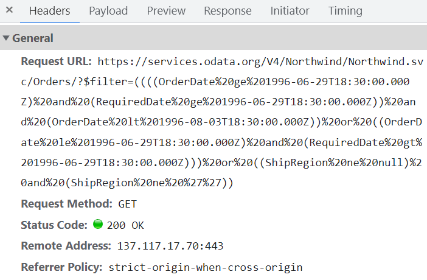

# Data Binding in Angular Scheduler

The Scheduler uses the `DataManager`, which supports both RESTful data service binding and JavaScript object array binding. The Scheduler [`dataSource`](https://ej2.syncfusion.com/angular/documentation/api/schedule/eventSettings#datasource) property can be assigned either a `DataManager` instance or a JavaScript object array. Scheduler supports the following data binding methods:

* Local data
* Remote data

## Binding local data

To bind local JSON data to the Scheduler, assign a JavaScript object array to the [`dataSource`](https://ej2.syncfusion.com/angular/documentation/api/schedule/eventSettings#datasource) option within the `eventSettings` property. The JSON object data source can also be provided as a `DataManager` instance and assigned to the Scheduler `dataSource` property.










  


> By default, `DataManager` uses the `JsonAdaptor` for local data binding.

> You can also map different field names to the default event fields and include additional custom fields in the event object collection. For details, refer to [event fields](./appointments#event-fields).

## Binding remote data

The Scheduler supports binding to various remote data services. To configure this, create a `DataManager` instance, supply the remote service URL to the `url` option, and assign it to the Scheduler [`dataSource`](https://ej2.syncfusion.com/angular/documentation/api/schedule/eventSettings#datasource) property within `eventSettings`.

### Using ODataV4Adaptor

[ODataV4](https://www.odata.org/documentation/) is a standardized protocol for creating and consuming data. The following example demonstrates how to retrieve data from an ODataV4 service using `DataManager`. To connect to ODataV4 service endpoints, use the `ODataV4Adaptor` within `DataManager`.










  


### Filter events using the in-built query

To enable server-side filtering based on specific conditions, set the [`includeFiltersInQuery`](https://helpej2.syncfusion.com/angular/documentation/api/schedule/eventSettingsModel#includefiltersinquery) API to true. This allows the filter query to include the start date, end date, and recurrence rule, so the request retrieves only the relevant data from the server.

This method greatly improves performance by reducing the data transferred to the client side. As a result, the component becomes more efficient and responsive, providing a better user experience. However, longer query strings may affect the maximum URL length or exceed server query-string limits.










  


The following image illustrates how parameters are passed using an ODataV4 filter for remote data binding.



### Using custom adaptor

You can create a custom adaptor by extending one of the built-in adaptors. The following example demonstrates how to use a custom adaptor and add a custom field, such as `EventID`, to appointments by overriding response processing with the `processResponse` method of the `ODataV4Adaptor`.










  


## Loading data via AJAX post

You can bind event data through an external AJAX request and assign it to the Scheduler [`dataSource`](https://ej2.syncfusion.com/angular/documentation/api/schedule/eventSettings#datasource) property. In the following code example, the data is retrieved from the server using an AJAX request and assigned to the Scheduler `dataSource` property within the Ajax `onSuccess` event.

`[src/app/app.ts]`

```typescript
import { Component, OnInit, ViewChild } from "@angular/core";
import { Ajax } from "@syncfusion/ej2-base";
import { DataManager, UrlAdaptor, Query } from "@syncfusion/ej2-data";
import { EventSettingsModel, View, EventRenderedArgs, DayService, WeekService, WorkWeekService, MonthService AgendaService, ResizeService, DragAndDropService, ScheduleComponent } from "@syncfusion/ej2-angular-schedule";

@Component({
  selector: "app-root",
  templateUrl: "app/app.component.html",
  providers: [ DayService, WeekService, WorkWeekService, MonthService, AgendaService, ResizeService,
DragAndDropService ]
})
export class AppComponent implements OnInit {
  @ViewChild("scheduleObj") public scheduleObj: ScheduleComponent;
  ngOnInit(): void {}

  public currentDate: Date = new Date(2017, 5, 5);
  onCreate() {
    const scheduleObj = this.scheduleObj; // Schedule instance
    const ajax = new Ajax(
      "https://services.syncfusion.com/angular/production/api/Schedule",
      "GET"
    );
    ajax.send();
    ajax.onSuccess = (data: string) => {
      scheduleObj.eventSettings.dataSource = JSON.parse(data);
    };
  }
}
```

> The controller method `GetData` is defined [here](#scheduler-crud-actions).

## Passing additional parameters to the server

To send additional custom parameters in the server-side request, use the `addParams` method of `Query`. Assign the `Query` object with the custom parameters to the Scheduler [`query`](https://ej2.syncfusion.com/angular/documentation/api/schedule/eventSettings#query) property.










  


> Parameters added using the Scheduler [`query`](https://ej2.syncfusion.com/angular/documentation/api/schedule/eventSettings#query) property are sent with every data request to the server.

## Handling failure actions

When the Scheduler interacts with the server, server-side exceptions may occur. These error messages or exception details can be accessed on the client side using the Scheduler [`actionFailure`](https://ej2.syncfusion.com/angular/documentation/api/schedule#actionfailure) event.

The argument passed to the [`actionFailure`](https://ej2.syncfusion.com/angular/documentation/api/schedule#actionfailure) event contains all error details returned from the server.










  


> The [`actionFailure`](https://ej2.syncfusion.com/angular/documentation/api/schedule#actionfailure) event is triggered not only when the server returns errors, but also when an exception occurs during Scheduler CRUD operations.

## Scheduler CRUD actions

CRUD (Create, Read, Update, and Delete) actions can be performed on Scheduler appointments using the adaptors available within the `DataManager`. Typically, the `UrlAdaptor` is used for CRUD operations on Scheduler appointments.

```typescript
import { Component } from '@angular/core';
import { EventSettingsModel, DayService, WeekService, WorkWeekService, MonthService, AgendaService } from '@syncfusion/ej2-angular-schedule';
import { DataManager, UrlAdaptor } from '@syncfusion/ej2-data';

@Component({
  selector: 'app-root',
  providers: [DayService, WeekService, WorkWeekService, MonthService, AgendaService],
  // specifies the template string for the Schedule component
  template: `<ejs-schedule width='100%' height='550px' [readonly]="readonly" [selectedDate]="selectedDate" [eventSettings]="eventSettings"></ejs-schedule>`
})

export class AppComponent {
    public selectedDate: Date = new Date(2017, 5, 11);
    private dataManager: DataManager = new DataManager({
       url: 'Home/GetData', // 'controller/actions'
       crudUrl: 'Home/UpdateData',
       adaptor: new UrlAdaptor
    });
    public eventSettings: EventSettingsModel = { dataSource: this.dataManager };
}
```

The following server-side controller code handles the CRUD operations.

```c#
using System;
using System.Collections.Generic;
using System.Linq;
using System.Web;
using System.Web.Mvc;
using ScheduleSample.Models;

namespace ScheduleSample.Controllers
{
    public class HomeController : Controller
    {
        ScheduleDataDataContext db = new ScheduleDataDataContext();
        public ActionResult Index()
        {
            return View();
        }
        public JsonResult LoadData()  // Here we get the start and end dates and filter the data before returning it to the Scheduler
        {
            var data = db.ScheduleEventDatas.ToList();
            return Json(data, JsonRequestBehavior.AllowGet);
        }
        [HttpPost]
        public JsonResult UpdateData(EditParams param)
        {
            if (param.action == "insert" || (param.action == "batch" && param.added != null)) // This block of code executes while inserting appointments
            {
                var value = (param.action == "insert") ? param.value : param.added[0];
                int intMax = db.ScheduleEventDatas.ToList().Count > 0 ? db.ScheduleEventDatas.ToList().Max(p => p.Id) : 1;
                DateTime startTime = Convert.ToDateTime(value.StartTime);
                DateTime endTime = Convert.ToDateTime(value.EndTime);
                ScheduleEventData appointment = new ScheduleEventData()
                {
                    Id = intMax + 1,
                    StartTime = startTime.ToLocalTime(),
                    EndTime = endTime.ToLocalTime(),
                    Subject = value.Subject,
                    IsAllDay = value.IsAllDay,
                    StartTimezone = value.StartTimezone,
                    EndTimezone = value.EndTimezone,
                    RecurrenceRule = value.RecurrenceRule,
                    RecurrenceID = value.RecurrenceID,
                    RecurrenceException = value.RecurrenceException
                };
                db.ScheduleEventDatas.InsertOnSubmit(appointment);
                db.SubmitChanges();
            }
            if (param.action == "update" || (param.action == "batch" && param.changed != null)) // This block of code executes while updating the appointment
            {
                var value = (param.action == "update") ? param.value : param.changed[0];
                var filterData = db.ScheduleEventDatas.Where(c => c.Id == Convert.ToInt32(value.Id));
                if (filterData.Count() > 0)
                {
                    DateTime startTime = Convert.ToDateTime(value.StartTime);
                    DateTime endTime = Convert.ToDateTime(value.EndTime);
                    ScheduleEventData appointment = db.ScheduleEventDatas.Single(A => A.Id == Convert.ToInt32(value.Id));
                    appointment.StartTime = startTime.ToLocalTime();
                    appointment.EndTime = endTime.ToLocalTime();
                    appointment.StartTimezone = value.StartTimezone;
                    appointment.EndTimezone = value.EndTimezone;
                    appointment.Subject = value.Subject;
                    appointment.IsAllDay = value.IsAllDay;
                    appointment.RecurrenceRule = value.RecurrenceRule;
                    appointment.RecurrenceID = value.RecurrenceID;
                    appointment.RecurrenceException = value.RecurrenceException;
                }
                db.SubmitChanges();
            }
            if (param.action == "remove" || (param.action == "batch" && param.deleted != null)) // This block of code executes while removing the appointment
            {
                if (param.action == "remove")
                {
                    int key = Convert.ToInt32(param.key);
                    ScheduleEventData appointment = db.ScheduleEventDatas.Where(c => c.Id == key).FirstOrDefault();
                    if (appointment != null) db.ScheduleEventDatas.DeleteOnSubmit(appointment);
                }
                else
                {
                    foreach (var apps in param.deleted)
                    {
                        ScheduleEventData appointment = db.ScheduleEventDatas.Where(c => c.Id == apps.Id).FirstOrDefault();
                        if (appointment != null) db.ScheduleEventDatas.DeleteOnSubmit(appointment);
                    }
                }
                db.SubmitChanges();
            }
            var data = db.ScheduleEventDatas.ToList();
            return Json(data, JsonRequestBehavior.AllowGet);
        }

        public class EditParams
        {
            public string key { get; set; }
            public string action { get; set; }
            public List<ScheduleEventData> added { get; set; }
            public List<ScheduleEventData> changed { get; set; }
            public List<ScheduleEventData> deleted { get; set; }
            public ScheduleEventData value { get; set; }
        }
    }
}
```

## Configuring Scheduler with Google API service

We have assigned our custom Google Calendar URL to the `DataManager` and used it for the Scheduler [`dataSource`](https://ej2.syncfusion.com/angular/documentation/api/schedule/eventSettings#datasource). Since the event data retrieved from Google Calendar is in its own object format, it must be resolved manually within the Scheduler’s [`dataBinding`](https://ej2.syncfusion.com/angular/documentation/api/schedule#databinding) event. Within this event, the event fields need to be mapped properly and then assigned to the result.










  


> You can refer to our [Angular Scheduler](https://www.syncfusion.com/angular-components/angular-scheduler) feature tour page for an overview of its features. You can also explore our [Angular Scheduler example](https://ej2.syncfusion.com/angular/demos/#/material/schedule/overview) to learn how to present and manipulate data.
