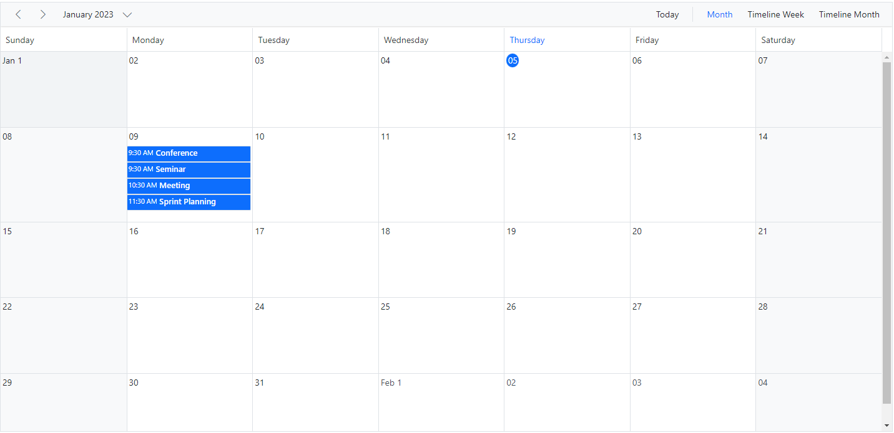
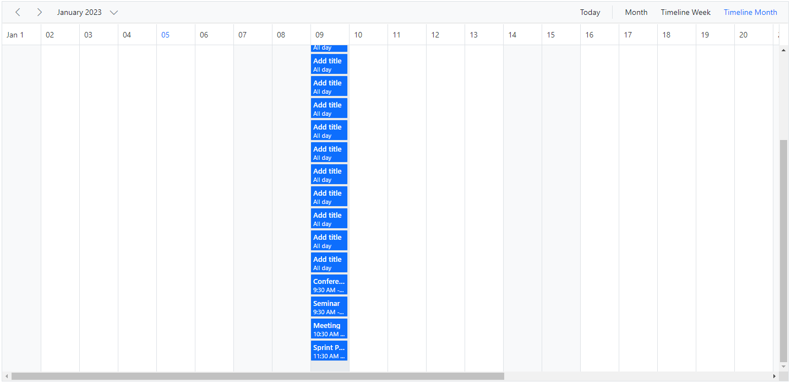
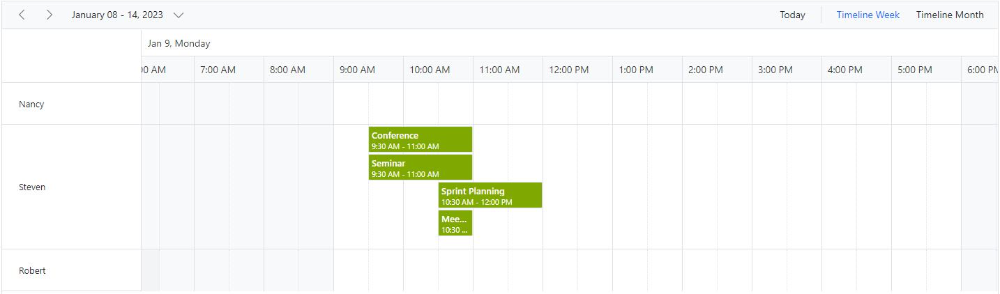
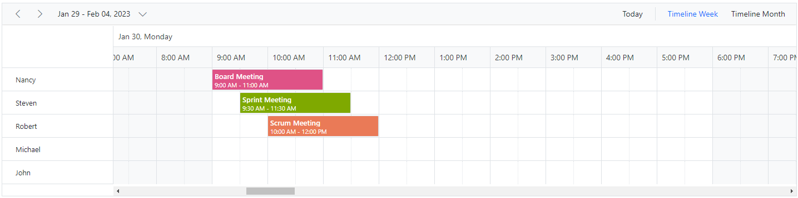

# Row Auto Height in Angular Scheduler

By default, the height of the Scheduler rows in Timeline views is static. Therefore, when the same time ranges hold multiple overlapping appointments, a `+n more` text indicator is displayed. With this feature enabled, you can now view all overlapping appointments in a specific time range by auto-adjusting the row height according to the number of appointments, instead of displaying the `+n more` text indicators.

To enable auto row height adjustments on Scheduler Timeline views and the Month view, set the [`rowAutoHeight`](https://ej2.syncfusion.com/angular/documentation/api/schedule#rowautoheight) property to `true` (default is `false`).

> This auto row height adjustment applies only to Timeline views and the calendar Month view.

Now, let us see how it works on those applicable views with examples.

## Calendar month view

By default, the rows of the calendar Month view can hold only a limited number of appointments based on its row height, and the rest of the overlapping appointments are indicated with a `+n more` text indicator. The following example shows how the month view row auto-adjusts based on the number of appointments when this [`rowAutoHeight`](https://ej2.syncfusion.com/angular/documentation/api/schedule#rowautoheight) feature is enabled.










  


## Timeline views

When the [`rowAutoHeight`](https://ej2.syncfusion.com/angular/documentation/api/schedule#rowautoheight) feature is enabled in Timeline views, the row height auto-adjusts based on the number of overlapping events in the same time range, as demonstrated in the following example.










  


## Timeline views with multiple resources

The following example shows how the auto row adjustment feature works on Timeline views with multiple resources.










  


## Appointments occupying entire cell

By default, when [`rowAutoHeight`](https://ej2.syncfusion.com/angular/documentation/api/schedule#rowautoheight) is enabled, there may be space at the bottom of the cell when an appointment is rendered. To avoid this space, set [`ignoreWhitespace`](https://ej2.syncfusion.com/angular/documentation/api/schedule/eventSettings#ignorewhitespace) to `true` within [`eventSettings`](https://ej2.syncfusion.com/angular/documentation/api/schedule/eventSettings). The default value is `false`. In the following code example, the whitespace below the appointments has been ignored.










  


**Note**: The [`ignoreWhitespace`](https://ej2.syncfusion.com/angular/documentation/api/schedule/eventSettings#ignorewhitespace) property applies only when the [`rowAutoHeight`](https://ej2.syncfusion.com/angular/documentation/api/schedule#rowautoheight) feature is enabled in the Scheduler.

> You can refer to our [Angular Scheduler](https://www.syncfusion.com/angular-components/angular-scheduler) feature tour page for its feature representations. You can also explore our [Angular Scheduler example](https://ej2.syncfusion.com/angular/demos/#/material/schedule/overview) to see how to present and manipulate data.
