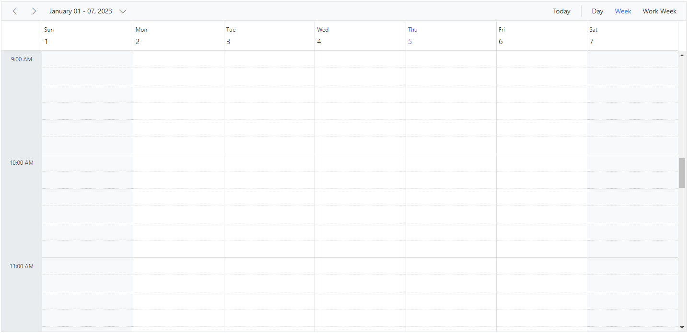
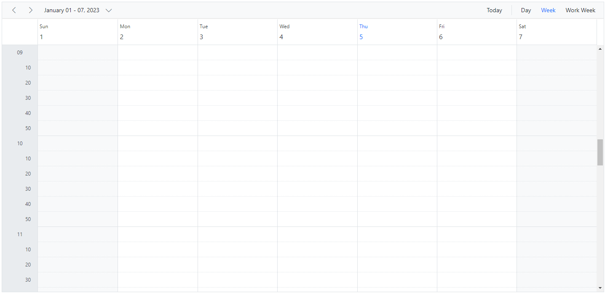
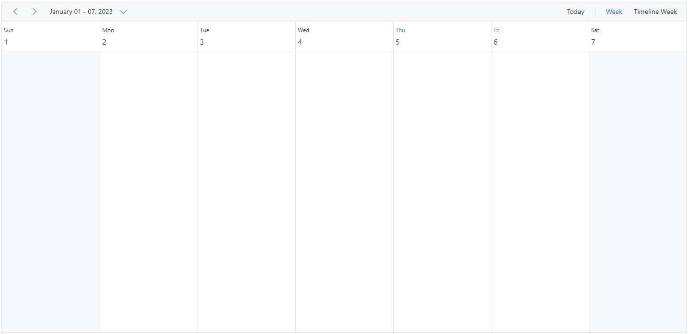
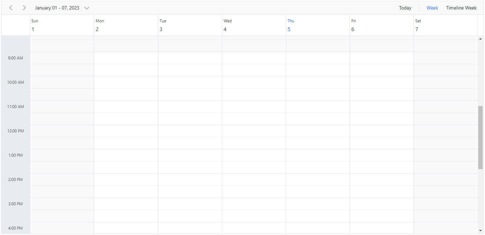

# Timescale Customization in Angular Scheduler

Time slots are the cells displayed in the Day, Week, and Work Week views of the Scheduler (in vertical views on the leftmost position and in timeline views at the top). The [`timeScale`](https://ej2.syncfusion.com/angular/documentation/api/schedule#timescale) property lets you control the duration of these slots. It includes these sub-options:

* [`enable`](https://ej2.syncfusion.com/angular/documentation/api/schedule/timeScale#enable) - When set to `true`, allows the Scheduler to display the appointments accurately against the exact time duration. If set to `false`, all the appointments of a day will be displayed one below the other with no grid lines displayed. Its default value is `true`.
* [`interval`](https://ej2.syncfusion.com/angular/documentation/api/schedule/timeScale#interval) – Defines the time duration on which the time axis to be displayed either in 1 hour or 30 minutes interval and so on. It accepts the values in minutes and defaults to 60.
* [`slotCount`](https://ej2.syncfusion.com/angular/documentation/api/schedule/timeScale#slotcount) – Decides the number of slot count to be split for the specified time interval duration. It defaults to 2, thus displaying two slots to represent an hour (each slot depicting 30 minutes duration).

> Note: The upper limit for rendering slots within a single day, utilizing the **interval** and **slotCount** properties of the **timeScale**, stands at 1000. This constraint aligns with the maximum **colspan** value permissible for the **table** element, also capped at 1000. This particular restriction is relevant exclusively to the `TimelineDay`, `TimelineWeek`, and `TimelineWorkWeek` views.

## Setting different time slot duration

The [`interval`](https://ej2.syncfusion.com/angular/documentation/api/schedule/timeScale#interval) and [`slotCount`](https://ej2.syncfusion.com/angular/documentation/api/schedule/timeScale#slotcount) properties can be used together on the Scheduler to set different time slot duration, as depicted in the following code example. Here, six time slots together represent an hour.










  


## Customizing time cells using template

The [`timeScale`](https://ej2.syncfusion.com/angular/documentation/api/schedule/timeScale) property provides template options for custom rendering:

* [`majorSlotTemplate`](https://ej2.syncfusion.com/angular/documentation/api/schedule/timeScale#majorslottemplate) - The template option to be applied for major time slots. Here, the template accepts either the string or HTMLElement as template design and then the parsed design is displayed onto the time cells. The time details can be accessed within this template.
* [`minorSlotTemplate`](https://ej2.syncfusion.com/angular/documentation/api/schedule/timeScale#minorslottemplate) - The template option to be applied for minor time slots. Here, the template accepts either the string or HTMLElement as template design and then the parsed design is displayed onto the time cells. The time details can be accessed within this template.
















## Hide the timescale

The grid lines that indicate the exact time duration can be enabled or disabled on the Scheduler by setting `true` or `false` for the `enable` option within the [`timeScale`](https://ej2.syncfusion.com/angular/documentation/api/schedule#timescale) property. Its default value is `true`.













## Highlighting current date and time

By default, Scheduler indicates the current date with a highlighted date header on all views, and also marks the system's current time on specific views such as Day, Week, Work Week, Timeline Day, Timeline Week, and Timeline Work Week. To stop highlighting the current time indicator on Scheduler views, set `false` to the [`showTimeIndicator`](https://ej2.syncfusion.com/angular/documentation/api/schedule#showtimeindicator) property, which defaults to `true`.










  


## Customizing current time indicator

The appearance and behavior of the current time indicator can be customized using the [`currentTimeIndicatorSettings`](https://ej2.syncfusion.com/angular/documentation/api/schedule/#currenttimeindicatorsettings) property. This property includes the following options to control different aspects of the time indicator:

* `showTime` - When set to `true`, displays the current time label (hours and minutes) on the indicator. The default value is `true`.
* `showPreviousDates` - When set to `true`, extends the indicator line to span across previous dates in the view. The default value is `true`.
* `onTop` - When set to `true`, positions the indicator line on top of appointments. When set to `false`, appointments appear on top of the indicator. The default value is `true`.

> **Note:** The current time indicator customization is only applicable in views that display a time grid (Day, Week, Work Week, Timeline Day, Timeline Week, and Timeline Work Week views) when both [`timeScale`](https://ej2.syncfusion.com/angular/documentation/api/schedule#timescale) is enabled and [`showTimeIndicator`](https://ej2.syncfusion.com/angular/documentation/api/schedule#showtimeindicator) is set to `true`.
















> You can refer to our [Angular Scheduler](https://www.syncfusion.com/angular-components/angular-scheduler) feature tour page for its feature representations. You can also explore our [Angular Scheduler example](https://ej2.syncfusion.com/angular/demos/#/material/schedule/overview) to see how to present and manipulate data.
