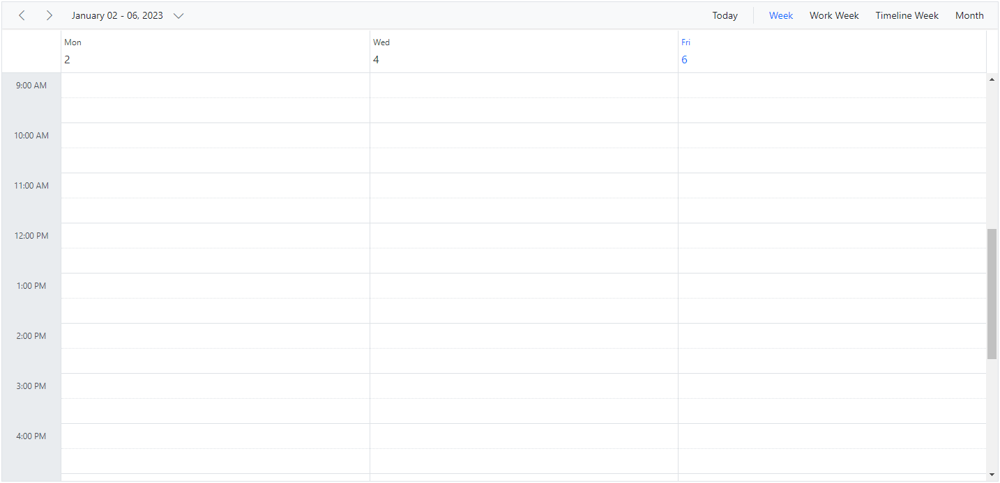
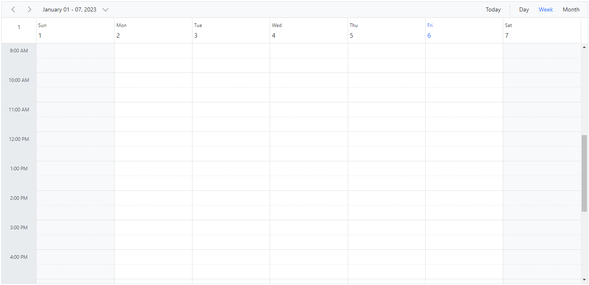
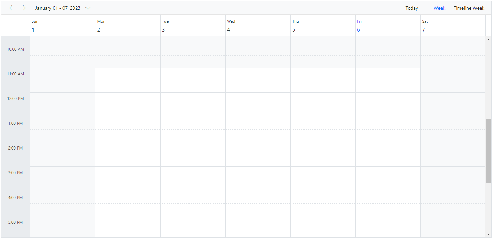
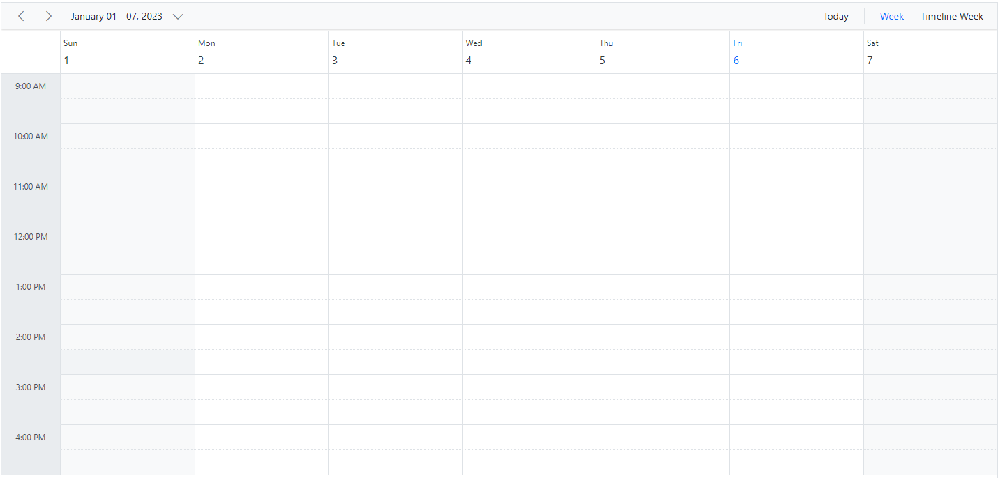
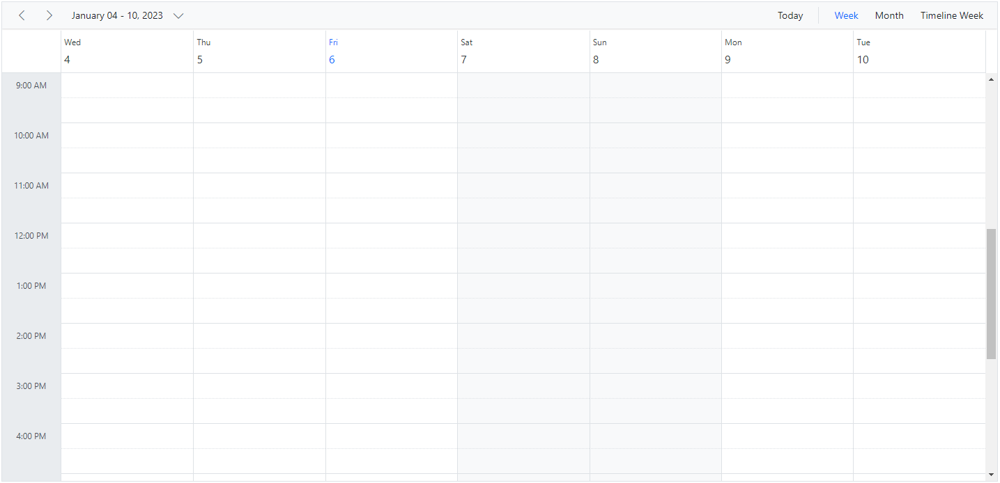

# Working Days and Hours in Angular Scheduler

The Scheduler supports many calendar-specific features, including:

* setting a custom visible time range
* defining working hours
* defining working days
* changing the first day of the week
* showing or hiding weekend days
* displaying week numbers

## Set working days

By default, the Scheduler considers Monday through Friday as working days (`[1, 2, 3, 4, 5]`), where 1 represents Monday, 2 represents Tuesday, and so on. Days not included in this collection are treated as non-working days. When weekend days are hidden, these non-working days are also hidden from the layout.

The Work week and Timeline Work week views display only the defined working days, whereas other views display all days and visually differentiate non-working days with an inactive cell color.

> The working or business hours depiction is valid only on the specified working days.

The following example shows how to configure the Scheduler to use Monday, Wednesday, and Friday as working days.










  


## Hiding weekend days

Use the [`showWeekend`](https://ej2.syncfusion.com/angular/documentation/api/schedule/views#showweekend) property to show or hide weekend days. This property is not applicable for the Work week view because non-working days are already excluded from that view. By default, `showWeekend` is `true`.

Days not included in the Schedulers `workDays` collection are considered non-working days. In the example below, working days are defined as `[1, 3, 4, 5]`, so Sunday, Tuesday, and Saturday (`0`, `2`, `6`) are treated as non-working days and are hidden from the views when `showWeekend` is `false`.










  


## Show week numbers

Set the `showWeekNumber` property to `true` to display week numbers in the Scheduler header. By default, `showWeekNumber` is `false`. In Month view, week numbers appear in the first column.

> The [`showWeekNumber`](https://ej2.syncfusion.com/angular/documentation/api/schedule/views#showweeknumber) property is not applicable in Timeline views. Timeline views use the equivalent [`headerRows`](./header-rows#display-week-numbers-in-timeline-views) customization instead.










  


### Different options for week numbers

By default, week numbers are shown in the Scheduler based on the first day of the year. However, the week numbers can be determined based on the following criteria.

`FirstDay` – The first week of the year is calculated based on the first day of the year.

`FirstFourDayWeek` – The first week of the year begins from the first week with four or more days.

`FirstFullWeek` – The first week of the year begins when meeting the first day of the week (firstDayOfWeek) and the first day of the year.

For more details refer to [CalendarWeekRule remarks](https://docs.microsoft.com/en-us/dotnet/api/system.globalization.calendarweekrule?view=net-5.0#remarks)










  


 **Note**: Enable the [`showWeekNumber`](https://ej2.syncfusion.com/angular/documentation/api/schedule/views#showweeknumber) property to configure the [`weekRule`](https://ej2.syncfusion.com/angular/documentation/api/schedule#weekrule) property. Also, the `weekRule` property depends on the value of the [`firstDayOfWeek`](https://ej2.syncfusion.com/angular/documentation/api/schedule#firstdayofweek) property.

## Set working hours

Working hours define the daily work-hour range within the Scheduler and are highlighted on work cells. Use the [`workHours`](https://ej2.syncfusion.com/angular/documentation/api/schedule#workhours) property to configure work hours. It supports the following sub-options:

* [`highlight`](https://ej2.syncfusion.com/angular/documentation/api/schedule/workHoursModel#highlight) – enable or disable work-hour highlighting.
* [`start`](https://ej2.syncfusion.com/angular/documentation/api/schedule/workHoursModel#start) – set the start time for work hours.
* [`end`](https://ej2.syncfusion.com/angular/documentation/api/schedule/workHoursModel#end) – set the end time for work hours.










  


## Scheduler displaying custom hours

You can display only a specific time range in the Scheduler by hiding hours outside that range. Set the [`startHour`](https://ej2.syncfusion.com/angular/documentation/api/schedule#starthour) and [`endHour`](https://ej2.syncfusion.com/angular/documentation/api/schedule#endhour) properties to define the visible time window.

The following example displays the Scheduler from 7:00 AM to 6:00 PM and hides the remaining hours.










  


## Setting start day of the week

By default, Scheduler uses `Sunday` as the first day of the week. To change it, set the [`firstDayOfWeek`](https://ej2.syncfusion.com/angular/documentation/api/schedule#firstdayofweek) property to a value from `0` to `6`.

> Sunday is `0`, Monday is `1`, and so on.










  


## Scroll to specific time and date

You can manually scroll to a specific time on Scheduler by using the [`scrollTo`](https://ej2.syncfusion.com/angular/documentation/api/schedule#scrollto) method as shown in the following example.












  


### How to scroll to current time on initial load

There are scenarios where you may need to load the Scheduler displaying the system's current time on the currently visible view port area. In such cases, the Scheduler needs to be scrolled to a specific time based on the system's current time which is depicted in the following code example.










  


> Refer to our [Angular Scheduler](https://www.syncfusion.com/angular-components/angular-scheduler) feature tour page for an overview of key capabilities. You can also explore the [Angular Scheduler example](https://ej2.syncfusion.com/angular/demos/#/material/schedule/overview) to learn how to present and manipulate data.

## See Also

* [To display the current time indicator](./timescale#highlighting-current-date-and-time)
* [To set different working hours dynamically](./how-to/set-different-work-hours)
* [To set different working hours for each resources](./resources#set-different-work-hours)
* [To set different working days for each resources](./resources#set-different-work-days)