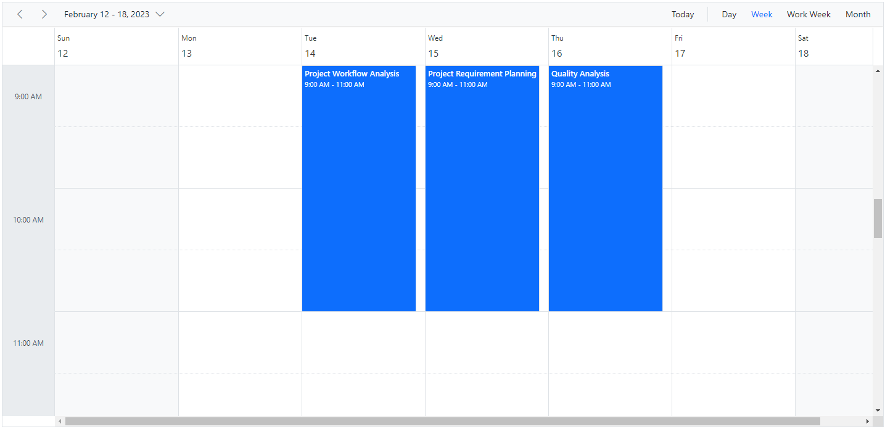
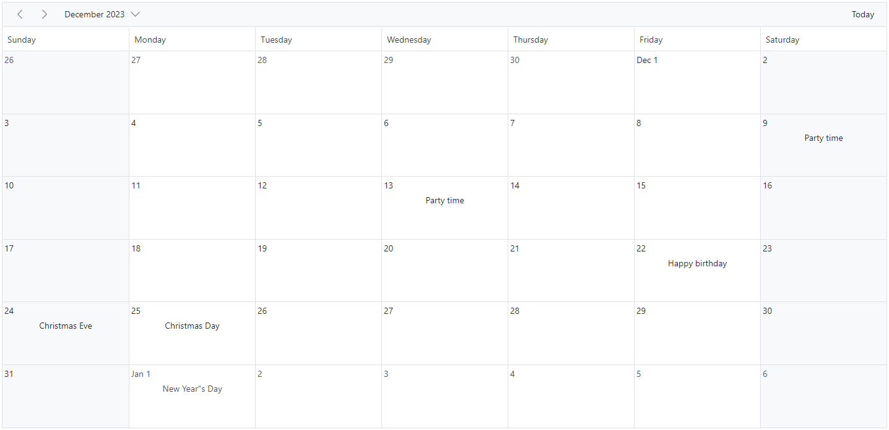
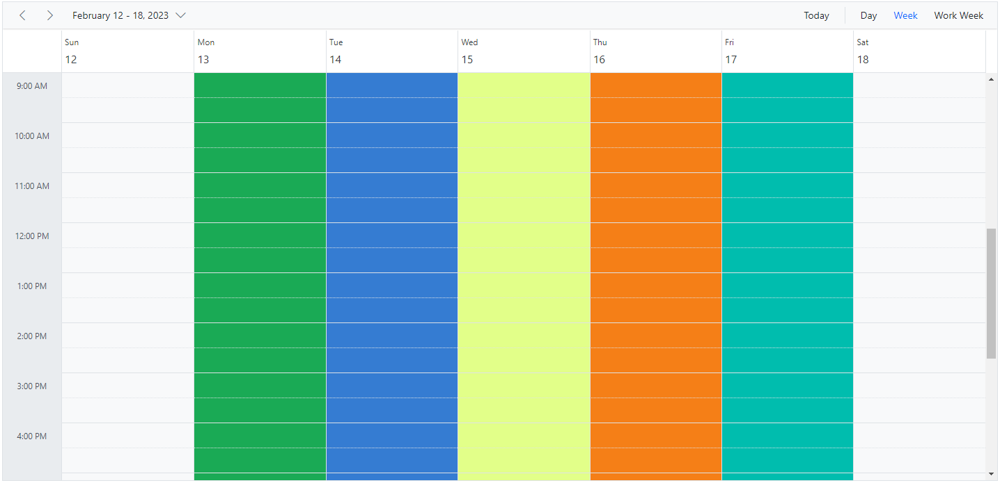

# Cell Customization in ASP.NET Core Scheduler

The cells of the Scheduler can be easily customized either using the cell template or [`renderCell`](https://help.syncfusion.com/cr/aspnetcore-js2/Syncfusion.EJ2.Schedule.Schedule.html#Syncfusion_EJ2_Schedule_Schedule_RenderCell) event.

## Setting cell dimensions in all views

The height and width of the Scheduler cells can be customized to increase or reduce their size through the [`cssClass`](https://help.syncfusion.com/cr/aspnetcore-js2/Syncfusion.EJ2.Schedule.Schedule.html#Syncfusion_EJ2_Schedule_Schedule_CssClass) property, which overrides the default CSS applied to cells.













## Check for cell availability

You can check whether the given time range slots are available for event creation or already occupied by other events using the `isSlotAvailable` method. In the following code example, if a specific time slot already contains an appointment, then no more appointments can be added to that cell.











## Customizing cells in all the views

It is possible to customize the appearance of the cells using both template options and [`renderCell`](https://help.syncfusion.com/cr/aspnetcore-js2/Syncfusion.EJ2.Schedule.Schedule.html#Syncfusion_EJ2_Schedule_Schedule_RenderCell) event on all the views.

### Using template

The [`cellTemplate`](https://help.syncfusion.com/cr/aspnetcore-js2/Syncfusion.EJ2.Schedule.Schedule.html#Syncfusion_EJ2_Schedule_Schedule_CellTemplate) option accepts the template string and is used to customize the cell background with specific images or appropriate text on the given date values.













### Using renderCell event

An alternative to [`cellTemplate`](https://help.syncfusion.com/cr/aspnetcore-js2/Syncfusion.EJ2.Schedule.Schedule.html#Syncfusion_EJ2_Schedule_Schedule_CellTemplate) is the [`renderCell`](https://help.syncfusion.com/cr/aspnetcore-js2/Syncfusion.EJ2.Schedule.Schedule.html#Syncfusion_EJ2_Schedule_Schedule_RenderCell) event, which can also be used to customize the cells with appropriate images or formatted text values.













You can customize cells such as work cells, month cells, all-day cells, header cells, resource header cells using [`renderCell`](https://help.syncfusion.com/cr/aspnetcore-js2/Syncfusion.EJ2.Schedule.Schedule.html#Syncfusion_EJ2_Schedule_Schedule_RenderCell) event by checking the `elementType` option within the event. You can check `elementType` with any of the following.

| Element type | Description |
|-------|---------|
| `dateHeader` | triggers on header cell rendering.|
| `monthDay` | triggers on header cell in month view rendering.|
| `resourceHeader` | triggers on resource header cell rendering.|
| `alldayCells` | triggers on all day cell rendering.|
| `emptyCells` | triggers on empty cell rendering on header bar.|
| `resourceGroupCells` | triggers on rendering of work cells for parent resource.|
| `workCells` | triggers on work cell rendering.|
| `monthCells` | triggers on month cell rendering.|
| `majorSlot` | triggers on major time slot cell rendering.|
| `minorSlot` | triggers on minor time slot cell rendering.|
| `weekNumberCell` | triggers on cell displaying week number.|

## Customizing cell header in month view

The month header of each date cell in the month view can be customized using the [`cellHeaderTemplate`](https://help.syncfusion.com/cr/aspnetcore-js2/Syncfusion.EJ2.Schedule.Schedule.html#Syncfusion_EJ2_Schedule_Schedule_CellHeaderTemplate) option, which accepts a string or HTMLElement. The corresponding date can be accessed with the template.








## Customizing the minimum and maximum date values

Providing the [`minDate`](https://help.syncfusion.com/cr/aspnetcore-js2/Syncfusion.EJ2.Schedule.Schedule.html#Syncfusion_EJ2_Schedule_Schedule_MinDate) and [`maxDate`](https://help.syncfusion.com/cr/aspnetcore-js2/Syncfusion.EJ2.Schedule.Schedule.html#Syncfusion_EJ2_Schedule_Schedule_MaxDate) property with some date values, allows the Scheduler to set the minimum and maximum date range. The Scheduler date that lies beyond this minimum and maximum date range will be in a disabled state so that the date navigation will be blocked beyond the specified date range.











N> By default, the [`minDate`](https://help.syncfusion.com/cr/aspnetcore-js2/Syncfusion.EJ2.Schedule.Schedule.html#Syncfusion_EJ2_Schedule_Schedule_MinDate) property value is set to `new Date(1900, 0, 1)` and the [`maxDate`](https://help.syncfusion.com/cr/aspnetcore-js2/Syncfusion.EJ2.Schedule.Schedule.html#Syncfusion_EJ2_Schedule_Schedule_MaxDate) property value is set to `new Date(2099, 11, 31)`. The user can also set customized [`minDate`](https://help.syncfusion.com/cr/aspnetcore-js2/Syncfusion.EJ2.Schedule.Schedule.html#Syncfusion_EJ2_Schedule_Schedule_MinDate) and [`maxDate`](https://help.syncfusion.com/cr/aspnetcore-js2/Syncfusion.EJ2.Schedule.Schedule.html#Syncfusion_EJ2_Schedule_Schedule_MaxDate) property values.

## Customizing the weekend cells background color

You can customize the background color of weekend cells by utilizing the [`renderCell`](https://help.syncfusion.com/cr/aspnetcore-js2/syncfusion.ej2.schedule.schedule.html#Syncfusion_EJ2_Schedule_Schedule_RenderCell) event and checking the `elementType` option within the event.

```javascript
function onRenderCell(args) {
        if (args.elementType == "workCells") {
            // To change the color of weekend columns in week view
            if (args.date) {
                if (args.date.getDay() === 6) {
                    (args.element).style.background = '#ffdea2';
                }
                if (args.date.getDay() === 0) {
                    (args.element).style.background = '#ffdea2';
                }
            }
        }
}

```

And the background color for weekend cells in the Month view can be customized through the [`cssClass`](https://help.syncfusion.com/cr/aspnetcore-js2/syncfusion.ej2.schedule.schedule.html#Syncfusion_EJ2_Schedule_Schedule_CssClass) property, which overrides the default CSS applied to cells.

```css

.schedule-cell-customization.e-schedule .e-month-view .e-work-cells:not(.e-work-days) {
    background-color: #f08080;
}

```










## How to disable multiple cell and row selection in Schedule

By default, the [`allowMultiCellSelection`](https://help.syncfusion.com/cr/aspnetcore-js2/Syncfusion.EJ2.Schedule.Schedule.html#Syncfusion_EJ2_Schedule_Schedule_AllowMultiCellSelection) and [`allowMultiRowSelection`](https://help.syncfusion.com/cr/aspnetcore-js2/Syncfusion.EJ2.Schedule.Schedule.html#Syncfusion_EJ2_Schedule_Schedule_AllowMultiRowSelection) properties of the Schedule are set to `true`. So, the Schedule allows users to select multiple cells and rows. If the user wants to disable multiple cell and row selection, set these properties to `false`.

N> You can refer to our [ASP.NET Core Scheduler](https://www.syncfusion.com/aspnet-core-ui-controls/scheduler) feature tour page for its feature highlights. You can also explore our [ASP.NET Core Scheduler example](https://ej2.syncfusion.com/aspnetcore/Schedule/Overview#/material) to learn how to present and manipulate data.
