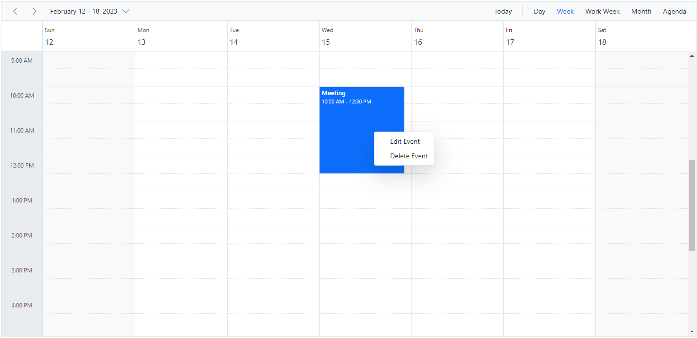

# Context Menu in ASP.NET Core Scheduler

You can display a context menu on the work cells and appointments of the Scheduler by using the [`ContextMenu`](https://ej2.syncfusion.com/aspnetcore/documentation/context-menu/getting-started) control from the application end. In the following code example, the context menu control is added from the sample end and its target is set to `Scheduler`.

On Scheduler cells, you can display menu items such as `New Event`, `New Recurring Event`, and the `Today` option. For appointments, you can display related options such as `Edit Event` and `Delete Event`. The default event window can be opened for appointment creation and editing using the `openEditor` method of the Scheduler.

Appointments can be deleted by using the `deleteEvent` public method. Also, the [`selectedDate`](https://help.syncfusion.com/cr/aspnetcore-js2/Syncfusion.EJ2.Schedule.Schedule.html#Syncfusion_EJ2_Schedule_Schedule_SelectedDate) property can be used to navigate between different dates.

N> You can also display custom menu options on Scheduler cells and appointments. The context menu opens on tap and hold in responsive mode.
























N> You can refer to our [ASP.NET Core Scheduler](https://www.syncfusion.com/aspnet-core-ui-controls/scheduler) feature tour page for its feature highlights. You can also explore our [ASP.NET Core Scheduler example](https://ej2.syncfusion.com/aspnetcore/Schedule/Overview#/material) to learn how to present and manipulate data.
