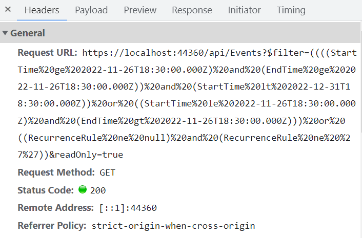

# Data Binding in ASP.NET Core Scheduler

The Scheduler uses `dataManager`, which supports both RESTful JSON data service binding and local JavaScript object array binding. The [`dataSource`](https://help.syncfusion.com/cr/aspnetcore-js2/Syncfusion.EJ2~Syncfusion.EJ2.Schedule.ScheduleEventSettings~DataSource.html) property can be assigned either to a `dataManager` instance or to a JavaScript object array collection. It supports two kinds of data binding:

* Local data
* Remote data

## Binding local data

To bind local JSON data to the Scheduler, assign a JavaScript object array to the [`dataSource`](https://help.syncfusion.com/cr/aspnetcore-js2/Syncfusion.EJ2~Syncfusion.EJ2.Schedule.ScheduleEventSettings~DataSource.html) option within the Scheduler `eventSettings` property. The local data source can also be provided as a `dataManager` instance.

























N> By default, `dataManager` uses `JsonAdaptor` for local data binding.

> You can also bind different field names to the default event fields and include additional `custom fields` in the event object collection, as described [here](./appointments#binding-different-field-names).

## Binding remote data

Any kind of remote data service can be bound to the Scheduler. To do so, create a `dataManager` instance, provide the service URL to the `Url` option, and assign it to the [`dataSource`](https://help.syncfusion.com/cr/aspnetcore-js2/Syncfusion.EJ2~Syncfusion.EJ2.Schedule.ScheduleEventSettings~DataSource.html) property within `e-schedule-eventsettings`.

### Using ODataV4Adaptor

[ODataV4](https://www.odata.org/documentation/) is a standardized protocol for creating and consuming data. Refer to the following code example to retrieve data from an ODataV4 service using the `dataManager`. To connect with ODataV4 service endpoints, use `ODataV4Adaptor` within `dataManager`.
























### Filter events using the in-built query

To enable server-side filtering based on predetermined conditions, set the [`includeFiltersInQuery`](https://help.syncfusion.com/cr/aspnetcore-js2/Syncfusion.EJ2.Schedule.ScheduleEventSettings.html#Syncfusion_EJ2_Schedule_ScheduleEventSettings_IncludeFiltersInQuery) API to true. This allows the filter query to be constructed using the start date, end date, and recurrence rule, which in turn filters the request accordingly.

This method improves the component's performance by reducing the amount of data transferred to the client side. As a result, the component becomes more efficient and responsive. However, be aware that longer query strings may cause issues with the maximum URL length or server query string limits.
























The following image represents how the parameters are passed using ODataV4 filter.



### Using custom adaptor

You can create your own custom adaptor by extending the available built-in adaptors. The following example demonstrates custom adaptor usage and how to add a custom field `EventID` to appointments by overriding the built-in response processing with the `processResponse` method of `ODataV4Adaptor`.

























## Loading data via AJAX post

You can bind event data through an external AJAX request and assign it to the Scheduler [`dataSource`](https://help.syncfusion.com/cr/aspnetcore-js2/Syncfusion.EJ2~Syncfusion.EJ2.Schedule.ScheduleEventSettings~DataSource.html) property. In the following code example, we retrieve data from the server with an AJAX request and assign the returned data to the Scheduler [`dataSource`](https://help.syncfusion.com/cr/aspnetcore-js2/Syncfusion.EJ2~Syncfusion.EJ2.Schedule.ScheduleEventSettings~DataSource.html) property within the Ajax `onSuccess` event.

























N> The controller method definition for `GetData` can be referred to [here](#scheduler-crud-actions).

## Passing additional parameters to the server

To send an additional custom parameter to the server-side post, use the `addParams` method of `query`. Then assign this `query` object with the additional parameters to the Scheduler [`query`](https://help.syncfusion.com/cr/aspnetcore-js2/Syncfusion.EJ2~Syncfusion.EJ2.Schedule.ScheduleEventSettings~Query.html) property.

























N> The parameters added using the `query` property are sent with the data request to the server during every Scheduler action.

## Handling failure actions

During Scheduler interaction with the server, server-side exceptions may occur. You can capture those error messages or exception details on the client side using the Scheduler [`actionFailure`](https://help.syncfusion.com/cr/aspnetcore-js2/Syncfusion.EJ2~Syncfusion.EJ2.Schedule.Schedule~ActionFailure.html) event.

























The argument passed to the [`actionFailure`](https://help.syncfusion.com/cr/aspnetcore-js2/Syncfusion.EJ2~Syncfusion.EJ2.Schedule.Schedule~ActionFailure.html) event contains the error details returned by the server.

## Scheduler CRUD actions

The CRUD (Create, Read, Update, and Delete) actions can be performed easily on Scheduler appointments using the various adaptors available within the `dataManager`. Most commonly, `UrlAdaptor` is used for performing CRUD actions on Scheduler appointments.

```sh
@using Syncfusion.EJ2

@{
    var dataManager = new DataManager() {
        Url = "Home/GetData",
        Adaptor = "UrlAdaptor",
        CrudUrl = "Home/UpdateData",
        CrossDomain = true
    };
}

<ejs-schedule id="schedule" width="100%" height="550" selectedDate="new DateTime(2017, 6, 5)">
    <e-schedule-eventsettings dataSource="dataManager">
    </e-schedule-eventsettings>
</ejs-schedule>

```

The server-side controller code to handle the CRUD operations are as follows.

```sh
using System;
using System.Collections.Generic;
using System.Linq;
using System.Web;
using System.Web.Mvc;
using ScheduleSample.Models;

namespace ScheduleSample.Controllers
{
    public class HomeController : Controller
    {
        ScheduleDataDataContext db = new ScheduleDataDataContext();
        public ActionResult Index()
        {
            return View();
        }  
        public ActionResult LoadData()  // Gets the start and end dates and filters the data before returning it to the Scheduler
        {
            var data = db.ScheduleEventDatas.ToList();
            return Json(data);
        }
        [HttpPost]
        public ActionResult UpdateData([FromBody] EditParams param)
        {
            if (param.action == "insert" || (param.action == "batch" && param.added != null)) // This block of code executes while inserting appointments
            {
                var value = (param.action == "insert") ? param.value : param.added[0];
                int intMax = db.ScheduleEventDatas.ToList().Count > 0 ? db.ScheduleEventDatas.ToList().Max(p => p.Id) : 1;
                DateTime startTime = Convert.ToDateTime(value.StartTime);
                DateTime endTime = Convert.ToDateTime(value.EndTime);
                ScheduleEventData appointment = new ScheduleEventData()
                {
                    Id = intMax + 1,
                    StartTime = startTime,
                    EndTime = endTime,
                    Subject = value.Subject,
                    IsAllDay = value.IsAllDay,
                    StartTimezone = value.StartTimezone,
                    EndTimezone = value.EndTimezone,
                    RecurrenceRule = value.RecurrenceRule,
                    RecurrenceID = value.RecurrenceID,
                    RecurrenceException = value.RecurrenceException
                };
                db.ScheduleEventDatas.InsertOnSubmit(appointment);
                db.SubmitChanges();
            }
            if (param.action == "update" || (param.action == "batch" && param.changed != null)) // This block of code executes while updating the appointment
            {
                var value = (param.action == "update") ? param.value : param.changed[0];
                var filterData = db.ScheduleEventDatas.Where(c => c.Id == Convert.ToInt32(value.Id));
                if (filterData.Count() > 0)
                {
                    DateTime startTime = Convert.ToDateTime(value.StartTime);
                    DateTime endTime = Convert.ToDateTime(value.EndTime);
                    ScheduleEventData appointment = db.ScheduleEventDatas.Single(A => A.Id == Convert.ToInt32(value.Id));
                    appointment.StartTime = startTime;
                    appointment.EndTime = endTime;
                    appointment.StartTimezone = value.StartTimezone;
                    appointment.EndTimezone = value.EndTimezone;
                    appointment.Subject = value.Subject;
                    appointment.IsAllDay = value.IsAllDay;
                    appointment.RecurrenceRule = value.RecurrenceRule;
                    appointment.RecurrenceID = value.RecurrenceID;
                    appointment.RecurrenceException = value.RecurrenceException;
                }
                db.SubmitChanges();
            }
            if (param.action == "remove" || (param.action == "batch" && param.deleted != null)) // This block of code executes while removing the appointment
            {
                if (param.action == "remove")
                {
                    int key = Convert.ToInt32(param.key);
                    ScheduleEventData appointment = db.ScheduleEventDatas.Where(c => c.Id == key).FirstOrDefault();
                    if (appointment != null) db.ScheduleEventDatas.DeleteOnSubmit(appointment);
                }
                else
                {
                    foreach (var apps in param.deleted)
                    {
                        ScheduleEventData appointment = db.ScheduleEventDatas.Where(c => c.Id == apps.Id).FirstOrDefault();
                        if (appointment != null) db.ScheduleEventDatas.DeleteOnSubmit(appointment);
                    }
                }
                db.SubmitChanges();
            }
            var data = db.ScheduleEventDatas.ToList();
            return Json(data);
        }

        public class EditParams
        {
            public string key { get; set; }
            public string action { get; set; }
            public List<ScheduleEventData> added { get; set; }
            public List<ScheduleEventData> changed { get; set; }
            public List<ScheduleEventData> deleted { get; set; }
            public ScheduleEventData value { get; set; }
        }
    }
}
```
N> You can find the working sample [here](https://github.com/SyncfusionExamples/aspnetcore-scheduler-crud-actions-with-editor-template).

## Configuring Scheduler with Google API service

We assign the custom Google Calendar URL to the `DataManager` and then assign it to the Scheduler [`dataSource`](https://help.syncfusion.com/cr/aspnetcore-js2/Syncfusion.EJ2~Syncfusion.EJ2.Schedule.ScheduleEventSettings~DataSource.html). Since the event data retrieved from Google Calendar is in its own object format, it must be resolved manually within the Scheduler [`dataBinding`](https://help.syncfusion.com/cr/aspnetcore-js2/Syncfusion.EJ2.Schedule.Schedule.html#Syncfusion_EJ2_Schedule_Schedule_DataBinding) event. Within this event, the event fields need to be mapped properly and then assigned to the result.

























N> You can refer to our [ASP.NET Core Scheduler](https://www.syncfusion.com/aspnet-core-ui-controls/scheduler) feature tour page for more details. You can also explore our [ASP.NET Core Scheduler example](https://ej2.syncfusion.com/aspnetcore/Schedule/Overview#/material) to learn how to present and manipulate data.
