# Editor Window Customization in ASP.NET Core Scheduler

Scheduler uses popups and dialogs to display the required notifications, and it includes an editor window with event fields that make appointment creation and editing easier. You can also customize the editor window and its fields, and apply validations to those fields.

## Event editor

The editor window usually opens in the Scheduler when a cell or event is double-clicked. When a cell is double-clicked, the detailed editor window opens in "Add new" mode. When an event is double-clicked, it opens in "Edit" mode.

On mobile devices, you can open the detailed editor window in edit mode by clicking the edit icon in the popup that appears when you single-tap an event. You can also open it in add mode by single-tapping a cell, which displays a `+` indicator; clicking it again opens the editor window.

N> You can also prevent the editor window from opening by rendering the Scheduler in a [`readonly`](https://help.syncfusion.com/cr/aspnetcore-js2/Syncfusion.EJ2.Schedule.Schedule.html#Syncfusion_EJ2_Schedule_Schedule_Readonly) mode or by customizing the [`popupOpen`](https://help.syncfusion.com/cr/aspnetcore-js2/Syncfusion.EJ2.Schedule.Schedule.html#Syncfusion_EJ2_Schedule_Schedule_PopupOpen) event.

### How to change the editor window header title and text of footer buttons

You can change the editor window header title and the footer button text by updating the appropriate localized word collection used in the Scheduler.











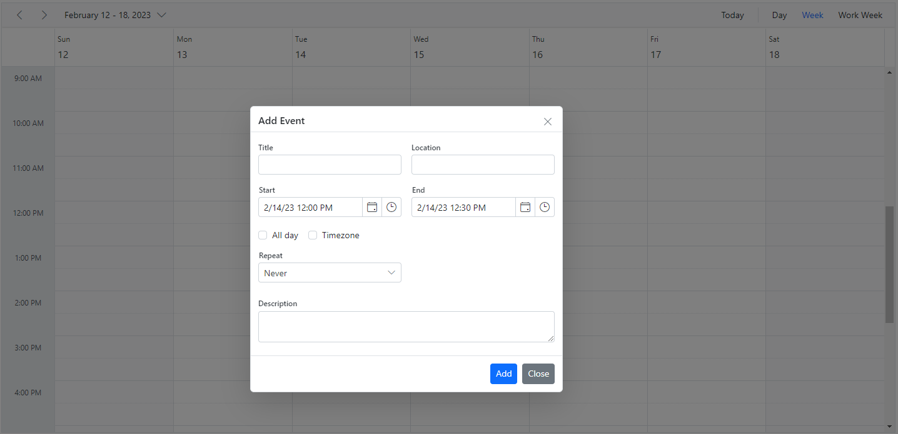

### How to change the label text of default editor fields

To change the default labels such as Subject, Location, and other field names in the editor window, use the `title` property available within the field option of [`e-schedule-eventsettings`](https://help.syncfusion.com/cr/aspnetcore-js2/Syncfusion.EJ2.Schedule.Schedule.html#Syncfusion_EJ2_Schedule_Schedule_EventSettings).











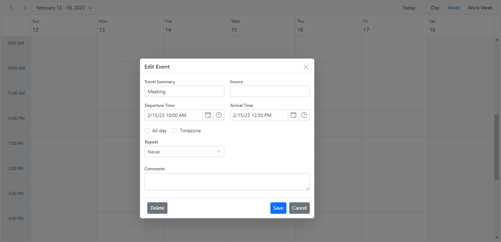

### Field validation

You can validate the required fields of the editor window on the client side before submitting it by adding the appropriate validation rules to each field. The appointment fields have been extended to accept both `string` and `object` type values. To perform validations, you must specify object values for the event fields.











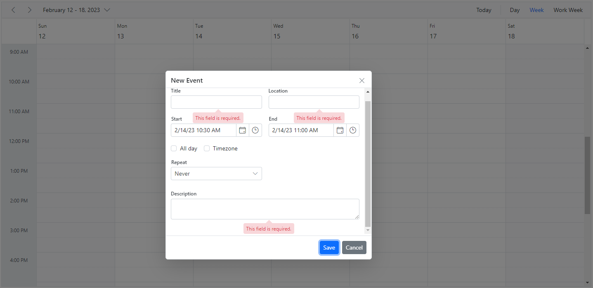

N> Applicable validation rules can be referred from [form validation](http://ej2.syncfusion.com/documentation/form-validator#validation-rules) documentation.

### Add additional fields to the default editor

You can add additional fields to the default event editor by using the [`popupOpen`](https://help.syncfusion.com/cr/aspnetcore-js2/Syncfusion.EJ2.Schedule.Schedule.html#Syncfusion_EJ2_Schedule_Schedule_PopupOpen) event, which is triggered before the event editor opens in the Scheduler. The [`popupOpen`](https://help.syncfusion.com/cr/aspnetcore-js2/Syncfusion.EJ2.Schedule.Schedule.html#Syncfusion_EJ2_Schedule_Schedule_PopupOpen) event is a client-side event that triggers before any of the generic popups open in the Scheduler. Any additional form elements should use the common `e-field` class name so they can be processed along with the default event object. In the following example, an additional field `Event Type` has been added to the default event editor, and its value is processed accordingly.











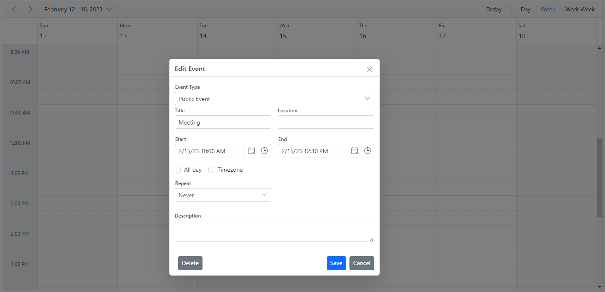

### Customizing the default time duration in editor window

In the default event editor window, the start and end time duration are processed based on the `interval` value set within the [`timeScale`](https://help.syncfusion.com/cr/aspnetcore-js2/Syncfusion.EJ2.Schedule.Schedule.html#Syncfusion_EJ2_Schedule_Schedule_TimeScale) property. By default, the `interval` value is set to 30, so the start and end time duration within the event editor will be 30 minutes apart. You can change this duration value by updating the `duration` option within the [`popupOpen`](https://help.syncfusion.com/cr/aspnetcore-js2/Syncfusion.EJ2.Schedule.Schedule.html#Syncfusion_EJ2_Schedule_Schedule_PopupOpen) event as shown in the following code example.











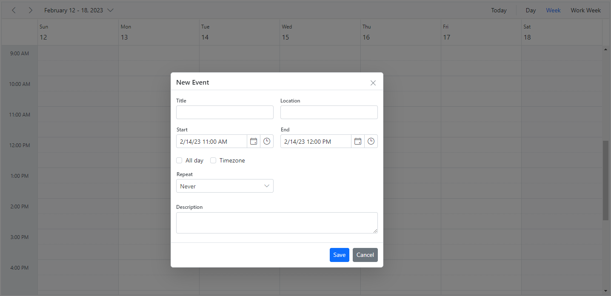

### How to prevent the display of editor and quick popups

You can prevent the display of the editor and quick popup windows by setting the `cancel` option to `true` within the [`popupOpen`](https://help.syncfusion.com/cr/aspnetcore-js2/Syncfusion.EJ2.Schedule.Schedule.html#Syncfusion_EJ2_Schedule_Schedule_PopupOpen) event.











If you need to prevent only specific popups in the Scheduler, you can check the popup type. The popup types that can be checked within the [`popupOpen`](https://help.syncfusion.com/cr/aspnetcore-js2/Syncfusion.EJ2.Schedule.Schedule.html#Syncfusion_EJ2_Schedule_Schedule_PopupOpen) event are as follows.

| Type | Description |
|------|-------------|
| `Editor` | For the detailed editor window.|
| `QuickInfo` | For the quick popup that opens on cell click.|
| `EditEventInfo` | For the quick popup that opens on event click.|
| `ViewEventInfo` | For the quick popup that opens in responsive mode.|
| `EditorContainer` | For the more events indicator popup.|

## Quick popups

The quick info popups open when a cell or appointment is single-clicked in desktop mode. When you single-click a cell, you can provide a subject and save it. When you single-click an event, a popup appears with an overview of the event information. You can also edit or delete those events using the available options.

By default, these popups are displayed over cells and appointments in the Scheduler. To disable this behavior, set the [`showQuickInfo`](https://help.syncfusion.com/cr/aspnetcore-js2/Syncfusion.EJ2.Schedule.Schedule.html#Syncfusion_EJ2_Schedule_Schedule_ShowQuickInfo) property to `false`.











N> The quick popup that opens while single clicking on the cells are not applicable on mobile devices.

### How to open Quick Info popup on multiple cell selection

By default, the `QuickInfo` popup opens when a cell is single-clicked. To open the quick info popup for multiple cell selection, select the cells and press the `Enter` key. You can open this popup immediately after multiple cell selection by setting [`quickInfoOnSelectionEnd`](https://help.syncfusion.com/cr/aspnetcore-js2/Syncfusion.EJ2.Schedule.Schedule.html#Syncfusion_EJ2_Schedule_Schedule_QuickInfoOnSelectionEnd) to `true`; its default value is `false`.











### How to change the watermark text of quick popup subject

By default, the `Add Title` text is displayed in the subject field of the quick popup. To change the default watermark text, update the appropriate localized word collection used in the Scheduler.

```csharp
var L10n = ej.base.L10n;
L10n.load({
    'en-US': {
        'schedule': {
          'addTitle' : 'New Title'
        }
    }
});
```

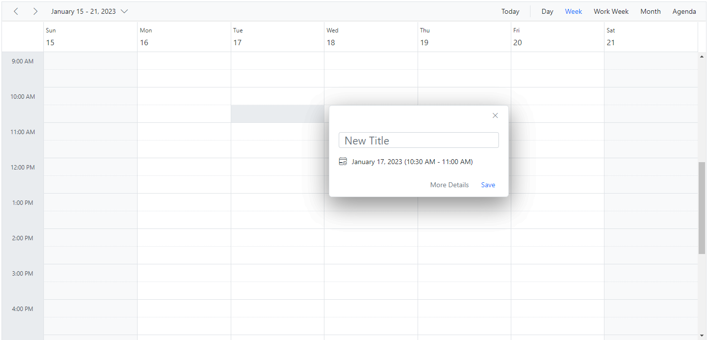

### Customizing quick popups

The look and feel of the built-in quick popup window, which opens when cells or appointments are single-clicked, can be customized by using the Scheduler [`quickInfoTemplates`](https://help.syncfusion.com/cr/aspnetcore-js2/Syncfusion.EJ2.Schedule.Schedule.html#Syncfusion_EJ2_Schedule_Schedule_QuickInfoTemplates) property. There are three sub-options available to customize it easily:

* header - Accepts the template design that customizes the header part of the quick popup.
* content - Accepts the template design that customizes the content part of the quick popup.
* footer - Accepts the template design that customizes the footer part of the quick popup.











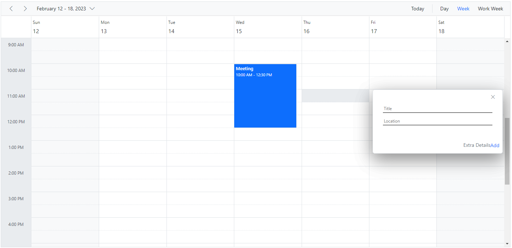

N> The quick popup in adaptive mode can also be customized using [`quickInfoTemplates`](https://help.syncfusion.com/cr/aspnetcore-js2/Syncfusion.EJ2.Schedule.Schedule.html#Syncfusion_EJ2_Schedule_Schedule_QuickInfoTemplates) with the `e-device` class.

### Customizing timezone collection in the editor window

By default, the editor window includes built-in timezone collections. You can customize these collections by using the [`timezoneDataSource`](https://help.syncfusion.com/cr/aspnetcore-js2/Syncfusion.EJ2.Schedule.Schedule.html#Syncfusion_EJ2_Schedule_Schedule_TimezoneDataSource) property with a collection of `TimezoneFields` data.











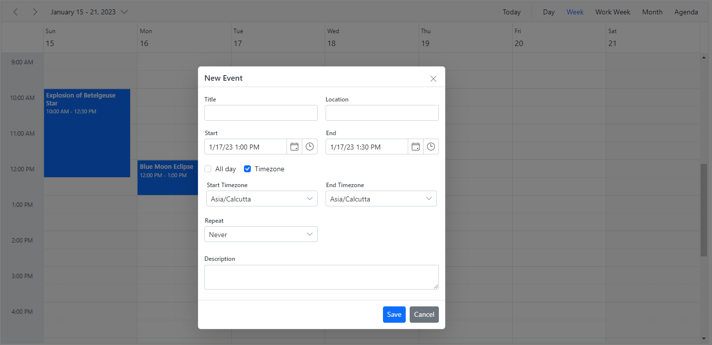

## Customizing event editor using template

The event editor window can be customized by using the [`editorTemplate`](https://help.syncfusion.com/cr/aspnetcore-js2/Syncfusion.EJ2.Schedule.Schedule.html#Syncfusion_EJ2_Schedule_Schedule_EditorTemplate) option. Here, the custom window design is built with the required fields using a script template, and its type should be **text/x-template**.

Each field defined within the template should contain the **e-field** class so that those field values can be processed internally. The ID of the customized script template section is assigned to the [`editorTemplate`](https://help.syncfusion.com/cr/aspnetcore-js2/Syncfusion.EJ2.Schedule.Schedule.html#Syncfusion_EJ2_Schedule_Schedule_EditorTemplate) option, so these customized fields replace the default editor window.

>Note: The **e-field** class is applicable only for **DropDownList**, **DateTimePicker**, **MultiSelect**, **DatePicker**, **CheckBox**, and **TextBox** components. The field values are processed internally for the components mentioned above.

As we use Syncfusion<sup style="font-size:70%">&reg;</sup> sub-components within the template in the following example, the custom form elements must be configured as required Syncfusion<sup style="font-size:70%">&reg;</sup> components such as **DropDownList** and **DateTimePicker** within the [`popupOpen`](https://help.syncfusion.com/cr/aspnetcore-js2/Syncfusion.EJ2.Schedule.Schedule.html#Syncfusion_EJ2_Schedule_Schedule_PopupOpen) event. This step can be skipped if you want to use standard form elements.











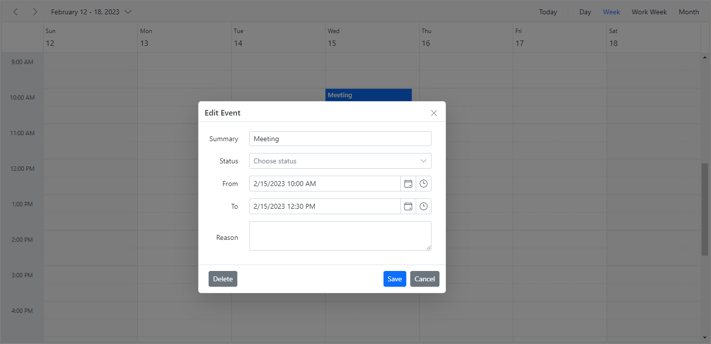

### How to customize header and footer using template

The editor window's header and footer can be enhanced with custom designs using the [`editorHeaderTemplate`](https://help.syncfusion.com/cr/aspnetcore-js2/syncfusion.ej2.schedule.schedule.html#Syncfusion_EJ2_Schedule_Schedule_EditorHeaderTemplate) and [`editorFooterTemplate`](https://help.syncfusion.com/cr/aspnetcore-js2/syncfusion.ej2.schedule.schedule.html#Syncfusion_EJ2_Schedule_Schedule_EditorFooterTemplate) options. To achieve this, create a script template that includes the required fields and set the template type to **text/x-template**.

In this demo, we tailor the editor header according to the appointment's subject field using the [`editorHeaderTemplate`](https://help.syncfusion.com/cr/aspnetcore-js2/syncfusion.ej2.schedule.schedule.html#Syncfusion_EJ2_Schedule_Schedule_EditorHeaderTemplate). We also use the [`editorFooterTemplate`](https://help.syncfusion.com/cr/aspnetcore-js2/syncfusion.ej2.schedule.schedule.html#Syncfusion_EJ2_Schedule_Schedule_EditorFooterTemplate) to validate specific fields before saving or canceling the appointment if validation requirements are not met.











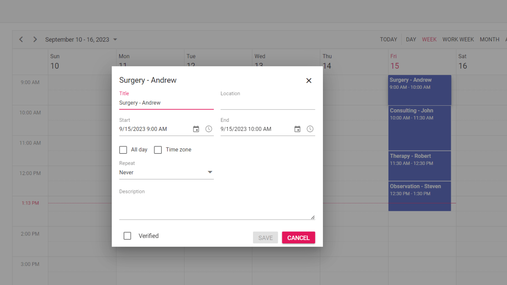

### How to add resource options within editor template

The resource field can be added within the editor template by using the MultiSelect control to allow multiple resources.











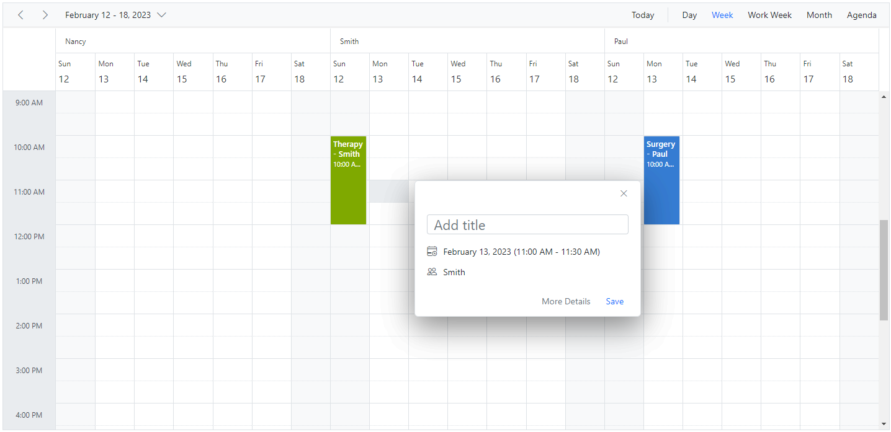

### How to add recurrence options within editor template

The following code example shows how to add recurrence options to the editor template.











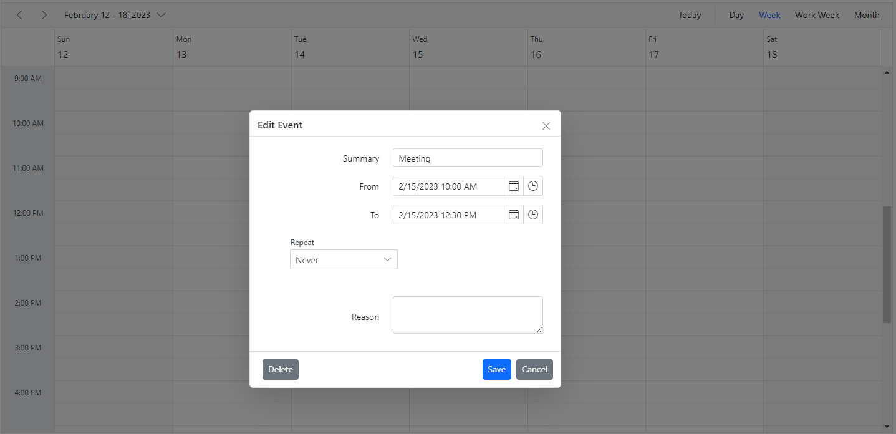

### Apply validations on editor template fields

In the following code example, validation is added to the status field.











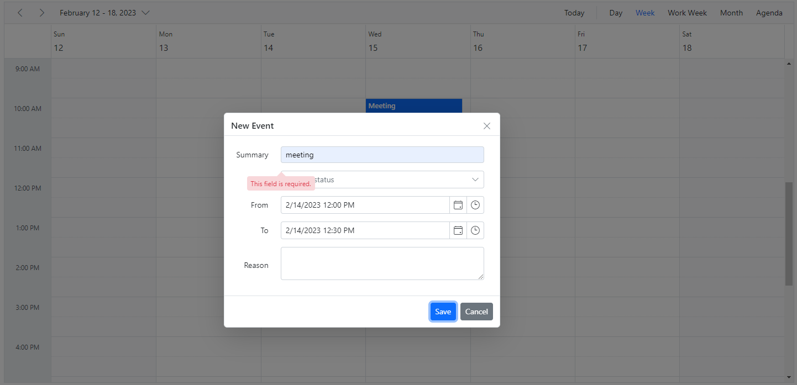

### How to save the customized event editor using template

The **e-field** class is not added to each field defined within the template, so you should set those field values externally by using the [`popupClose`](https://help.syncfusion.com/cr/aspnetcore-js2/Syncfusion.EJ2.Schedule.Schedule.html#Syncfusion_EJ2_Schedule_Schedule_PopupClose) event.

N> You can retrieve the data only on the `save` and `delete` options. Data cannot be retrieved on the `close` and `cancel` options in the editor window.

The following code example shows how to save the customized event editor using a template with the [`popupClose`](https://help.syncfusion.com/cr/aspnetcore-js2/Syncfusion.EJ2.Schedule.Schedule.html#Syncfusion_EJ2_Schedule_Schedule_PopupClose) event.











If you need to prevent only specific popups in the Scheduler, you can check the popup type. The popup types that can be checked within the [`popupClose`](https://help.syncfusion.com/cr/aspnetcore-js2/Syncfusion.EJ2.Schedule.Schedule.html#Syncfusion_EJ2_Schedule_Schedule_PopupClose) event are as follows.

| Type | Description |
|------|-------------|
| `Editor` | For the detailed editor window.|
| `QuickInfo` | For the quick popup that opens on cell click.|
| `EditEventInfo` | For the quick popup that opens on event click.|
| `ViewEventInfo` | For the quick popup that opens in responsive mode.|
| `EventContainer` | For the more events indicator popup.|
| `RecurrenceAlert` | For the recurrence edit alert popup.|
| `DeleteAlert` | For the delete confirmation popup.|
| `ValidationAlert` | For the validation alert popup.|
| `RecurrenceValidationAlert` | For the recurrence validation alert popup.|

## More events indicator and popup

When the number of appointments in a particular time range exceeds the default appointment height of a cell in month view and other timeline views, a `+ more` text indicator appears at the bottom of those cells. This indicator shows that the cell contains additional appointments, and clicking it displays a popup with all appointments present on that day.

N> To disable the popup that shows all hidden appointments when clicking the text indicator, you can customize the [`popupOpen`](https://help.syncfusion.com/cr/aspnetcore-js2/Syncfusion.EJ2.Schedule.Schedule.html#Syncfusion_EJ2_Schedule_Schedule_PopupOpen) event.

The same indicator is displayed in the all-day row in calendar views such as day, week, and work week views when the number of appointments in a cell exceeds three. Clicking the text indicator here will not open a popup, but will allow the expand and collapse option for viewing the remaining appointments in the all-day row.

The following code example shows how to disable popups when clicking the more text indicator.











### How to customize the popup that opens on more indicator

The following code example shows how to customize the default more indicator popup so the number of events rendered on the day is shown in the header.











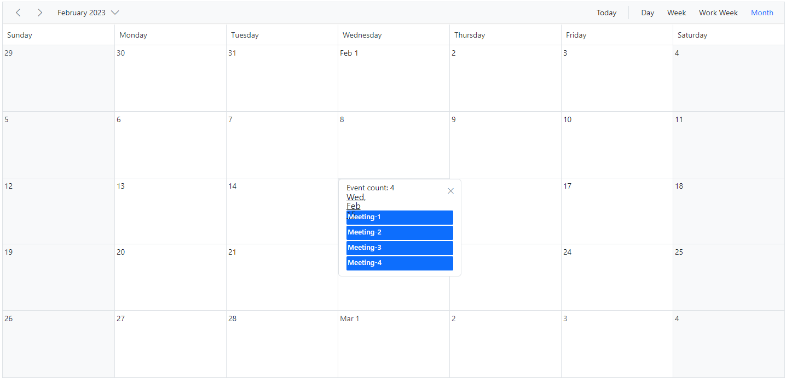

### How to prevent the display of popup when clicking on the more text indicator

You can prevent the popup window from opening by setting the `cancel` option to `true` within the [`MoreEventsClick`](https://help.syncfusion.com/cr/aspnetcore-js2/Syncfusion.EJ2.Schedule.Schedule.html#Syncfusion_EJ2_Schedule_Schedule_MoreEventsClick) event.











### How to navigate Day view when clicking on more text indicator

The following code example shows how to customize the [`moreEventsClick`](https://help.syncfusion.com/cr/aspnetcore-js2/Syncfusion.EJ2.Schedule.Schedule.html#Syncfusion_EJ2_Schedule_Schedule_MoreEventsClick) event to navigate to the Day view when clicking the more text indicator.











### How to close the editor window manually

You can close the editor window by using the `closeEditor` method.












### How to open the quick info popup manually

You can open the quick info popup in the Scheduler by using the `openQuickInfoPopup` public method. To open the cell quick info popup, pass the cell data as an argument to the method. To open the event quick info popup, pass the event data object as an argument to the method.












### How to close the quick info popup manually

You can close the quick info popup in the Scheduler by using the `closeQuickInfoPopup` public method. The following code example demonstrates how to close the quick info popup manually.












N> You can refer to our [ASP.NET Core Scheduler](https://www.syncfusion.com/scheduler-sdk/aspnet-core-scheduler) feature tour page for more details. You can also explore our [ASP.NET Core Scheduler example](https://ej2.syncfusion.com/aspnetcore/Schedule/Overview#/material) to learn how to present and manipulate data.
