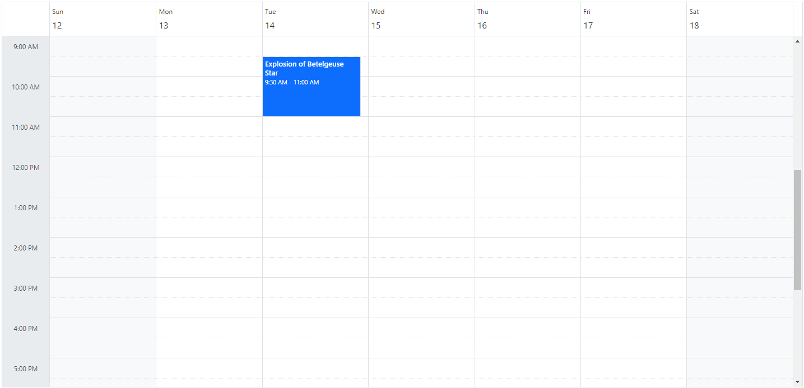
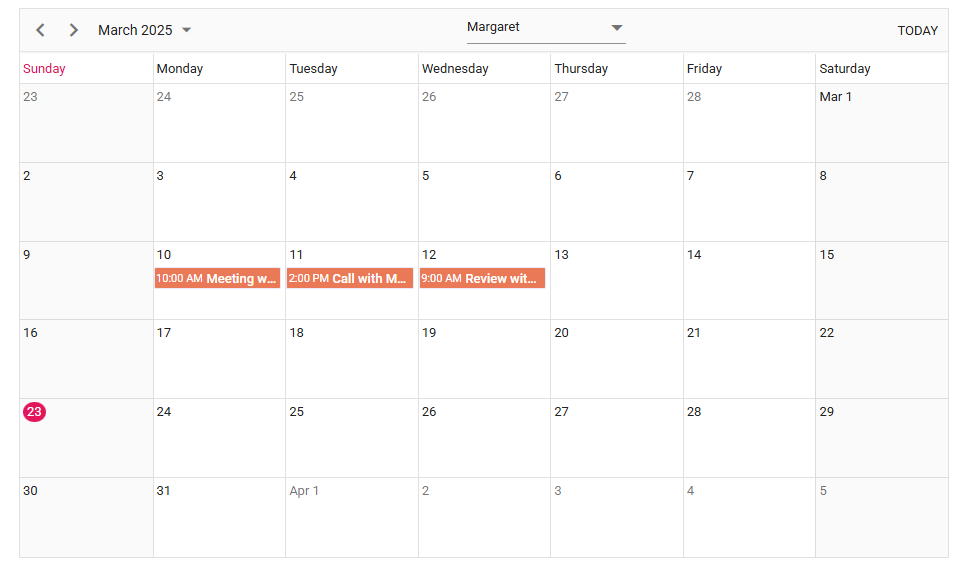
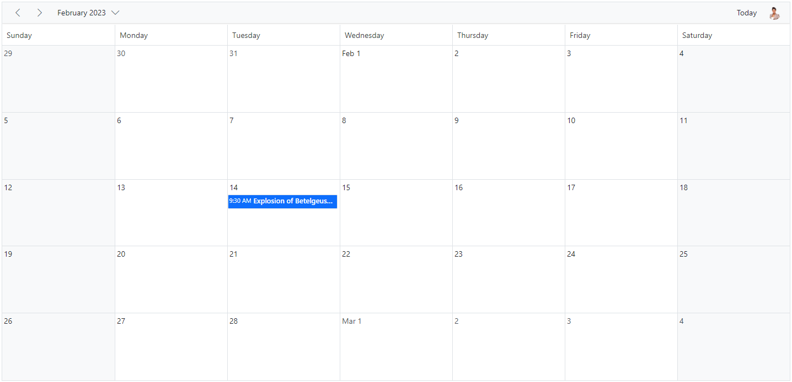
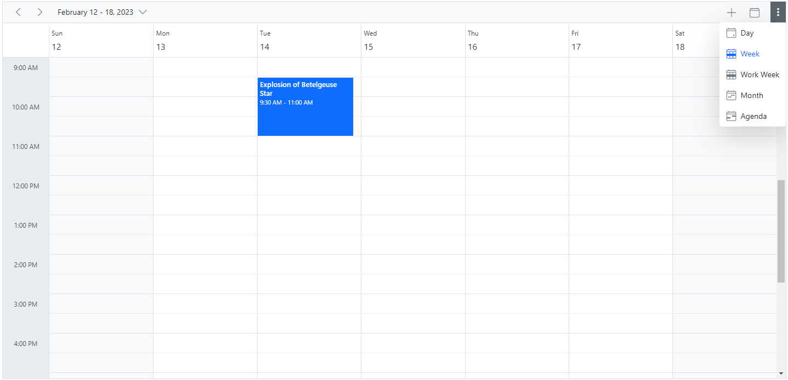
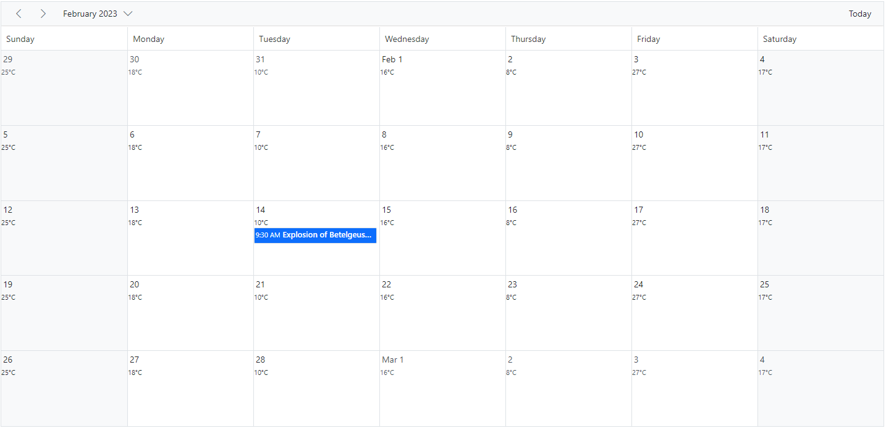
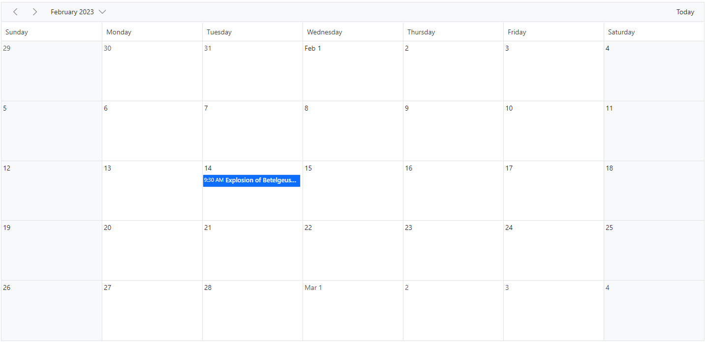
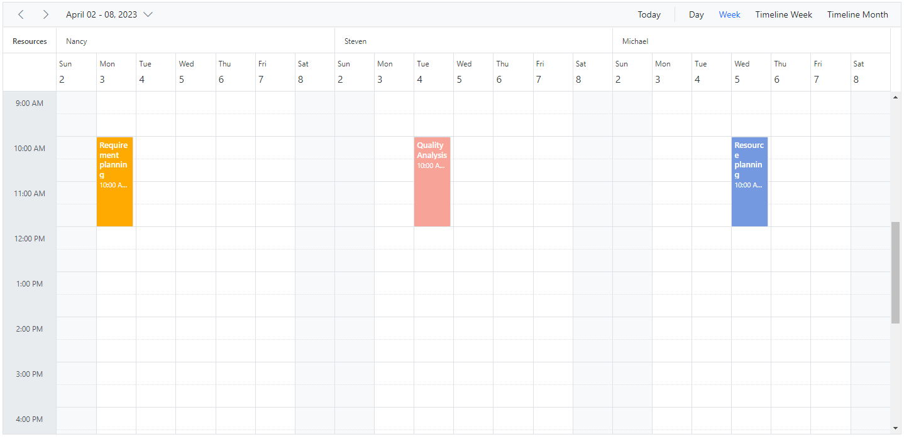

# Header Customization in ASP.NET Core Scheduler

The header part of Scheduler can be customized easily with the built-in options available. Before using the samples, ensure the Scheduler project is configured with the appropriate Syncfusion ASP.NET Core package and a data source.

## Show or Hide header bar

By default, the header bar holds the date and view navigation options, through which the user can switch between the dates and various views. This header bar can be hidden from the UI by setting `false` to the [`showHeaderBar`](https://help.syncfusion.com/cr/aspnetcore-js2/Syncfusion.EJ2.Schedule.Schedule.html#Syncfusion_EJ2_Schedule_Schedule_ShowHeaderBar) property. Its default value is `true`.
























## Customizing header bar using template

Apart from the default date navigation and view options available on the header bar, you can add custom items into the Scheduler header bar by making use of the [`toolbarItems`](https://help.syncfusion.com/cr/aspnetcore-js2/Syncfusion.EJ2.Schedule.ScheduleToolbarItem.html#properties) property. To display the default items, it is essential to assign a [`name`](https://help.syncfusion.com/cr/aspnetcore-js2/Syncfusion.EJ2.Schedule.ScheduleToolbarItem.html#Syncfusion_EJ2_Schedule_ScheduleToolbarItem_Name) field to each item. The names of the default items are `Previous`, `Next`, `Today`, `DateRangeText`, `NewEvent`, and `Views`. For custom items, use `Custom` as the name value. Here, the default items such as Previous, Next, DateRangeText, and Today are used along with an external dropdown list as custom items.
























## Customizing header bar using event

Apart from the default date navigation and view options available on the header bar, you can add custom items into the Scheduler header bar by making use of the `actionBegin` event. Here, an employee image is added to the header bar; clicking it opens a popup showing that person's short profile information.
























## How to display the view options within the header bar popup

By default, the header bar holds the view navigation options, through which the user can switch between various views. You can move these view options to the header bar popup by setting `true` for the [`enableAdaptiveUI`](https://help.syncfusion.com/cr/aspnetcore-js2/Syncfusion.EJ2.Schedule.Schedule.html#Syncfusion_EJ2_Schedule_Schedule_EnableAdaptiveUI) property.
























N> Refer [here](./resources#adaptive-ui-in-desktop) to know more about adaptive UI in resources scheduler.

## Date header customization

The Scheduler UI that displays the date text on all views is considered the date header cells. You can customize the date header cells of Scheduler using either [`dateHeaderTemplate`](https://help.syncfusion.com/cr/aspnetcore-js2/Syncfusion.EJ2.Schedule.Schedule.html#Syncfusion_EJ2_Schedule_Schedule_DateHeaderTemplate) or the [`renderCell`](https://help.syncfusion.com/cr/aspnetcore-js2/Syncfusion.EJ2.Schedule.Schedule.html#Syncfusion_EJ2_Schedule_Schedule_RenderCell) event.

### Using date header template

The [`dateHeaderTemplate`](https://help.syncfusion.com/cr/aspnetcore-js2/Syncfusion.EJ2.Schedule.Schedule.html#Syncfusion_EJ2_Schedule_Schedule_DateHeaderTemplate) option is used to customize the date header cells of day, week and work-week views.
























### Using renderCell event

In month view, the date header template is not applicable and therefore the same customization can be added beside the date text in month cells by making use of the [`renderCell`](https://help.syncfusion.com/cr/aspnetcore-js2/Syncfusion.EJ2.Schedule.Schedule.html#Syncfusion_EJ2_Schedule_Schedule_RenderCell) event.
























## Customizing the date range text

The [`DateRangeTemplate`](https://help.syncfusion.com/cr/aspnetcore-js2/Syncfusion.EJ2.Schedule.Schedule.html#Syncfusion_EJ2_Schedule_Schedule_DateRangeTemplate) option allows you to customize the text content of the date range displayed in the Scheduler. By default, the date range text is determined by the current Scheduler view. You can use [`DateRangeTemplate`](https://help.syncfusion.com/cr/aspnetcore-js2/Syncfusion.EJ2.Schedule.Schedule.html#Syncfusion_EJ2_Schedule_Schedule_DateRangeTemplate) to override the default text and specify custom content.

The [`DateRangeTemplate`](https://help.syncfusion.com/cr/aspnetcore-js2/Syncfusion.EJ2.Schedule.Schedule.html#Syncfusion_EJ2_Schedule_Schedule_DateRangeTemplate) property provides `startDate`, `endDate`, and `currentView` options. Use these values to format the date range text.
























## Customizing header indent cells

It is possible to customize the header indent cells using the [`headerIndentTemplate`](https://help.syncfusion.com/cr/aspnetcore-js2/Syncfusion.EJ2.Schedule.Schedule.html#Syncfusion_EJ2_Schedule_Schedule_HeaderIndentTemplate) option and change the look and appearance in both the vertical and timeline views. In vertical views, you can customize the header indent cells at the hierarchy level, and in timeline views you can customize the resource header left indent cell using the template option.

**Example:** To customize the header left indent cell to display resource text, refer to the code example below.
























N> You can refer to our [ASP.NET Core Scheduler](https://www.syncfusion.com/aspnet-core-ui-controls/scheduler) feature tour page for its feature overview. You can also explore our [ASP.NET Core Scheduler example](https://ej2.syncfusion.com/aspnetcore/Schedule/Overview#/material) to learn how to present and manipulate data.
