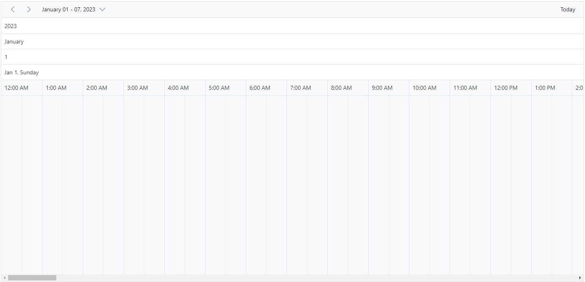
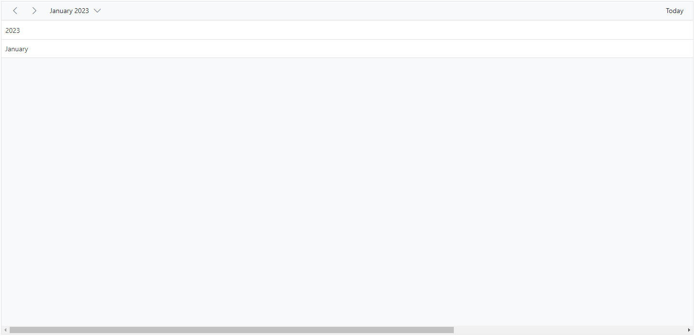
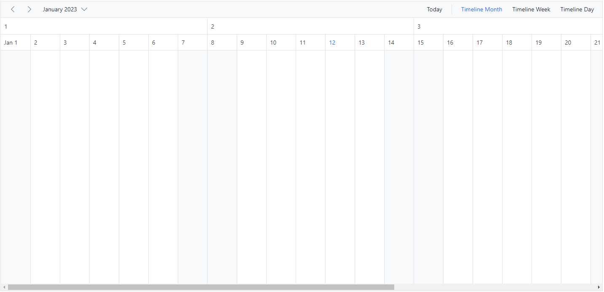
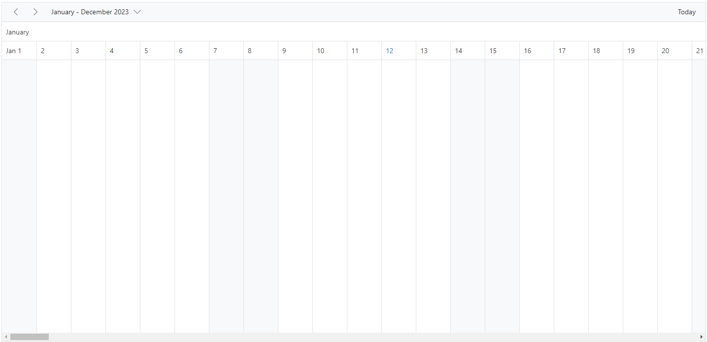
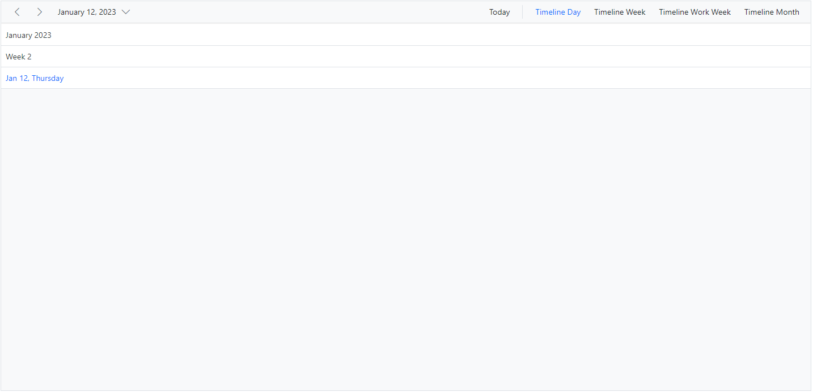

# Timeline Header Rows in ASP.NET Core Scheduler

The Timeline views can have additional header rows other than the default date and time header rows. It is possible to show individual header rows for displaying year, month, and week separately by using the [`headerRows`](https://help.syncfusion.com/cr/aspnetcore-js2/Syncfusion.EJ2.Schedule.Schedule.html#Syncfusion_EJ2_Schedule_Schedule_HeaderRows) property. This property is applicable only to timeline views. The possible rows that can be added by using the `headerRows` property are as follows.

* `Year`
* `Month`
* `Week`
* `Date`
* `Hour`

N> The `Hour` row is not applicable to the TimelineMonth view.

The following example shows the Scheduler displaying all the available header rows on timeline views.










## Display year and month rows in timeline views

To display the Scheduler timeline with year and month names alone, define the `Year` and `Month` options within the [`headerRows`](https://help.syncfusion.com/cr/aspnetcore-js2/Syncfusion.EJ2.Schedule.Schedule.html#Syncfusion_EJ2_Schedule_Schedule_HeaderRows) property.










## Display week numbers in timeline views

The week number can be displayed in a separate header row of the timeline Scheduler by setting `Week` option within [`headerRows`](https://help.syncfusion.com/cr/aspnetcore-js2/Syncfusion.EJ2.Schedule.Schedule.html#Syncfusion_EJ2_Schedule_Schedule_HeaderRows) property.










## Timeline view displaying dates of a complete year

It is possible to display a complete year in a timeline view by setting the [`interval`](https://help.syncfusion.com/cr/aspnetcore-js2/Syncfusion.EJ2.Schedule.ScheduleTimeScale.html#Syncfusion_EJ2_Schedule_ScheduleTimeScale_Interval) value to 12 and defining the **TimelineMonth** view option within the [`e-schedule-views`](https://help.syncfusion.com/cr/aspnetcore-js2/Syncfusion.EJ2.Schedule.Schedule.html#Syncfusion_EJ2_Schedule_Schedule_Views) tag helper of the Scheduler.










## Customizing the header rows using template

You can customize the text of the header rows and display images or formatted text in each individual header row by using the built-in `template` option within the [`headerRows`](https://help.syncfusion.com/cr/aspnetcore-js2/Syncfusion.EJ2.Schedule.Schedule.html#Syncfusion_EJ2_Schedule_Schedule_HeaderRows) property.

To get started quickly with the header row template option in Scheduler, watch this video:












N> You can refer to our [ASP.NET Core Scheduler](https://www.syncfusion.com/scheduler-sdk/aspnet-core-scheduler) feature tour page for an overview of its features. You can also explore our [ASP.NET Core Scheduler example](https://ej2.syncfusion.com/aspnetcore/Schedule/Overview#/material) to learn how to present and manipulate data.
