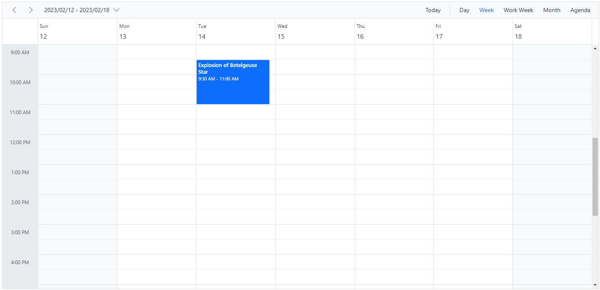
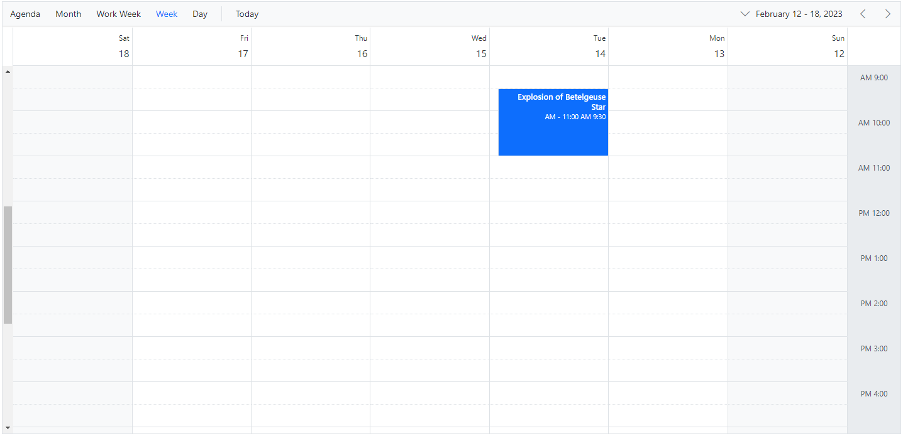

# Globalization and Localization in ASP.NET Core Scheduler

The Scheduler supports different date and time formats as well as cultures, which helps it work across regions. Before using the samples, install the required CLDR data and ensure the Scheduler is configured with the appropriate locale.

You can adapt the Scheduler to various languages by parsing and formatting the date or number using [`Internationalization`](https://ej2.syncfusion.com/aspnetcore/documentation/common/internationalization), and by adding culture-specific customization and text translation using [`Localization`](https://ej2.syncfusion.com/aspnetcore/documentation/common/localization).

## Globalization

The Internationalization library provides support for formatting and parsing the number, date, and time by using the official [`Unicode CLDR`](http://cldr.unicode.org/) JSON data and also provides the `loadCldr` method to load the culture specific CLDR JSON data.

By default, Scheduler is set to follow the English culture ('en-US'). If you want to use a culture other than English, follow these steps.

Install the `cldr-data` package by using the following command. For more information about CLDR data, refer to this [link](https://cldr.unicode.org/index/cldr-spec/cldr-json-bindings).

```
npm install cldr-data --save
```

Once the package is installed, you can find the culture-specific JSON data under `node_modules/cldr-data`.

After installing `cldr-data`, create a `cldr-data` folder inside `wwwroot` and add the following subfolders:

* `wwwroot/cldr-data/supplemental`
* `wwwroot/cldr-data/main`

The following files are required to set up the specific culture for the Scheduler.

* numberingSystems.json
* ca-gregorian.json
* numbers.json
* timeZoneNames.json
* ca-islamic.json

The file named `numberingSystems.json` is available in the location `node_modules/cldr-data/supplemental` which is common for all the cultures. Now you can move this file to the location `wwwroot/cldr-data/supplemental`.

The other required files mentioned above are available in the location `node_modules/cldr-data/main/culture_code`. In this location every culture having the culture files inside the folder named as its language culture code. For example if we are loading the German culture we can find the German culture files inside the location `node_modules/cldr-data/main/de`. Now create a folder named `de` inside the location `wwwroot/cldr-data/main` and move the files inside it.

Then use the `loadCultureFiles` method to load the culture-specific CLDR JSON data.

```sh
    loadCultureFiles('de');
    function loadCultureFiles(name) {
        var files = ['ca-gregorian.json', 'numbers.json', 'timeZoneNames.json'];
        var loader = ej.base.loadCldr;
        var loadCulture = function (prop) {
            var val, ajax;
            ajax = new ej.base.Ajax(location.origin + '/../cldr-data/main/' + name + '/' + files[prop], 'GET', false);
            ajax.onSuccess = function (value) {
                val = value;
            };
            ajax.send();
            loader(JSON.parse(val));
        };
        for (var prop = 0; prop < files.length; prop++) {
            loadCulture(prop);
        }
    }
```

Set the culture to Scheduler by using the `locale` property.











## Localizing the static Scheduler text

The [`Localization`](https://ej2.syncfusion.com/aspnetcore/documentation/common/localization) library allows you to display all static text, date content, and time mode in the localized language. To achieve this, set the `locale` property of Scheduler and define the translation text for the static words of Scheduler through the `load` method of the `L10n` class.

For example, the following code example lets you define the Hungarian translation words for all the static words used in Scheduler.











## Setting date format

Scheduler can be used with all valid date formats and, by default, follows the universal date format "MM/dd/yyyy". If the [`dateFormat`](https://help.syncfusion.com/cr/aspnetcore-js2/Syncfusion.EJ2.Schedule.Schedule.html#Syncfusion_EJ2_Schedule_Schedule_DateFormat) property is not specified, it uses the locale assigned to Scheduler. Because the default locale is "en-US", it follows the "MM/dd/yyyy" pattern.













## Setting the time format

Time format is a way of representing time values in different string formats in the Scheduler. By default, the time mode of the Scheduler can be either 12-hour or 24-hour format, depending on the `locale` set on the Scheduler. Since the default `locale` value is `en-US`, the time mode is set to 12-hour format automatically. You can also customize the format by using the [`timeFormat`](https://help.syncfusion.com/cr/aspnetcore-js2/Syncfusion.EJ2.Schedule.Schedule.html#Syncfusion_EJ2_Schedule_Schedule_TimeFormat) property. To learn more about time format standards, refer to the [Date and Time Format](https://ej2.syncfusion.com/aspnetcore/documentation/common/internationalization#custom-formats) section.

The following example demonstrates the Scheduler component in 24-hour format.











N> The [`timeFormat`](https://help.syncfusion.com/cr/aspnetcore-js2/Syncfusion.EJ2.Schedule.Schedule.html#Syncfusion_EJ2_Schedule_Schedule_TimeFormat) property accepts only valid time formats.

## Displaying Scheduler in RTL mode

The Scheduler layout and its behavior can be changed according to the common RTL (right-to-left) conventions by setting [`enableRtl`](https://help.syncfusion.com/cr/aspnetcore-js2/Syncfusion.EJ2.Schedule.Schedule.html#Syncfusion_EJ2_Schedule_Schedule_EnableRtl) to `true`. By doing so, the Scheduler displays its layout from right to left. Its default value is `false`.













N> You can refer to our [ASP.NET Core Scheduler](https://www.syncfusion.com/aspnet-core-ui-controls/scheduler) feature tour page for an overview of its features. You can also explore our [ASP.NET Core Scheduler example](https://ej2.syncfusion.com/aspnetcore/Schedule/Overview#/material) to learn how to present and manipulate data.

## See Also

* [How to change first day of the week in the Scheduler](./working-days#setting-start-day-of-the-week)