# Resources and Grouping in ASP.NET Core Scheduler

Resources and grouping support allows the Scheduler to be shared by multiple resources. The appointments for each resource are displayed under the relevant resource. Each resource in the Scheduler is arranged in a column or row order, with spacing to display its appointments on a single page. It also supports multiple levels of grouping, enabling resources to be categorized in a hierarchical structure and shown either in expandable groups (Timeline views) or in a vertical hierarchy (Calendar views).

It is also possible to assign one or more resources to the same appointment by allowing multiple selection of resource options in the event editor window.

The Scheduler groups resources based on different criteria. It includes grouping appointments based on resources, grouping resources based on dates, and timeline scheduling. The resource data can be bound to the Scheduler as either a local JSON collection or a URL, retrieving data from remote data services.

To render an ASP.NET Core Scheduler with appointments from multiple resources, you can watch this video:



## Resource fields

The default options available within the [`resources`](https://help.syncfusion.com/cr/aspnetcore-js2/Syncfusion.EJ2.Schedule.ScheduleGroup.html#Syncfusion_EJ2_Schedule_ScheduleGroup_Resources) collection are as follows:

| Field name | Type | Description |
|-------|---------| --------------- |
| `field` | String | A value that binds to the resource field of event object. |
| `title` | String | It holds the title of the resource field to be displayed on the event editor window. |
| `name` | String | A unique resource name used for differentiating various resource objects while grouping. |
| `allowMultiple` | Boolean | When set to `true`, allows multiple selection of resource names, thus creating multiple instances of same appointment for the selected resources. |
| `dataSource` | Object | Assigns the resource `dataSource`, where data can be passed either as an array of JavaScript objects, or else can create an instance of [`DataManager`](https://ej2.syncfusion.com/documentation/api/data/datamanager) in case of processing remote data and can be assigned to the `dataSource` property. With the remote data assigned to `dataSource`, check the available [adaptors](http://ej2.syncfusion.com/documentation/data/adaptors.html) to customize the data processing. |
| `query` | Query | Defines the external [`query`](https://ej2.syncfusion.com/documentation/api/data/query) that will be executed along with the data processing. |
| `idField` | String | Binds the resource ID field name from the resources `dataSource`. |
| `expandedField` | String | Binds the `expandedField` name from the resources `dataSource`. It usually holds boolean value which decide whether the resource of timeline views is in collapse or expand state on initial load. |
| `textField` | String | Binds the text field name from the resources `dataSource`. It usually holds the resource names. |
| `groupIDField` | String | Binds the group ID field name from the resource `dataSource`. It usually holds the value of resource IDs of parent level resources. |
| `colorField` | String | Binds the color field name from the resource `dataSource`. The color value mapped in this field will be applied to the events of resources. |
| `startHourField` | String | Binds the start hour field name from the resource `dataSource`. It allows to provide different work start hour for the resources. |
| `endHourField` | String | Binds the end hour field name from the resource `dataSource`. It allows to provide different work end hour for the resources. |
| `workDaysField` | String | Binds the work days field name from the resources `dataSource`. It allows to provide different working days collection for the resources. |
| `cssClassField` | String | Binds the custom CSS class field name from the resources `dataSource`. It maps the CSS class written for the specific resources and applies it to the events of those resources. |

## Resource data binding

The resource data can be bound to the Scheduler either as a local JSON collection or a service URL, retrieving resource data from remote services.

### Using local JSON data

The following code example shows how to bind local JSON data to the `dataSource` of the [`resources`](https://help.syncfusion.com/cr/aspnetcore-js2/Syncfusion.EJ2.Schedule.ScheduleGroup.html#Syncfusion_EJ2_Schedule_ScheduleGroup_Resources) collection.

* Add the resource data source in the Index method.
* Add the Scheduler code in the view page.
























### Using remote service URL

The following code example shows how to bind remote data to the resources `dataSource`.

* Add the resource data source in the Index method.
* Add the Scheduler code in the view page.
























## Scheduler with multiple resources

It is possible to display the Scheduler in default mode without visually showing all the resources, while still allowing the required resources to be assigned through the event editor resource options.

Appointments belonging to different resources are displayed together in the default Scheduler and are differentiated based on the resource color assigned in the `resources` collection.

**Example:** To display the default Scheduler with multiple resource options in the event editor, ignore the group option and define the [`resources`](https://help.syncfusion.com/cr/aspnetcore-js2/Syncfusion.EJ2.Schedule.ScheduleGroup.html#Syncfusion_EJ2_Schedule_ScheduleGroup_Resources) property with all its internal options.
























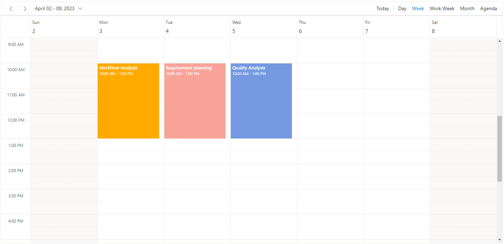

N> Setting `allowMultiple` to `true` in the above code example allows you to select multiple resources from the event editor and also creates multiple copies of the same appointment in the Scheduler for each resources while rendering.

## Resource grouping

Resource grouping support allows the Scheduler to group resources in a hierarchical structure either as expandable groups (Timeline views) or as a vertical hierarchy displaying resources one after the other (Resources view).

Scheduler supports both single-level and multi-level resource grouping, and these can be customized in both timeline and vertical Scheduler views.

### Vertical resource view

The following code example shows how multiple resources are grouped and how their events are displayed in the default calendar views.
























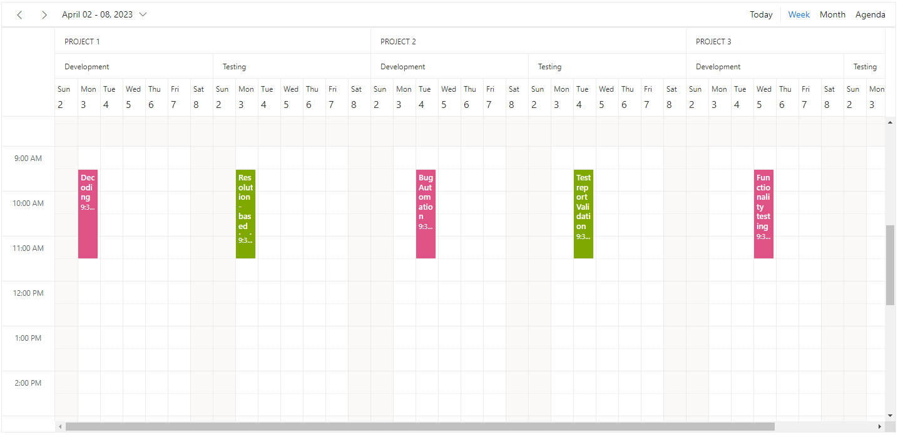

### Timeline resource view

The following code example shows how to group multiple resources in Timeline Scheduler views and display the related events under those resources.
























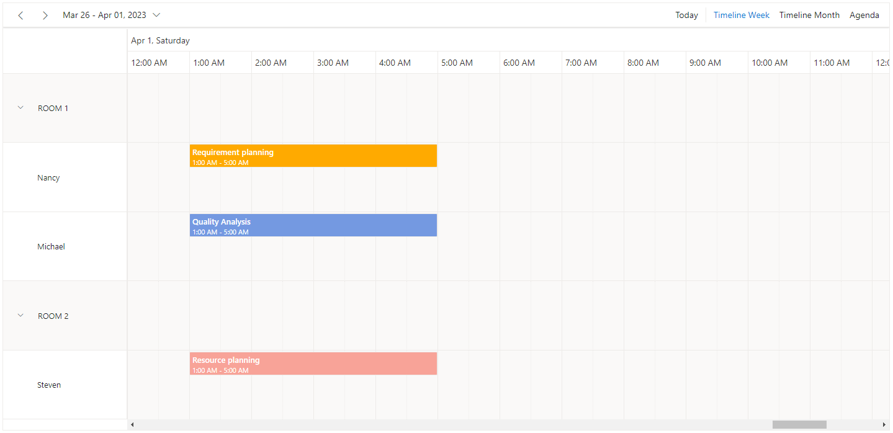

### Grouping single-level resources

This grouping allows the Scheduler to display all resources at a single level simultaneously. Appointments mapped to resources are displayed with the colors defined by the `colorField` in the resources collection.

**Example:** To display the Scheduler with single-level resource grouping:
























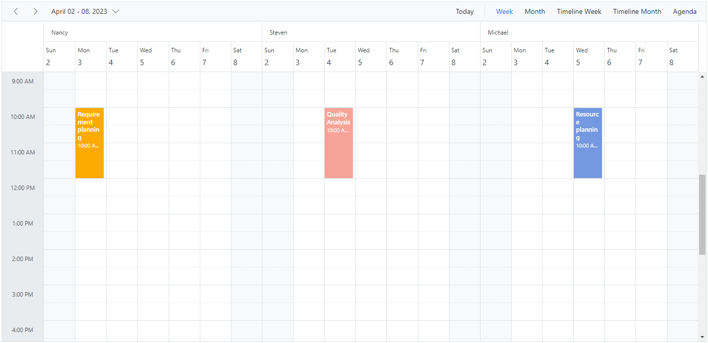

N> The `name` field defined in the **resources** collection namely `Owners` will be mapped within the [`group`](https://help.syncfusion.com/cr/aspnetcore-js2/Syncfusion.EJ2.Schedule.Schedule.html#Syncfusion_EJ2_Schedule_Schedule_Group) property, in order to enable the grouping option with those resource levels on the Scheduler.

### Grouping multi-level resources

It is possible to group the resources in the Scheduler across multiple levels by mapping child resources to each parent resource. In the following example, there are two resource levels, and the second-level resources use `groupIDField` to map to the first-level resource ID and establish the parent-child relationship.
























### One-to-One grouping

In multi-level grouping, Scheduler usually groups child resources based on the `groupIDField` mapped to the parent resource's `idField` (with [`byGroupID`](https://help.syncfusion.com/cr/aspnetcore-js2/Syncfusion.EJ2.Schedule.ScheduleGroup.html#Syncfusion_EJ2_Schedule_ScheduleGroup_ByGroupID) set to `true` by default). There is also an option that allows you to group all child resources against each parent resource. To enable this grouping, set the [`byGroupID`](https://help.syncfusion.com/cr/aspnetcore-js2/Syncfusion.EJ2.Schedule.ScheduleGroup.html#Syncfusion_EJ2_Schedule_ScheduleGroup_ByGroupID) option within the [`group`](https://help.syncfusion.com/cr/aspnetcore-js2/Syncfusion.EJ2.Schedule.Schedule.html#Syncfusion_EJ2_Schedule_Schedule_Group) property to `false`. In the following code example, there are two resource levels, and all three child resources are mapped one-to-one with each resource on the first level.
























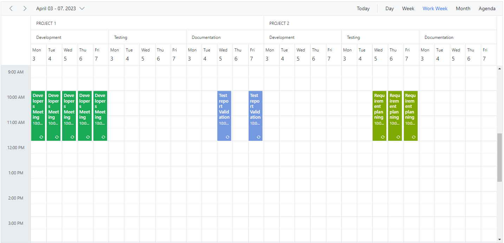

### Grouping resources by date

It groups the resources under each date and is applicable only to calendar views such as Day, Week, Work Week, Month, Agenda, and Month-Agenda. To enable this grouping, set the [`byDate`](https://help.syncfusion.com/cr/aspnetcore-js2/Syncfusion.EJ2.Schedule.ScheduleGroup.html#Syncfusion_EJ2_Schedule_ScheduleGroup_ByDate) option within the [`group`](https://help.syncfusion.com/cr/aspnetcore-js2/Syncfusion.EJ2.Schedule.Schedule.html#Syncfusion_EJ2_Schedule_Schedule_Group) property to `true`.

**Example:** To display the Scheduler with resources grouped by date:
























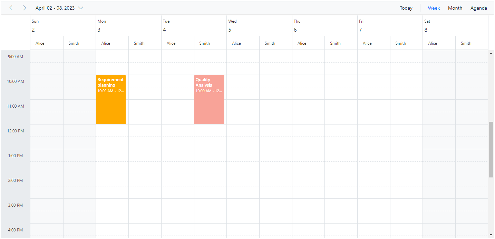

N> This kind of grouping by date is not applicable on any of the **timeline views**.

## Customizing parent resource cells

In timeline view work cells of parent resource can be customized by checking the `elementType` as `resourceGroupCells` in the event [`renderCell`](https://help.syncfusion.com/cr/aspnetcore-js2/Syncfusion.EJ2.Schedule.Schedule.html#Syncfusion_EJ2_Schedule_Schedule_RenderCell). In the following code example, background color of the work hours has been changed.
























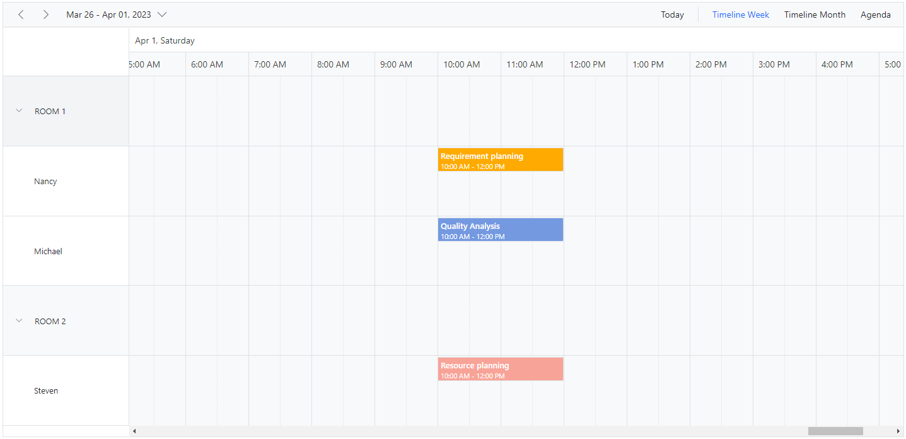

## Working with shared events

Multiple resources can share the same events, thus allowing the CRUD action made on it to reflect on all other shared instances simultaneously. To enable such option, set [`allowGroupEdit`](https://help.syncfusion.com/cr/aspnetcore-js2/Syncfusion.EJ2.Schedule.ScheduleGroup.html#Syncfusion_EJ2_Schedule_ScheduleGroup_AllowGroupEdit) option to `true` within the [`group`](https://help.syncfusion.com/cr/aspnetcore-js2/Syncfusion.EJ2.Schedule.Schedule.html#Syncfusion_EJ2_Schedule_Schedule_Group) property. With this property enabled, a single appointment object will be maintained within the appointment collection, even if it is shared by more than one resource – whereas the resource fields of such appointment object will be in array which hold the IDs of the multiple resources.

N> Any actions such as create, edit or delete held on any one of the shared event instances, will be reflected on all other related instances visible on the UI.

**Example:** To edit all the resource events simultaneously,
























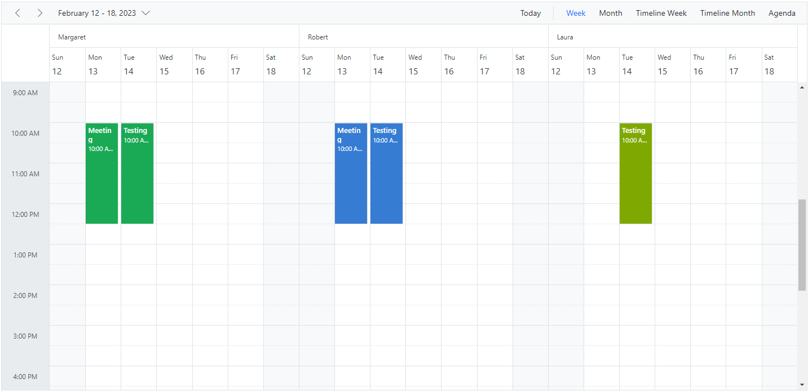

## Simple resource header customization

It is possible to customize the resource header cells using built-in template option and change the look and appearance of it in both the vertical and timeline view modes. All the resource related fields and other information can be accessed within the resource header template option.

**Example:** To customize the resource header and display it along with designation field, refer the below code example.
























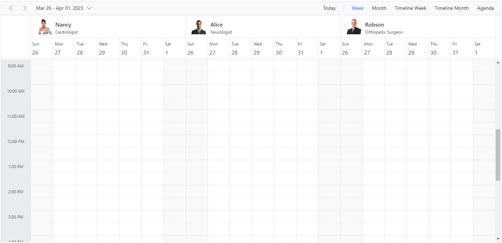

N> To customize the resource header in compact mode properly make use of the class `e-device` as in the code example.

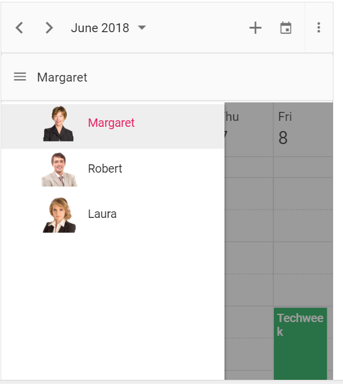

## Customizing resource header with multiple columns

It is possible to customize the resource headers to display with multiple columns such as Room, Type and Capacity. The following code example depicts the way to achieve it and is applicable only on timeline views.
























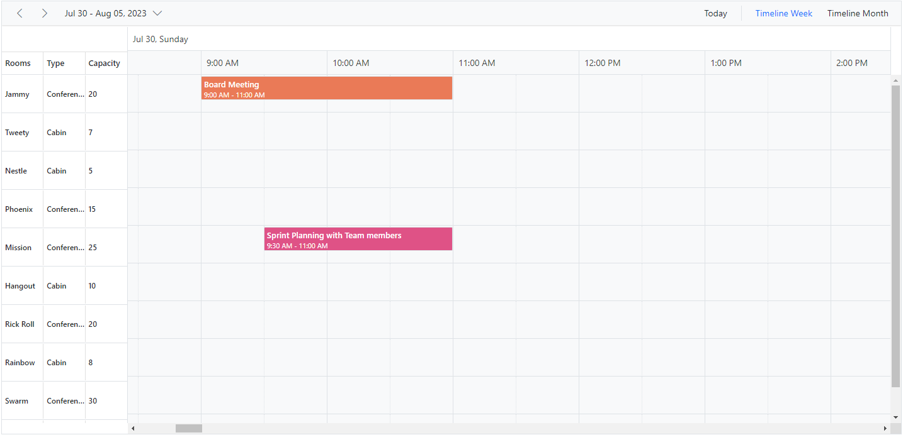

## Collapse/Expand child resources in timeline views

It is possible to expand and collapse the resources which have child resource in timeline views dynamically. By default, resources are in expanded state with their child resource. We can collapse and expand the child resources in UI by setting `expandedField` option as `false` whereas its default value is `true`.
























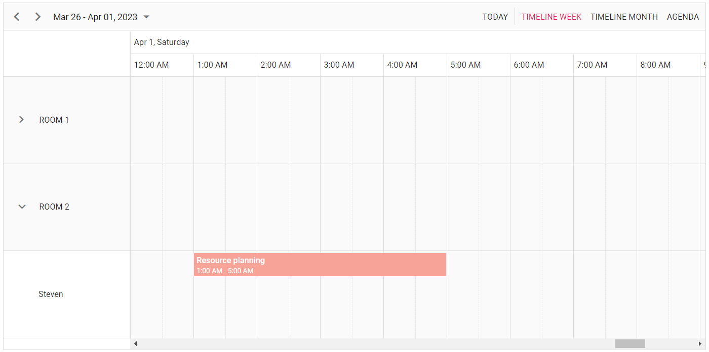

## Displaying tooltip for resource headers

It is possible to display tooltip over the resource headers showing the resource information. By default, there won't be any tooltip displayed on the resource headers, and to enable it, you need to assign the customized template design to the [`headerTooltipTemplate`](https://help.syncfusion.com/cr/aspnetcore-js2/Syncfusion.EJ2.Schedule.ScheduleGroup.html#Syncfusion_EJ2_Schedule_ScheduleGroup_HeaderTooltipTemplate) option within the [`group`](https://help.syncfusion.com/cr/aspnetcore-js2/Syncfusion.EJ2.Schedule.Schedule.html#Syncfusion_EJ2_Schedule_Schedule_Group) property.
























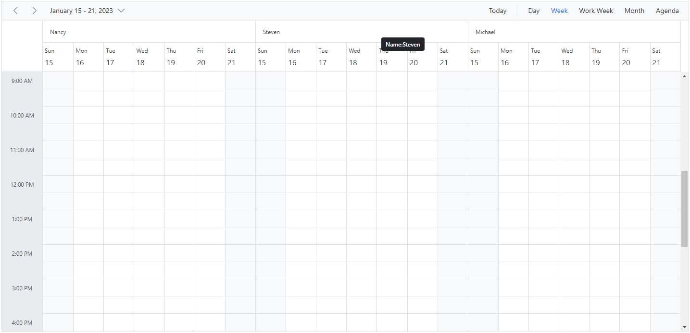

## Choosing between resource colors for appointments

By default, the colors defined on the top level resources collection will be applied for the events. In case, if you want to apply specific resource color to events irrespective of its top-level parent resource color, it can be achieved by defining [`resourceColorField`](https://help.syncfusion.com/cr/aspnetcore-js2/Syncfusion.EJ2.Schedule.ScheduleEventSettings.html#Syncfusion_EJ2_Schedule_ScheduleEventSettings_ResourceColorField) option within the [`eventSettings`](https://help.syncfusion.com/cr/aspnetcore-js2/Syncfusion.EJ2.Schedule.Schedule.html#Syncfusion_EJ2_Schedule_Schedule_EventSettings) property.

In the following example, the colors mentioned in the second level will get applied over the events.
























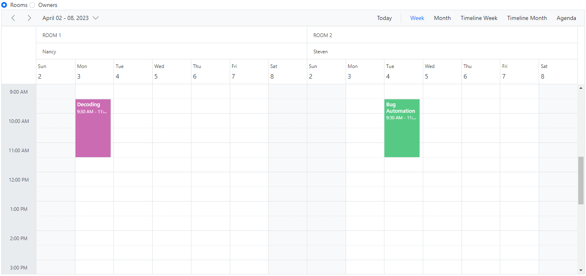

N> The value of the `resourceColorField` field should be mapped with the `name` value given within the [`resources`](https://help.syncfusion.com/cr/aspnetcore-js2/Syncfusion.EJ2.Schedule.Schedule.html#Syncfusion_EJ2_Schedule_Schedule_Resources) property.

## Dynamically add and remove resources

It is possible to add or remove the resources dynamically to and from the Scheduler respectively. In the following example, when the checkbox is checked and unchecked, the respective resources gets added up or removed from the Scheduler layout. To add new resource dynamically, `addResource` method is used which accepts the arguments such as resource object, resource name (within which level, the resource object to be added) and index (position where the resource needs to be added).

To remove the resources dynamically, `removeResource` method is used which accepts the index (position from where the resource to be removed) and resource name (within which level, the resource object presents) as parameters.
























## Setting different working days and hours for resources

Each resource in the Scheduler can have different `working hours` as well as different `working days` set to it. There are default options available within the `resources` collection, to customize the default working hours and days of the Scheduler.

* [Using the work day field for different work days](#Set-different-work-days)
* [Using the start hour and end hour fields for different work hours](#Set-different-work-hours)

### Set different work days

Different working days can be set for the resources of Scheduler using the `workDaysField` property which maps the working days field from the resource dataSource. This field accepts the collection of day indexes (from 0 to 6) of a week. By default, it is set to [1, 2, 3, 4, 5] and in the following example, each resource has been set with different values and therefore each of them will render only those working days. This option is applicable only on the calendar views and is not applicable on timeline views.
























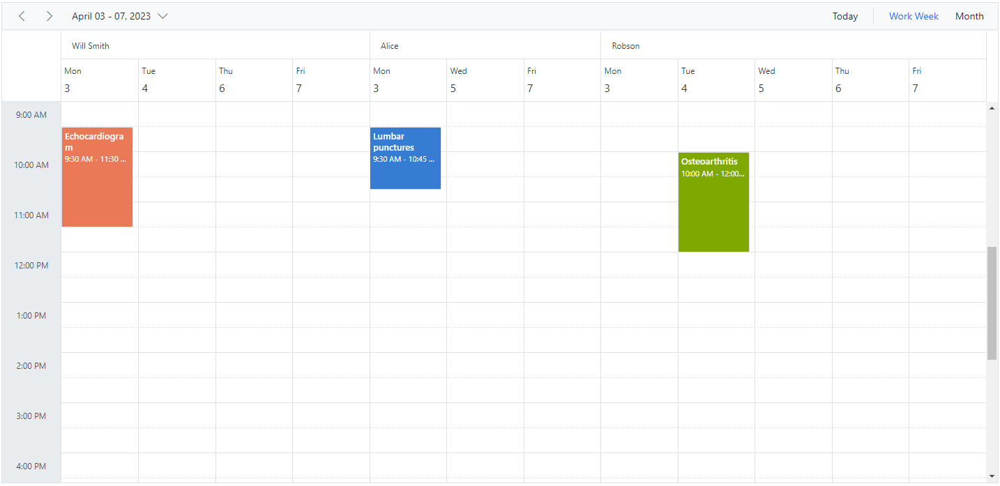

### Set different work hours

Different `working Hours` can be set for the resources of Scheduler using the `startHourField` and `sndHourField` property which maps the `startHourField` and `endHourField` field from the resource dataSource.

* `startHourField` - Denotes the start time of the working/business hour in a day.
* `endHourField` - Denotes the end time limit of the working/business hour in a day.

Working hours indicates the work hour duration of a day, which is highlighted visually with active color over the work cells. Each resource on the Scheduler can be defined with its own set of working hours as depicted in the following example.
























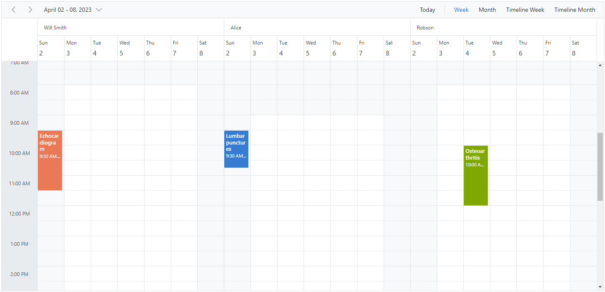

In this example, a resource named `Will Smith` is depicted with working hours ranging from 8.00 AM to 3.00 PM and is visually illustrated with active colors, whereas the other two resources have different working hours set.

## Hide non-working days when grouped by date

In Scheduler, you can set custom work days for each resource and group the Scheduler by date to display these work days. By default, the Scheduler will show all days when it is grouped by date, even if they are not included in the custom work days for the resources. However, you can use the `HideNonWorkingDays` property to only display the custom work days in the Scheduler.

To use the `HideNonWorkingDays` property, you need to include it in the configuration options for your Scheduler component. Set the value of `HideNonWorkingDays` to `true` to enable this feature.

**Example:** To display the Scheduler with resources grouped by date for custom working days,
























N> The `HideNonWorkingDays` property only applies when the Scheduler is grouped `byDate`.

## Compact view in mobile

Although the Scheduler views are designed keeping in mind the responsiveness of the control in mobile devices, however when using Scheduler with multiple resources - it is difficult to view all the resources and its relevant events at once on the mobile. Therefore, we have introduced a new compact mode specially for displaying multiple resources of Scheduler on mobile devices. By default, this mode is enabled while using Scheduler with multiple resources on mobile devices. If in case, you need to disable this compact mode, set `false` to the [`enableCompactView`](https://help.syncfusion.com/cr/aspnetcore-js2/Syncfusion.EJ2.Schedule.ScheduleGroup.html#Syncfusion_EJ2_Schedule_ScheduleGroup_EnableCompactView) option within the [`group`](https://help.syncfusion.com/cr/aspnetcore-js2/Syncfusion.EJ2.Schedule.Schedule.html#Syncfusion_EJ2_Schedule_Schedule_Group) property. Disabling this option will display the exact desktop mode of Scheduler view on mobile devices.

With this compact view enabled on mobile, you can view only single resource at a time and to switch to other resources, there is a TreeView at the left listing out all other available resources - clicking on which will display that particular resource and its related appointments.

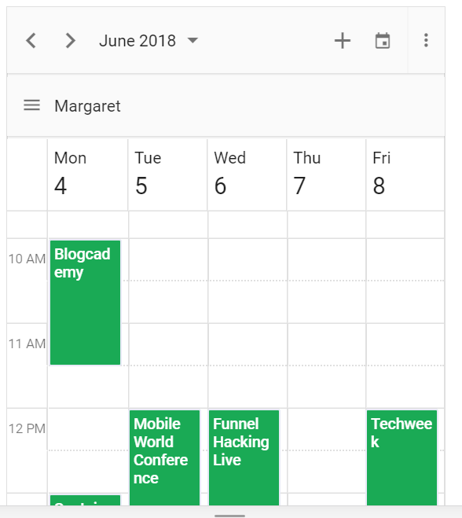

## Adaptive UI in desktop

By default, the Scheduler layout adapts automatically in the desktop and mobile devices with appropriate UI changes. In case, if the user wants to display the Adaptive scheduler in desktop mode with adaptive enhancements, then the property [`enableAdaptiveUI`](https://help.syncfusion.com/cr/aspnetcore-js2/Syncfusion.EJ2.Schedule.Schedule.html#Syncfusion_EJ2_Schedule_Schedule_EnableAdaptiveUI) can be set to true. Enabling this option will display the exact mobile mode of Scheduler view on desktop devices.

Some of the default changes made for compact Scheduler to render in desktop devices are as follows,
* View options displayed in the Navigation drawer.
* Plus icon is added to the header for new event creation.
* Today icon is added to the header instead of the Today button.
* With Multiple resources – only one resource has been shown to enhance the view experience of resource events details clearly. To switch to other resources, there is a TreeView on the left that lists all other available resources, clicking on which will display that particular resource and its related events.
























N> You can refer to our [ASP.NET Core Scheduler](https://www.syncfusion.com/aspnet-core-ui-controls/scheduler) feature tour page for its groundbreaking feature representations. You can also explore our [ASP.NET Core Scheduler example](https://ej2.syncfusion.com/aspnetcore/Schedule/Overview#/material) to knows how to present and manipulate data.
