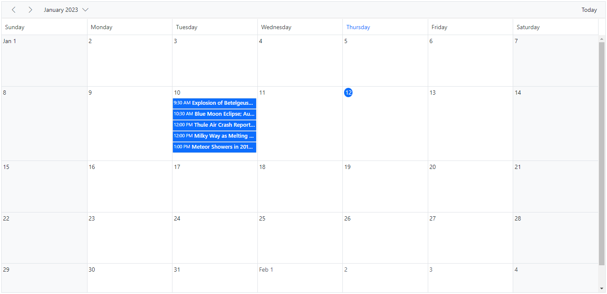
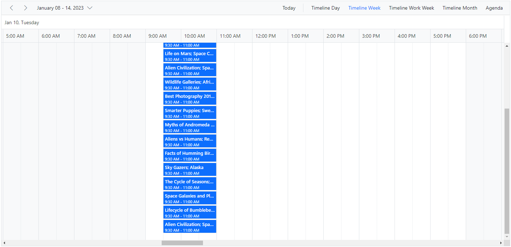
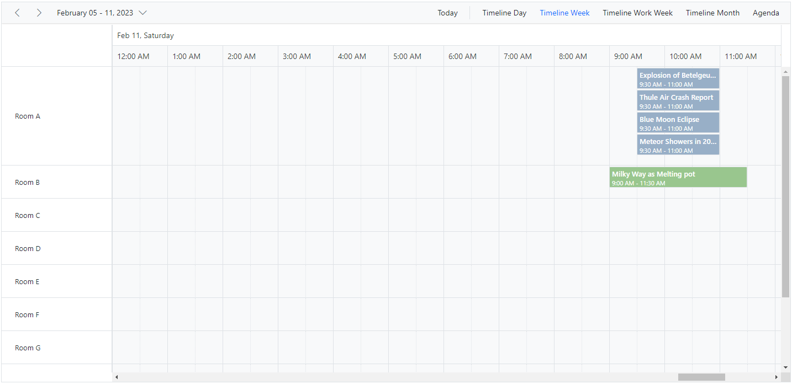
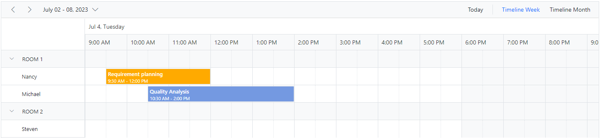

# Row Auto Height in ASP.NET Core Scheduler

By default, the height of the Scheduler rows in Timeline views is static and therefore, when the same time range holds multiple overlapping appointments, a `+n more` text indicator is displayed. With this feature enabled, you can now view all the overlapping appointments present in those specific time ranges by auto-adjusting the row height based on the number of appointments, instead of displaying the `+n more` text indicators.

To enable auto row height adjustments on Scheduler Timeline views and Month view, set `true` to the [`rowAutoHeight`](https://help.syncfusion.com/cr/aspnetcore-js2/Syncfusion.EJ2.Schedule.Schedule.html#Syncfusion_EJ2_Schedule_Schedule_RowAutoHeight) property whose default value is `false`.

N> This auto row height adjustment is applicable only to all the Timeline views as well as to the calendar Month view.

Now, let's see how it works on those applicable views with examples.

## Calendar month view

By default, the rows of the calendar Month view can hold only a limited number of appointments based on the row height, and the rest of the overlapping appointments are indicated with a `+n more` text indicator. The following example shows how the month view row auto-adjusts based on the number of appointments when this [`rowAutoHeight`](https://help.syncfusion.com/cr/aspnetcore-js2/Syncfusion.EJ2.Schedule.Schedule.html#Syncfusion_EJ2_Schedule_Schedule_RowAutoHeight) feature is enabled.










## Timeline views

When the feature [`rowAutoHeight`](https://help.syncfusion.com/cr/aspnetcore-js2/Syncfusion.EJ2.Schedule.Schedule.html#Syncfusion_EJ2_Schedule_Schedule_RowAutoHeight) is enabled in Timeline views, the row height is auto-adjusted based on the number of overlapping events occupying the same time range, which is demonstrated in the following example.










## Timeline views with multiple resources

The following example shows how the auto row adjustment feature works on timeline views with multiple resources.










## Appointments occupying entire cell

By default, with the feature [`rowAutoHeight`](https://help.syncfusion.com/cr/aspnetcore-js2/Syncfusion.EJ2.Schedule.Schedule.html#Syncfusion_EJ2_Schedule_Schedule_RowAutoHeight), there will be a space at the bottom of the cell when an appointment is rendered. To avoid this space, we can set the property [`ignoreWhitespace`](https://help.syncfusion.com/cr/aspnetcore-js2/Syncfusion.EJ2.Schedule.ScheduleEventSettings.html#Syncfusion_EJ2_Schedule_ScheduleEventSettings_IgnoreWhitespace) to true within [`eventSettings`](https://help.syncfusion.com/cr/aspnetcore-js2/Syncfusion.EJ2.Schedule.Schedule.html#Syncfusion_EJ2_Schedule_Schedule_EventSettings), whose default value is false. In the following code example, the whitespace below the appointments is ignored.










**Note**: The property [`ignoreWhitespace`](https://help.syncfusion.com/cr/aspnetcore-js2/Syncfusion.EJ2.Schedule.ScheduleEventSettings.html#Syncfusion_EJ2_Schedule_ScheduleEventSettings_IgnoreWhitespace) will be applicable only when [`rowAutoHeight`](https://help.syncfusion.com/cr/aspnetcore-js2/Syncfusion.EJ2.Schedule.Schedule.html#Syncfusion_EJ2_Schedule_Schedule_RowAutoHeight) feature is enabled in the Scheduler.

N> You can refer to our [ASP.NET Core Scheduler](https://www.syncfusion.com/aspnet-core-ui-controls/scheduler) feature tour page for its groundbreaking feature representations. You can also explore our [ASP.NET Core Scheduler example](https://ej2.syncfusion.com/aspnetcore/Schedule/Overview#/material) to know how to present and manipulate data.
