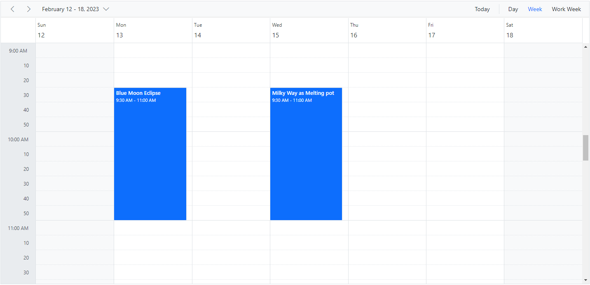
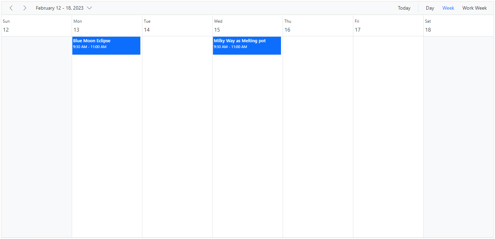
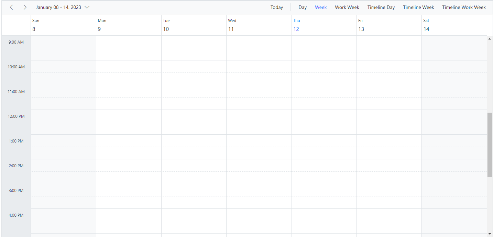

# Timescale Customization in ASP.NET Core Scheduler

The time slots are the time cells that are displayed on the Day, Week, and Work Week views of both the calendar (at the left-most position) and timeline views (at the top position). The [`timeScale`](https://help.syncfusion.com/cr/aspnetcore-js2/Syncfusion.EJ2.Schedule.Schedule.html#Syncfusion_EJ2_Schedule_Schedule_TimeScale) property allows you to control and set the required time slot duration for the work cells displayed on the Scheduler. It includes the following sub-options:

* [`enable`](https://help.syncfusion.com/cr/aspnetcore-js2/Syncfusion.EJ2.Schedule.ScheduleTimeScale.html#Syncfusion_EJ2_Schedule_ScheduleTimeScale_Enable) - When set to `true`, allows the Scheduler to display the appointments accurately against the exact time duration. If set to `false`, all the appointments of a day will be displayed one below the other with no grid lines displayed. Its default value is `true`.
* [`interval`](https://help.syncfusion.com/cr/aspnetcore-js2/Syncfusion.EJ2.Schedule.ScheduleTimeScale.html#Syncfusion_EJ2_Schedule_ScheduleTimeScale_Interval) - Defines the duration on which the time axis is displayed, such as 1 hour, 30 minutes, and so on. It accepts values in minutes and defaults to 60.
* [`slotCount`](https://help.syncfusion.com/cr/aspnetcore-js2/Syncfusion.EJ2.Schedule.ScheduleTimeScale.html#Syncfusion_EJ2_Schedule_ScheduleTimeScale_SlotCount) - Decides the number of slots to be split for the specified time interval duration. It defaults to 2, thus displaying two slots to represent an hour (each slot depicting 30 minutes duration).

> Note: The upper limit for rendering slots within a single day, utilizing the **interval** and **slotCount** properties of the **timeScale**, stands at 1000. This constraint aligns with the maximum **colspan** value permissible for the **table** element, which is also capped at 1000. This particular restriction is relevant exclusively to the `TimelineDay`, `TimelineWeek`, and `TimelineWorkWeek` views.

## Setting different time slot duration

The [`interval`](https://help.syncfusion.com/cr/aspnetcore-js2/Syncfusion.EJ2.Schedule.ScheduleTimeScale.html#Syncfusion_EJ2_Schedule_ScheduleTimeScale_Interval) and [`slotCount`](https://help.syncfusion.com/cr/aspnetcore-js2/Syncfusion.EJ2.Schedule.ScheduleTimeScale.html#Syncfusion_EJ2_Schedule_ScheduleTimeScale_SlotCount) properties can be used together on the Scheduler to set a different time slot duration, which is depicted in the following code example. Here, six time slots together represent an hour.
























## Customizing time cells using template

The [`timeScale`](https://help.syncfusion.com/cr/aspnetcore-js2/Syncfusion.EJ2.Schedule.Schedule.html#Syncfusion_EJ2_Schedule_Schedule_TimeScale) property also provides a template option to allow customization of time slots, which are as follows:

* [`majorSlotTemplate`](https://help.syncfusion.com/cr/aspnetcore-js2/Syncfusion.EJ2.Schedule.ScheduleTimeScale.html#Syncfusion_EJ2_Schedule_ScheduleTimeScale_MajorSlotTemplate) - The template option to be applied for major time slots. Here, the template accepts either the string or HTMLElement as template design and then the parsed design is displayed onto the time cells. The time details can be accessed within this template.
* [`minorSlotTemplate`](https://help.syncfusion.com/cr/aspnetcore-js2/Syncfusion.EJ2.Schedule.ScheduleTimeScale.html#Syncfusion_EJ2_Schedule_ScheduleTimeScale_MinorSlotTemplate) - The template option to be applied for minor time slots. Here, the template accepts either the string or HTMLElement as template design and then the parsed design is displayed onto the time cells. The time details can be accessed within this template.
























## Hide the timescale

The grid lines that indicate the exact time duration can be enabled or disabled on the Scheduler by setting `true` or `false` to the `enable` option within the [`timeScale`](https://help.syncfusion.com/cr/aspnetcore-js2/Syncfusion.EJ2.Schedule.Schedule.html#Syncfusion_EJ2_Schedule_Schedule_TimeScale) property. Its default value is `true`.
























## Highlighting current date and time

By default, the Scheduler indicates the current date with a highlighted date header on all views, and accurately marks the system's current time on specific views such as Day, Week, Work Week, Timeline Day, Timeline Week, and Timeline Work Week. To stop highlighting the current time indicator on the Scheduler views, set the [`showTimeIndicator`](https://help.syncfusion.com/cr/aspnetcore-js2/Syncfusion.EJ2.Schedule.Schedule.html#Syncfusion_EJ2_Schedule_Schedule_ShowTimeIndicator) property to `false`, which defaults to `true`.
























N> You can refer to our [ASP.NET Core Scheduler](https://www.syncfusion.com/aspnet-core-ui-controls/scheduler) feature tour page for its groundbreaking feature representations. You can also explore our [ASP.NET Core Scheduler example](https://ej2.syncfusion.com/aspnetcore/Schedule/Overview#/material) to know how to present and manipulate data.
