# Views in ASP.NET Core Scheduler

The Scheduler includes a wide variety of view modes with unique configuration options for each view. The available view modes are Day, Week, Work Week, Month, Year, Agenda, Month Agenda, Timeline Day, Timeline Week, Timeline Work Week, Timeline Month, and Timeline Year, out of which the `Week` view is set as the active view by default.

To navigate between different views and dates, the navigation options are available in the Scheduler header bar. The active view option is usually highlighted by default. The date range of the active view is also displayed at the left corner of the header bar; clicking it opens a calendar popup to select the desired date.

N> By default, the Scheduler displays the calendar views such as Day, Week, Work Week, Month, and Agenda.

## Setting specific view on scheduler

As the Scheduler displays the `Week` view by default, to change the active view, set the [`currentView`](https://help.syncfusion.com/cr/aspnetcore-js2/Syncfusion.EJ2.Schedule.Schedule.html#Syncfusion_EJ2_Schedule_Schedule_CurrentView) property to the desired view name. The applicable view names that the Scheduler accepts are as follows:

* Day
* Week
* WorkWeek
* Month
* Year
* Agenda
* MonthAgenda
* TimelineDay
* TimelineWeek
* TimelineWorkWeek
* TimelineMonth
* TimelineYear

It is possible to display only the desired views on the Scheduler using the [`e-schedule-views`](https://help.syncfusion.com/cr/aspnetcore-js2/Syncfusion.EJ2~Syncfusion.EJ2.Schedule.ScheduleView_properties.html) property.

In the following example, the Scheduler displays two views, namely Week and TimelineDay.










To configure the Scheduler with different configurations on each view, refer to the following code example. Here, the Week view displays the dates in `dd-MM-yyyy` format, whereas the Month view hides the weekend days and also displays it in read-only mode.










## View specific configuration

There are scenarios where each view may need to have different configurations. For such cases, you can define the applicable Scheduler properties within the [`views`](https://help.syncfusion.com/cr/aspnetcore-js2/Syncfusion.EJ2.Schedule.Schedule.html#Syncfusion_EJ2_Schedule_Schedule_Views) property for each view option, as depicted in the following examples. The fields available to be used within each view option are as follows.

| Property | Type | Description | Applicable views |
|----------|------|-------------|------------------|
| `option` | View | It accepts the Scheduler view name, based on which we can define its related properties. The view names can be `Day`, `Week` and so on. | All views.|
| `isSelected` | Boolean | It acts similar to the `currentView` property and defines the active view of the Scheduler.| All views. |
| `dateFormat` | Date | By default, the Scheduler follows the date format as per the default culture assigned to it. When it is defined under a specific view, only those assigned views follow this date format. | All views. |
| `readonly` | Boolean | When set to `true`, prevents the CRUD actions on the respective view under which it is defined. | All views. |
| `resourceHeaderTemplate` | String | The template option which is used to customize the resource header cells on the Scheduler. It gets applied only on the views, wherever it is defined.| All views. |
| `dateHeaderTemplate` | String | The template option which is used to customize the date header cells and is applied only on the views, wherever it is defined. | All views. |
| `eventTemplate` | String | The template option to customize the events background. It is applied to the events of the view on which it is currently defined. | All views. |
| `showWeekend` | Boolean | When set to `false`, it hides the weekend days of a week from the views on which it is defined.| All views. |
| [`group`](https://help.syncfusion.com/cr/aspnetcore-js2/Syncfusion.EJ2.Schedule.Schedule.html#Syncfusion_EJ2_Schedule_Schedule_Group) | [GroupModel](https://help.syncfusion.com/cr/aspnetcore-js2/Syncfusion.EJ2~Syncfusion.EJ2.Schedule.ScheduleGroup_members.html) | Allows setting different resource grouping options on all available Scheduler view modes. | All views. |
| `cellTemplate` | String | The template option to customize the work cells of the Scheduler and is applied only on the views, on which it is defined. | Applicable on all views except Agenda view. |
| `workDays` | Number[] | It is used to set the working days on the Scheduler views. | Applicable on all views except Agenda view. |
| `displayName` | String | When a particular view is customized to display with different intervals, this property allows the user to set a different display name for each of the views. | Applicable on all views except Agenda and Month Agenda. |
| `interval` | Number | It allows customizing the default Scheduler views with a different set of days, weeks, work weeks, or months on the applicable view type. | Applicable on all views except Agenda and Month Agenda. |
| `startHour` | String | It is used to specify the start hour from which the Scheduler should be displayed. It accepts the time string in a short skeleton format and also hides the time beyond the specified start time. | Applicable on Day, Week, Work Week, Timeline Day, Timeline Week, and Timeline Work Week views. |
| `endHour` | String | It is used to specify the end hour at which the Scheduler ends. It accepts the time string in a short skeleton format. | Applicable on Day, Week, Work Week, Timeline Day, Timeline Week, and Timeline Work Week views. |
| `timeScale` | [TimeScaleModel](https://help.syncfusion.com/cr/aspnetcore-js2/Syncfusion.EJ2~Syncfusion.EJ2.Schedule.ScheduleTimeScale_members.html) | Allows setting different timescale configurations on each applicable view mode. | Applicable on Day, Week, Work Week, Timeline Day, Timeline Week, and Timeline Work Week views. |
| `showWeekNumber` | Boolean | When set to `true`, shows the week number on the respective weeks.| Applicable on Day, Week, Work Week, and Month views. |
| `allowVirtualScrolling` | Boolean | It is used to enable or disable the virtual scrolling functionality. | Applicable on Agenda and Timeline views. |
| `headerRows` | [`HeaderRowsModel`](https://help.syncfusion.com/cr/aspnetcore-js2/Syncfusion.EJ2~Syncfusion.EJ2.Schedule.ScheduleHeaderRow_members.html) | Allows defining the custom header rows on the timeline views of the Scheduler to display the year, month, week, date, and hour label as individual rows. | Applicable only on all timeline views. |

### Day view

Usually a Day view displays a single day with all its related appointments. It is possible to customize the Day view to display more number of days by extending the `e-schedule-views` property with the `interval` option. You can also define any of the above-defined properties within the `e-schedule-views` object definition, as depicted in the following code example.  










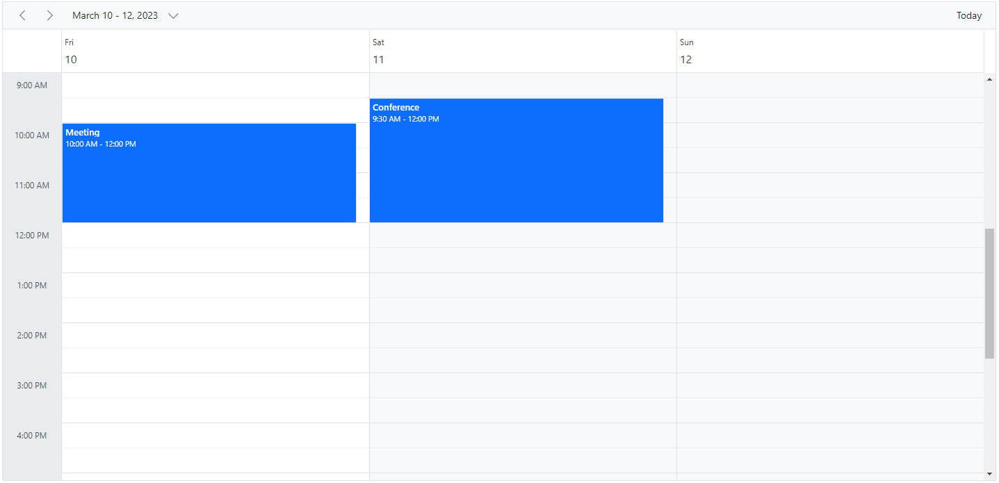

N> All the above-defined properties can be accessed within the Day view, except `allowVirtualScrolling` and `headerRows`.

### Week view

The Week view displays a count of 7 days (from Sunday to Saturday) with all its related appointments. The first day of the week can be changed using the `firstDayOfWeek` property, which accepts an integer value (Sunday=0, Monday=1, Tuesday=2, and so on). You can navigate to a particular date in the Day view from the Week view by clicking on the appropriate dates on the date header bar.










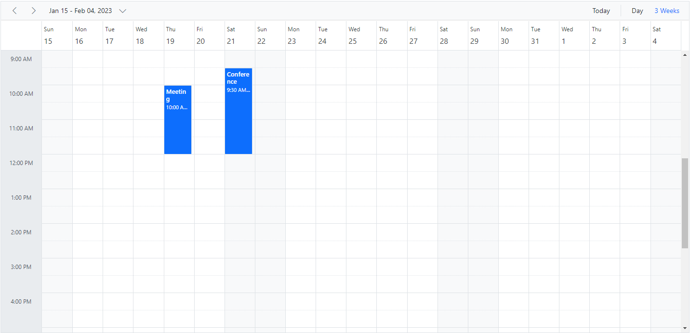

N> All the above-defined properties in the table can be accessed within the Week and Work Week views, except `allowVirtualScrolling` and `headerRows`.

### Work Week view

The Work Week view displays only the working days of a week (count of 5 days) and its associated appointments. It is possible to customize the working days on the Work Week view by using the `workDays` property, which accepts an array of integer values (such as Sunday=0, Monday=1, Tuesday=2, and so on). By default, it displays from Monday to Friday (5 days). You can also navigate to a particular date in the Day view from the Work Week view by clicking on the appropriate dates in the date header bar.

The following code example depicts how to change the working days only on the `Work Week` view of the Scheduler.










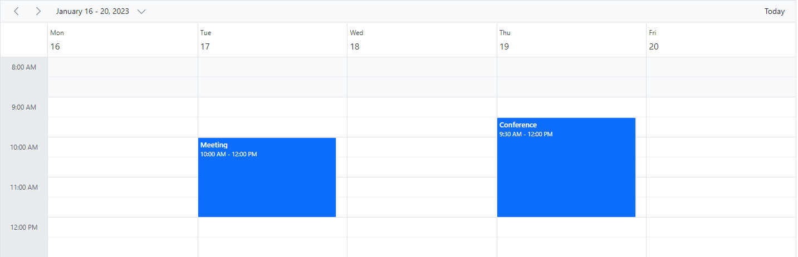

N> The Week, Work Week, and Day views can display the all-day row appointments in a separate all-day row with an expand/collapse option to view it.

### Month view

A Month view displays the entire days of a particular month and all its related appointments. You can navigate to a particular date in the Day view by clicking on the appropriate date text on the month cells.

By default, when you try to create an appointment through the Month view, it is considered as created for an entire day. You can explicitly change this behavior by unchecking the `All-day` option from the editor window, so that it defaults to a start time of 9:00 AM and an end time of 9:30 AM.

You can also have the `+ more` text indicator on each day cell of a Month view; clicking it allows you to view the hidden appointments of a day.










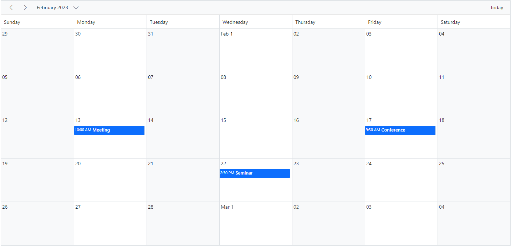

### Year view

A Year view displays all the days of a particular year with months and all its related appointments. You can navigate to a particular date in the Day view by clicking on the appropriate date text on the year cells.

Year view is available in both the `Horizontal` and `Vertical` orientations. You can manage the orientation of the Year view through the `views` property.










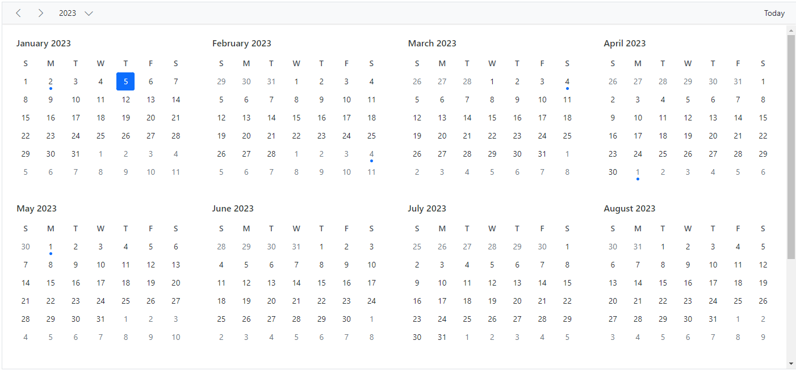

N> The Year view also has module support. In that, you can get all the months of a particular year in a calendar view format. In that calendar view, appointment-containing dates are highlighted with dots placed under the individual date. When you click on a date, the event popup is displayed and the events are listed.

### Agenda view

The Agenda view lists out the appointments in a grid-like view for the next 7 days by default from the current date. The count of the days can be changed using the API [`agendaDaysCount`](https://help.syncfusion.com/cr/aspnetcore-js2/Syncfusion.EJ2.Schedule.Schedule.html#Syncfusion_EJ2_Schedule_Schedule_AgendaDaysCount). It allows virtual scrolling of dates by enabling the `allowVirtualScrolling` property. You can also enable or disable the display of days on the Scheduler that have no appointments by setting the [`hideEmptyAgendaDays`](https://help.syncfusion.com/cr/aspnetcore-js2/Syncfusion.EJ2.Schedule.Schedule.html#Syncfusion_EJ2_Schedule_Schedule_HideEmptyAgendaDays) property to `true` or `false`.

The following code example depicts how to customize the display of events within Agenda view alone.










N> Schedule Height is mandatory to set in pixels for Agenda view alone.

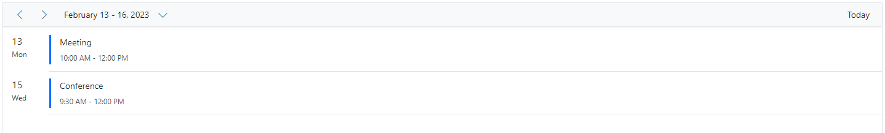

### Month Agenda view

A Month Agenda view shows a month calendar, where clicking on a particular day displays the appointments present on that date below the calendar. Days with appointments are differentiated with a circular dot below the date of the calendar.

The following code example shows how to hide the weekend days on the `MonthAgenda` view, as well as modify the working days list on the Month Agenda view alone.










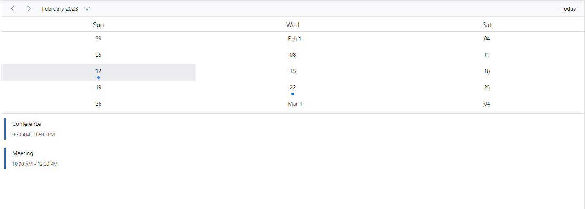

### Timeline views – Day, Week, Work Week

Similar to the Day view, the Timeline Day view shows a single day with all its appointments where the time slots are displayed horizontally. By default, the cell height adjusts as per the height set to the Scheduler. When the number of appointments exceeds the visible area of the cells, the `+ more` text indicator is displayed at the bottom to denote the presence of a few more appointments in that time range.










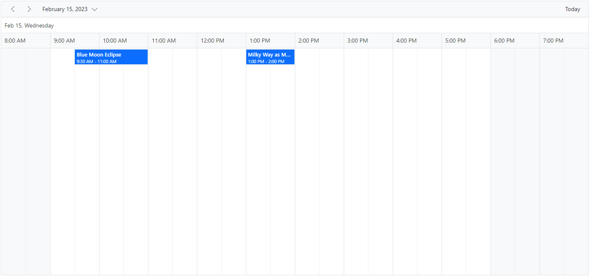

Similar to the Week view, the Timeline Week view shows 7 days with their associated appointments, with the time slots displayed horizontally.










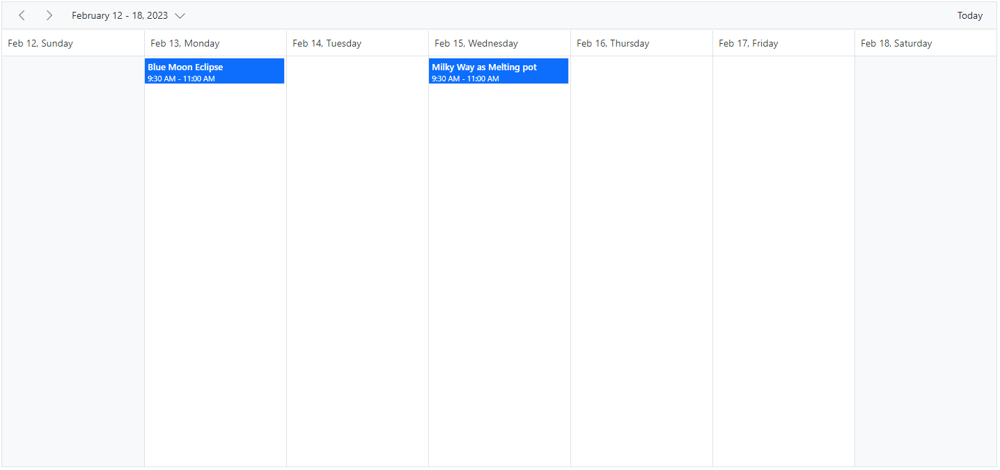

The following code example depicts how to display the Timeline Work Week view on the Scheduler.










N> Clicking on the dates in the date header bar of Timeline Day, Timeline Week, and Timeline Work Week allows you to navigate to the Agenda view.

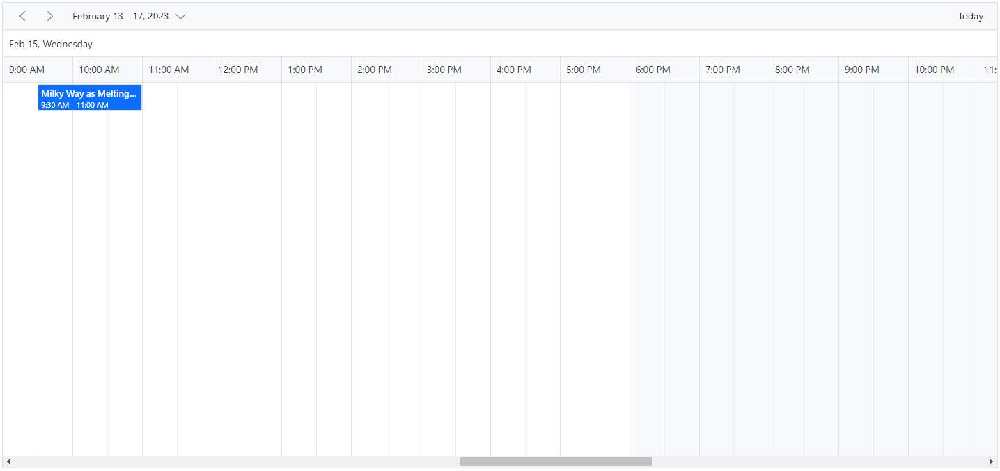

### Timeline Month view

A Timeline Month view displays the current month days along with its appointments.










N> Clicking on the dates in the date header bar of Timeline Month allows you to navigate to the Timeline Day view.

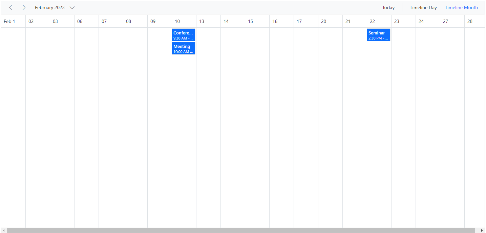

### Timeline Year view

In Timeline Year view, each row depicts a single resource. Whereas in the vertical view, each resource is grouped in parallel as columns. Here, the resource grouping follows a tree-view-like hierarchical grouping structure and can contain any level of child resources.

To make use of the Timeline Year view on the Scheduler, import and inject the `TimelineYear` module from the `ej2-schedule` package.










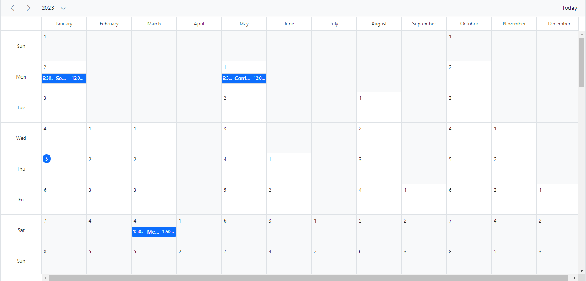

#### Resource grouping

The following code example depicts how to group multiple resources on the Timeline Year view, and its relevant events are displayed accordingly under those resources.










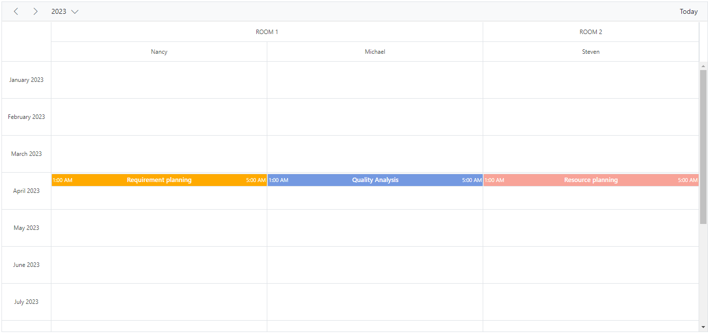

#### Auto row height

The Timeline Year view supports Auto row height. When the feature [`rowAutoHeight`](https://help.syncfusion.com/cr/aspnetcore-js2/Syncfusion.EJ2.Schedule.Schedule.html#Syncfusion_EJ2_Schedule_Schedule_RowAutoHeight) is enabled, the row height is auto-adjusted based on the number of overlapping events occupying the same time range. If you disable the Auto row height, you have the `+ more` text indicator on each day cell of a Timeline Year view; clicking it allows you to view the hidden appointments of a day.










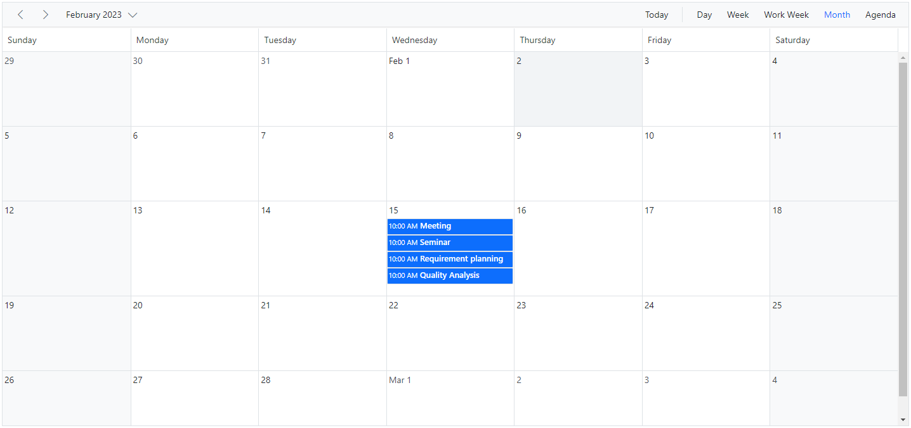

## Extending view intervals

It is possible to customize the display of the default number of days on different Scheduler view modes. For example, a Day view can be extended to display 3 days by setting the `interval` option to 3 for the `Day` option within the `e-schedule-views` property, as depicted in the following code example. In the same way, you can also display 2 weeks by setting `interval` to 2 for the `Week` option.

You can provide an alternative display name for such customized views on the Scheduler header bar by setting the appropriate `displayName` property.










N> The view intervals can be extended on all the Scheduler view modes except Agenda and Month-Agenda views.

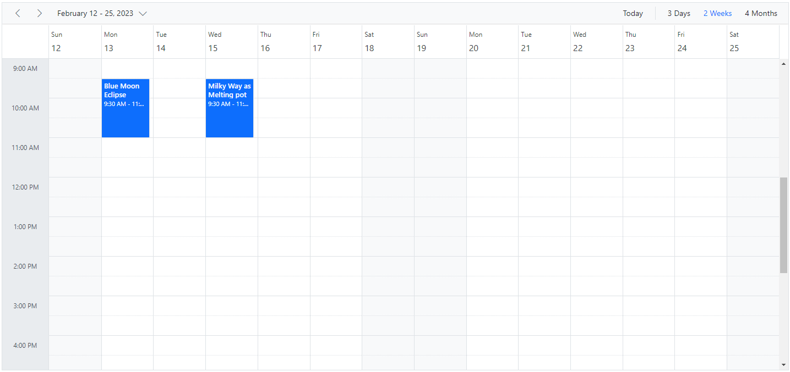

## See Also

* [How to restrict view navigation while clicking on dates](./how-to/prevent-date-navigation)

N> You can refer to our [ASP.NET Core Scheduler](https://www.syncfusion.com/aspnet-core-ui-controls/scheduler) feature tour page for its groundbreaking feature representations. You can also explore our [ASP.NET Core Scheduler example](https://ej2.syncfusion.com/aspnetcore/Schedule/Overview#/material) to know how to present and manipulate data.
