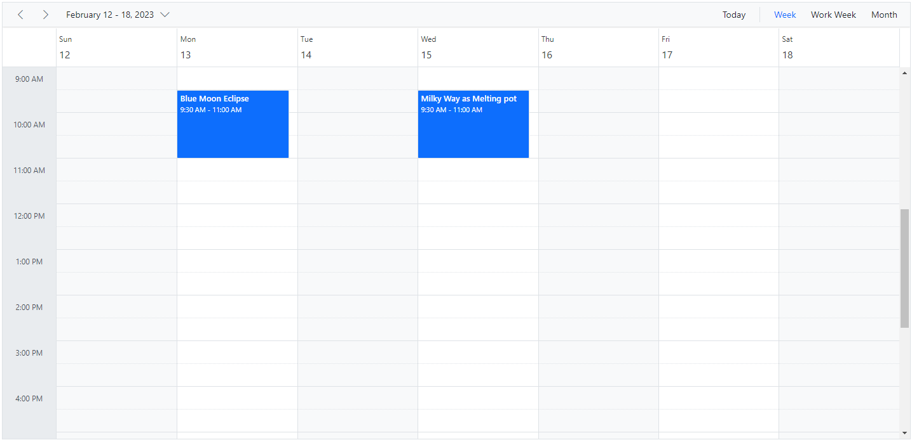
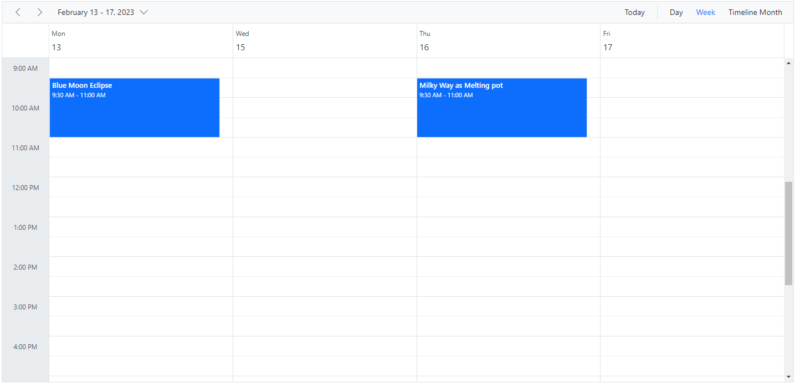
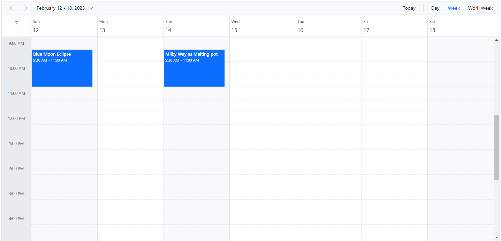
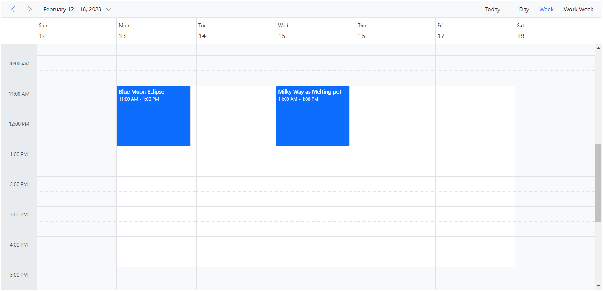
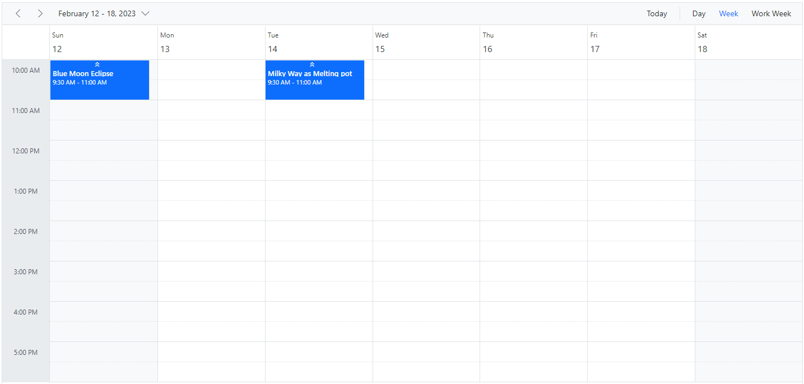
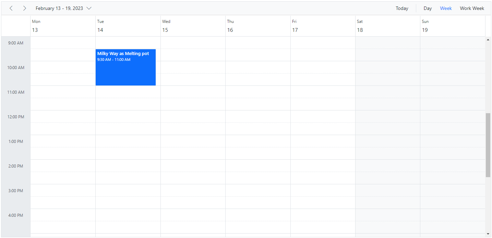

# Working Days and Hours in ASP.NET Core Scheduler

The Scheduler can be customized on various aspects, and it inherits almost all the calendar-specific features such as options,

* To set custom time range display on Scheduler
* To set different working hours
* To set different working days
* To set different first day of week
* To show/hide weekend days
* To show the week number

## Set working days

By default, the Scheduler considers the weekdays from Monday to Friday as `Working days`, and therefore defaults to `[1, 2, 3, 4, 5]` — where 1 represents Monday, 2 represents Tuesday, and so on. The days that are not defined in this working days collection are considered as non-working days. Therefore, when the weekend days are set to hide from the Scheduler, all those non-working days also get hidden from the layout.

The Work Week and Timeline Work Week views display exactly the defined working days on the Scheduler layout, whereas other views display all the days and simply differentiate the non-working days on the UI with an inactive cell color.

N> The working or business hours depiction on the Scheduler is usually valid only on these specified working days.

The following example code depicts how to set the Scheduler to display Monday, Wednesday and Friday as working days of a week.










## Hiding weekend days

The `showWeekend` property is used to either show or hide the weekend days of a week, and it is not applicable on the Work Week view (as non-working days are usually not displayed on the Work Week view). By default, it is set to `true`. The days that are not a part of the working days collection of a Scheduler are usually considered as non-working or weekend days.

Here, the working days are defined as `[1, 3, 4, 5]` on the Scheduler, and therefore the remaining days (0, 2, 6 — Sunday, Tuesday, and Saturday) are considered as non-working or weekend days and will be hidden from all the views when the `showWeekend` property is set to `false`.










## Show week numbers

It is possible to show the week number count of a week in the header bar of the Scheduler by setting the `showWeekNumber` property to `true`. By default, its value is `false`. In the Month view, the week numbers are displayed as a first column.

N> The `showWeekNumber` property is not applicable on Timeline views, as it has the equivalent [`headerRows`](./header-rows#display-week-numbers-in-timeline-views) property to handle such requirement with additional customization.










### Different options in showing week numbers

By default, week numbers are shown in the Scheduler based on the first day of the year. However, the week numbers can be determined based on the following criteria.

* `FirstDay` – The first week of the year is calculated based on the first day of the year.
* `FirstFourDayWeek` – The first week of the year begins from the first week with four or more days.
* `FirstFullWeek` – The first week of the year begins when meeting the first day of the week (`firstDayOfWeek`) and the first day of the year.

For more details refer to [this link](https://docs.microsoft.com/en-us/dotnet/api/system.globalization.calendarweekrule?view=net-5.0#remarks)










N> Enable the `showWeekNumber` property to configure the `weekRule` property. Also, the weekRule property depends on the value of the `firstDayOfWeek` property.

## Set working hours

Working hours indicate the work hour limit within the Scheduler, which is visually highlighted with an active color on work cells. The working hours can be set on the Scheduler using the `workHours` property, which is of object type and includes the following sub-options:

* [`highlight`](https://help.syncfusion.com/cr/aspnetcore-js2/Syncfusion.EJ2.Schedule.ScheduleWorkHours.html#Syncfusion_EJ2_Schedule_ScheduleWorkHours_Highlight) – enables/disables the highlighting of work hours.
* [`start`](https://help.syncfusion.com/cr/aspnetcore-js2/Syncfusion.EJ2.Schedule.ScheduleWorkHours.html#Syncfusion_EJ2_Schedule_ScheduleWorkHours_Start) - sets the start time of the working/business hour of a day.
* [`end`](https://help.syncfusion.com/cr/aspnetcore-js2/Syncfusion.EJ2.Schedule.ScheduleWorkHours.html#Syncfusion_EJ2_Schedule_ScheduleWorkHours_End) - sets the end time limit of the working/business hour of a day.










## Scheduler displaying custom hours

It is possible to display the Scheduler layout with specific time durations by hiding the unwanted hours. To do so, set the start and end hour for the Scheduler using the [`startHour`](https://help.syncfusion.com/cr/aspnetcore-js2/Syncfusion.EJ2.Schedule.Schedule.html#Syncfusion_EJ2_Schedule_Schedule_StartHour) and [`endHour`](https://help.syncfusion.com/cr/aspnetcore-js2/Syncfusion.EJ2.Schedule.Schedule.html#Syncfusion_EJ2_Schedule_Schedule_EndHour) properties, respectively.

The following code example displays the Scheduler starting from the time range 7:00 AM to 6:00 PM, and the remaining hours are hidden on the UI.










## Setting start day of the week

By default, the Scheduler uses `Sunday` as its first day of the week. To change the Scheduler's start day of the week to a different day, set the [`firstDayOfWeek`](https://help.syncfusion.com/cr/aspnetcore-js2/Syncfusion.EJ2.Schedule.Schedule.html#Syncfusion_EJ2_Schedule_Schedule_FirstDayOfWeek) property to a value ranging from 0 to 6.

N> Here, Sunday is always denoted as 0, Monday as 1, and so on.










## Scroll to specific time and date

You can manually scroll to a specific time on the Scheduler by making use of the `scrollTo` method, as depicted in the following code example.










### How to scroll to current time on initial load

There are scenarios where you may need to load the Scheduler displaying the system's current time on the currently visible viewport area. In such cases, the Scheduler needs to be scrolled to a specific time based on the system's current time, which is depicted in the following code example.










N> You can refer to our [ASP.NET Core Scheduler](https://www.syncfusion.com/scheduler-sdk/aspnet-core-scheduler) feature tour page for its groundbreaking feature representations. You can also explore our [ASP.NET Core Scheduler example](https://ej2.syncfusion.com/aspnetcore/Schedule/Overview#/material) to know how to present and manipulate data.

## See Also

* [To display the current time indicator](./timescale#highlighting-current-date-and-time)
* [To set different working hours dynamically](./how-to/set-different-work-hours)
* [To set different working hours for each resource](./resources#set-different-work-hours)
* [To set different working days for each resource](./resources#set-different-work-days)