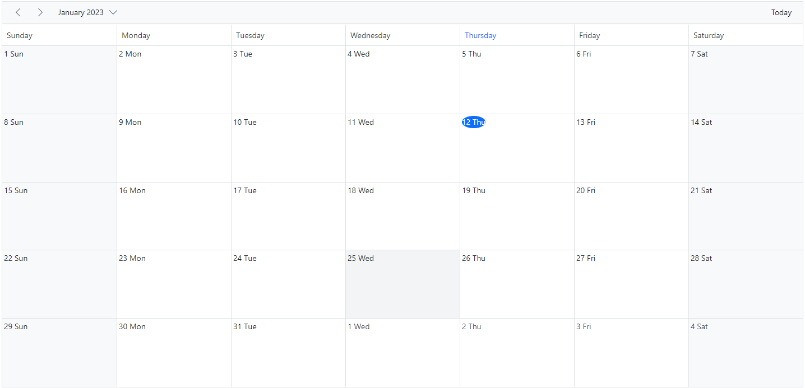

# Cell Customization in ASP.NET MVC Scheduler

The cells of the Scheduler can be customized either using the cell template or the [`RenderCell`](https://help.syncfusion.com/cr/aspnetmvc-js2/Syncfusion.EJ2.Schedule.Schedule.html#Syncfusion_EJ2_Schedule_Schedule_RenderCell) event.

## Setting cell dimensions in all views

The height and width of the Scheduler cells can be customized to increase or reduce their size through the [`CssClass`](https://help.syncfusion.com/cr/aspnetmvc-js2/Syncfusion.EJ2.Schedule.Schedule.html#Syncfusion_EJ2_Schedule_Schedule_CssClass) property, which overrides the default CSS applied to the cells.











## Check for cell availability

You can check whether the given time-range slots are available for event creation or already occupied by other events using the `isSlotAvailable` method. In the following code example, if a specific time slot already contains an appointment, then no more appointments can be added to that cell.











## Customizing cells in all the views

It is possible to customize the appearance of the cells using both the template option and the [`RenderCell`](https://help.syncfusion.com/cr/aspnetmvc-js2/Syncfusion.EJ2.Schedule.Schedule.html#Syncfusion_EJ2_Schedule_Schedule_RenderCell) event on all the views.

### Using template

The [`CellTemplate`](https://help.syncfusion.com/cr/aspnetmvc-js2/Syncfusion.EJ2.Schedule.Schedule.html#Syncfusion_EJ2_Schedule_Schedule_CellTemplate) option accepts the template string and is used to customize the cell background with specific images or appropriate text on the given date values.











### Using renderCell event

An alternative to [`CellTemplate`](https://help.syncfusion.com/cr/aspnetmvc-js2/Syncfusion.EJ2.Schedule.Schedule.html#Syncfusion_EJ2_Schedule_Schedule_CellTemplate) is the [`RenderCell`](https://help.syncfusion.com/cr/aspnetmvc-js2/Syncfusion.EJ2.Schedule.Schedule.html#Syncfusion_EJ2_Schedule_Schedule_RenderCell) event, which can also be used to customize the cells with appropriate images or formatted text values.











You can customize cells such as work cells, month cells, all-day cells, header cells, and resource header cells using the [`RenderCell`](https://help.syncfusion.com/cr/aspnetmvc-js2/Syncfusion.EJ2.Schedule.Schedule.html#Syncfusion_EJ2_Schedule_Schedule_RenderCell) event by checking the `elementType` option within the event. You can check `elementType` against any of the following values.

| Element type | Description |
|-------|---------|
| `dateHeader` | Triggers on header cell rendering. |
| `monthDay` | Triggers on header cell in month view rendering. |
| `resourceHeader` | Triggers on resource header cell rendering. |
| `alldayCells` | Triggers on all-day cell rendering. |
| `emptyCells` | Triggers on empty cell rendering on the header bar. |
| `resourceGroupCells` | Triggers on rendering of work cells for the parent resource. |
| `workCells` | Triggers on work cell rendering. |
| `monthCells` | Triggers on month cell rendering. |
| `majorSlot` | Triggers on major time slot cell rendering. |
| `minorSlot` | Triggers on minor time slot cell rendering. |
| `weekNumberCell` | Triggers on cell displaying week number. |

## Customizing cell header in month view

The month header of each date cell in the month view can be customized using the [`CellHeaderTemplate`](https://help.syncfusion.com/cr/aspnetmvc-js2/Syncfusion.EJ2.Schedule.Schedule.html#Syncfusion_EJ2_Schedule_Schedule_CellHeaderTemplate) option, which accepts a string or an `HTMLElement`. The corresponding date can be accessed within the template.










## Customizing the minimum and maximum date values

Setting the [`minDate`](https://help.syncfusion.com/cr/aspnetmvc-js2/Syncfusion.EJ2.Schedule.Schedule.html#Syncfusion_EJ2_Schedule_Schedule_MinDate) and [`maxDate`](https://help.syncfusion.com/cr/aspnetmvc-js2/Syncfusion.EJ2.Schedule.Schedule.html#Syncfusion_EJ2_Schedule_Schedule_MaxDate) properties with specific date values allows the Scheduler to set the minimum and maximum date range. Scheduler dates that lie beyond this range are in a disabled state, so date navigation is blocked beyond the specified range.











N> By default, the [`minDate`](https://help.syncfusion.com/cr/aspnetmvc-js2/Syncfusion.EJ2.Schedule.Schedule.html#Syncfusion_EJ2_Schedule_Schedule_MinDate) property value is set to `new Date(1900, 0, 1)` and the [`maxDate`](https://help.syncfusion.com/cr/aspnetmvc-js2/Syncfusion.EJ2.Schedule.Schedule.html#Syncfusion_EJ2_Schedule_Schedule_MaxDate) property value is set to `new Date(2099, 11, 31)`. You can also set custom values for the [`minDate`](https://help.syncfusion.com/cr/aspnetmvc-js2/Syncfusion.EJ2.Schedule.Schedule.html#Syncfusion_EJ2_Schedule_Schedule_MinDate) and [`maxDate`](https://help.syncfusion.com/cr/aspnetmvc-js2/Syncfusion.EJ2.Schedule.Schedule.html#Syncfusion_EJ2_Schedule_Schedule_MaxDate) properties.

## Customizing the weekend cells background color

You can customize the background color of weekend cells by using the [`RenderCell`](https://help.syncfusion.com/cr/aspnetmvc-js2/Syncfusion.EJ2.Schedule.Schedule.html#Syncfusion_EJ2_Schedule_Schedule_RenderCell) event and checking the `elementType` option within the event.

```javascript

function onRendercell(args) {
        if (args.elementType == "workCells") {
            // To change the color of weekend columns in week view
            if (args.date) {
                if (args.date.getDay() === 6) {
                    (args.element).style.background = '#ffdea2';
                }
                if (args.date.getDay() === 0) {
                    (args.element).style.background = '#ffdea2';
                }
            }
        }
    }

```

Likewise, the background color for weekend cells in the Month view can be customized through the [`cssClass`](https://help.syncfusion.com/cr/aspnetmvc-js2/Syncfusion.EJ2.Schedule.Schedule.html#Syncfusion_EJ2_Schedule_Schedule_CssClass) property, which overrides the default CSS applied to the cells.

```css

.schedule-cell-customization.e-schedule .e-month-view .e-work-cells:not(.e-work-days) {
    background-color: #f08080;
}

```










## How to disable multiple cell and row selection in Schedule

By default, the [`AllowMultiCellSelection`](https://help.syncfusion.com/cr/aspnetmvc-js2/Syncfusion.EJ2.Schedule.Schedule.html#Syncfusion_EJ2_Schedule_Schedule_AllowMultiCellSelection) and [`AllowMultiRowSelection`](https://help.syncfusion.com/cr/aspnetmvc-js2/Syncfusion.EJ2.Schedule.Schedule.html#Syncfusion_EJ2_Schedule_Schedule_AllowMultiRowSelection) properties of the Scheduler are set to `true`. This allows the user to select multiple cells and rows. To disable multiple cell and row selection, set these properties to `false`.

N> You can refer to our [ASP.NET MVC Scheduler](https://www.syncfusion.com/aspnet-mvc-ui-controls/scheduler) feature tour page for its groundbreaking feature representations. You can also explore our [ASP.NET MVC Scheduler](https://ej2.syncfusion.com/aspnetmvc/Schedule/Overview#/material) example to know how to present and manipulate data.
