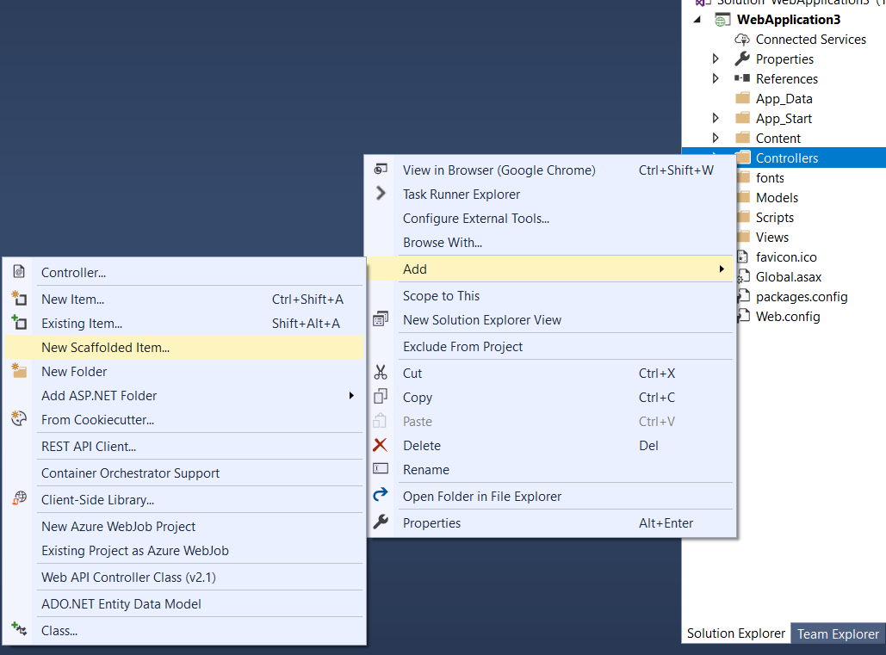
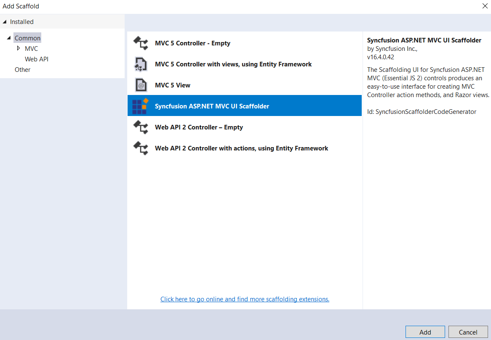
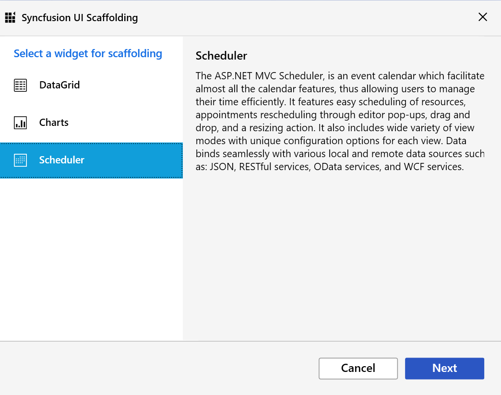
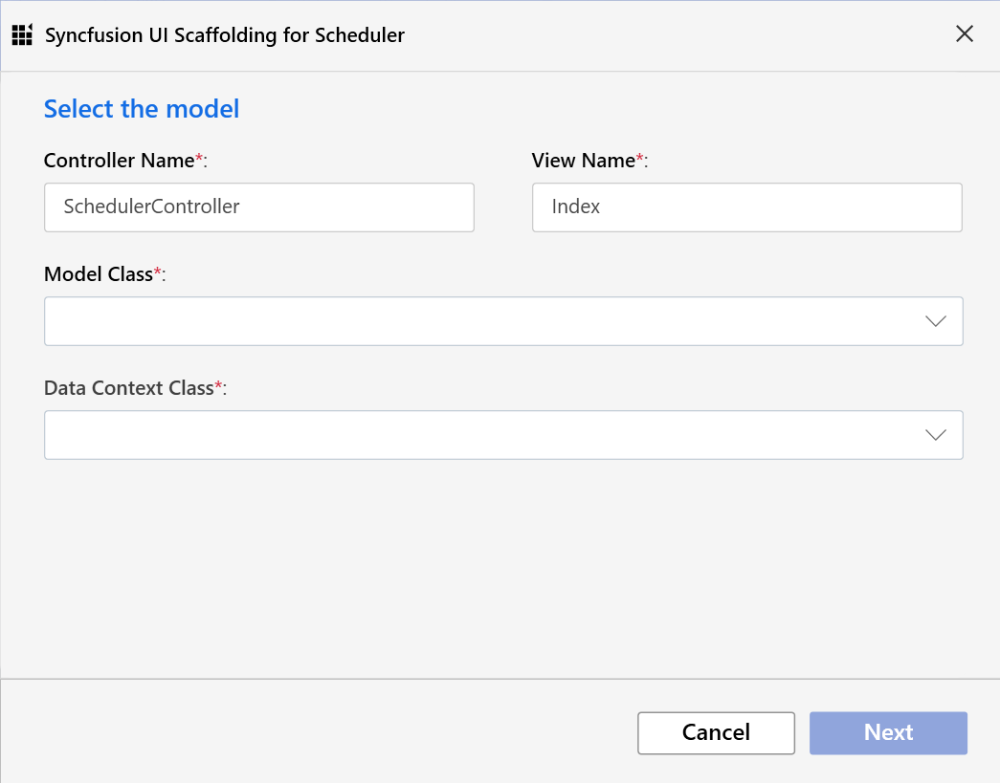
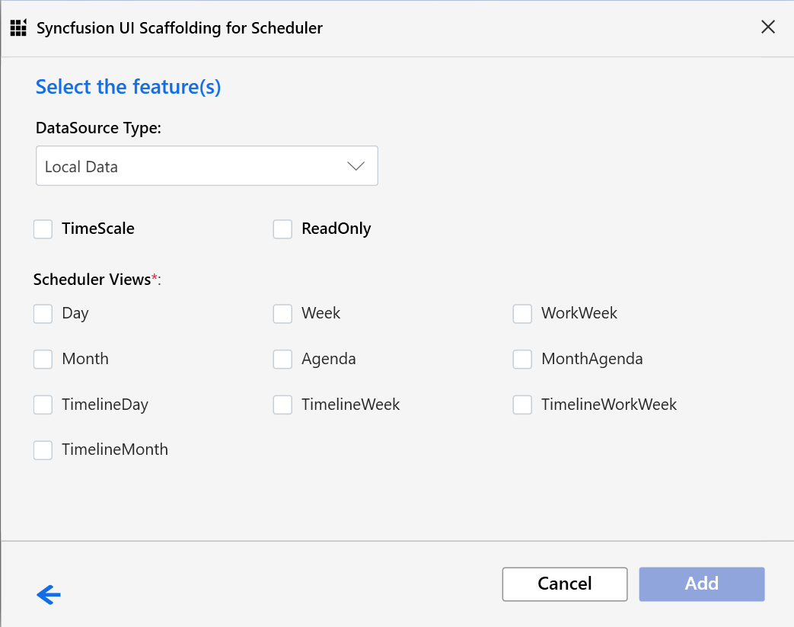
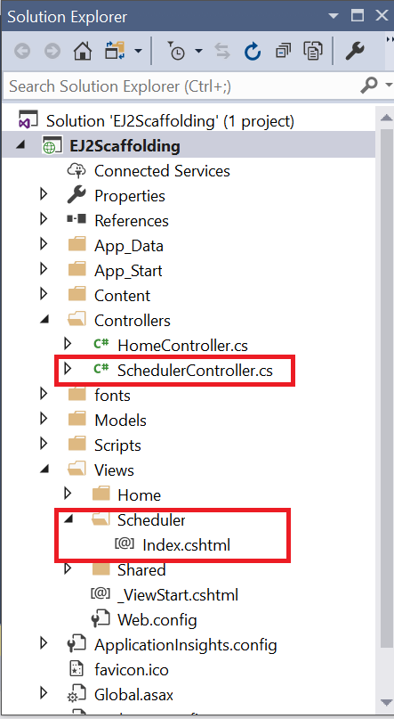

# Scaffolding in ASP.NET MVC Scheduler

Syncfusion&reg; includes Visual Studio extensions with UI Scaffolding options for the ASP.NET MVC Scheduler that let you quickly add code and interact with data models. This makes it easy to create the appropriate **Views** and **Controller** action methods along with the corresponding ASP.NET MVC Scheduler code.

N> The Syncfusion&reg; ASP.NET MVC UI Scaffolder is available from the version **v16.4.0.40**.

## Getting started

The following steps describe how to scaffold the ASP.NET MVC Scheduler into your web application.

* Create an ASP.NET MVC application and add an Entity Framework data model referring to the [documentation](https://docs.microsoft.com/en-us/aspnet/mvc/overview/getting-started/database-first-development/creating-the-web-application#generate-the-models), with Scheduler-related fields such as Id, Subject, Location, Start Date, End Date, and All-day. Once the model file is added, ensure that the required `DBContext` and all its related properties are added.

* Refer to the [Getting Started documentation](https://ej2.syncfusion.com/aspnetmvc/documentation/getting-started/visual-studio-2017#configure-essential-js-2-in-the-application) to learn how to configure Syncfusion&reg; Essential&reg; JS2 for ASP.NET MVC in your web application.

* Right-click the **Controllers** folder in the Solution Explorer and select **Add → New Scaffolded Item** from the menu.

* The `Add Scaffold` dialog will appear. Select **Syncfusion&reg; ASP.NET MVC UI Scaffolder** and click the `Add` button, which displays the Syncfusion&reg; UI Scaffolding dialog.

* Choose the Scheduler control to scaffold and click **Next**.

* The `Syncfusion&reg; UI Scaffolding for Scheduler` dialog opens, from which you can choose the Model and Data Context options. Enter the **Controller** and **View** names as required by your application. Once the required **Model Class** and its relevant **Data Context Class** are selected, click the **Next** button, which exposes the Scheduler functionalities that can be configured before scaffolding.

N> All the model types present in the current application are listed in the **Model Class** drop-down. From the available **Data Context Class**, choose the appropriate Entity Framework data model.

* Now, select the required Scheduler options (the corresponding **Scheduler Views** and **Properties**) and click the **Add** button. Use the **Back** arrow if you need to modify the already chosen Controller or View name, or to change the selected **Model Class** and **Data Context Class**.

* Once the required Scheduler options are configured through the **Scheduler UI Scaffolding**, the corresponding Scheduler **Controller** and **View** files are generated with the appropriate Scheduler code snippet.

N> Ensure that at least one Entity Framework model exists in your active project and that the application compiles successfully. If you make any changes to the Model properties later, compile the application once before performing the scaffold again.

N> You can refer to our [ASP.NET MVC Scheduler](https://www.syncfusion.com/aspnet-mvc-ui-controls/scheduler) feature tour page for its groundbreaking feature representations. You can also explore our [ASP.NET MVC Scheduler](https://ej2.syncfusion.com/aspnetmvc/Schedule/Overview#/material) example to know how to present and manipulate data.
