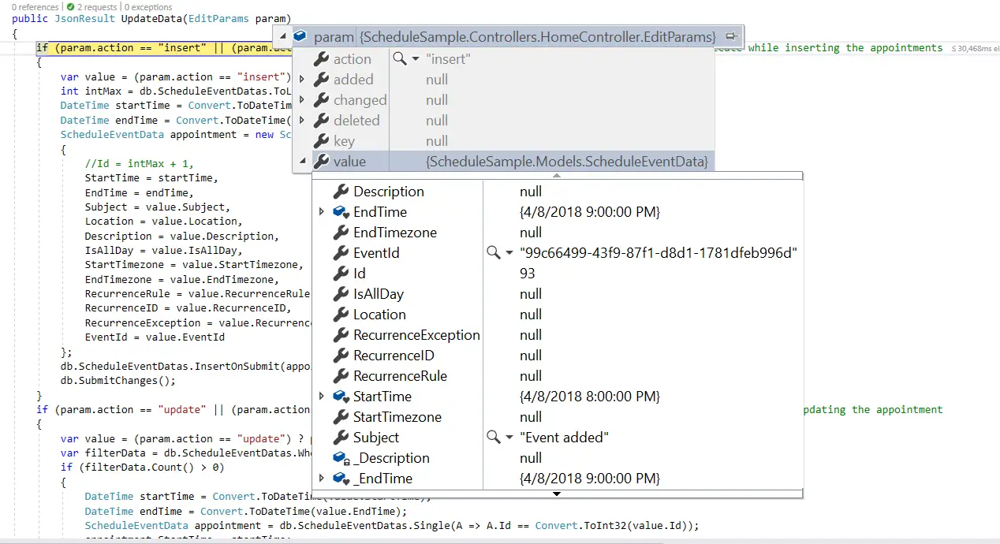
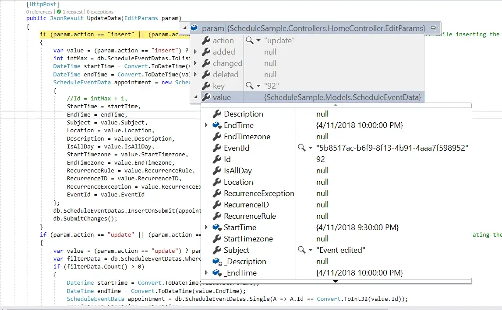
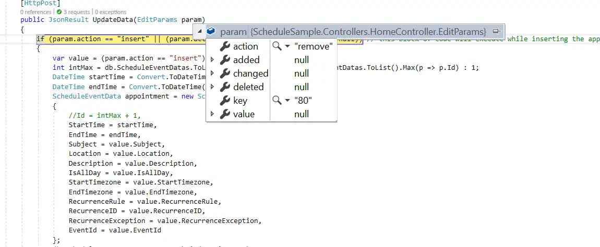

# CRUD Actions in Blazor Scheduler

Events, also known as appointments, play an important role in the Scheduler and are the items that users interact with most often. You can easily manipulate them by adding, editing, or deleting appointments as needed, either by using the editor window or through drag-and-resize actions.

## Add

Any kind of appointment, such as normal, all-day, spanned, or recurring events, can be added in the Scheduler using any of the following ways.

* [Creation using editor window](#creation-using-editor-window)
* [Creation using AddEventAsync method](#creation-using-addeventasync-method)

### Creation using editor window

The default editor window opens when you double-click Scheduler cells. It provides event-related options such as Subject, Location, Start and End Time, All-day, Timezone, Description, and recurrence options. With these available fields, you can provide detailed information for the appointments. Once the fields are filled with valid values, select the `Save` button to add an event.

If you want to provide only the Subject for appointments, single-click the required cells to open the quick popup, enter the Subject, and save it. You can also select multiple cells and press the `Enter` key to open the quick popup for the selected time range and save the appointment for that range.

### Creation using AddEventAsync method

Appointments can be created dynamically by using the [`AddEventAsync`](https://help.syncfusion.com/cr/blazor/Syncfusion.Blazor.Schedule.SfSchedule-1.html#Syncfusion_Blazor_Schedule_SfSchedule_1_AddEventAsync__0_) method.

```cshtml
@using Syncfusion.Blazor.Schedule
@using Syncfusion.Blazor.Buttons

<SfButton Content="ADD" OnClick="OnClick"></SfButton>

<SfSchedule @ref="ScheduleRef" TValue="AppointmentData" Height="550px" @bind-SelectedDate="@CurrentDate">
    <ScheduleEventSettings DataSource="@DataSource"></ScheduleEventSettings>
    <ScheduleViews>
        <ScheduleView Option="View.Day"></ScheduleView>
        <ScheduleView Option="View.Week"></ScheduleView>
        <ScheduleView Option="View.WorkWeek"></ScheduleView>
        <ScheduleView Option="View.Month"></ScheduleView>
        <ScheduleView Option="View.Agenda"></ScheduleView>
    </ScheduleViews>
</SfSchedule>
@code{
    DateTime CurrentDate = new DateTime(2020, 1, 6);
    SfSchedule<AppointmentData> ScheduleRef;
    List<AppointmentData> DataSource = new List<AppointmentData>
    {
        new AppointmentData { Id = 1, Subject = "Meeting", StartTime = new DateTime(2020, 1, 6, 9, 30, 0) , EndTime = new DateTime(2020, 1, 6, 11, 0, 0),
        RecurrenceRule = "FREQ=DAILY;INTERVAL=1;COUNT=5" }
    };
    public async Task OnClick()
    {
        AppointmentData eventData = new AppointmentData
        {
            Id = 10,
            Subject = "Added Event",
            StartTime = new DateTime(2020, 1, 7, 9, 30, 0),
            EndTime = new DateTime(2020, 1, 7, 11, 30, 0),
        };
        await ScheduleRef.AddEventAsync(eventData);
    }
    public class AppointmentData
    {
        public int Id { get; set; }
        public string Subject { get; set; }
        public string Location { get; set; }
        public DateTime StartTime { get; set; }
        public DateTime EndTime { get; set; }
        public string Description { get; set; }
        public bool IsAllDay { get; set; }
        public string RecurrenceRule { get; set; }
        public string RecurrenceException { get; set; }
        public Nullable<int> RecurrenceID { get; set; }
    }
}
```

### Inline creation

Another easy way to create appointments is by enabling the [`AllowInline`](https://help.syncfusion.com/cr/blazor/Syncfusion.Blazor.Schedule.SfSchedule-1.html#Syncfusion_Blazor_Schedule_SfSchedule_1_AllowInline) property. By single-clicking Scheduler cells or pressing the `Enter` key on selected cells, an appointment-like text box is displayed, where you can enter the Subject. Pressing the `Enter` key or clicking outside the text box creates the appointment in the Scheduler.

```cshtml
@using Syncfusion.Blazor.Schedule

<SfSchedule TValue="AppointmentData" Height="550px" AllowInline="true" @bind-SelectedDate="@CurrentDate">
    <ScheduleEventSettings DataSource="@DataSource"></ScheduleEventSettings>
    <ScheduleViews>
        <ScheduleView Option="View.Day"></ScheduleView>
        <ScheduleView Option="View.Week"></ScheduleView>
        <ScheduleView Option="View.WorkWeek"></ScheduleView>
        <ScheduleView Option="View.Month"></ScheduleView>
        <ScheduleView Option="View.Agenda"></ScheduleView>
    </ScheduleViews>
</SfSchedule>

@code{
    DateTime CurrentDate = new DateTime(2020, 1, 6);
    List<AppointmentData> DataSource = new List<AppointmentData>
    {
        new AppointmentData { Id = 1, Subject = "Meeting", StartTime = new DateTime(2020, 1, 6, 9, 30, 0) , EndTime = new DateTime(2020, 1, 6, 11, 0, 0) }
    };
    public class AppointmentData
    {
        public int Id { get; set; }
        public string Subject { get; set; }
        public string Location { get; set; }
        public DateTime StartTime { get; set; }
        public DateTime EndTime { get; set; }
        public string Description { get; set; }
        public bool IsAllDay { get; set; }
        public string RecurrenceRule { get; set; }
        public string RecurrenceException { get; set; }
        public Nullable<int> RecurrenceID { get; set; }
    }
}
```

### Inserting events into database at server-side

When you add normal or recurring events to the Scheduler, the `insert` action is triggered. The following code example describes how to add a new event to the database on the server side.

```sh
if (param.action == "insert" || (param.action == "batch" && param.added != null)) // this block of code will execute while inserting the appointments
{
    var value = (param.action == "insert") ? param.value : param.added[0];
    int intMax = db.ScheduleEventDatas.Select(x => x.Id).DefaultIfEmpty(0).Max();
    DateTime startTime = Convert.ToDateTime(value.StartTime);
    DateTime endTime = Convert.ToDateTime(value.EndTime);
    ScheduleEventData appointment = new ScheduleEventData()
    {
        Id = intMax + 1,
        StartTime = startTime,
        EndTime = endTime,
        Subject = value.Subject,
        IsAllDay = value.IsAllDay,
        StartTimezone = value.StartTimezone,
        EndTimezone = value.EndTimezone,
        RecurrenceRule = value.RecurrenceRule,
        RecurrenceID = value.RecurrenceID,
        RecurrenceException = value.RecurrenceException
    };
    db.ScheduleEventDatas.InsertOnSubmit(appointment);
    db.SubmitChanges();
}
```



### Restricting add action based on specific criteria

In the following example, specific fields in the Scheduler editor window, such as Subject and Location, are validated so that if they are left blank, the default `required` validation message is displayed when the `Save` button is clicked.

Additionally, a regex condition is added to the Location field so that if any special characters are entered, a custom validation message is displayed.

```cshtml
@using Syncfusion.Blazor.Schedule

<SfSchedule TValue="AppointmentData" Height="550px" @bind-SelectedDate="@CurrentDate">
    <ScheduleEventSettings DataSource="@DataSource">
        <ScheduleField>
            <FieldSubject Name="Subject" Validation="@ValidationRules"></FieldSubject>
            <FieldLocation Name="Location" Validation="@LocationValidationRules"></FieldLocation>
            <FieldDescription Name="Description" Validation="@DescriptionValidationRules"></FieldDescription>
            <FieldStartTime Name="StartTime" Validation="@ValidationRules"></FieldStartTime>
            <FieldEndTime Name="EndTime" Validation="@ValidationRules"></FieldEndTime>
        </ScheduleField>
    </ScheduleEventSettings>
    <ScheduleViews>
        <ScheduleView Option="View.Day"></ScheduleView>
        <ScheduleView Option="View.Week"></ScheduleView>
        <ScheduleView Option="View.WorkWeek"></ScheduleView>
        <ScheduleView Option="View.Month"></ScheduleView>
        <ScheduleView Option="View.Agenda"></ScheduleView>
    </ScheduleViews>
</SfSchedule>
@code{
    DateTime CurrentDate = new DateTime(2020, 1, 6);
    static Dictionary<string, object> ValidationMessages = new Dictionary<string, object>() { { "regex", "Special character(s) not allowed in this field" } };
    ValidationRules ValidationRules = new ValidationRules { Required = true };
    ValidationRules LocationValidationRules = new ValidationRules { Required = true, RegexPattern = "^[a-zA-Z0-9- ]*$", Messages = ValidationMessages };
    ValidationRules DescriptionValidationRules = new ValidationRules { Required = true, MinLength = 5, MaxLength = 500 };

    List<AppointmentData> DataSource = new List<AppointmentData>
    {
        new AppointmentData { Id = 1, Subject = "Meeting", StartTime = new DateTime(2020, 1, 6, 9, 30, 0) , EndTime = new DateTime(2020, 1, 6, 11, 0, 0) }
    };

    public class AppointmentData
    {
        public int Id { get; set; }
        public string Subject { get; set; }
        public string Location { get; set; }
        public DateTime StartTime { get; set; }
        public DateTime EndTime { get; set; }
        public string Description { get; set; }
        public bool IsAllDay { get; set; }
        public string RecurrenceRule { get; set; }
        public string RecurrenceException { get; set; }
        public Nullable<int> RecurrenceID { get; set; }
    }
}
```

You can also dynamically prevent the creation of appointments in the Scheduler. For example, if you want to prevent appointments from being created on weekends, you can check the appropriate condition in the [`OnActionBegin`](https://help.syncfusion.com/cr/blazor/Syncfusion.Blazor.Schedule.ScheduleEvents-1.html#Syncfusion_Blazor_Schedule_ScheduleEvents_1_OnActionBegin) event.

```cshtml
@using Syncfusion.Blazor.Schedule

<SfSchedule TValue="AppointmentData" Width="100%" Height="550px" @bind-SelectedDate="@CurrentDate">
    <ScheduleEvents TValue="AppointmentData" OnActionBegin="OnActionBegin"></ScheduleEvents>
    <ScheduleViews>
        <ScheduleView Option="View.Day"></ScheduleView>
        <ScheduleView Option="View.Week"></ScheduleView>
        <ScheduleView Option="View.Month" MaxEventsPerRow="2"></ScheduleView>
    </ScheduleViews>
    <ScheduleEventSettings DataSource="@DataSource"></ScheduleEventSettings>
</SfSchedule>
@code {
    DateTime CurrentDate = new DateTime(2019, 1, 6);
    public void OnActionBegin(ActionEventArgs<AppointmentData> args)
    {
        if (args.ActionType == ActionType.EventCreate)
        {
            int[] weekEnds = new int[2] { 0, 6 };
            AppointmentData data = args.AddedRecords[0];
            DateTime date = data.StartTime;
            int weekDay = (int)date.DayOfWeek;
            if (weekDay == weekEnds[0] || weekDay == weekEnds[1])
            {
                args.Cancel = true;
            }
        }
    }
    List<AppointmentData> DataSource = new List<AppointmentData>
    {
        new AppointmentData { Id = 1, Subject = "Meeting", StartTime = new DateTime(2019, 1, 7, 11, 0, 0) , EndTime = new DateTime(2019, 1, 7, 12, 30, 0) },
        new AppointmentData { Id = 2, Subject = "vacation", StartTime = new DateTime(2019, 1, 8, 8, 30, 0) , EndTime = new DateTime(2019, 1, 8, 9, 30, 0) },
        new AppointmentData { Id = 6, Subject = "conference", StartTime = new DateTime(2019, 1, 11, 18, 0, 0) , EndTime = new DateTime(2019, 1, 11, 19, 30, 0) }
    };

    public class AppointmentData
    {
        public int Id { get; set; }
        public string Subject { get; set; }
        public string Location { get; set; }
        public DateTime StartTime { get; set; }
        public DateTime EndTime { get; set; }
        public string Description { get; set; }
        public bool IsAllDay { get; set; }
        public string RecurrenceRule { get; set; }
        public string RecurrenceException { get; set; }
        public Nullable<int> RecurrenceID { get; set; }
    }
}
```

## Edit

Appointments such as normal, all-day, spanned, or recurring events can be edited in the same way they are created, using any of the following options.

* [Update using editor window](#update-using-editor-window)
* [Update using SaveEventAsync method](#update-using-saveeventasync-method)

### Update using editor window

The default editor window filled with appointment details can be opened by double-clicking the required events. It is prefilled with event options such as Subject, Location, Start and End Time, All-day, Timezone, Description, and other recurrence options. You can then edit the desired field values and select the `Save` button to update the appointment.

Note: You can also single-click appointments, which opens the quick info popup with edit and delete options. Clicking the `Edit` option opens the default editor with event details, and clicking the `Delete` option prompts for delete confirmation.

### Update using SaveEventAsync method

Appointments can be edited and updated manually using the [`SaveEventAsync`](https://help.syncfusion.com/cr/blazor/Syncfusion.Blazor.Schedule.SfSchedule-1.html#Syncfusion_Blazor_Schedule_SfSchedule_1_SaveEventAsync__0_Syncfusion_Blazor_Schedule_CurrentAction__0_) method.

In the following example, an event with ID `1` is edited and its Subject is changed. When the modified data object is passed to the [`SaveEventAsync`](https://help.syncfusion.com/cr/blazor/Syncfusion.Blazor.Schedule.SfSchedule-1.html#Syncfusion_Blazor_Schedule_SfSchedule_1_SaveEventAsync__0_Syncfusion_Blazor_Schedule_CurrentAction__0_) method, the changes are reflected in the original event. The `Id` field is required in this edit process, and the modified event object must contain a valid `Id` value that exists in the Scheduler data source.

```cshtml
@using Syncfusion.Blazor.Schedule
@using Syncfusion.Blazor.Buttons

<SfButton Content="EDIT" OnClick="OnClick"></SfButton>

<SfSchedule @ref="ScheduleRef" TValue="AppointmentData" Height="550px" @bind-SelectedDate="@CurrentDate">
    <ScheduleEventSettings DataSource="@DataSource"></ScheduleEventSettings>
    <ScheduleViews>
        <ScheduleView Option="View.Day"></ScheduleView>
        <ScheduleView Option="View.Week"></ScheduleView>
        <ScheduleView Option="View.WorkWeek"></ScheduleView>
        <ScheduleView Option="View.Month"></ScheduleView>
        <ScheduleView Option="View.Agenda"></ScheduleView>
    </ScheduleViews>
</SfSchedule>
@code{
    DateTime CurrentDate = new DateTime(2020, 1, 6);
    SfSchedule<AppointmentData> ScheduleRef;
    List<AppointmentData> DataSource = new List<AppointmentData>
    {
        new AppointmentData { Id = 1, Subject = "Testing", StartTime = new DateTime(2020, 1, 6, 9, 30, 0) , EndTime = new DateTime(2020, 1, 6, 11, 0, 0)},
        new AppointmentData { Id = 2, Subject = "Conference", StartTime = new DateTime(2020, 1, 11, 9, 30, 0) , EndTime = new DateTime(2020, 1, 11, 11, 0, 0)}
    };
    public async Task OnClick()
    {
        AppointmentData eventData = new AppointmentData
        {
            Id = 1,
            Subject = "Edited",
            StartTime = new DateTime(2020, 1, 6, 10, 30, 0),
            EndTime = new DateTime(2020, 1, 6, 12, 0, 0),
        };
        await ScheduleRef.SaveEventAsync(eventData);
    }
    public class AppointmentData
    {
        public int Id { get; set; }
        public string Subject { get; set; }
        public string Location { get; set; }
        public DateTime StartTime { get; set; }
        public DateTime EndTime { get; set; }
        public string Description { get; set; }
        public bool IsAllDay { get; set; }
        public string RecurrenceRule { get; set; }
        public string RecurrenceException { get; set; }
        public Nullable<int> RecurrenceID { get; set; }
    }
}
```

### Inline editing

Another easy way to edit appointments is by enabling the [`AllowInline`](https://help.syncfusion.com/cr/blazor/Syncfusion.Blazor.Schedule.SfSchedule-1.html#Syncfusion_Blazor_Schedule_SfSchedule_1_AllowInline) property. By single-clicking appointments, you can edit the Subject. Pressing the `Enter` key or clicking outside the appointment edits the existing appointment.

```cshtml
@using Syncfusion.Blazor.Schedule

<SfSchedule TValue="AppointmentData" Height="550px" AllowInline="true" @bind-SelectedDate="@CurrentDate">
    <ScheduleEventSettings DataSource="@DataSource"></ScheduleEventSettings>
    <ScheduleViews>
        <ScheduleView Option="View.Day"></ScheduleView>
        <ScheduleView Option="View.Week"></ScheduleView>
        <ScheduleView Option="View.WorkWeek"></ScheduleView>
        <ScheduleView Option="View.Month"></ScheduleView>
        <ScheduleView Option="View.Agenda"></ScheduleView>
    </ScheduleViews>
</SfSchedule>

@code{
    DateTime CurrentDate = new DateTime(2020, 1, 6);
    List<AppointmentData> DataSource = new List<AppointmentData>
    {
        new AppointmentData { Id = 1, Subject = "Meeting", StartTime = new DateTime(2020, 1, 6, 9, 30, 0) , EndTime = new DateTime(2020, 1, 6, 11, 0, 0) }
    };
    public class AppointmentData
    {
        public int Id { get; set; }
        public string Subject { get; set; }
        public string Location { get; set; }
        public DateTime StartTime { get; set; }
        public DateTime EndTime { get; set; }
        public string Description { get; set; }
        public bool IsAllDay { get; set; }
        public string RecurrenceRule { get; set; }
        public string RecurrenceException { get; set; }
        public Nullable<int> RecurrenceID { get; set; }
    }
}
```

### Updating events in database at server-side

When you edit normal events in the Scheduler, the `update` action is triggered. The following code example describes how to update an event in the database on the server side.

```sh
if (param.action == "update" || (param.action == "batch" && param.changed != null)) // this block of code will execute while updating the appointment
{
    var value = (param.action == "update") ? param.value : param.changed[0];
    var filterData = db.ScheduleEventDatas.Where(c => c.Id == Convert.ToInt32(value.Id));
    if (filterData.Count() > 0)
    {
        DateTime startTime = Convert.ToDateTime(value.StartTime);
        DateTime endTime = Convert.ToDateTime(value.EndTime);
        ScheduleEventData appointment = db.ScheduleEventDatas.Single(A => A.Id == Convert.ToInt32(value.Id));
        appointment.StartTime = startTime;
        appointment.EndTime = endTime;
        appointment.StartTimezone = value.StartTimezone;
        appointment.EndTimezone = value.EndTimezone;
        appointment.Subject = value.Subject;
        appointment.IsAllDay = value.IsAllDay;
        appointment.RecurrenceRule = value.RecurrenceRule;
        appointment.RecurrenceID = value.RecurrenceID;
        appointment.RecurrenceException = value.RecurrenceException;
    }
    db.SubmitChanges();
}
```



### How to edit a single occurrence or entire series and update it in database at server-side

Recurring appointments can be edited in either of the following two ways.

* Single occurrence
* Entire series

**Editing single occurrence** - When a recurring event is double-clicked, a popup prompts you to choose whether to edit the single event or the entire series. If you select the **EDIT EVENT** option, only a single occurrence of the recurring appointment is edited. The following process takes place while editing a single occurrence:

* A new event will be created from the parent event data and added to the Scheduler dataSource, with all its default field values overwritten with the newly modified data and additionally, the [`RecurrenceID`](https://help.syncfusion.com/cr/blazor/Syncfusion.Blazor.Schedule.FieldRecurrenceId.html) field will be added to it, that holds the `id` value of the parent recurring event. Also, a new `Id` will be generated for this event in the dataSource.

* The parent recurring event needs to be updated with appropriate [`RecurrenceException`](https://help.syncfusion.com/cr/blazor/Syncfusion.Blazor.Schedule.FieldRecurrenceException.html) field to hold the edited occurrence appointment's date collection.

Therefore, when a single occurrence is edited from a recurring event, the batch action takes place and both the `Add` and `Edit` action requests are processed together.

Note: If you edit an already edited occurrence of a recurring event, only the edited occurrence that exists in the database as an individual event object is updated. In this case, only the `update` action takes place on the edited occurrence object in the database.

```sh
if (param.action == "insert" || (param.action == "batch" && param.added != null)) // this block of code will execute while inserting the appointments
{
    var value = (param.action == "insert") ? param.value : param.added[0];
    int intMax = db.ScheduleEventDatas.Select(x => x.Id).DefaultIfEmpty(0).Max();
    DateTime startTime = Convert.ToDateTime(value.StartTime);
    DateTime endTime = Convert.ToDateTime(value.EndTime);
    ScheduleEventData appointment = new ScheduleEventData()
    {
        Id = intMax + 1,
        StartTime = startTime,
        EndTime = endTime,
        Subject = value.Subject,
        IsAllDay = value.IsAllDay,
        StartTimezone = value.StartTimezone,
        EndTimezone = value.EndTimezone,
        RecurrenceRule = value.RecurrenceRule,
        RecurrenceID = value.RecurrenceID,
        RecurrenceException = value.RecurrenceException
    };
    db.ScheduleEventDatas.InsertOnSubmit(appointment);
    db.SubmitChanges();
}
if (param.action == "update" || (param.action == "batch" && param.changed != null)) // this block of code will execute while updating the appointment
{
    var value = (param.action == "update") ? param.value : param.changed[0];
    var filterData = db.ScheduleEventDatas.Where(c => c.Id == Convert.ToInt32(value.Id));
    if (filterData.Count() > 0)
    {
        DateTime startTime = Convert.ToDateTime(value.StartTime);
        DateTime endTime = Convert.ToDateTime(value.EndTime);
        ScheduleEventData appointment = db.ScheduleEventDatas.Single(A => A.Id == Convert.ToInt32(value.Id));
        appointment.StartTime = startTime;
        appointment.EndTime = endTime;
        appointment.StartTimezone = value.StartTimezone;
        appointment.EndTimezone = value.EndTimezone;
        appointment.Subject = value.Subject;
        appointment.IsAllDay = value.IsAllDay;
        appointment.RecurrenceRule = value.RecurrenceRule;
        appointment.RecurrenceID = value.RecurrenceID;
        appointment.RecurrenceException = value.RecurrenceException;
    }
    db.SubmitChanges();
}
```

**Editing entire series** - When the **EDIT SERIES** option is selected from the popup that opens on a double-clicked recurring event, the entire recurring series is updated with the newly provided values. If the parent event has any edited occurrences, all child occurrences are removed from the data source and only the parent event is updated.

This action also leads to the batch process, because both the `Delete` and `Edit` actions take place together.

```sh
if (param.action == "update" || (param.action == "batch" && param.changed != null)) // this block of code will execute while updating the appointment
{
    var value = (param.action == "update") ? param.value : param.changed[0];
    var filterData = db.ScheduleEventDatas.Where(c => c.Id == Convert.ToInt32(value.Id));
    if (filterData.Count() > 0)
    {
        DateTime startTime = Convert.ToDateTime(value.StartTime);
        DateTime endTime = Convert.ToDateTime(value.EndTime);
        ScheduleEventData appointment = db.ScheduleEventDatas.Single(A => A.Id == Convert.ToInt32(value.Id));
        appointment.StartTime = startTime;
        appointment.EndTime = endTime;
        appointment.StartTimezone = value.StartTimezone;
        appointment.EndTimezone = value.EndTimezone;
        appointment.Subject = value.Subject;
        appointment.IsAllDay = value.IsAllDay;
        appointment.RecurrenceRule = value.RecurrenceRule;
        appointment.RecurrenceID = value.RecurrenceID;
        appointment.RecurrenceException = value.RecurrenceException;
    }
    db.SubmitChanges();
}
if (param.action == "remove" || (param.action == "batch" && param.deleted != null)) // this block of code will execute while removing the appointment
{
    if (param.action == "remove")
    {
        int key = Convert.ToInt32(param.key);
        ScheduleEventData appointment = db.ScheduleEventDatas.Where(c => c.Id == key).FirstOrDefault();
        if (appointment != null) db.ScheduleEventDatas.DeleteOnSubmit(appointment);
    }
    else
    {
        foreach (var apps in param.deleted)
        {
            ScheduleEventData appointment = db.ScheduleEventDatas.Where(c => c.Id == apps.Id).FirstOrDefault();
            if (apps != null) db.ScheduleEventDatas.DeleteOnSubmit(appointment);
        }
    }
    db.SubmitChanges();
}
```

Note: To learn more about handling recurrence exceptions, refer to the [Adding exceptions](https://help.syncfusion.com/scheduler-sdk/blazor/schedule/recurring-events#adding-exceptions) topic.

### Restricting edit action based on specific criteria

You can also dynamically prevent the editing of appointments in the Scheduler. For example, if you want to prevent updates during non-working hours, you can check the appropriate condition in the [`OnActionBegin`](https://help.syncfusion.com/cr/blazor/Syncfusion.Blazor.Schedule.ScheduleEvents-1.html#Syncfusion_Blazor_Schedule_ScheduleEvents_1_OnActionBegin) event.

```cshtml
@using Syncfusion.Blazor.Schedule

<SfSchedule TValue="AppointmentData" Width="100%" Height="550px" @bind-SelectedDate="@CurrentDate">
    <ScheduleWorkHours Highlight="true" Start="@StartHour" End="@EndHour"></ScheduleWorkHours>
    <ScheduleEvents TValue="AppointmentData" OnActionBegin="OnActionBegin"></ScheduleEvents>
    <ScheduleViews>
        <ScheduleView Option="View.Day"></ScheduleView>
        <ScheduleView Option="View.Week"></ScheduleView>
        <ScheduleView Option="View.Month" MaxEventsPerRow="2"></ScheduleView>
    </ScheduleViews>
    <ScheduleEventSettings DataSource="@DataSource"></ScheduleEventSettings>
</SfSchedule>
@code {
    DateTime CurrentDate = new DateTime(2019, 1, 6);
    public string StartHour { get; set; } = "09:00";
    public string EndHour { get; set; } = "18:00";
    public void OnActionBegin(ActionEventArgs<AppointmentData> args)
    {
        if (args.ActionType == ActionType.EventChange)
        {
            bool workHours = false, flag = false;
            int[] weekEnds = new int[2] { 0, 6 };
            AppointmentData data = args.ChangedRecords[0];
            DateTime date = data.StartTime;
            int weekDay = (int)date.DayOfWeek;
            if (weekDay == weekEnds[0] || weekDay == weekEnds[1])
            {
                flag = true;
            }
            int hour = data.StartTime.Hour;
            int workHoursStart = Convert.ToInt32(StartHour.Substring(0, 2));
            int workHoursEnd = Convert.ToInt32(EndHour.Substring(0, 2));
            if (workHoursStart <= hour && workHoursEnd > hour)
            {
                workHours = true;
            }
            if (flag || !workHours)
            {
                args.Cancel = true;
            }
        }
    }
    List<AppointmentData> DataSource = new List<AppointmentData>
    {
        new AppointmentData { Id = 1, Subject = "Meeting", StartTime = new DateTime(2019, 1, 6, 9, 0, 0) , EndTime = new DateTime(2019, 1, 6, 11, 30, 0) },
        new AppointmentData { Id = 2, Subject = "vacation", StartTime = new DateTime(2019, 1, 8, 10, 30, 0) , EndTime = new DateTime(2019, 1, 8, 12, 30, 0) },
        new AppointmentData { Id = 6, Subject = "conference", StartTime = new DateTime(2019, 1, 11, 18, 0, 0) , EndTime = new DateTime(2019, 1, 11, 19, 30, 0) }
    };

    public class AppointmentData
    {
        public int Id { get; set; }
        public string Subject { get; set; }
        public string Location { get; set; }
        public DateTime StartTime { get; set; }
        public DateTime EndTime { get; set; }
        public string Description { get; set; }
        public bool IsAllDay { get; set; }
        public string RecurrenceRule { get; set; }
        public string RecurrenceException { get; set; }
        public Nullable<int> RecurrenceID { get; set; }
    }
}
```

## Delete

Appointments can be deleted in either of the following ways:

* Selecting an appointment and clicking the delete icon from the quick popup that opens.
* Selecting an appointment and pressing `Delete` key.
* Selecting multiple appointments by tap holding an event and then continuously single clicking on other consecutive events and then clicking the `Delete` key.
* Double clicking on an event which opens the default event editor pre-filled with event details, and then choosing `Delete` button in it.

When any of these actions are performed, a pop-up with a delete confirmation message is displayed to confirm whether the appointment should be deleted.

### Deletion using editor window

When you double-click an event, the default editor window opens and includes a `Delete` button at the bottom-left position, which allows you to delete that appointment. When you delete an appointment through this editor window, the delete confirmation is not shown and the event is deleted immediately.

### Deletion using DeleteEventAsync method

Appointments can be removed manually using the [`DeleteEventAsync`](https://help.syncfusion.com/cr/blazor/Syncfusion.Blazor.Schedule.SfSchedule-1.html#Syncfusion_Blazor_Schedule_SfSchedule_1_DeleteEventAsync__0_System_Nullable_Syncfusion_Blazor_Schedule_CurrentAction__) method. The following code examples show how to delete normal and recurring events.

**Normal event** - You can delete normal appointments in the Scheduler by passing either its `Id` value or the entire event object collection to the [`DeleteEventAsync`](https://help.syncfusion.com/cr/blazor/Syncfusion.Blazor.Schedule.SfSchedule-1.html#Syncfusion_Blazor_Schedule_SfSchedule_1_DeleteEventAsync__0_System_Nullable_Syncfusion_Blazor_Schedule_CurrentAction__) method.

```cshtml
@using Syncfusion.Blazor.Schedule
@using Syncfusion.Blazor.Buttons

<SfButton Content="DELETE" OnClick="OnClick"></SfButton>

<SfSchedule @ref="ScheduleRef" TValue="AppointmentData" Height="550px" @bind-SelectedDate="@CurrentDate">
    <ScheduleEventSettings DataSource="@DataSource"></ScheduleEventSettings>
    <ScheduleViews>
        <ScheduleView Option="View.Day"></ScheduleView>
        <ScheduleView Option="View.Week"></ScheduleView>
        <ScheduleView Option="View.WorkWeek"></ScheduleView>
        <ScheduleView Option="View.Month"></ScheduleView>
        <ScheduleView Option="View.Agenda"></ScheduleView>
    </ScheduleViews>
</SfSchedule>
@code{
    DateTime CurrentDate = new DateTime(2020, 1, 6);
    SfSchedule<AppointmentData> ScheduleRef;
    List<AppointmentData> DataSource = new List<AppointmentData>
    {
        new AppointmentData { Id = 1, Subject = "Testing", StartTime = new DateTime(2020, 1, 6, 9, 30, 0) , EndTime = new DateTime(2020, 1, 6, 11, 0, 0)},
        new AppointmentData { Id = 2, Subject = "Conference", StartTime = new DateTime(2020, 1, 8, 9, 30, 0) , EndTime = new DateTime(2020, 1, 8, 11, 0, 0)}
    };
    public async Task OnClick()
    {
        await ScheduleRef.DeleteEventAsync(2);
    }
    public class AppointmentData
    {
        public int Id { get; set; }
        public string Subject { get; set; }
        public string Location { get; set; }
        public DateTime StartTime { get; set; }
        public DateTime EndTime { get; set; }
        public string Description { get; set; }
        public bool IsAllDay { get; set; }
        public string RecurrenceRule { get; set; }
        public string RecurrenceException { get; set; }
        public Nullable<int> RecurrenceID { get; set; }
    }
}
```

**Recurring event** - Recurring events can be removed as an entire series or as a single occurrence by using the [`DeleteEventAsync`](https://help.syncfusion.com/cr/blazor/Syncfusion.Blazor.Schedule.SfSchedule-1.html#Syncfusion_Blazor_Schedule_SfSchedule_1_DeleteEventAsync__0_System_Nullable_Syncfusion_Blazor_Schedule_CurrentAction__) method with either the `DeleteSeries` or `DeleteOccurrence` parameter.

```cshtml
@using Syncfusion.Blazor.Schedule
@using Syncfusion.Blazor.Buttons

<SfButton Content="DELETE SERIES" OnClick="OnClick"></SfButton>

<SfSchedule @ref="ScheduleRef" TValue="AppointmentData" Height="550px" @bind-SelectedDate="@CurrentDate">
    <ScheduleEventSettings DataSource="@DataSource"></ScheduleEventSettings>
    <ScheduleViews>
        <ScheduleView Option="View.Day"></ScheduleView>
        <ScheduleView Option="View.Week"></ScheduleView>
        <ScheduleView Option="View.WorkWeek"></ScheduleView>
        <ScheduleView Option="View.Month"></ScheduleView>
        <ScheduleView Option="View.Agenda"></ScheduleView>
    </ScheduleViews>
</SfSchedule>
@code{
    DateTime CurrentDate = new DateTime(2020, 1, 6);
    SfSchedule<AppointmentData> ScheduleRef;
    List<AppointmentData> DataSource = new List<AppointmentData>
    {
        new AppointmentData { Id = 1, Subject = "Meeting", StartTime = new DateTime(2020, 1, 6, 9, 30, 0) , EndTime = new DateTime(2020, 1, 6, 11, 0, 0),
        RecurrenceRule = "FREQ=DAILY;INTERVAL=1;COUNT=3"},
        new AppointmentData { Id = 2, Subject = "Testing", StartTime = new DateTime(2020, 1, 7, 12, 0, 0) , EndTime = new DateTime(2020, 1, 7, 13, 30, 0),
        RecurrenceRule = "FREQ=DAILY;INTERVAL=1;COUNT=3"}
    };
    public async Task OnClick()
    {
        AppointmentData eventData = new AppointmentData
        {
            Id = 2,
            Subject = "Testing",
            StartTime = new DateTime(2020, 1, 7, 12, 0, 0),
            EndTime = new DateTime(2020, 1, 7, 13, 30, 0),
            RecurrenceID = 2,
            RecurrenceRule = "FREQ=DAILY;INTERVAL=1;COUNT=3"
        };
        await ScheduleRef.DeleteEventAsync(eventData, CurrentAction.DeleteSeries);
    }
        public class AppointmentData
    {
        public int Id { get; set; }
        public string Subject { get; set; }
        public string Location { get; set; }
        public DateTime StartTime { get; set; }
        public DateTime EndTime { get; set; }
        public string Description { get; set; }
        public bool IsAllDay { get; set; }
        public string RecurrenceRule { get; set; }
        public string RecurrenceException { get; set; }
        public Nullable<int> RecurrenceID { get; set; }
    }
}
```

### Removing events from database at server-side

When you delete an event from the Scheduler, the `remove` action is triggered. The following code example describes how to delete an event from the database on the server side.

```sh
if (param.action == "remove" || (param.action == "batch" && param.deleted != null)) // this block of code will execute while removing the appointment
{
    if (param.action == "remove")
    {
        int key = Convert.ToInt32(param.key);
        ScheduleEventData appointment = db.ScheduleEventDatas.Where(c => c.Id == key).FirstOrDefault();
        if (appointment != null) db.ScheduleEventDatas.DeleteOnSubmit(appointment);
    }
    else
    {
        foreach (var apps in param.deleted)
        {
            ScheduleEventData appointment = db.ScheduleEventDatas.Where(c => c.Id == apps.Id).FirstOrDefault();
            if (apps != null) db.ScheduleEventDatas.DeleteOnSubmit(appointment);
        }
    }
    db.SubmitChanges();
}
```



### How to delete a single occurrence or entire series from Scheduler and update it in database at server side

The recurring events can be deleted in either of the following two ways.

* Single occurrence
* Entire series

**Single occurrence** - When you attempt to delete a recurring event, a popup prompts you to choose whether to delete the single event or the entire series. If you select the **DELETE EVENT** option, only a single occurrence of the recurring appointment is removed. The following process takes place while removing a single occurrence:

* The selected occurrence will be deleted from the Scheduler user interface.
* In code, the parent recurring event object will be updated with appropriate [`RecurrenceException`](https://help.syncfusion.com/cr/blazor/Syncfusion.Blazor.Schedule.FieldRecurrenceException.html) field, to hold the deleted occurrence appointment's date collection.

Therefore, when a single occurrence is deleted from a recurring event, the `update` action is applied to the parent recurring event as shown in the following code example.

Note: If you delete an already edited occurrence of a recurring event, only the edited occurrence that exists in the database as an individual event object is removed. In this case, the `delete` action is performed instead of the `update` action, and the parent recurring event object remains unchanged.

```sh
if (param.action == "update" || (param.action == "batch" && param.changed != null)) // this block of code will execute while updating the appointment
{
    var value = (param.action == "update") ? param.value : param.changed[0];
    var filterData = db.ScheduleEventDatas.Where(c => c.Id == Convert.ToInt32(value.Id));
    if (filterData.Count() > 0)
    {
        DateTime startTime = Convert.ToDateTime(value.StartTime);
        DateTime endTime = Convert.ToDateTime(value.EndTime);
        ScheduleEventData appointment = db.ScheduleEventDatas.Single(A => A.Id == Convert.ToInt32(value.Id));
        appointment.StartTime = startTime;
        appointment.EndTime = endTime;
        appointment.StartTimezone = value.StartTimezone;
        appointment.EndTimezone = value.EndTimezone;
        appointment.Subject = value.Subject;
        appointment.IsAllDay = value.IsAllDay;
        appointment.RecurrenceRule = value.RecurrenceRule;
        appointment.RecurrenceID = value.RecurrenceID;
        appointment.RecurrenceException = value.RecurrenceException;
    }
    db.SubmitChanges();
}
```

**Entire series** - When you select the **DELETE SERIES** option from the popup, the entire recurring series is deleted. If the parent event has any edited occurrences, all child occurrences that are maintained as separate event objects are also removed from the data source. This action triggers the `remove` action and removes one or more event objects at the same time.

```sh
if (param.action == "remove" || (param.action == "batch" && param.deleted != null)) // this block of code will execute while removing the appointment
{
    if (param.action == "remove")
    {
        int key = Convert.ToInt32(param.key);
        ScheduleEventData appointment = db.ScheduleEventDatas.Where(c => c.Id == key).FirstOrDefault();
        if (appointment != null) db.ScheduleEventDatas.DeleteOnSubmit(appointment);
    }
    else
    {
        foreach (var apps in param.deleted)
        {
            ScheduleEventData appointment = db.ScheduleEventDatas.Where(c => c.Id == apps.Id).FirstOrDefault();
            if (apps != null) db.ScheduleEventDatas.DeleteOnSubmit(appointment);
        }
    }
    db.SubmitChanges();
}
```

## Drag and drop

When you drag and drop a normal event on the Scheduler, the editing action takes place. When a recurring event is dragged and dropped on a desired time range, the batch action explained in the `Editing single occurrence` process takes place, allowing both the `Add` and `Edit` actions to occur together.

Note: By default, when you drag a recurring instance, only the occurrence of the event is edited, not the entire series.

```cshtml
@using Syncfusion.Blazor.Schedule

<SfSchedule TValue="AppointmentData" Width="100%" Height="550px" @bind-SelectedDate="@CurrentDate">
    <ScheduleEventSettings DataSource="@DataSource"></ScheduleEventSettings>
    <ScheduleViews>
        <ScheduleView Option="View.Day"></ScheduleView>
        <ScheduleView Option="View.Week"></ScheduleView>
        <ScheduleView Option="View.WorkWeek"></ScheduleView>
        <ScheduleView Option="View.Month"></ScheduleView>
        <ScheduleView Option="View.Agenda"></ScheduleView>
    </ScheduleViews>
</SfSchedule>
@code {
    DateTime CurrentDate = new DateTime(2020, 1, 31);
    List<AppointmentData> DataSource = new List<AppointmentData>
    {
        new AppointmentData { Id = 1, Subject = "Meeting", StartTime = new DateTime(2020, 1, 31, 9, 30, 0) , EndTime = new DateTime(2020, 1, 31, 11, 0, 0) }
    };
    public class AppointmentData
    {
        public int Id { get; set; }
        public string Subject { get; set; }
        public string Location { get; set; }
        public DateTime StartTime { get; set; }
        public DateTime EndTime { get; set; }
        public string Description { get; set; }
        public bool IsAllDay { get; set; }
        public string RecurrenceRule { get; set; }
        public string RecurrenceException { get; set; }
        public Nullable<int> RecurrenceID { get; set; }
    }
}
```

## Resize

When you resize a normal event on the Scheduler, the editing action takes place. When a recurring event is resized to a new desired time, the batch action explained in the `Editing single occurrence` process takes place, allowing both the `Add` and `Edit` actions to occur together.

Note: By default, when you resize a recurring instance, only the occurrence of the event is edited, not the entire series.

```cshtml
@using Syncfusion.Blazor.Schedule

<SfSchedule TValue="AppointmentData" Width="100%" Height="550px" @bind-SelectedDate="@CurrentDate">
    <ScheduleEventSettings DataSource="@DataSource"></ScheduleEventSettings>
    <ScheduleViews>
        <ScheduleView Option="View.Day"></ScheduleView>
        <ScheduleView Option="View.Week"></ScheduleView>
        <ScheduleView Option="View.WorkWeek"></ScheduleView>
        <ScheduleView Option="View.Month"></ScheduleView>
        <ScheduleView Option="View.Agenda"></ScheduleView>
    </ScheduleViews>
</SfSchedule>
@code {
    DateTime CurrentDate = new DateTime(2020, 1, 31);
    List<AppointmentData> DataSource = new List<AppointmentData>
    {
        new AppointmentData { Id = 1, Subject = "Meeting", StartTime = new DateTime(2020, 1, 31, 9, 30, 0) , EndTime = new DateTime(2020, 1, 31, 11, 0, 0) }
    };
    public class AppointmentData
    {
        public int Id { get; set; }
        public string Subject { get; set; }
        public string Location { get; set; }
        public DateTime StartTime { get; set; }
        public DateTime EndTime { get; set; }
        public string Description { get; set; }
        public bool IsAllDay { get; set; }
        public string RecurrenceRule { get; set; }
        public string RecurrenceException { get; set; }
        public Nullable<int> RecurrenceID { get; set; }
    }
}
```
