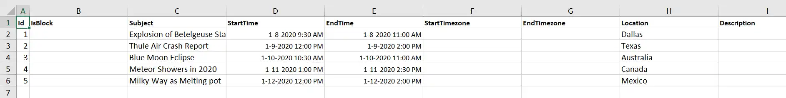
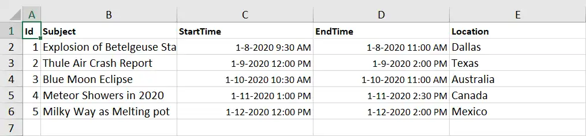
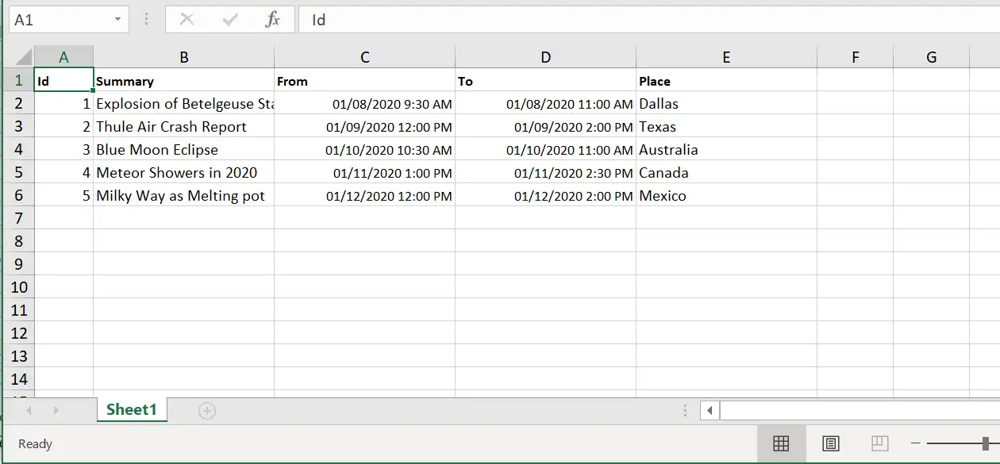
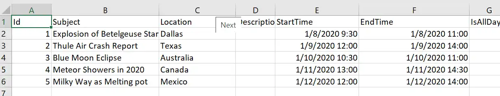

# Exporting in Blazor Scheduler

Scheduler supports exporting all appointments to either Excel or ICS files. It also provides different methods for exporting appointments in Excel or iCal formats. Let's look at the ways to implement exporting in Scheduler.

## Excel Exporting

Scheduler allows you to export all events to an Excel file by using the [`ExportToExcelAsync`](https://help.syncfusion.com/cr/blazor/Syncfusion.Blazor.Schedule.SfSchedule-1.html#Syncfusion_Blazor_Schedule_SfSchedule_1_ExportToExcelAsync_Syncfusion_Blazor_Schedule_ExportOptions_) method. By default, it exports all default Scheduler fields mapped through the `<ScheduleEventSettings>` property.

```cshtml
@using Syncfusion.Blazor.Schedule
@using Syncfusion.Blazor.Buttons

<SfButton Content="Excel Export" OnClick="OnExportToExcel"></SfButton>
<SfSchedule @ref="ScheduleRef" TValue="AppointmentData" Height="650px" @bind-SelectedDate="@CurrentDate">
    <ScheduleEventSettings DataSource="@DataSource"></ScheduleEventSettings>
    <ScheduleViews>
        <ScheduleView Option="View.Week"></ScheduleView>
    </ScheduleViews>
</SfSchedule>

@code{
    DateTime CurrentDate = new DateTime(2020, 1, 10);
    SfSchedule<AppointmentData> ScheduleRef;
    List<AppointmentData> DataSource = new List<AppointmentData>
    {
        new AppointmentData { Id = 1, Subject = "Explosion of Betelgeuse Star", Location = "Dallas",  StartTime = new DateTime(2020, 1, 8, 9, 30, 0), EndTime = new DateTime(2020, 1, 8, 11, 0, 0)  },
        new AppointmentData { Id = 2, Subject = "Thule Air Crash Report", Location = "Texas", StartTime = new DateTime(2020, 1, 9, 12, 0, 0), EndTime = new DateTime(2020, 1, 9, 14, 0, 0)  },
        new AppointmentData { Id = 3, Subject = "Blue Moon Eclipse", Location = "Australia", StartTime = new DateTime(2020, 1, 10, 10, 30, 0), EndTime = new DateTime(2020, 1, 10, 11, 0, 0)  },
        new AppointmentData { Id = 4, Subject = "Meteor Showers in 2020", Location = "Canada", StartTime = new DateTime(2020, 1, 11, 13, 0, 0), EndTime = new DateTime(2020, 1, 11, 14, 30, 0)  },
        new AppointmentData { Id = 5, Subject = "Milky Way as Melting pot", Location = "Mexico", StartTime = new DateTime(2020, 1, 12, 12, 0, 0), EndTime = new DateTime(2020, 1, 12, 14, 0, 0)  }
    };
    public class AppointmentData
    {
        public int Id { get; set; }
        public string Subject { get; set; }
        public string Location { get; set; }
        public DateTime StartTime { get; set; }
        public DateTime EndTime { get; set; }
        public string Description { get; set; }
        public bool IsAllDay { get; set; }
        public string RecurrenceRule { get; set; }
        public string RecurrenceException { get; set; }
        public Nullable<int> RecurrenceID { get; set; }
    }
    public async Task OnExportToExcel()
    {
        await ScheduleRef.ExportToExcelAsync();
    }
}
```



### Exporting with custom fields

By default, Scheduler exports all default event fields mapped through the `<ScheduleEventSettings>` property. To limit the number of fields in the exported Excel file, you can export only the custom fields from the event data. To export only those custom fields, define the required `Fields` and pass them as an argument to the [`ExportToExcelAsync`](https://help.syncfusion.com/cr/blazor/Syncfusion.Blazor.Schedule.SfSchedule-1.html#Syncfusion_Blazor_Schedule_SfSchedule_1_ExportToExcelAsync_Syncfusion_Blazor_Schedule_ExportOptions_) method, as shown in the following example. In the following code example, only the `Id`, `Subject`, `StartTime`, and `EndTime` fields are exported.

```cshtml
@using Syncfusion.Blazor.Schedule
@using Syncfusion.Blazor.Buttons

<SfButton Content="Excel Export" OnClick="OnExportToExcel"></SfButton>
<SfSchedule @ref="ScheduleRef" TValue="AppointmentData" Height="650px" @bind-SelectedDate="@CurrentDate">
    <ScheduleEventSettings DataSource="@DataSource"></ScheduleEventSettings>
    <ScheduleViews>
        <ScheduleView Option="View.Week"></ScheduleView>
    </ScheduleViews>
</SfSchedule>

@code{
    DateTime CurrentDate = new DateTime(2020, 1, 10);
    SfSchedule<AppointmentData> ScheduleRef;
    List<AppointmentData> DataSource = new List<AppointmentData>
    {
        new AppointmentData { Id = 1, Subject = "Explosion of Betelgeuse Star", Location = "Dallas",  StartTime = new DateTime(2020, 1, 8, 9, 30, 0), EndTime = new DateTime(2020, 1, 8, 11, 0, 0)  },
        new AppointmentData { Id = 2, Subject = "Thule Air Crash Report", Location = "Texas", StartTime = new DateTime(2020, 1, 9, 12, 0, 0), EndTime = new DateTime(2020, 1, 9, 14, 0, 0)  },
        new AppointmentData { Id = 3, Subject = "Blue Moon Eclipse", Location = "Australia", StartTime = new DateTime(2020, 1, 10, 10, 30, 0), EndTime = new DateTime(2020, 1, 10, 11, 0, 0)  },
        new AppointmentData { Id = 4, Subject = "Meteor Showers in 2020", Location = "Canada", StartTime = new DateTime(2020, 1, 11, 13, 0, 0), EndTime = new DateTime(2020, 1, 11, 14, 30, 0)  },
        new AppointmentData { Id = 5, Subject = "Milky Way as Melting pot", Location = "Mexico", StartTime = new DateTime(2020, 1, 12, 12, 0, 0), EndTime = new DateTime(2020, 1, 12, 14, 0, 0)  }
    };
    public class AppointmentData
    {
        public int Id { get; set; }
        public string Subject { get; set; }
        public string Location { get; set; }
        public DateTime StartTime { get; set; }
        public DateTime EndTime { get; set; }
    }
    public async Task OnExportToExcel()
    {
        ExportOptions Options = new ExportOptions() { ExportType = ExcelFormat.Xlsx, Fields = new string[] { "Id", "Subject", "StartTime", "EndTime" } };
        await ScheduleRef.ExportToExcelAsync(Options);
    }
}
```



### Exporting individual occurrences of a recurring series

By default, Scheduler exports recurring events as a single record by exporting only the parent record to the Excel file. If you want to export each individual occurrence of a recurring series appointment as separate records in an Excel file, set the [`IncludeOccurrences`](https://help.syncfusion.com/cr/blazor/Syncfusion.Blazor.Schedule.ExportOptions.html#Syncfusion_Blazor_Schedule_ExportOptions_IncludeOccurrences) option to `true` and pass it as an argument to the [`ExportToExcelAsync`](https://help.syncfusion.com/cr/blazor/Syncfusion.Blazor.Schedule.SfSchedule-1.html#Syncfusion_Blazor_Schedule_SfSchedule_1_ExportToExcelAsync_Syncfusion_Blazor_Schedule_ExportOptions_) method. By default, the [`IncludeOccurrences`](https://help.syncfusion.com/cr/blazor/Syncfusion.Blazor.Schedule.ExportOptions.html#Syncfusion_Blazor_Schedule_ExportOptions_IncludeOccurrences) option is `false`.

```cshtml
@using Syncfusion.Blazor.Schedule
@using Syncfusion.Blazor.Buttons

<SfButton Content="Excel Export" OnClick="OnExportToExcel"></SfButton>
<SfSchedule @ref="ScheduleRef" TValue="AppointmentData" Height="650px" @bind-SelectedDate="@CurrentDate">
    <ScheduleEventSettings DataSource="@DataSource"></ScheduleEventSettings>
    <ScheduleViews>
        <ScheduleView Option="View.Week"></ScheduleView>
    </ScheduleViews>
</SfSchedule>

@code{
    DateTime CurrentDate = new DateTime(2020, 1, 10);
    SfSchedule<AppointmentData> ScheduleRef;
    List<AppointmentData> DataSource = new List<AppointmentData>
    {
        new AppointmentData { Id = 1, Subject = "Explosion of Betelgeuse Star", Location = "Dallas",  StartTime = new DateTime(2020, 1, 8, 9, 30, 0), EndTime = new DateTime(2020, 1, 8, 11, 0, 0)  },
        new AppointmentData { Id = 2, Subject = "Thule Air Crash Report", Location = "Texas", StartTime = new DateTime(2020, 1, 9, 12, 0, 0), EndTime = new DateTime(2020, 1, 9, 14, 0, 0)  },
        new AppointmentData { Id = 3, Subject = "Blue Moon Eclipse", Location = "Australia", StartTime = new DateTime(2020, 1, 10, 10, 30, 0), EndTime = new DateTime(2020, 1, 10, 11, 0, 0)  },
        new AppointmentData { Id = 4, Subject = "Meteor Showers in 2020", Location = "Canada", StartTime = new DateTime(2020, 1, 11, 13, 0, 0), EndTime = new DateTime(2020, 1, 11, 14, 30, 0)  },
        new AppointmentData { Id = 5, Subject = "Milky Way as Melting pot", Location = "Mexico", StartTime = new DateTime(2020, 1, 12, 12, 0, 0), EndTime = new DateTime(2020, 1, 12, 14, 0, 0)  }
    };
    public class AppointmentData
    {
        public int Id { get; set; }
        public string Subject { get; set; }
        public string Location { get; set; }
        public DateTime StartTime { get; set; }
        public DateTime EndTime { get; set; }
    }
    public ExportOptions ExportValues = new ExportOptions { IncludeOccurrences = true };
    public async Task OnExportToExcel()
    {
       await ScheduleRef.ExportToExcelAsync(ExportValues);
    }
}
```

### Exporting custom event data

By default, the entire event collection bound to the Scheduler is exported as an Excel file. To export only specific Scheduler events or a custom event collection, pass the custom data collection as a parameter to the [`ExportToExcelAsync`](https://help.syncfusion.com/cr/blazor/Syncfusion.Blazor.Schedule.SfSchedule-1.html#Syncfusion_Blazor_Schedule_SfSchedule_1_ExportToExcelAsync_Syncfusion_Blazor_Schedule_ExportOptions_) method, as shown in the following example, by using the [`CustomData`](https://help.syncfusion.com/cr/blazor/Syncfusion.Blazor.Schedule.ExportOptions.html#Syncfusion_Blazor_Schedule_ExportOptions_CustomData) option.

Note: By default, the event data is taken from the Scheduler data source.

```cshtml
@using Syncfusion.Blazor.Schedule
@using Syncfusion.Blazor.Buttons

<SfButton Content="Excel Export" OnClick="OnExportToExcel"></SfButton>
<SfSchedule @ref="ScheduleRef" TValue="AppointmentData" Width="100%" Height="650px" @bind-SelectedDate="@CurrentDate">
    <ScheduleEventSettings DataSource="@DataSource"></ScheduleEventSettings>
    <ScheduleViews>
        <ScheduleView Option="View.Week"></ScheduleView>
    </ScheduleViews>
</SfSchedule>

@code{
    DateTime CurrentDate = new DateTime(2020, 1, 10);
    SfSchedule<AppointmentData> ScheduleRef;
    List<AppointmentData> DataSource = new List<AppointmentData>
    {
        new AppointmentData { Id = 1, Subject = "Explosion of Betelgeuse Star", Location = "Dallas",  StartTime = new DateTime(2020, 1, 8, 9, 30, 0), EndTime = new DateTime(2020, 1, 8, 11, 0, 0)  },
        new AppointmentData { Id = 2, Subject = "Thule Air Crash Report", Location = "Texas", StartTime = new DateTime(2020, 1, 9, 12, 0, 0), EndTime = new DateTime(2020, 1, 9, 14, 0, 0)  },
        new AppointmentData { Id = 3, Subject = "Blue Moon Eclipse", Location = "Australia", StartTime = new DateTime(2020, 1, 10, 10, 30, 0), EndTime = new DateTime(2020, 1, 10, 11, 0, 0)  },
        new AppointmentData { Id = 4, Subject = "Meteor Showers in 2020", Location = "Canada", StartTime = new DateTime(2020, 1, 11, 13, 0, 0), EndTime = new DateTime(2020, 1, 11, 14, 30, 0)  },
        new AppointmentData { Id = 5, Subject = "Milky Way as Melting pot", Location = "Mexico", StartTime = new DateTime(2020, 1, 12, 12, 0, 0), EndTime = new DateTime(2020, 1, 12, 14, 0, 0)  }
    };
    public ExportOptions ExportValues = new ExportOptions { CustomData = customData };
    static List<AppointmentData> customData = new List<AppointmentData>()
    {
        new AppointmentData
        {
            Id = 1,
            Subject = "Explosion of Betelgeuse Star",
            Location = "Space Centre USA",
            StartTime = new DateTime(2020, 1, 31, 9, 30, 0) ,
            EndTime = new DateTime(2020, 1, 31, 11, 0, 0)
        },
        new AppointmentData
        {
            Id = 2,
            Subject = "Thule Air Crash Report",
            Location = "Newyork City",
            StartTime = new DateTime(2020, 1, 31, 12, 0, 0),
            EndTime = new DateTime(2020, 1, 31, 11, 0, 0)
        }
    };
    public async Task OnExportToExcel()
    {
        await ScheduleRef.ExportToExcelAsync(ExportValues);
    }
    public class AppointmentData
    {
        public int Id { get; set; }
        public string Subject { get; set; }
        public string Location { get; set; }
        public DateTime StartTime { get; set; }
        public DateTime EndTime { get; set; }
        public string Description { get; set; }
        public bool IsAllDay { get; set; }
        public string RecurrenceRule { get; set; }
        public string RecurrenceException { get; set; }
        public Nullable<int> RecurrenceID { get; set; }
    }
}
```

### Customizing the column header texts with custom fields exporting

You can change the appointment field names in the column header during export by using the [`FieldsInfo`](https://help.syncfusion.com/cr/blazor/Syncfusion.Blazor.Schedule.ExportOptions.html#Syncfusion_Blazor_Schedule_ExportOptions_FieldsInfo) option with the [`ExportFieldInfo`](https://help.syncfusion.com/cr/blazor/Syncfusion.Blazor.Schedule.ExportFieldInfo.html) class and pass it as an argument to the [`ExportToExcelAsync`](https://help.syncfusion.com/cr/blazor/Syncfusion.Blazor.Schedule.SfSchedule-1.html#Syncfusion_Blazor_Schedule_SfSchedule_1_ExportToExcelAsync_Syncfusion_Blazor_Schedule_ExportOptions_) method, as shown in the following code example.

```cshtml
@using Syncfusion.Blazor.Schedule
@using Syncfusion.Blazor.Buttons

<SfButton Content="Excel Export" OnClick="OnExportToExcel"></SfButton>
<SfSchedule @ref="ScheduleRef" TValue="AppointmentData" Height="650px" @bind-SelectedDate="@CurrentDate">
    <ScheduleEventSettings DataSource="@DataSource"></ScheduleEventSettings>
    <ScheduleViews>
        <ScheduleView Option="View.Week"></ScheduleView>
    </ScheduleViews>
</SfSchedule>

@code{
    DateTime CurrentDate = new DateTime(2020, 1, 10);
    SfSchedule<AppointmentData> ScheduleRef;
    List<AppointmentData> DataSource = new List<AppointmentData>
    {
        new AppointmentData { Id = 1, Subject = "Explosion of Betelgeuse Star", Location = "Dallas",  StartTime = new DateTime(2020, 1, 8, 9, 30, 0), EndTime = new DateTime(2020, 1, 8, 11, 0, 0)  },
        new AppointmentData { Id = 2, Subject = "Thule Air Crash Report", Location = "Texas", StartTime = new DateTime(2020, 1, 9, 12, 0, 0), EndTime = new DateTime(2020, 1, 9, 14, 0, 0)  },
        new AppointmentData { Id = 3, Subject = "Blue Moon Eclipse", Location = "Australia", StartTime = new DateTime(2020, 1, 10, 10, 30, 0), EndTime = new DateTime(2020, 1, 10, 11, 0, 0)  },
        new AppointmentData { Id = 4, Subject = "Meteor Showers in 2020", Location = "Canada", StartTime = new DateTime(2020, 1, 11, 13, 0, 0), EndTime = new DateTime(2020, 1, 11, 14, 30, 0)  },
        new AppointmentData { Id = 5, Subject = "Milky Way as Melting pot", Location = "Mexico", StartTime = new DateTime(2020, 1, 12, 12, 0, 0), EndTime = new DateTime(2020, 1, 12, 14, 0, 0)  }
    };
    public async Task OnExportToExcel()
    {
        List<ExportFieldInfo> exportFields = new List<ExportFieldInfo>();
        exportFields.Add(new ExportFieldInfo { Name = "Id", Text = "Id" });
        exportFields.Add(new ExportFieldInfo { Name = "Subject", Text = "Summary" });
        exportFields.Add(new ExportFieldInfo { Name = "StartTime", Text = "From" });
        exportFields.Add(new ExportFieldInfo { Name = "EndTime", Text = "To" });
        exportFields.Add(new ExportFieldInfo { Name = "Location", Text = "Place" });
        ExportOptions options = new ExportOptions() { ExportType = ExcelFormat.Xlsx, FieldsInfo = exportFields };
        await ScheduleRef.ExportToExcelAsync(options);
    }
    public class AppointmentData
    {
        public int Id { get; set; }
        public string Subject { get; set; }
        public string Location { get; set; }
        public DateTime StartTime { get; set; }
        public DateTime EndTime { get; set; }
        public string Description { get; set; }
        public bool IsAllDay { get; set; }
        public string RecurrenceRule { get; set; }
        public string RecurrenceException { get; set; }
        public Nullable<int> RecurrenceID { get; set; }
    }
}
```



### Export with custom file name

By default, Scheduler downloads the exported Excel file as `Schedule.xlsx`. You can also export the Excel file with a custom file name by defining the desired `FileName` and passing it as an argument to the [`ExportToExcelAsync`](https://help.syncfusion.com/cr/blazor/Syncfusion.Blazor.Schedule.SfSchedule-1.html#Syncfusion_Blazor_Schedule_SfSchedule_1_ExportToExcelAsync_Syncfusion_Blazor_Schedule_ExportOptions_) method.

```cshtml
@using Syncfusion.Blazor.Schedule
@using Syncfusion.Blazor.Buttons

<SfButton Content="Excel Export" OnClick="OnExportToExcel"></SfButton>
<SfSchedule @ref="ScheduleRef" TValue="AppointmentData" Height="650px" @bind-SelectedDate="@CurrentDate">
    <ScheduleEventSettings DataSource="@DataSource"></ScheduleEventSettings>
    <ScheduleViews>
        <ScheduleView Option="View.Week"></ScheduleView>
    </ScheduleViews>
</SfSchedule>

@code{
    DateTime CurrentDate = new DateTime(2020, 1, 10);
    SfSchedule<AppointmentData> ScheduleRef;
    List<AppointmentData> DataSource = new List<AppointmentData>
    {
        new AppointmentData { Id = 1, Subject = "Explosion of Betelgeuse Star", Location = "Dallas",  StartTime = new DateTime(2020, 1, 8, 9, 30, 0), EndTime = new DateTime(2020, 1, 8, 11, 0, 0)  },
        new AppointmentData { Id = 2, Subject = "Thule Air Crash Report", Location = "Texas", StartTime = new DateTime(2020, 1, 9, 12, 0, 0), EndTime = new DateTime(2020, 1, 9, 14, 0, 0)  },
        new AppointmentData { Id = 3, Subject = "Blue Moon Eclipse", Location = "Australia", StartTime = new DateTime(2020, 1, 10, 10, 30, 0), EndTime = new DateTime(2020, 1, 10, 11, 0, 0)  },
        new AppointmentData { Id = 4, Subject = "Meteor Showers in 2020", Location = "Canada", StartTime = new DateTime(2020, 1, 11, 13, 0, 0), EndTime = new DateTime(2020, 1, 11, 14, 30, 0)  },
        new AppointmentData { Id = 5, Subject = "Milky Way as Melting pot", Location = "Mexico", StartTime = new DateTime(2020, 1, 12, 12, 0, 0), EndTime = new DateTime(2020, 1, 12, 14, 0, 0)  }
    };
    public class AppointmentData
    {
        public int Id { get; set; }
        public string Subject { get; set; }
        public string Location { get; set; }
        public DateTime StartTime { get; set; }
        public DateTime EndTime { get; set; }
        public string Description { get; set; }
        public bool IsAllDay { get; set; }
        public string RecurrenceRule { get; set; }
        public string RecurrenceException { get; set; }
        public Nullable<int> RecurrenceID { get; set; }
    }
    public ExportOptions ExportValues = new ExportOptions { FileName = "SchedulerData" };
    public async Task OnExportToExcel()
    {
        await ScheduleRef.ExportToExcelAsync(ExportValues);
    }
}
```

### Excel file formats

By default, Scheduler exports event data to an Excel file in the `.xlsx` format. You can also export Scheduler data in either `.xlsx` or `csv` format by setting the [`ExportType`](https://help.syncfusion.com/cr/blazor/Syncfusion.Blazor.Schedule.ExportOptions.html#Syncfusion_Blazor_Schedule_ExportOptions_ExportType) option to `csv` or `xlsx`. By default, the [`ExportType`](https://help.syncfusion.com/cr/blazor/Syncfusion.Blazor.Schedule.ExportOptions.html#Syncfusion_Blazor_Schedule_ExportOptions_ExportType) is set to `xlsx`.

```cshtml
@using Syncfusion.Blazor.Schedule
@using Syncfusion.Blazor.Buttons

<SfButton Content="Excel Export" OnClick="OnExportToExcel"></SfButton>
<SfSchedule @ref="ScheduleRef" TValue="AppointmentData" Height="650px" @bind-SelectedDate="@CurrentDate">
    <ScheduleEventSettings DataSource="@DataSource"></ScheduleEventSettings>
    <ScheduleViews>
        <ScheduleView Option="View.Week"></ScheduleView>
    </ScheduleViews>
</SfSchedule>

@code{
    DateTime CurrentDate = new DateTime(2020, 1, 10);
    SfSchedule<AppointmentData> ScheduleRef;
    List<AppointmentData> DataSource = new List<AppointmentData>
    {
        new AppointmentData { Id = 1, Subject = "Explosion of Betelgeuse Star", Location = "Dallas",  StartTime = new DateTime(2020, 1, 8, 9, 30, 0), EndTime = new DateTime(2020, 1, 8, 11, 0, 0)  },
        new AppointmentData { Id = 2, Subject = "Thule Air Crash Report", Location = "Texas", StartTime = new DateTime(2020, 1, 9, 12, 0, 0), EndTime = new DateTime(2020, 1, 9, 14, 0, 0)  },
        new AppointmentData { Id = 3, Subject = "Blue Moon Eclipse", Location = "Australia", StartTime = new DateTime(2020, 1, 10, 10, 30, 0), EndTime = new DateTime(2020, 1, 10, 11, 0, 0)  },
        new AppointmentData { Id = 4, Subject = "Meteor Showers in 2020", Location = "Canada", StartTime = new DateTime(2020, 1, 11, 13, 0, 0), EndTime = new DateTime(2020, 1, 11, 14, 30, 0)  },
        new AppointmentData { Id = 5, Subject = "Milky Way as Melting pot", Location = "Mexico", StartTime = new DateTime(2020, 1, 12, 12, 0, 0), EndTime = new DateTime(2020, 1, 12, 14, 0, 0)  }
    };
    public class AppointmentData
    {
        public int Id { get; set; }
        public string Subject { get; set; }
        public string Location { get; set; }
        public DateTime StartTime { get; set; }
        public DateTime EndTime { get; set; }
        public string Description { get; set; }
        public bool IsAllDay { get; set; }
        public string RecurrenceRule { get; set; }
        public string RecurrenceException { get; set; }
        public Nullable<int> RecurrenceID { get; set; }
    }
    public ExportOptions ExportValues = new ExportOptions { ExportType = ExcelFormat.Csv };
    public async Task OnExportToExcel()
    {
        await ScheduleRef.ExportToExcelAsync(ExportValues);
    }
}
```

### Export with specific date format

You can export Scheduler data with a specific date format by defining the [`DateFormat`](https://help.syncfusion.com/cr/blazor/Syncfusion.Blazor.Schedule.ExportOptions.html#Syncfusion_Blazor_Schedule_ExportOptions_DateFormat) option, which accepts an MSDN date format string. In the following code example, the Scheduler appointments are exported in 24-hour date format.

```cshtml
@using Syncfusion.Blazor.Schedule
@using Syncfusion.Blazor.Buttons

<SfButton Content="Excel Export" OnClick="OnExportToExcel"></SfButton>
<SfSchedule @ref="ScheduleRef" TValue="AppointmentData" Height="650px" @bind-SelectedDate="@CurrentDate">
    <ScheduleEventSettings DataSource="@DataSource"></ScheduleEventSettings>
    <ScheduleViews>
        <ScheduleView Option="View.Week"></ScheduleView>
    </ScheduleViews>
</SfSchedule>

@code{
    DateTime CurrentDate = new DateTime(2020, 1, 10);
    SfSchedule<AppointmentData> ScheduleRef;
    List<AppointmentData> DataSource = new List<AppointmentData>
    {
        new AppointmentData { Id = 1, Subject = "Explosion of Betelgeuse Star", Location = "Dallas",  StartTime = new DateTime(2020, 1, 8, 9, 30, 0), EndTime = new DateTime(2020, 1, 8, 11, 0, 0)  },
        new AppointmentData { Id = 2, Subject = "Thule Air Crash Report", Location = "Texas", StartTime = new DateTime(2020, 1, 9, 12, 0, 0), EndTime = new DateTime(2020, 1, 9, 14, 0, 0)  },
        new AppointmentData { Id = 3, Subject = "Blue Moon Eclipse", Location = "Australia", StartTime = new DateTime(2020, 1, 10, 10, 30, 0), EndTime = new DateTime(2020, 1, 10, 11, 0, 0)  },
        new AppointmentData { Id = 4, Subject = "Meteor Showers in 2020", Location = "Canada", StartTime = new DateTime(2020, 1, 11, 13, 0, 0), EndTime = new DateTime(2020, 1, 11, 14, 30, 0)  },
        new AppointmentData { Id = 5, Subject = "Milky Way as Melting pot", Location = "Mexico", StartTime = new DateTime(2020, 1, 12, 12, 0, 0), EndTime = new DateTime(2020, 1, 12, 14, 0, 0)  }
    };
    public class AppointmentData
    {
        public int Id { get; set; }
        public string Subject { get; set; }
        public string Location { get; set; }
        public DateTime StartTime { get; set; }
        public DateTime EndTime { get; set; }
        public string Description { get; set; }
        public bool IsAllDay { get; set; }
        public string RecurrenceRule { get; set; }
        public string RecurrenceException { get; set; }
        public Nullable<int> RecurrenceID { get; set; }
    }
    public ExportOptions ExportValues = new ExportOptions { DateFormat = "MM/dd/yy H:mm:ss" };
    public async Task OnExportToExcel()
    {
        await ScheduleRef.ExportToExcelAsync(ExportValues);
    }
}
```



### How to customize the excel sheet before exporting

Customizing an Excel sheet before export is straightforward with the [`ExcelExport`](https://help.syncfusion.com/cr/blazor/Syncfusion.Blazor.Schedule.SfSchedule-1.html#Syncfusion_Blazor_Schedule_SfSchedule_1_ExcelExport) API. This API gives you flexibility to tailor the exported data, format it to match specific needs, and include additional elements for better presentation.

With the [`ExcelExport`](https://help.syncfusion.com/cr/blazor/Syncfusion.Blazor.Schedule.SfSchedule-1.html#Syncfusion_Blazor_Schedule_SfSchedule_1_ExcelExport) API, you can:

- **Adjust the formatting:** Apply specific styles such as font type, size, color, and cell formatting to make the output visually appealing and consistent with your requirements.

- **Customize headers and footers:** Personalize the Excel sheet by modifying the header and footer content to give you more control over the exported document.

- **Cancel the export:** The API supports cancellation of the export process by setting the `cancel` property to `true`. This lets you prevent export based on specific conditions and gives you full control over the Excel export workflow.

Here is an example that adds a custom header and footer to an Excel sheet before exporting by using the [`ExcelExport`](https://help.syncfusion.com/cr/blazor/Syncfusion.Blazor.Schedule.SfSchedule-1.html#Syncfusion_Blazor_Schedule_SfSchedule_1_ExcelExport) API:

```cshtml
@using Syncfusion.Blazor.Buttons
@using Syncfusion.XlsIO
@using System.Globalization
@using Syncfusion.ExcelExport

  < div class="col-lg-12" style = "padding-top:15px" >
    <SfButton Content="Export to Excel" OnClick="OnExportToExcel"></SfButton>
</div >
  <div class="col-lg-12 control-section">
    <SfSchedule @ref="ScheduleRef" TValue="ScheduleData.AppointmentData" Width="100%" Height="650px"
    @bind-SelectedDate="@CurrentDate">
    <ScheduleEventSettings DataSource="@EventDataSource"></ScheduleEventSettings>
    <ScheduleEvents TValue="ScheduleData.AppointmentData" ExcelExporting="OnExcelExporting"></ScheduleEvents>
    <ScheduleViews>
      <ScheduleView Option="View.Week"></ScheduleView>
    </ScheduleViews>
  </SfSchedule>
</div >

  @code {
    private DateTime CurrentDate { get; set; } = DateTime.Today;
  SfSchedule < ScheduleData.AppointmentData > ScheduleRef;
    private List < ScheduleData.AppointmentData > EventDataSource = new ScheduleData().GetExportingData();
 
    public List < ExportFieldInfo > exportFieldsGlobal = new List<ExportFieldInfo>();
 
    public async Task OnExportToExcel()
  {
    List < ExportFieldInfo > exportFields = new List<ExportFieldInfo>
    {
      new ExportFieldInfo { Name = "Id", Text = "Id" },
      new ExportFieldInfo { Name = "Subject", Text = "Summary" },
      new ExportFieldInfo { Name = "StartTime", Text = "Start Date" },
      new ExportFieldInfo { Name = "EndTime", Text = "End Date" },
      new ExportFieldInfo { Name = "Location", Text = "Location" }
    };

    exportFieldsGlobal = exportFields;
 
        ExportOptions options = new ExportOptions()
    {
      ExportType = ExcelFormat.Xlsx,
        FieldsInfo = exportFields
    };

    await ScheduleRef.ExportToExcelAsync(options);
  }
    private void OnExcelExporting(ExcelExportEventArgs args)
  {
    var worksheet = args.Worksheet;
    Row headerRow = worksheet.Rows.Add();
    var headerCell = headerRow.Cells.Add();
    headerCell.Index = 1;
    headerCell.Value = "Custom Header";
    headerCell.CellStyle.FontSize = 14;
    headerCell.CellStyle.Bold = true;
    worksheet.Rows.Insert(0, headerRow);
    worksheet.Rows.RemoveAt(worksheet.Rows.Count - 1);
    // Add a footer
    Row footerRow = worksheet.Rows.Add();
    var footerCell = footerRow.Cells.Add();
    footerCell.Index = 1;
    footerCell.Value = "Custom Footer";
    footerCell.CellStyle.FontSize = 12;
    footerCell.CellStyle.Italic = true;
    for (var i = 0; i < worksheet.Rows.Count; i++) {
    worksheet.Rows[i].Index = i + 1;
    }
  }
}
```

## Exporting calendar events as ICS file

You can export Scheduler events to a calendar (.ics) file and open it in other default calendars such as Google Calendar or Outlook.

To get started quickly with exporting and importing calendar events in Scheduler, you can watch this video:



The following code example shows how Scheduler events are exported to a calendar (.ics) file by using the [`ExportToICalendarAsync`](https://help.syncfusion.com/cr/blazor/Syncfusion.Blazor.Schedule.SfSchedule-1.html#Syncfusion_Blazor_Schedule_SfSchedule_1_ExportToICalendarAsync_System_String_System_Collections_Generic_List__0__) public method.

```cshtml
@using Syncfusion.Blazor.Schedule
@using Syncfusion.Blazor.Buttons

<SfButton Content="Excel Export" OnClick="OnExportToIcs"></SfButton>
<SfSchedule @ref="ScheduleRef" TValue="AppointmentData" Height="650px" @bind-SelectedDate="@CurrentDate">
    <ScheduleEventSettings DataSource="@DataSource"></ScheduleEventSettings>
    <ScheduleViews>
        <ScheduleView Option="View.Week"></ScheduleView>
    </ScheduleViews>
</SfSchedule>

@code{
    DateTime CurrentDate = new DateTime(2020, 1, 10);
    SfSchedule<AppointmentData> ScheduleRef;
    List<AppointmentData> DataSource = new List<AppointmentData>
    {
        new AppointmentData { Id = 1, Subject = "Explosion of Betelgeuse Star", Location = "Dallas",  StartTime = new DateTime(2020, 1, 8, 9, 30, 0), EndTime = new DateTime(2020, 1, 8, 11, 0, 0)  },
        new AppointmentData { Id = 2, Subject = "Thule Air Crash Report", Location = "Texas", StartTime = new DateTime(2020, 1, 9, 12, 0, 0), EndTime = new DateTime(2020, 1, 9, 14, 0, 0)  },
        new AppointmentData { Id = 3, Subject = "Blue Moon Eclipse", Location = "Australia", StartTime = new DateTime(2020, 1, 10, 10, 30, 0), EndTime = new DateTime(2020, 1, 10, 11, 0, 0)  },
        new AppointmentData { Id = 4, Subject = "Meteor Showers in 2020", Location = "Canada", StartTime = new DateTime(2020, 1, 11, 13, 0, 0), EndTime = new DateTime(2020, 1, 11, 14, 30, 0)  },
        new AppointmentData { Id = 5, Subject = "Milky Way as Melting pot", Location = "Mexico", StartTime = new DateTime(2020, 1, 12, 12, 0, 0), EndTime = new DateTime(2020, 1, 12, 14, 0, 0)  }
    };
    public class AppointmentData
    {
        public int Id { get; set; }
        public string Subject { get; set; }
        public string Location { get; set; }
        public DateTime StartTime { get; set; }
        public DateTime EndTime { get; set; }
        public string Description { get; set; }
        public bool IsAllDay { get; set; }
        public string RecurrenceRule { get; set; }
        public string RecurrenceException { get; set; }
        public Nullable<int> RecurrenceID { get; set; }
    }
    public async Task OnExportToIcs()
    {
        await ScheduleRef.ExportToICalendarAsync();
    }
}
```

### Exporting calendar with custom file name

By default, the calendar is exported with the file name `Calendar.ics`. To change the file name on export, pass a custom string value as [`FileName`](https://help.syncfusion.com/cr/blazor/Syncfusion.Blazor.Schedule.ExportOptions.html#Syncfusion_Blazor_Schedule_ExportOptions_FileName) to the method argument so the file is downloaded with that name.

The following example downloads the iCal file with a name `ScheduleEvents.ics`.

```cshtml
@using Syncfusion.Blazor.Schedule
@using Syncfusion.Blazor.Buttons

<SfButton Content="Excel Export" OnClick="OnExportToIcs"></SfButton>
<SfSchedule @ref="ScheduleRef" TValue="AppointmentData" Height="650px" @bind-SelectedDate="@CurrentDate">
    <ScheduleEventSettings DataSource="@DataSource"></ScheduleEventSettings>
    <ScheduleViews>
        <ScheduleView Option="View.Week"></ScheduleView>
    </ScheduleViews>
</SfSchedule>

@code{
    DateTime CurrentDate = new DateTime(2020, 1, 10);
    SfSchedule<AppointmentData> ScheduleRef;
    List<AppointmentData> DataSource = new List<AppointmentData>
    {
        new AppointmentData { Id = 1, Subject = "Explosion of Betelgeuse Star", Location = "Dallas",  StartTime = new DateTime(2020, 1, 8, 9, 30, 0), EndTime = new DateTime(2020, 1, 8, 11, 0, 0)  },
        new AppointmentData { Id = 2, Subject = "Thule Air Crash Report", Location = "Texas", StartTime = new DateTime(2020, 1, 9, 12, 0, 0), EndTime = new DateTime(2020, 1, 9, 14, 0, 0)  },
        new AppointmentData { Id = 3, Subject = "Blue Moon Eclipse", Location = "Australia", StartTime = new DateTime(2020, 1, 10, 10, 30, 0), EndTime = new DateTime(2020, 1, 10, 11, 0, 0)  },
        new AppointmentData { Id = 4, Subject = "Meteor Showers in 2020", Location = "Canada", StartTime = new DateTime(2020, 1, 11, 13, 0, 0), EndTime = new DateTime(2020, 1, 11, 14, 30, 0)  },
        new AppointmentData { Id = 5, Subject = "Milky Way as Melting pot", Location = "Mexico", StartTime = new DateTime(2020, 1, 12, 12, 0, 0), EndTime = new DateTime(2020, 1, 12, 14, 0, 0)  }
    };
    public class AppointmentData
    {
        public int Id { get; set; }
        public string Subject { get; set; }
        public string Location { get; set; }
        public DateTime StartTime { get; set; }
        public DateTime EndTime { get; set; }
        public string Description { get; set; }
        public bool IsAllDay { get; set; }
        public string RecurrenceRule { get; set; }
        public string RecurrenceException { get; set; }
        public Nullable<int> RecurrenceID { get; set; }
    }
    public async Task OnExportToIcs()
    {
        await ScheduleRef.ExportToICalendarAsync("ScheduleEvents");
    }
}
```

## Importing events from other calendars

Events from external calendars (ICS files) can be imported into Scheduler by using the [`ImportICalendarAsync`](https://help.syncfusion.com/cr/blazor/Syncfusion.Blazor.Schedule.SfSchedule-1.html#Syncfusion_Blazor_Schedule_SfSchedule_1_ImportICalendarAsync_System_String_) method. In the following code example, events are imported from an ICS file into Scheduler with the help of Uploader. In the [`ImportICalendarAsync`](https://help.syncfusion.com/cr/blazor/Syncfusion.Blazor.Schedule.SfSchedule-1.html#Syncfusion_Blazor_Schedule_SfSchedule_1_ImportICalendarAsync_System_String_) public method, the ICS file is passed as a string.

```cshtml
@using Syncfusion.Blazor.Schedule
@using Syncfusion.Blazor.Inputs
@using System.IO

<SfUploader AllowedExtensions=".ics" CssClass="calendar-import" Multiple="false">
    <UploaderButtons Browse="Choose File"></UploaderButtons>
    <UploaderEvents ValueChange="OnChange"></UploaderEvents>
</SfUploader>
<SfSchedule @ref="ScheduleRef" TValue="AppointmentData" Width="100%" Height="650px" @bind-SelectedDate="@CurrentDate">
    <ScheduleEventSettings DataSource="@DataSource"></ScheduleEventSettings>
    <ScheduleViews>
        <ScheduleView Option="View.Day"></ScheduleView>
        <ScheduleView Option="View.Week"></ScheduleView>
        <ScheduleView Option="View.WorkWeek"></ScheduleView>
        <ScheduleView Option="View.Month"></ScheduleView>
        <ScheduleView Option="View.Agenda"></ScheduleView>
    </ScheduleViews>
</SfSchedule>

@code{
    SfSchedule<AppointmentData> ScheduleRef;
    DateTime CurrentDate = new DateTime(2023, 1, 10);
    public async Task OnChange(UploadChangeEventArgs args)
    {
        foreach (var file in args.Files)
        {
            StreamReader reader = new StreamReader(file.File.OpenReadStream(long.MaxValue));
            string fileContent = await reader.ReadToEndAsync();
            await ScheduleRef.ImportICalendarAsync(fileContent);
        }
    }
    List<AppointmentData> DataSource = new List<AppointmentData>
    {
    new AppointmentData { Id = 1, Subject = "Explosion of Betelgeuse Star", Location = "Dallas",  StartTime = new DateTime(2023, 3, 10, 9, 30, 0), EndTime = new DateTime(2023, 3, 10, 11, 0, 0)  },
    new AppointmentData { Id = 2, Subject = "Thule Air Crash Report", Location = "Texas", StartTime = new DateTime(2023, 3, 13, 12, 0, 0), EndTime = new DateTime(2023, 3, 13, 14, 0, 0)  },
    new AppointmentData { Id = 3, Subject = "Blue Moon Eclipse", Location = "Australia", StartTime = new DateTime(2023, 3, 11, 10, 30, 0), EndTime = new DateTime(2023, 3, 11, 13, 0, 0)  },
    new AppointmentData { Id = 4, Subject = "Meteor Showers in 2020", Location = "Canada", StartTime = new DateTime(2023, 3, 9, 13, 0, 0), EndTime = new DateTime(2023, 3, 9, 14, 30, 0)  },
    new AppointmentData { Id = 5, Subject = "Milky Way as Melting pot", Location = "Mexico", StartTime = new DateTime(2023, 3, 12, 9, 0, 0), EndTime = new DateTime(2023, 3, 12, 10, 30, 0)  }
    };
    public class AppointmentData
    {
        public int Id { get; set; }
        public string Subject { get; set; }
        public string Location { get; set; }
        public DateTime StartTime { get; set; }
        public DateTime EndTime { get; set; }
        public string Description { get; set; }
        public bool IsAllDay { get; set; }
        public string RecurrenceRule { get; set; }
        public string RecurrenceException { get; set; }
        public Nullable<int> RecurrenceID { get; set; }
    }
}
<style>
    .calendar-import.e-upload {
        border: 0;
    }

    .calendar-import.e-upload .e-file-select-wrap {
        padding: 0
    }

    .calendar-import.e-upload .e-file-select-wrap .e-file-drop, .calendar-import .e-upload-files {
        display: none;
    }
</style>
```

## How to print the Scheduler element

Scheduler allows you to print the Scheduler element by using the [`PrintAsync`](https://help.syncfusion.com/cr/blazor/Syncfusion.Blazor.Schedule.SfSchedule-1.html#Syncfusion_Blazor_Schedule_SfSchedule_1_PrintAsync) method. The print method works in two ways.

* Using Print method without options.
* Using a Print method with options.

### Using PrintAsync method without options

You can print the Scheduler with the current view by using the [`PrintAsync`](https://help.syncfusion.com/cr/blazor/Syncfusion.Blazor.Schedule.SfSchedule-1.html#Syncfusion_Blazor_Schedule_SfSchedule_1_PrintAsync) method without passing the [`PrintOptions`](https://help.syncfusion.com/cr/blazor/Syncfusion.Blazor.Schedule.SfSchedule-1.html#Syncfusion_Blazor_Schedule_SfSchedule_1_PrintAsync_Syncfusion_Blazor_Schedule_PrintOptions_) options. The following example shows how to print the Scheduler by using the [`PrintAsync`](https://help.syncfusion.com/cr/blazor/Syncfusion.Blazor.Schedule.SfSchedule-1.html#Syncfusion_Blazor_Schedule_SfSchedule_1_PrintAsync) method without passing the [`PrintOptions`](https://help.syncfusion.com/cr/blazor/Syncfusion.Blazor.Schedule.SfSchedule-1.html#Syncfusion_Blazor_Schedule_SfSchedule_1_PrintAsync_Syncfusion_Blazor_Schedule_PrintOptions_) options.

```cshtml
@using Syncfusion.Blazor.Schedule
@using Syncfusion.Blazor.Buttons

<SfButton OnClick="OnPrintClick">Print</SfButton>

<SfSchedule @ref="ScheduleRef" TValue="AppointmentData" Width="100%" Height="650px" @bind-SelectedDate="@CurrentDate">
    <ScheduleEventSettings DataSource="@DataSource"></ScheduleEventSettings>
    <ScheduleViews>
        <ScheduleView Option="View.Day"></ScheduleView>
        <ScheduleView Option="View.Week"></ScheduleView>
        <ScheduleView Option="View.WorkWeek"></ScheduleView>
        <ScheduleView Option="View.Month"></ScheduleView>
        <ScheduleView Option="View.Agenda"></ScheduleView>
    </ScheduleViews>
</SfSchedule>

@code{
    SfSchedule<AppointmentData> ScheduleRef;
    DateTime CurrentDate = new DateTime(2020, 1, 10);
    public async void OnPrintClick()
    {
        await ScheduleRef.PrintAsync();
    }
    List<AppointmentData> DataSource = new List<AppointmentData>
    {
        new AppointmentData { Id = 1, Subject = "Explosion of Betelgeuse Star", Location = "Dallas",  StartTime = new DateTime(2020, 3, 10, 9, 30, 0), EndTime = new DateTime(2020, 3, 10, 11, 0, 0)  },
        new AppointmentData { Id = 2, Subject = "Thule Air Crash Report", Location = "Texas", StartTime = new DateTime(2020, 3, 13, 12, 0, 0), EndTime = new DateTime(2020, 3, 13, 14, 0, 0)  },
        new AppointmentData { Id = 3, Subject = "Blue Moon Eclipse", Location = "Australia", StartTime = new DateTime(2020, 3, 11, 10, 30, 0), EndTime = new DateTime(2020, 3, 11, 13, 0, 0)  },
        new AppointmentData { Id = 4, Subject = "Meteor Showers in 2020", Location = "Canada", StartTime = new DateTime(2020, 3, 9, 13, 0, 0), EndTime = new DateTime(2020, 3, 9, 14, 30, 0)  },
        new AppointmentData { Id = 5, Subject = "Milky Way as Melting pot", Location = "Mexico", StartTime = new DateTime(2020, 3, 12, 9, 0, 0), EndTime = new DateTime(2020, 3, 12, 10, 30, 0)  }
    };
    public class AppointmentData
    {
        public int Id { get; set; }
        public string Subject { get; set; }
        public string Location { get; set; }
        public DateTime StartTime { get; set; }
        public DateTime EndTime { get; set; }
        public string Description { get; set; }
        public bool IsAllDay { get; set; }
        public string RecurrenceRule { get; set; }
        public string RecurrenceException { get; set; }
        public Nullable<int> RecurrenceID { get; set; }
    }
}
```

### Using a PrintAsync method with options

You can print the Scheduler with customized width and height by using the [`PrintAsync`](https://help.syncfusion.com/cr/blazor/Syncfusion.Blazor.Schedule.SfSchedule-1.html#Syncfusion_Blazor_Schedule_SfSchedule_1_PrintAsync) method and passing the [`PrintOptions`](https://help.syncfusion.com/cr/blazor/Syncfusion.Blazor.Schedule.SfSchedule-1.html#Syncfusion_Blazor_Schedule_SfSchedule_1_PrintAsync_Syncfusion_Blazor_Schedule_PrintOptions_) height and width options. The following example shows how to print the Scheduler by passing the [`PrintOptions`](https://help.syncfusion.com/cr/blazor/Syncfusion.Blazor.Schedule.SfSchedule-1.html#Syncfusion_Blazor_Schedule_SfSchedule_1_PrintAsync_Syncfusion_Blazor_Schedule_PrintOptions_) options.

```cshtml
@using Syncfusion.Blazor.Schedule
@using Syncfusion.Blazor.Buttons

<SfButton OnClick="OnPrintClick">Print</SfButton>

<SfSchedule @ref="ScheduleRef" TValue="AppointmentData" Width="100%" Height="650px" @bind-SelectedDate="@CurrentDate">
    <ScheduleEventSettings DataSource="@DataSource"></ScheduleEventSettings>
    <ScheduleViews>
        <ScheduleView Option="View.Day"></ScheduleView>
        <ScheduleView Option="View.Week"></ScheduleView>
        <ScheduleView Option="View.WorkWeek"></ScheduleView>
        <ScheduleView Option="View.Month"></ScheduleView>
        <ScheduleView Option="View.Agenda"></ScheduleView>
    </ScheduleViews>
</SfSchedule>

@code{
    SfSchedule<AppointmentData> ScheduleRef;
    DateTime CurrentDate = new DateTime(2020, 1, 10);
    PrintOptions Options = new PrintOptions() { Height = "auto", Width = "auto" };
    public async void OnPrintClick()
    {
        await ScheduleRef.PrintAsync(Options);
    }
    List<AppointmentData> DataSource = new List<AppointmentData>
    {
        new AppointmentData { Id = 1, Subject = "Explosion of Betelgeuse Star", Location = "Dallas",  StartTime = new DateTime(2020, 3, 10, 9, 30, 0), EndTime = new DateTime(2020, 3, 10, 11, 0, 0)  },
        new AppointmentData { Id = 2, Subject = "Thule Air Crash Report", Location = "Texas", StartTime = new DateTime(2020, 3, 13, 12, 0, 0), EndTime = new DateTime(2020, 3, 13, 14, 0, 0)  },
        new AppointmentData { Id = 3, Subject = "Blue Moon Eclipse", Location = "Australia", StartTime = new DateTime(2020, 3, 11, 10, 30, 0), EndTime = new DateTime(2020, 3, 11, 13, 0, 0)  },
        new AppointmentData { Id = 4, Subject = "Meteor Showers in 2020", Location = "Canada", StartTime = new DateTime(2020, 3, 9, 13, 0, 0), EndTime = new DateTime(2020, 3, 9, 14, 30, 0)  },
        new AppointmentData { Id = 5, Subject = "Milky Way as Melting pot", Location = "Mexico", StartTime = new DateTime(2020, 3, 12, 9, 0, 0), EndTime = new DateTime(2020, 3, 12, 10, 30, 0)  }
    };
    public class AppointmentData
    {
        public int Id { get; set; }
        public string Subject { get; set; }
        public string Location { get; set; }
        public DateTime StartTime { get; set; }
        public DateTime EndTime { get; set; }
        public string Description { get; set; }
        public bool IsAllDay { get; set; }
        public string RecurrenceRule { get; set; }
        public string RecurrenceException { get; set; }
        public Nullable<int> RecurrenceID { get; set; }
    }
}
```
