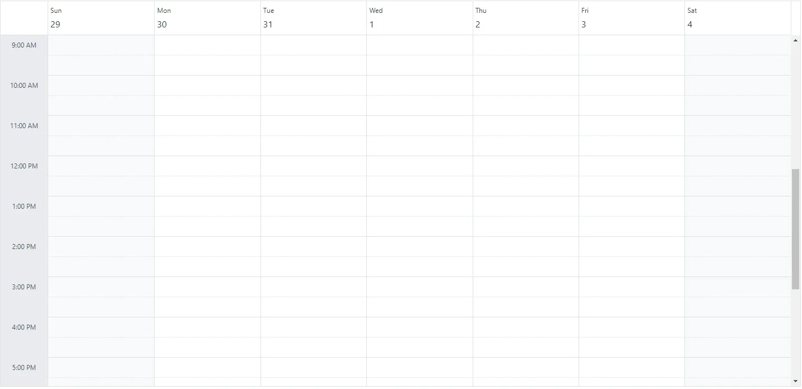
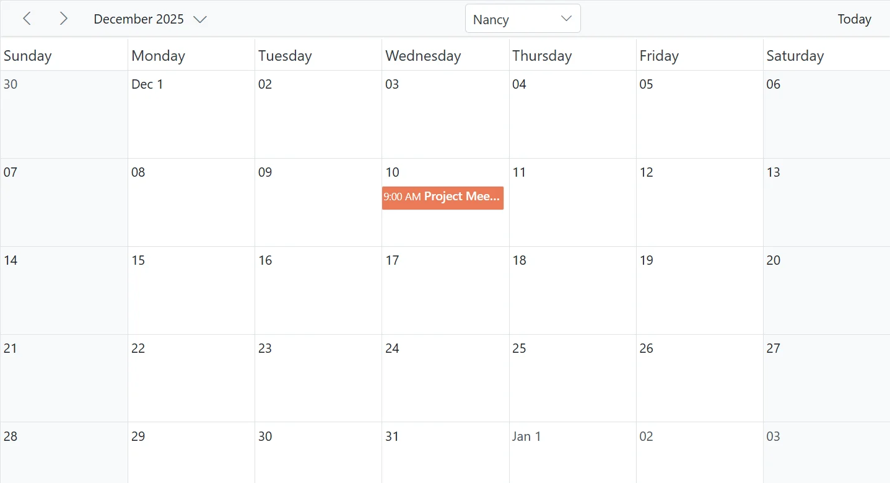
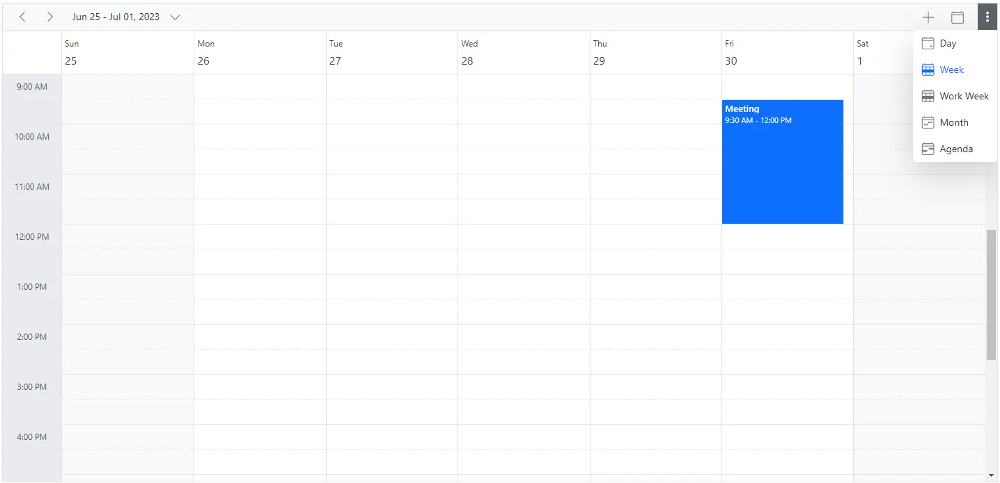
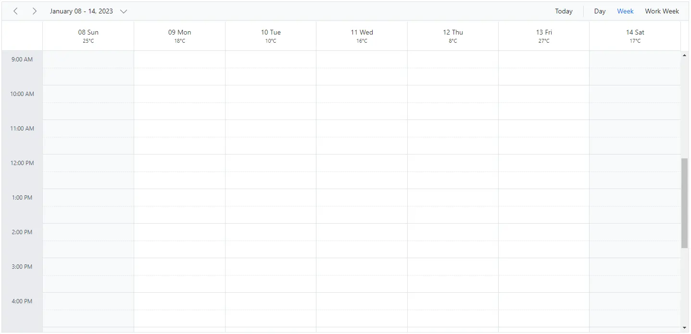

 
# Header Customization in Blazor Scheduler

The Scheduler header can be customized with the built-in options.

## Show or Hide header bar

By default, the header bar holds the date and view navigation options, which let users switch between dates and views. You can hide the header bar by setting the [`ShowHeaderBar`](https://help.syncfusion.com/cr/blazor/Syncfusion.Blazor.Schedule.SfSchedule-1.html#Syncfusion_Blazor_Schedule_SfSchedule_1_ShowHeaderBar) property to `false`. Its default value is `true`.

```cshtml
@using Syncfusion.Blazor.Schedule

<SfSchedule TValue="AppointmentData" ShowHeaderBar="false" Height="550px" @bind-SelectedDate="@CurrentDate">
    <ScheduleViews>
        <ScheduleView Option="View.Day"></ScheduleView>
        <ScheduleView Option="View.Week"></ScheduleView>
        <ScheduleView Option="View.WorkWeek"></ScheduleView>
        <ScheduleView Option="View.Month"></ScheduleView>
        <ScheduleView Option="View.Agenda"></ScheduleView>
    </ScheduleViews>
</SfSchedule>

@code{
    DateTime CurrentDate = new DateTime(2023, 1, 31);
    public class AppointmentData
    {
        public int Id { get; set; }
        public string Subject { get; set; }
        public string Location { get; set; }
        public DateTime StartTime { get; set; }
        public DateTime EndTime { get; set; }
        public string Description { get; set; }
        public bool IsAllDay { get; set; }
        public string RecurrenceRule { get; set; }
        public string RecurrenceException { get; set; }
        public Nullable<int> RecurrenceID { get; set; }
    }
}
```



## Toolbar customization

[Blazor Scheduler](https://www.syncfusion.com/scheduler-sdk/blazor-scheduler) supports toolbar customization to match your application's navigation and filtering requirements. By using the `ScheduleToolBar` component and its child items, you can:

- Integrate built-in navigation controls (Previous, Next, Today, Views).
- Embed custom elements, such as dropdowns and buttons.
- Rearrange, add, or remove toolbar items to streamline user workflows.
- Apply adaptive spacing or separators for a responsive layout.

Use these options to deliver an intuitive and branded scheduling experience.

### Built-in toolbar items

The Scheduler provides the following built-in toolbar components:

| Item                  | Description                                                                                     |
| --------------------- | ----------------------------------------------------------------------------------------------- |
| `ScheduleToolBarPrevious`  | Navigates to the previous date range.                                                           |
| `ScheduleToolBarNext`        | Navigates to the next date range.                                                               |
| `ScheduleToolBarDateRange`   | Displays the current visible date range.                                                        |
| `ScheduleToolBarToday`       | Navigates to today's date.                                                                      |
| `ScheduleToolBarViews` | Renders view-switching buttons for any user-configured views. However, if only a single view is configured, the view-switching buttons will not be rendered. If no views are explicitly configured, the Scheduler renders its default set of built-in views. |
| `ScheduleToolBarNewEvent`    | Renders an "Add" button for creating new appointments. This is visible when `EnableAdaptiveUI` is `true` on desktop or when the Scheduler is rendered on mobile devices. |

### Custom toolbar item

For more advanced scenarios, the `ScheduleToolBarCustom` component lets you add custom content to the toolbar. It supports different item types through the `Type` property.

| Type                | Description                                                                           |
| ------------------- | ------------------------------------------------------------------------------------- |
| `ItemType.Button`   | (Default) Renders custom content as a button-style item for clickable actions.        |
| `ItemType.Input`    | Used to embed input controls, such as a `SfDropDownList` or `SfTextBox`, into the toolbar.    |
| `ItemType.Spacer`   | Adds an adaptive space that pushes subsequent items, creating horizontal separation. |
| `ItemType.Separator`| Adds a vertical divider line to visually separate groups of toolbar items.            |

N> When adding input elements such as dropdowns or textboxes within `ScheduleToolBarCustom`, set the `Type` property to `ItemType.Input` to ensure proper rendering and interaction behavior.

### Configuring custom toolbar

This example creates a custom toolbar that enhances navigation and adds resource-based filtering in the Blazor Scheduler. The toolbar includes built-in navigation controls (previous, next, date range, and today) along with a custom dropdown for selecting a resource. When the dropdown value changes, the `OnOwnerChange` event updates the `EventQuery` filter, which is bound to both the `ScheduleResource` and the `ScheduleEventSettings`. This binding ensures that the Scheduler displays appointments only for the selected resource.

```cshtml
@using Syncfusion.Blazor.Schedule
@using Syncfusion.Blazor.Navigations
@using Syncfusion.Blazor.DropDowns
@using Syncfusion.Blazor.Data

<SfSchedule TValue="AppointmentData" Height="550px" @bind-SelectedDate="@CurrentDate">
    <ScheduleEventSettings Query="@EventQuery" DataSource="@DataSource"></ScheduleEventSettings>
    <ScheduleResources>
        <ScheduleResource TItem="OwnerData" TValue="int[]" Field="OwnerId" Title="Owner" Name="Owners" AllowMultiple="true"
                          DataSource="@OwnerCollections" TextField="OwnerText" IdField="OwnerId" ColorField="Color" Query="@EventQuery">
        </ScheduleResource>
    </ScheduleResources>
    <ScheduleToolBar>
        <ScheduleToolBarPrevious />
        <ScheduleToolBarNext />
        <ScheduleToolBarDateRange />
        <ScheduleToolBarCustom Type="ItemType.Spacer" />
        <ScheduleToolBarCustom Type="ItemType.Input">
            <SfDropDownList TValue="int" TItem="OwnerData" @bind-Value="@SelectedOwner" ShowClearButton="false" Width="125px" DataSource="@OwnerCollections">
                <DropDownListFieldSettings Text="OwnerText" Value="OwnerId"></DropDownListFieldSettings>
                <DropDownListEvents TValue="int" TItem="OwnerData" ValueChange="OnOwnerChange"></DropDownListEvents>
            </SfDropDownList>
        </ScheduleToolBarCustom>
        <ScheduleToolBarCustom Type="ItemType.Spacer" />
        <ScheduleToolBarToday />
    </ScheduleToolBar>
    <ScheduleViews>
        <ScheduleView Option="View.Month"></ScheduleView>
    </ScheduleViews>
</SfSchedule>

@code {
    private DateTime CurrentDate = new DateTime(2025, 12, 10);
    private Query? EventQuery { get; set; }
    private List<OwnerData> OwnerCollections = new List<OwnerData>();
    private List<AppointmentData> DataSource = new List<AppointmentData>();
    private int SelectedOwner = 1;

    protected override void OnInitialized()
    {
        OwnerCollections = new List<OwnerData>
        {
            new OwnerData { OwnerId = 1, OwnerText = "Nancy", Color = "#ea7a57" },
            new OwnerData { OwnerId = 2, OwnerText = "Steven", Color = "#7fa900" },
            new OwnerData { OwnerId = 3, OwnerText = "Michael", Color = "#5978ee" }
        };
        InitializeAppointments();
        EventQuery = new Query().Where("OwnerId", "equal", SelectedOwner);
    }

    private void InitializeAppointments()
    {
        DataSource = new List<AppointmentData>
        {
            new AppointmentData
            {
                Id = 1,
                Subject = "Project Meeting",
                StartTime = new DateTime(2025, 12, 10, 9, 0, 0),
                EndTime = new DateTime(2025, 12, 10, 10, 0, 0),
                OwnerId = 1,
                Description = "Project discussion with Nancy"
            },
            new AppointmentData
            {
                Id = 2,
                Subject = "Design Discussion",
                StartTime = new DateTime(2025, 12, 10, 10, 0, 0),
                EndTime = new DateTime(2025, 12, 10, 11, 00, 0),
                OwnerId = 2,
                Description = "Design review with Steven"
            },
            new AppointmentData
            {
                Id = 3,
                Subject = "Budget Meeting",
                StartTime = new DateTime(2025, 12, 10, 11, 0, 0),
                EndTime = new DateTime(2025, 12, 10, 12, 0, 0),
                OwnerId = 3,
                Description = "Budget discussion with Michael"
            }
        };
    }

    private void OnOwnerChange(ChangeEventArgs<int, OwnerData> args)
    {
        SelectedOwner = args.Value;
        EventQuery = new Query().Where("OwnerId", "equal", SelectedOwner);
    }

    public class OwnerData
    {
        public int OwnerId { get; set; }
        public string? OwnerText { get; set; }
        public string? Color { get; set; }
    }

    public class AppointmentData
    {
        public int Id { get; set; }
        public string? Subject { get; set; }
        public DateTime StartTime { get; set; }
        public DateTime EndTime { get; set; }
        public string? Description { get; set; }
        public int OwnerId { get; set; }
        public bool IsAllDay { get; set; }
        public string? RecurrenceRule { get; set; }
        public string? RecurrenceException { get; set; }
        public Nullable<int> RecurrenceID { get; set; }
    }
}
```



## How to display the view options within the header bar popup

By default, the header bar holds the view navigation options, which let users switch between views. You can move these view options to the header bar popup by setting the [`EnableAdaptiveUI`](https://help.syncfusion.com/cr/blazor/Syncfusion.Blazor.Schedule.SfSchedule-1.html#Syncfusion_Blazor_Schedule_SfSchedule_1_EnableAdaptiveUI) property to `true`.

```cshtml
@using Syncfusion.Blazor.Schedule

<SfSchedule TValue="AppointmentData" EnableAdaptiveUI="true" Height="550px" @bind-SelectedDate="@CurrentDate">
 <ScheduleEventSettings DataSource="@DataSource"></ScheduleEventSettings>
    <ScheduleViews>
        <ScheduleView Option="View.Day"></ScheduleView>
        <ScheduleView Option="View.Week"></ScheduleView>
        <ScheduleView Option="View.WorkWeek"></ScheduleView>
        <ScheduleView Option="View.Month"></ScheduleView>
        <ScheduleView Option="View.Agenda"></ScheduleView>
    </ScheduleViews>
</SfSchedule>

@code{
    DateTime CurrentDate = new DateTime(2023, 6, 30);
     List<AppointmentData> DataSource = new List<AppointmentData>
    {
        new AppointmentData { Id = 1, Subject = "Meeting", StartTime = new DateTime(2023, 6, 30, 9, 30, 0) , EndTime = new DateTime(2023, 6, 30, 12, 0, 0) }
    };
    public class AppointmentData
    {
        public int Id { get; set; }
        public string Subject { get; set; }
        public string Location { get; set; }
        public DateTime StartTime { get; set; }
        public DateTime EndTime { get; set; }
        public string Description { get; set; }
        public bool IsAllDay { get; set; }
        public string RecurrenceRule { get; set; }
        public string RecurrenceException { get; set; }
        public Nullable<int> RecurrenceID { get; set; }
    }
}
```

The Scheduler with view options within the header bar popup will be rendered as shown in the following image.



N> Refer [here](./resources#adaptive-ui-in-desktop) to learn more about adaptive UI in the resources scheduler.

## Date header customization

The cells that display the date text in Scheduler views are called date header cells. You can customize them by using [`DateHeaderTemplate`](https://help.syncfusion.com/cr/blazor/Syncfusion.Blazor.Schedule.ScheduleTemplates.html#Syncfusion_Blazor_Schedule_ScheduleTemplates_DateRangeTemplate). This option is used to customize the date header cells in day, week, and work-week views.

```cshtml
@using Syncfusion.Blazor.Schedule
@using System.Globalization

<SfSchedule TValue="AppointmentData" Width="100%" CssClass="schedule-date-header-template" Height="650px" @bind-SelectedDate="@CurrentDate">
    <ScheduleTemplates>
        <DateHeaderTemplate>
            <div class="date-text">@(getDateHeaderText((context as TemplateContext).Date))</div>
            @{
                @switch ((int)(context as TemplateContext).Date.DayOfWeek)
                {
                    case 0:
                        <div class="weather-text">25&deg;C</div>
                        break;
                    case 1:
                        <div class="weather-text">18&deg;C</div>
                        break;
                    case 2:
                        <div class="weather-text">10&deg;C</div>
                        break;
                    case 3:
                        <div class="weather-text">16&deg;C</div>
                        break;
                    case 4:
                        <div class="weather-text">8&deg;C</div>
                        break;
                    case 5:
                        <div class="weather-text">27&deg;C</div>
                        break;
                    case 6:
                        <div class="weather-text">17&deg;C</div>
                        break;
                }
            }
        </DateHeaderTemplate>
    </ScheduleTemplates>
    <ScheduleViews>
        <ScheduleView Option="View.Day"></ScheduleView>
        <ScheduleView Option="View.Week"></ScheduleView>
        <ScheduleView Option="View.WorkWeek"></ScheduleView>
    </ScheduleViews>
</SfSchedule>

@code {
    DateTime CurrentDate = new DateTime(2023, 1, 10);
    public static string getDateHeaderText(DateTime date)
    {
        return date.ToString("dd ddd", CultureInfo.CurrentCulture);
    }
    public class AppointmentData
    {
        public int Id { get; set; }
        public string Subject { get; set; }
        public string Location { get; set; }
        public DateTime StartTime { get; set; }
        public DateTime EndTime { get; set; }
        public string Description { get; set; }
        public bool IsAllDay { get; set; }
        public string RecurrenceRule { get; set; }
        public string RecurrenceException { get; set; }
        public Nullable<int> RecurrenceID { get; set; }
    }
}
<style>
    .schedule-date-header-template.e-schedule .e-vertical-view .e-header-cells {
        padding: 0;
        text-align: center !important;
    }

    .schedule-date-header-template.e-schedule .date-text {
        font-size: 14px;
    }

    .schedule-date-header-template.e-schedule.e-device .date-text {
        font-size: 12px;
    }

    .schedule-date-header-template.e-schedule .weather-image {
        width: 20px;
        height: 20px;
        background-position: center center;
        background-repeat: no-repeat;
        background-size: cover;
    }

    .schedule-date-header-template.e-schedule .weather-text {
        font-size: 11px;
    }
</style>
```



### Customization using `OnRenderCell` event

You can also customize the date header by using the [`OnRenderCell`](https://help.syncfusion.com/cr/blazor/Syncfusion.Blazor.Schedule.ScheduleEvents-1.html#Syncfusion_Blazor_Schedule_ScheduleEvents_1_OnRenderCell) event. In `RenderCellEventArgs`, the `ElementType` value is `DateHeader` when the date header is rendered.

```cshtml
@using Syncfusion.Blazor.Schedule

<SfSchedule TValue="AppointmentData" Width="100%" Height="550px" @bind-SelectedDate="@CurrentDate">
    <ScheduleEvents TValue="AppointmentData" OnRenderCell="OnRenderCell"></ScheduleEvents>
    <ScheduleEventSettings DataSource="@DataSource"></ScheduleEventSettings>
    <ScheduleViews>
        <ScheduleView Option="View.Day"></ScheduleView>
        <ScheduleView Option="View.Week"></ScheduleView>
        <ScheduleView Option="View.WorkWeek"></ScheduleView>
        <ScheduleView Option="View.Month"></ScheduleView>
        <ScheduleView Option="View.Agenda"></ScheduleView>
    </ScheduleViews>
</SfSchedule>
<style>
    .e-schedule .e-vertical-view .e-date-header-wrap table tbody td.e-header-cells {
        background-color: ivory;
    }
</style>

@code{
    private DateTime CurrentDate = new DateTime(2020, 3, 10);
    public string[] CustomClass = { "custom-class" };
    public void OnRenderCell(RenderCellEventArgs args)
    {
        //Here you can customize with your code
        if (args.ElementType == ElementType.DateHeader)
        {
            args.CssClasses = new List<string>(CustomClass);
        }
    }
    List<AppointmentData> DataSource = new List<AppointmentData>
    {
        new AppointmentData { Id = 1, Subject = "Meeting", StartTime = new DateTime(2020, 3, 10, 9, 30, 0) , EndTime = new DateTime(2020, 3, 10, 12, 0, 0) }
    };
    public class AppointmentData
    {
        public int Id { get; set; }
        public string Subject { get; set; }
        public string Location { get; set; }
        public DateTime StartTime { get; set; }
        public DateTime EndTime { get; set; }
        public string Description { get; set; }
        public bool IsAllDay { get; set; }
        public string RecurrenceRule { get; set; }
        public string RecurrenceException { get; set; }
        public Nullable<int> RecurrenceID { get; set; }
    }
}
```

## Customizing the date range text

The [`dateRangeTemplate`](https://help.syncfusion.com/cr/blazor/Syncfusion.Blazor.Schedule.ScheduleTemplates.html#Syncfusion_Blazor_Schedule_ScheduleTemplates_DateRangeTemplate) option lets you customize the date range text displayed in the Scheduler. By default, the text is based on the current view, but you can override it with your own content.

The [`dateRangeTemplate`](https://help.syncfusion.com/cr/blazor/Syncfusion.Blazor.Schedule.ScheduleTemplates.html#Syncfusion_Blazor_Schedule_ScheduleTemplates_DateRangeTemplate) property includes `startDate`, `endDate`, and `currentView` options.

```cshtml
@using Syncfusion.Blazor.Schedule
@using System.Globalization

<SfSchedule TValue="AppointmentData" Width="100%" Height="650px" @bind-SelectedDate="@CurrentDate">
    <ScheduleTemplates>
        <DateRangeTemplate>
            @((context as DateRangeTemplateContext).StartDate.ToString("dd MMMM yyyy", CultureInfo.CurrentCulture)) - @((context as DateRangeTemplateContext).EndDate.ToString("dd MMMM yyyy", CultureInfo.CurrentCulture))
        </DateRangeTemplate>
    </ScheduleTemplates>
    <ScheduleViews>
        <ScheduleView Option="View.Day"></ScheduleView>
        <ScheduleView Option="View.Week"></ScheduleView>
        <ScheduleView Option="View.WorkWeek"></ScheduleView>
    </ScheduleViews>
</SfSchedule>

@code {
    DateTime CurrentDate = new DateTime(2023, 1, 10);
    
    public class AppointmentData
    {
        public int Id { get; set; }
        public string Subject { get; set; }
        public string Location { get; set; }
        public DateTime StartTime { get; set; }
        public DateTime EndTime { get; set; }
        public string Description { get; set; }
        public bool IsAllDay { get; set; }
        public string RecurrenceRule { get; set; }
        public string RecurrenceException { get; set; }
        public Nullable<int> RecurrenceID { get; set; }
    }
}
```

## TimelineYear header customization

The day header cells and month header cells can be customized in the TimelineYear view by using [`DayHeaderTemplate`](https://help.syncfusion.com/cr/blazor/Syncfusion.Blazor.Schedule.ScheduleTemplates.html#Syncfusion_Blazor_Schedule_ScheduleTemplates_DayHeaderTemplate) and [`MonthHeaderTemplate`](https://help.syncfusion.com/cr/blazor/Syncfusion.Blazor.Schedule.ScheduleTemplates.html#Syncfusion_Blazor_Schedule_ScheduleTemplates_MonthHeaderTemplate). These templates customize the day and month header cells in both vertical and horizontal orientations.

```cshtml
@using Syncfusion.Blazor.Schedule
@using System.Globalization

<div>
    <SfSchedule TValue="AppointmentData" Width="100%" Height="550px" @bind-SelectedDate="@CurrentDate">
        <ScheduleTemplates>
            <DayHeaderTemplate>
                <div>@(getDayHeaderText((context as TemplateContext).Date))
                </div>
            </DayHeaderTemplate>
            <MonthHeaderTemplate>
                <div>@(getMonthHeaderText((context as TemplateContext).Date))</div>
            </MonthHeaderTemplate>
        </ScheduleTemplates>
        <ScheduleViews>
            <ScheduleView Option="View.TimelineYear" MaxEventsPerRow="2" Orientation="Orientation.Vertical" DisplayName="Vertical Year">
            </ScheduleView>
            <ScheduleView Option="View.TimelineYear" MaxEventsPerRow="2" Orientation="Orientation.Horizontal" DisplayName="Horizontal Year">
            </ScheduleView>
        </ScheduleViews>
        <ScheduleEventSettings DataSource="@DataSource"></ScheduleEventSettings>
    </SfSchedule>
</div>


@code{
    private DateTime CurrentDate = new DateTime(2023, 3, 10);
    public static string getDayHeaderText(DateTime date)
    {
        return date.ToString("dddd", CultureInfo.InvariantCulture);
    }
    public static string getMonthHeaderText(DateTime date)
    {
        return date.ToString("MMM", CultureInfo.InvariantCulture);
    }
    List<AppointmentData> DataSource = new List<AppointmentData>
{
        new AppointmentData { Id = 1, Subject = "Meeting", StartTime = new DateTime(2023, 3, 4, 0, 0, 0) , EndTime = new DateTime(2023, 3, 5, 0, 0, 0) },
        new AppointmentData { Id = 2, Subject = "Conference", StartTime = new DateTime(2023, 5, 1, 9, 30, 0) , EndTime = new DateTime(2023, 5, 1, 12, 0, 0) },
        new AppointmentData { Id = 3, Subject = "Seminar", StartTime = new DateTime(2023, 1, 2, 9, 30, 0) , EndTime = new DateTime(2023, 1, 2, 12, 0, 0) }
    };
    public class AppointmentData
    {
        public int Id { get; set; }
        public string Subject { get; set; }
        public string Location { get; set; }
        public DateTime StartTime { get; set; }
        public DateTime EndTime { get; set; }
        public string Description { get; set; }
        public bool IsAllDay { get; set; }
        public string RecurrenceRule { get; set; }
        public string RecurrenceException { get; set; }
        public Nullable<int> RecurrenceID { get; set; }
    }
}
```

## Customizing header indent cells

You can customize the header indent cells by using the [`HeaderIndentTemplate`](https://help.syncfusion.com/cr/blazor/Syncfusion.Blazor.Schedule.ScheduleTemplates.html#Syncfusion_Blazor_Schedule_ScheduleTemplates_HeaderIndentTemplate) option. In vertical views, the header indent cells can be customized at the hierarchy level, and in timeline views, the resource header left indent cell can be customized using this template.

**Example:** To customize the header left indent cell to display resource text, refer to the code example below.

```cshtml
@using Syncfusion.Blazor.Schedule

<SfSchedule TValue="AppointmentData" Height="550px" @bind-SelectedDate="@CurrentDate">
    <ScheduleGroup Resources="@Resources"></ScheduleGroup>
    <ScheduleResources>
        <ScheduleResource TItem="ResourceData" TValue="int[]" DataSource="@OwnersData" Field="OwnerId" Title="Owner" Name="Owners" TextField="OwnerText" IdField="Id" GroupIDField="OwnerGroupId" ColorField="OwnerColor" AllowMultiple="true"></ScheduleResource>
    </ScheduleResources>
    <ScheduleEventSettings DataSource="@DataSource"></ScheduleEventSettings>
        <ScheduleTemplates>
            <HeaderIndentTemplate>
                <div class='e-resource-text'>
                    <div class="text">Resources</div>
                </div>
            </HeaderIndentTemplate>
        </ScheduleTemplates>
    <ScheduleViews>
        <ScheduleView Option="View.Day"></ScheduleView>
        <ScheduleView Option="View.Week"></ScheduleView>
        <ScheduleView Option="View.WorkWeek"></ScheduleView>
        <ScheduleView Option="View.TimelineWeek"></ScheduleView>
        <ScheduleView Option="View.TimelineMonth"></ScheduleView>
    </ScheduleViews>
</SfSchedule>

<style>
    .e-schedule .e-timeline-view .e-resource-left-td {
        vertical-align: bottom;
    }

    .e-schedule .e-timeline-view .e-resource-left-td .e-resource-text,
    .e-schedule .e-timeline-month-view .e-resource-left-td .e-resource-text {
        font-weight: 500;
        padding: 0;
    }

    .e-schedule .e-timeline-view .e-resource-left-td .e-resource-text > div {
        border-right: 1px solid rgba(0, 0, 0, 0.12);
        border-top: 1px solid rgba(0, 0, 0, 0.12);
        flex: 0 0 33.3%;
        font-weight: 500;
        height: 36px;
        line-height: 34px;
        padding-left: 50px;
    }

    .e-schedule .e-timeline-month-view .e-resource-left-td .e-resource-text > div {
        border-right: 1px solid rgba(0, 0, 0, 0.12);
        flex: 0 0 33.3%;
        font-weight: 500;
        height: 38px;
        line-height: 34px;
        padding-left: 50px;
    }

    .e-schedule .e-vertical-view .e-left-indent-wrap table tbody td.e-resource-cells {
        border-bottom-color: rgba(0, 0, 0, 0.12);
    }

    .e-schedule .e-vertical-view .e-left-indent-wrap table tbody td.e-resource-cells .e-resource-text {
        font-weight: 500;
    }

    .e-schedule .e-vertical-view .e-left-indent-wrap table tbody td.e-header-cells .e-resource-text,
    .e-schedule .e-vertical-view .e-left-indent-wrap table tbody td.e-all-day-cells .e-resource-text {
        display: none;
    }
    </style>

@code{
    DateTime CurrentDate = new DateTime(2023, 1, 31);
    public string[] Resources { get; set; } = { "Rooms", "Owners" };
    public List<ResourceData> RoomData { get; set; } = new List<ResourceData>
    {
        new ResourceData{ RoomText = "ROOM 1", Id = 1, RoomColor = "#cb6bb2" },
        new ResourceData{ RoomText = "ROOM 2", Id = 2, RoomColor = "#56ca85" }
    };
    public List<ResourceData> OwnersData { get; set; } = new List<ResourceData>
    {
        new ResourceData{ OwnerText = "Nancy", Id = 1, OwnerGroupId = 1, OwnerColor = "#ffaa00" },
        new ResourceData{ OwnerText = "Steven", Id = 2, OwnerGroupId = 2, OwnerColor = "#f8a398" },
        new ResourceData{ OwnerText = "Michael", Id = 3, OwnerGroupId = 1, OwnerColor = "#7499e1" }
    };
    List<AppointmentData> DataSource = new List<AppointmentData>
    {
        new AppointmentData { Id = 1, Subject = "Meeting", StartTime = new DateTime(2023, 1, 31, 9, 30, 0) , EndTime = new DateTime(2023, 1, 31, 11, 0, 0), OwnerId = 1, RoomId = 1 }
    };
    public class AppointmentData
    {
        public int Id { get; set; }
        public string Subject { get; set; }
        public string Location { get; set; }
        public DateTime StartTime { get; set; }
        public DateTime EndTime { get; set; }
        public string Description { get; set; }
        public bool IsAllDay { get; set; }
        public string RecurrenceRule { get; set; }
        public string RecurrenceException { get; set; }
        public Nullable<int> RecurrenceID { get; set; }
        public int OwnerId { get; set; }
        public int RoomId { get; set; }
    }
    public class ResourceData
    {
        public int Id { get; set; }
        public string RoomText { get; set; }
        public string RoomColor { get; set; }
        public string OwnerText { get; set; }
        public string OwnerColor { get; set; }
        public int OwnerGroupId { get; set; }
    }
}
```
