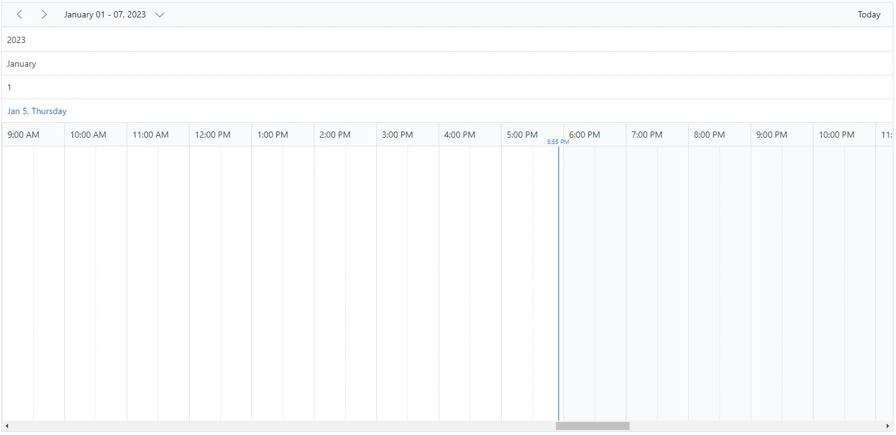
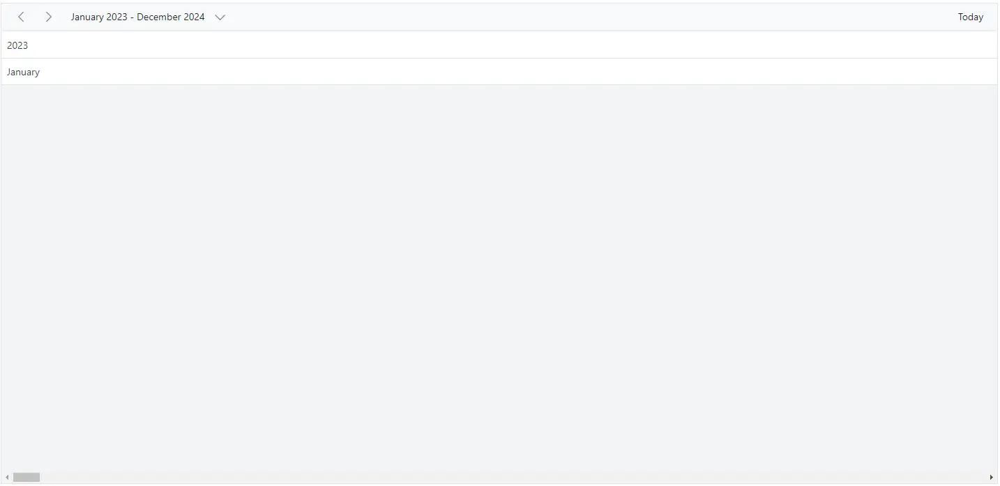
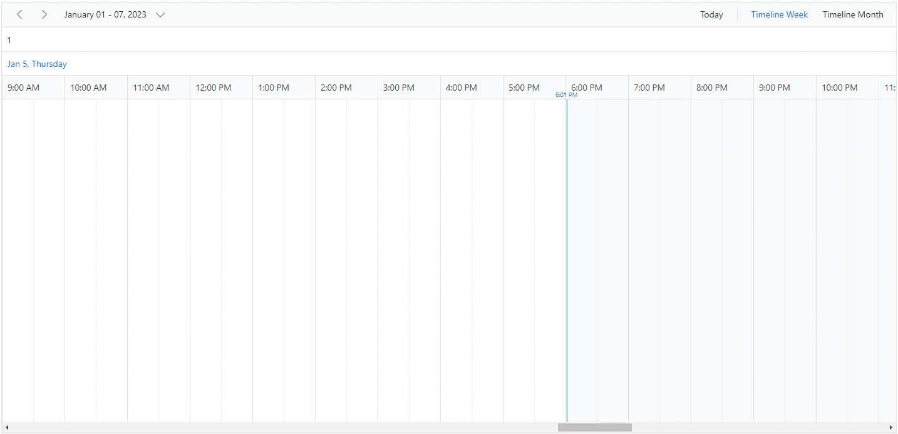
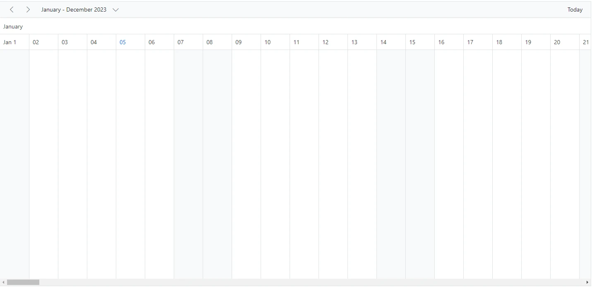
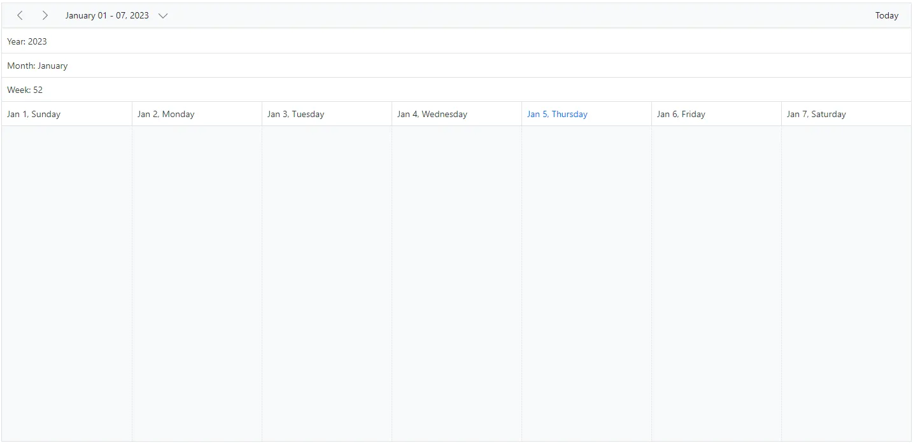

# Timeline Header Rows in Blazor Scheduler

Timeline views can include additional header rows beyond the default date and time rows. You can show year, month, week, date, and hour rows separately by using the [`ScheduleHeaderRow`](https://help.syncfusion.com/cr/blazor/Syncfusion.Blazor.Schedule.ScheduleHeaderRows.html) component, which applies only to timeline views. The available rows are:

* `Year`
* `Month`
* `Week`
* `Date`
* `Hour`

To get started quickly with timeline header row customization in Scheduler, watch this video:



N> The `Hour` row is not applicable to Timeline month view.

```cshtml
@using Syncfusion.Blazor.Schedule

<SfSchedule TValue="AppointmentData" Height="650px">
    <ScheduleHeaderRows>
        <ScheduleHeaderRow Option="HeaderRowType.Year"></ScheduleHeaderRow>
        <ScheduleHeaderRow Option="HeaderRowType.Month"></ScheduleHeaderRow>
        <ScheduleHeaderRow Option="HeaderRowType.Week"></ScheduleHeaderRow>
        <ScheduleHeaderRow Option="HeaderRowType.Date"></ScheduleHeaderRow>
        <ScheduleHeaderRow Option="HeaderRowType.Hour"></ScheduleHeaderRow>
    </ScheduleHeaderRows>
    <ScheduleViews>
        <ScheduleView Option="View.TimelineWeek" MaxEventsPerRow="10"></ScheduleView>
    </ScheduleViews>
</SfSchedule>

@code{
    public class AppointmentData
    {
        public int Id { get; set; }
        public string Subject { get; set; }
        public string Location { get; set; }
        public DateTime StartTime { get; set; }
        public DateTime EndTime { get; set; }
        public string Description { get; set; }
        public bool IsAllDay { get; set; }
        public string RecurrenceRule { get; set; }
        public string RecurrenceException { get; set; }
        public Nullable<int> RecurrenceID { get; set; }
    }
}
```



## Display year and month rows in timeline views

To display the timeline Scheduler with only year and month names, define the `Year` and `Month` options within the [`ScheduleHeaderRow`](https://help.syncfusion.com/cr/blazor/Syncfusion.Blazor.Schedule.ScheduleHeaderRows.html) property.

```cshtml
@using Syncfusion.Blazor.Schedule

<SfSchedule TValue="AppointmentData" Height="650px">
    <ScheduleHeaderRows>
        <ScheduleHeaderRow Option="HeaderRowType.Year"></ScheduleHeaderRow>
        <ScheduleHeaderRow Option="HeaderRowType.Month"></ScheduleHeaderRow>
    </ScheduleHeaderRows>
    <ScheduleViews>
        <ScheduleView Option="View.TimelineMonth" MaxEventsPerRow="10" Interval="24"></ScheduleView>
    </ScheduleViews>
</SfSchedule>
@code{
    public class AppointmentData
    {
        public int Id { get; set; }
        public string Subject { get; set; }
        public string Location { get; set; }
        public DateTime StartTime { get; set; }
        public DateTime EndTime { get; set; }
        public string Description { get; set; }
        public bool IsAllDay { get; set; }
        public string RecurrenceRule { get; set; }
        public string RecurrenceException { get; set; }
        public Nullable<int> RecurrenceID { get; set; }
    }
}
```



## Display week numbers in timeline views

You can display the week number in a separate header row of the timeline Scheduler by setting the `Week` option within the [`ScheduleHeaderRow`](https://help.syncfusion.com/cr/blazor/Syncfusion.Blazor.Schedule.ScheduleHeaderRows.html) property.

```cshtml
@using Syncfusion.Blazor.Schedule

<SfSchedule TValue="AppointmentData" Height="650px">
    <ScheduleHeaderRows>
        <ScheduleHeaderRow Option="HeaderRowType.Week"></ScheduleHeaderRow>
        <ScheduleHeaderRow Option="HeaderRowType.Date"></ScheduleHeaderRow>
        <ScheduleHeaderRow Option="HeaderRowType.Hour"></ScheduleHeaderRow>
    </ScheduleHeaderRows>
    <ScheduleViews>
        <ScheduleView Option="View.TimelineWeek" MaxEventsPerRow="10"></ScheduleView>
        <ScheduleView Option="View.TimelineMonth" MaxEventsPerRow="10"></ScheduleView>
    </ScheduleViews>
</SfSchedule>
@code{
    public class AppointmentData
    {
        public int Id { get; set; }
        public string Subject { get; set; }
        public string Location { get; set; }
        public DateTime StartTime { get; set; }
        public DateTime EndTime { get; set; }
        public string Description { get; set; }
        public bool IsAllDay { get; set; }
        public string RecurrenceRule { get; set; }
        public string RecurrenceException { get; set; }
        public Nullable<int> RecurrenceID { get; set; }
    }
}
```



## Timeline view displaying dates of a complete year

You can display a complete year in a timeline view by setting the `Interval` value to 12 and defining the **TimelineMonth** view option within the [`ScheduleView`](https://help.syncfusion.com/cr/blazor/Syncfusion.Blazor.Schedule.ScheduleViews.html) tag helper.

```cshtml
@using Syncfusion.Blazor.Schedule

<SfSchedule TValue="AppointmentData" Height="650px">
    <ScheduleHeaderRows>
        <ScheduleHeaderRow Option="HeaderRowType.Month"></ScheduleHeaderRow>
        <ScheduleHeaderRow Option="HeaderRowType.Date"></ScheduleHeaderRow>
    </ScheduleHeaderRows>
    <ScheduleViews>
        <ScheduleView Option="View.TimelineMonth" MaxEventsPerRow="10" Interval="12"></ScheduleView>
    </ScheduleViews>
</SfSchedule>
@code{
    public class AppointmentData
    {
        public int Id { get; set; }
        public string Subject { get; set; }
        public string Location { get; set; }
        public DateTime StartTime { get; set; }
        public DateTime EndTime { get; set; }
        public string Description { get; set; }
        public bool IsAllDay { get; set; }
        public string RecurrenceRule { get; set; }
        public string RecurrenceException { get; set; }
        public Nullable<int> RecurrenceID { get; set; }
    }
}
```



## Customizing the header rows using template

You can customize the header row text and display images or formatted text in each row by using the built-in [`Template`](https://help.syncfusion.com/cr/blazor/Syncfusion.Blazor.Schedule.ScheduleHeaderRow.html#Syncfusion_Blazor_Schedule_ScheduleHeaderRow_Template) option available within the [`ScheduleHeaderRow`](https://help.syncfusion.com/cr/blazor/Syncfusion.Blazor.Schedule.ScheduleHeaderRow.html) component.

```cshtml
@using Syncfusion.Blazor.Schedule
@using System.Globalization
<p>Timeline header rows</p>
<SfSchedule TValue="AppointmentData" Height="650px">
    <ScheduleHeaderRows>
        <ScheduleHeaderRow Option="HeaderRowType.Year">
            <Template>
                <div class="date-text">Year: @(getYearText((context as TemplateContext).Date))</div>
            </Template>
        </ScheduleHeaderRow>
        <ScheduleHeaderRow Option="HeaderRowType.Month">
            <Template>
                <div class="date-text">Month: @(getMonthText((context as TemplateContext).Date))</div>
            </Template>
        </ScheduleHeaderRow>
        <ScheduleHeaderRow Option="HeaderRowType.Week">
            <Template>
                <div class="date-text">Week: @(getWeekText((context as TemplateContext).Date))</div>
            </Template>
        </ScheduleHeaderRow>
        <ScheduleHeaderRow Option="HeaderRowType.Date"></ScheduleHeaderRow>
    </ScheduleHeaderRows>
    <ScheduleViews>
        <ScheduleView Option="View.TimelineWeek" MaxEventsPerRow="10"></ScheduleView>
    </ScheduleViews>
</SfSchedule>
@code{
    public class AppointmentData
    {
        public int Id { get; set; }
        public string Subject { get; set; }
        public string Location { get; set; }
        public DateTime StartTime { get; set; }
        public DateTime EndTime { get; set; }
        public string Description { get; set; }
        public bool IsAllDay { get; set; }
        public string RecurrenceRule { get; set; }
        public string RecurrenceException { get; set; }
        public Nullable<int> RecurrenceID { get; set; }
    }
    public static string getYearText(DateTime date)
    {
        return date.ToString("yyyy", CultureInfo.InvariantCulture);
    }
    public static string getMonthText(DateTime date)
    {
        return date.ToString("MMMM", CultureInfo.InvariantCulture);
    }
    public static string getWeekText(DateTime date)
    {
        return CultureInfo.InvariantCulture.Calendar.GetWeekOfYear(date, CalendarWeekRule.FirstFourDayWeek, DayOfWeek.Monday).ToString();
    }
}
```

