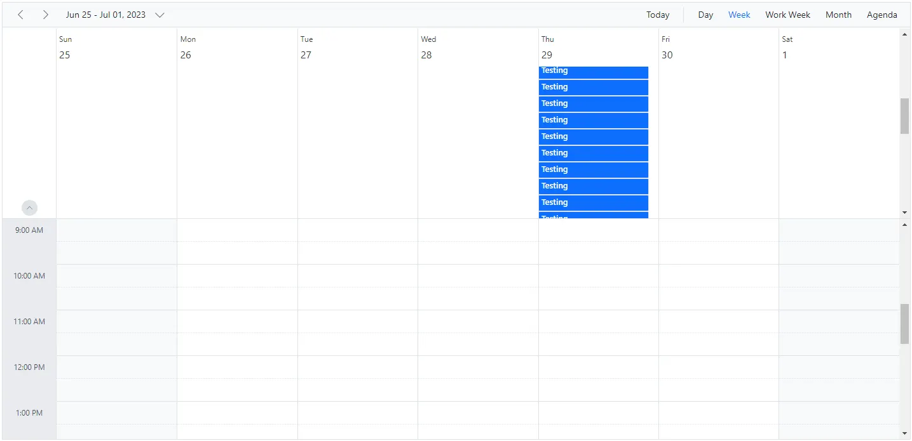

# Enable Scroll Option on All-Day Section in Blazor Scheduler

When there are a large number of appointments in the all-day row, it becomes difficult to view them properly. In that case, you can enable the scroller option for the all-day row by setting `EnableAllDayScroll` to `true`. Its default value is `false`. When this property is set to `true`, an individual scroller for the all-day row is enabled when the row reaches its maximum height after expanding.

N> This property is not applicable when Scheduler height is set to `auto`.

```cshtml
@using Syncfusion.Blazor.Schedule

<SfSchedule TValue="AppointmentData" Height="550px" EnableAllDayScroll="true" @bind-SelectedDate="@CurrentDate">
    <ScheduleEventSettings DataSource="@generateObject()"></ScheduleEventSettings>
    <ScheduleViews>
        <ScheduleView Option="View.Day"></ScheduleView>
        <ScheduleView Option="View.Week"></ScheduleView>
        <ScheduleView Option="View.WorkWeek"></ScheduleView>
        <ScheduleView Option="View.Month"></ScheduleView>
        <ScheduleView Option="View.Agenda"></ScheduleView>
    </ScheduleViews>
</SfSchedule>
@code{
    SfSchedule<ScheduleData.RoomData> ScheduleObj;
    private View CurrentView = View.Week;
    public DateTime CurrentDate = new DateTime(2023, 6, 29);
    public List<AppointmentData> generateObject()
    {
        List<AppointmentData> appData = new List<AppointmentData>(25);
        for (int a = 0; a <= 25; a++)
        {
            appData.Add(new AppointmentData
            {
                Id = a + 1,
                Subject = "Testing",
                StartTime = new DateTime(2023, 6, 29, 0, 0, 0),
                EndTime = new DateTime(2023, 6, 30, 0, 0, 0),
                IsAllDay = true
            });
        }
        return appData;
    }

    public class AppointmentData
    {
        public int Id { get; set; }
        public string Subject { get; set; }
        public string Location { get; set; }
        public DateTime StartTime { get; set; }
        public DateTime EndTime { get; set; }
        public string Description { get; set; }
        public bool IsAllDay { get; set; }
        public string RecurrenceRule { get; set; }
        public string RecurrenceException { get; set; }
        public Nullable<int> RecurrenceID { get; set; }
    }
}
```

