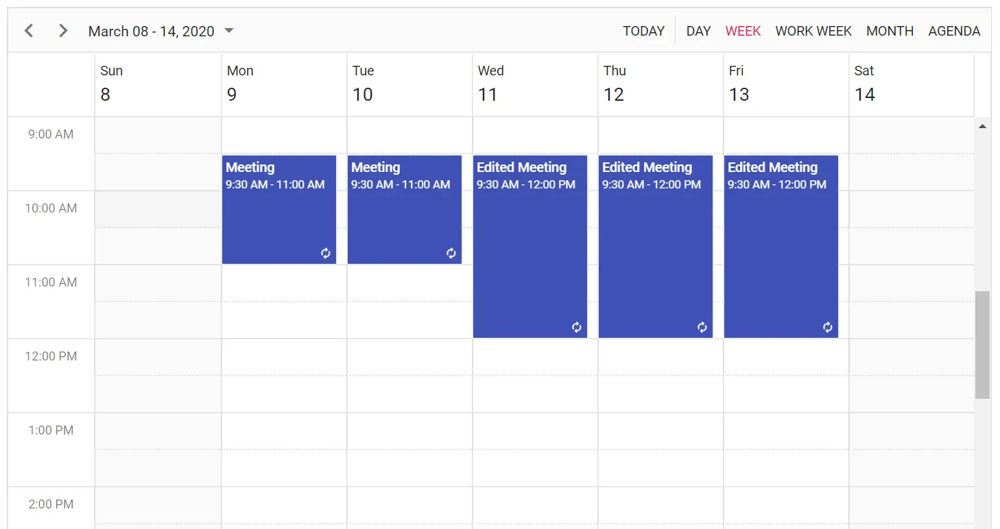

# Recurring Events in Blazor Scheduler

Recurring events represent appointments that occur repeatedly at a fixed interval on a daily, weekly, monthly, or yearly basis, based on the provided recurrence rule. Recurring events are usually indicated by a repeat marker in the bottom-right corner.

N> Set the [`RecurrenceRule`](https://help.syncfusion.com/cr/blazor/Syncfusion.Blazor.Schedule.FieldRecurrenceRule.html) property to create recurring events.

## Recurrence options and rules

Events can be repeated on a daily, weekly, monthly, or yearly basis by using a recurrence rule string. The following details should be assigned to the [`RecurrenceRule`](https://help.syncfusion.com/cr/blazor/Syncfusion.Blazor.Schedule.FieldRecurrenceRule.html) property to generate recurring instances.

* Repeat type - daily/weekly/monthly/yearly.
* How many times it needs to be repeated?
* The interval duration.
* The time period to render the appointment, etc.

There are four repeat types available:

* **Daily** - Creates the recurring instances on daily basis.
* **Weekly** - Creates the recurring instances on weekly basis for the selected days.
* **Monthly** - Creates the recurring instances on monthly basis for the selected months and other provided recurrence criteria.
* **Yearly** - Creates the recurring instances on yearly basis.

## Recurrence properties

The following table shows the properties used to create recurrence appointments for the respective time period. The valid rule string can be referenced from the [iCalendar](https://datatracker.ietf.org/doc/html/rfc5545#section-3.3.10) specification.

N> Refer to the [iCalendar](https://datatracker.ietf.org/doc/html/rfc5545#section-3.3.10) specification for valid recurrence rule strings.

| Property | Purpose | Example |
|-------|---------| --------- |
| FREQ | Stores the repeat type value of the appointment, such as daily, weekly, monthly, or yearly. | FREQ=DAILY;INTERVAL=1|
| INTERVAL | Stores the interval value of the appointment. For example, a daily appointment with an interval of 2 is rendered every other day. | FREQ=DAILY;INTERVAL=2|
| COUNT | Stores the number of occurrences in the recurrence series. For example, a `COUNT` value of 10 creates 10 instances. | FREQ=DAILY;INTERVAL=1;COUNT=10|
| UNTIL | Stores the end date value in ISO format to indicate when recurrence ends. | FREQ=DAILY;INTERVAL=1;UNTIL=20200530T041343Z;|
| BYDAY | Stores the day values that determine when appointments are rendered. For weekly appointments, selected days such as Monday or Wednesday are saved as `MO` or `WE`. Multiple days are separated by commas. | FREQ=WEEKLY;INTERVAL=1;BYDAY=MO,WE;COUNT=10|
| BYMONTHDAY | Stores the day of the month for monthly recurring appointments. For example, `3` creates the appointment on the third day of every month. | FREQ=MONTHLY;BYMONTHDAY=3;INTERVAL=1;COUNT=10|
| BYMONTH | Stores the month value for yearly appointments. For example, `6` represents June. | FREQ=YEARLY;BYMONTHDAY=16;BYMONTH=6;INTERVAL=1;COUNT=10|
| BYSETPOS | Stores the index of the selected week. For example, `2` represents the second week of the month. | FREQ=MONTHLY;BYDAY=MO;BYSETPOS=2;COUNT=10|

N> Default recurrence validation is included for recurring appointments, similar to Outlook. The validation usually occurs during recurrence appointment creation, editing, drag and drop, resizing, or when a single occurrence changes.

## Creating a recurring event

The following example shows how to create a recurring event in Scheduler with a specific recurrence rule. In this example, the event repeats daily and ends after five occurrences.

```cshtml
@using Syncfusion.Blazor.Schedule

<SfSchedule TValue="AppointmentData" Height="550px" @bind-SelectedDate="@CurrentDate">
    <ScheduleEventSettings DataSource="@DataSource"></ScheduleEventSettings>
    <ScheduleViews>
        <ScheduleView Option="View.Day"></ScheduleView>
        <ScheduleView Option="View.Week"></ScheduleView>
        <ScheduleView Option="View.WorkWeek"></ScheduleView>
        <ScheduleView Option="View.Month"></ScheduleView>
        <ScheduleView Option="View.Agenda"></ScheduleView>
    </ScheduleViews>
</SfSchedule>

@code{
    DateTime CurrentDate = new DateTime(2020, 1, 9);
    List<AppointmentData> DataSource = new List<AppointmentData>
    {
        new AppointmentData { Id = 1, Subject = "Meeting", StartTime = new DateTime(2020, 1, 6, 9, 30, 0) , EndTime = new DateTime(2020, 1, 6, 11, 0, 0),
        RecurrenceRule = "FREQ=DAILY;INTERVAL=1;COUNT=5" }
    };
    public class AppointmentData
    {
        public int Id { get; set; }
        public string Subject { get; set; }
        public DateTime StartTime { get; set; }
        public DateTime EndTime { get; set; }
        public bool IsAllDay { get; set; }
        public string RecurrenceRule { get; set; }
        public Nullable<int> RecurrenceID { get; set; }
        public string RecurrenceException { get; set; }
    }
}
```

## Adding exceptions

A few instances of the recurrence series can be excluded on specific dates by adding those exception dates to the [`RecurrenceException`](https://help.syncfusion.com/cr/blazor/Syncfusion.Blazor.Schedule.FieldRecurrenceException.html) field. These date values should be given in ISO date-time format with no hyphens separating the date elements.

For example, 7 January 2020 can be represented as 20200107. The UTC time portion needs a `Z` suffix with no space. "09:30 AM" is therefore represented as "040000Z".

```cshtml
@using Syncfusion.Blazor.Schedule

<SfSchedule TValue="AppointmentData" Height="550px" @bind-SelectedDate="@CurrentDate">
    <ScheduleEventSettings DataSource="@DataSource"></ScheduleEventSettings>
    <ScheduleViews>
        <ScheduleView Option="View.Day"></ScheduleView>
        <ScheduleView Option="View.Week"></ScheduleView>
        <ScheduleView Option="View.WorkWeek"></ScheduleView>
        <ScheduleView Option="View.Month"></ScheduleView>
        <ScheduleView Option="View.Agenda"></ScheduleView>
    </ScheduleViews>
</SfSchedule>

@code{
    DateTime CurrentDate = new DateTime(2020, 1, 6);
    List<AppointmentData> DataSource = new List<AppointmentData>
    {
        new AppointmentData { Id = 1, Subject = "Meeting", StartTime = new DateTime(2020, 1, 6, 9, 30, 0) , EndTime = new DateTime(2020, 1, 6, 11, 0, 0),
        RecurrenceRule = "FREQ=DAILY;INTERVAL=1;COUNT=5", RecurrenceException = "20200107T040000Z,20200109T040000Z" }
    };
    public class AppointmentData
    {
        public int Id { get; set; }
        public string Subject { get; set; }
        public DateTime StartTime { get; set; }
        public DateTime EndTime { get; set; }
        public bool IsAllDay { get; set; }
        public string RecurrenceRule { get; set; }
        public string RecurrenceException { get; set; }
        public Nullable<int> RecurrenceID { get; set; }
    }
}
```

## Editing an occurrence from a series

To edit a specific occurrence from an event series and display it on the initial load of Scheduler, add the edited occurrence as a new event to the data source collection with an additional [`RecurrenceID`](https://help.syncfusion.com/cr/blazor/Syncfusion.Blazor.Schedule.FieldRecurrenceId.html) field. The [`RecurrenceID`](https://help.syncfusion.com/cr/blazor/Syncfusion.Blazor.Schedule.FieldRecurrenceId.html) field of the edited occurrence usually maps to the ID value of the parent event.

In this example, a recurring instance that appears on 30 January 2020 is edited with different timings. That date is excluded from the parent recurring event that repeats from 28 January 2020 to 1 February 2020. Add the [`RecurrenceException`](https://help.syncfusion.com/cr/blazor/Syncfusion.Blazor.Schedule.FieldRecurrenceException.html) field with the excluded date value on the parent event. The edited occurrence, created as a new event, should also carry the [`RecurrenceID`](https://help.syncfusion.com/cr/blazor/Syncfusion.Blazor.Schedule.FieldRecurrenceId.html) field pointing to the parent event's [`Id`](https://help.syncfusion.com/cr/blazor/Syncfusion.Blazor.Schedule.ScheduleField.html#Syncfusion_Blazor_Schedule_ScheduleField_Id) value.

```cshtml
@using Syncfusion.Blazor.Schedule

<SfSchedule TValue="AppointmentData" Height="550px" @bind-SelectedDate="@CurrentDate">
    <ScheduleEventSettings DataSource="@DataSource"></ScheduleEventSettings>
    <ScheduleViews>
        <ScheduleView Option="View.Day"></ScheduleView>
        <ScheduleView Option="View.Week"></ScheduleView>
        <ScheduleView Option="View.WorkWeek"></ScheduleView>
        <ScheduleView Option="View.Month"></ScheduleView>
        <ScheduleView Option="View.Agenda"></ScheduleView>
    </ScheduleViews>
</SfSchedule>

@code{
    DateTime CurrentDate = new DateTime(2020, 1, 31);
    List<AppointmentData> DataSource = new List<AppointmentData>
    {
        new AppointmentData { Id = 1, Subject = "Scrum Meeting", StartTime = new DateTime(2020, 1, 28, 9, 30, 0) , EndTime = new DateTime(2020, 1, 28, 11, 0, 0),
        RecurrenceRule = "FREQ=DAILY;INTERVAL=1;COUNT=5", RecurrenceException = "20200130T040000Z" },
        new AppointmentData { Id = 2, Subject = "Scrum Meeting Rescheduled", StartTime = new DateTime(2020, 1, 30, 10, 30, 0) , EndTime = new DateTime(2020, 1, 30, 12, 0, 0), RecurrenceID = 1 }
    };
    public class AppointmentData
    {
        public int Id { get; set; }
        public string Subject { get; set; }
        public DateTime StartTime { get; set; }
        public DateTime EndTime { get; set; }
        public bool IsAllDay { get; set; }
        public string RecurrenceRule { get; set; }
        public string RecurrenceException { get; set; }
        public Nullable<int> RecurrenceID { get; set; }
    }
}
```

## Edit/Delete following recurrence events

The Scheduler lets users edit following recurrence events by setting the [AllowEditFollowingEvents](https://help.syncfusion.com/cr/blazor/Syncfusion.Blazor.Schedule.ScheduleEventSettings-1.html#Syncfusion_Blazor_Schedule_ScheduleEventSettings_1_AllowEditFollowingEvents) property to `true` within the [`ScheduleEventSettings`](https://help.syncfusion.com/cr/blazor/Syncfusion.Blazor.Schedule.ScheduleEventSettings-1.html) tag. Once recurrence events are edited or deleted as following events, they are treated as a separate series and the changes do not affect the parent series. In the following code example, if any recurrence event is edited or deleted with the following events option, the change is applied to later recurrence events.

N> To edit or delete following recurrence events in the Scheduler, set [`AllowEditFollowingEvents`](https://help.syncfusion.com/cr/blazor/Syncfusion.Blazor.Schedule.ScheduleEventSettings-1.html#Syncfusion_Blazor_Schedule_ScheduleEventSettings_1_AllowEditFollowingEvents) to `true` in [`ScheduleEventSettings`](https://help.syncfusion.com/cr/blazor/Syncfusion.Blazor.Schedule.ScheduleEventSettings-1.html).

```cshtml
@using Syncfusion.Blazor.Schedule

<SfSchedule TValue="AppointmentData" Width="100%" Height="550px" @bind-SelectedDate="@CurrentDate">
    <ScheduleEventSettings DataSource="@DataSource" AllowEditFollowingEvents="true"></ScheduleEventSettings>
    <ScheduleViews>
        <ScheduleView Option="View.Day"></ScheduleView>
        <ScheduleView Option="View.Week"></ScheduleView>
        <ScheduleView Option="View.WorkWeek"></ScheduleView>
        <ScheduleView Option="View.Month"></ScheduleView>
        <ScheduleView Option="View.Agenda"></ScheduleView>
    </ScheduleViews>
</SfSchedule>

@code{
    DateTime CurrentDate = new DateTime(2020, 3, 10);
    List<AppointmentData> DataSource = new List<AppointmentData>
    {
        new AppointmentData { Id = 1, Subject = "Meeting", StartTime = new DateTime(2020, 3, 9, 9, 30, 0) , EndTime = new DateTime(2020, 3, 9, 11, 0, 0), RecurrenceRule = "FREQ=DAILY;INTERVAL=1;COUNT=5" }
    };
    public class AppointmentData
    {
        public int Id { get; set; }
        public string Subject { get; set; }
        public string Location { get; set; }
        public DateTime StartTime { get; set; }
        public DateTime EndTime { get; set; }
        public string Description { get; set; }
        public bool IsAllDay { get; set; }
        public string RecurrenceRule { get; set; }
        public string RecurrenceException { get; set; }
        public Nullable<int> RecurrenceID { get; set; }
    }
}
```



## Daily Frequency

| Description | Example |
|-------------|---------|
| Daily recurring event that never ends | FREQ=DAILY; INTERVAL=1 |
| Daily recurring event that ends after 5 occurrences | FREQ=DAILY; INTERVAL=1; COUNT=5 |
| Daily recurring event that ends exactly on 12/12/2020 | FREQ=DAILY; INTERVAL=1; UNTIL=20201212T041343Z |
| Daily event that recurs on alternate days and repeats for 10 occurrences | FREQ=DAILY; INTERVAL=2; COUNT=10 |

## Weekly Frequency

| Description | Example |
|-------------|---------|
| Weekly recurring event that repeats on every Monday, Wednesday and Friday and never ends | FREQ=WEEKLY; INTERVAL=1; BYDAY=MO,WE,FR |
| Repeats every Thursday and ends after 10 occurrences | FREQ=WEEKLY; INTERVAL=1; BYDAY=TH; COUNT=10 |
| Repeats every Monday and ends on 12/12/2020 | FREQ=WEEKLY; INTERVAL=1; BYDAY=MO; UNTIL=20201212T041343Z |
| Repeats on Monday, Wednesday, and Friday of alternate weeks and ends after 10 occurrences | FREQ=WEEKLY; INTERVAL=2; BYDAY=MO, WE, FR; COUNT=10 |

## Monthly Frequency

| Description | Example |
|-------------|---------|
| Monthly recurring event that repeats on the 15th day of a month and never ends | FREQ=MONTHLY; BYMONTHDAY=15; INTERVAL=1 |
| Monthly recurring event that repeats on the 16th day of a month and ends after 10 occurrences | FREQ=MONTHLY; BYMONTHDAY=16; INTERVAL=1; COUNT=10 |
| Repeats on the 17th day of a month and ends on 12/12/2020 | FREQ=MONTHLY; BYMONTHDAY=17; INTERVAL=1; UNTIL=20201212T041343Z |
| Repeats on the second Friday of a month and never ends | FREQ=MONTHLY; BYDAY=FR; BYSETPOS=2; INTERVAL=1 |
| Repeats on the fourth Wednesday of a month and ends after 10 occurrences | FREQ=MONTHLY; BYDAY=WE; BYSETPOS=4; INTERVAL=1; COUNT=10 |
| Repeats on the fourth Friday of a month and ends on 12/12/2020 | FREQ=MONTHLY; BYDAY=FR; BYSETPOS=4; INTERVAL=1; UNTIL=20201212T041343Z; |

## Yearly Frequency

| Description | Example |
|-------------|---------|
| Yearly event that repeats on the 15th day of December and never ends | FREQ=YEARLY; BYMONTHDAY=15; BYMONTH=12; INTERVAL=1 |
| Event that repeats on the 10th day of December and ends after 10 occurrences | FREQ=YEARLY; BYMONTHDAY=10; BYMONTH=12; INTERVAL=1; COUNT=10 |
| Repeats on the 12th day of December and ends on 12/12/2025 | FREQ=YEARLY; BYMONTHDAY=12; BYMONTH=12; INTERVAL=1; UNTIL=20251212T041343Z |
| Repeats on the third Friday of December and never ends | FREQ=YEARLY; BYDAY=FR; BYMONTH=12; BYSETPOS=3; INTERVAL=1 |
| Repeats on the third Tuesday of December and ends after 10 occurrences | FREQ=YEARLY; BYDAY=TU; BYMONTH=12; BYSETPOS=3; INTERVAL=1; COUNT=10 |
| Repeats on the fourth Wednesday of December and ends on 12/12/2028 | FREQ=YEARLY; BYDAY=WE; BYMONTH=12; BYSETPOS=4; INTERVAL=1; UNTIL=20281212T041343Z |

## Recurrence Validation

Built-in validation support is available for recurring appointments during creation, editing, drag and drop, or resize actions. The following are the possible validation alerts displayed in Scheduler while creating or editing recurring events.

| Validation messages | Description |
|-------|---------|
| The recurrence pattern is not valid. | This alert appears when the selected recurrence rule is not valid. For example, if the end date selected by using the `Until` option occurs before the start date, Scheduler shows this validation message. |
| The changes made to specific instances of this series will be canceled and those events will match the series again. | This alert appears when you try to edit the whole series after one or more occurrences have already been edited. For example, if one of five occurrences has already been edited and you try to edit the entire series, this validation message appears. |
| The duration of the event must be shorter than how frequently it occurs. Shorten the duration, or change the recurrence pattern in the recurrence event editor. | This validation appears when the event duration is longer than the selected frequency. For example, a recurring appointment with a two-day duration in `Daily` frequency without an interval can trigger this alert. |
| Some months have fewer than the selected date. For these months, the occurrence will fall on the last date of the month. | This validation appears when you create a recurring appointment on the 31st of every month, because some months do not have 31 days. |
| Two occurrences of the same event cannot occur on the same day. | This validation appears when you try to edit or move a single occurrence to a date where another occurrence of the same event already exists. |