# Resources and Grouping in Blazor Scheduler

[Resources and grouping](https://www.syncfusion.com/scheduler-sdk/blazor-scheduler/multiple-resources) support allows the Scheduler to be shared across multiple resources. Appointments for each resource are displayed under the relevant resource. Each resource in the Scheduler is arranged in column or row order with individual spacing to display the related appointments on a single page. It also supports multiple levels of resource grouping, enabling a hierarchical structure that appears as expandable groups in timeline views or as a vertical hierarchy in calendar views.

It is also possible to assign one or more resources to the same appointment by allowing multiple selection in the event editor.

The Scheduler groups resources based on different criteria. It supports grouping appointments by resource, grouping resources by date, and timeline scheduling. Resource data can be bound to the Scheduler either as a local JSON collection or through a URL that retrieves data from remote services.

## Resource fields

The default options available within the [`Resources`](https://help.syncfusion.com/cr/blazor/Syncfusion.Blazor.Schedule.Resource.html) collection are as follows:

| Field name | Type    | Description     |
|------------|---------| --------------- |
| [`Field`](https://help.syncfusion.com/cr/blazor/Syncfusion.Blazor.Schedule.Resource.html#Syncfusion_Blazor_Schedule_Resource_Field) | string | Binds the resource field in the event object. |
| [`Title`](https://help.syncfusion.com/cr/blazor/Syncfusion.Blazor.Schedule.Resource.html#Syncfusion_Blazor_Schedule_Resource_Title) | string | Holds the resource field title displayed in the event editor. |
| [`Name`](https://help.syncfusion.com/cr/blazor/Syncfusion.Blazor.Schedule.Resource.html#Syncfusion_Blazor_Schedule_Resource_Name) | string | A unique resource name used to differentiate resource objects during grouping. |
| [`AllowMultiple`](https://help.syncfusion.com/cr/blazor/Syncfusion.Blazor.Schedule.Resource.html#Syncfusion_Blazor_Schedule_Resource_AllowMultiple) | bool | When set to `true`, allows selecting multiple resources and creates multiple instances of the same appointment. |
| [`DataSource`](https://help.syncfusion.com/cr/blazor/Syncfusion.Blazor.Schedule.Resource.html#Syncfusion_Blazor_Schedule_Resource_DataSource) | Object | Assigns the resource data source. Data can be passed as a local collection or as a `DataManager` instance for remote data. |
| [`Query`](https://help.syncfusion.com/cr/blazor/Syncfusion.Blazor.Schedule.Resource.html#Syncfusion_Blazor_Schedule_Resource_Query) | query | Defines the external [Query](https://help.syncfusion.com/cr/blazor/Syncfusion.Blazor.Data.Query.html) to execute with the data processing. |
| [`IdField`](https://help.syncfusion.com/cr/blazor/Syncfusion.Blazor.Schedule.Resource.html#Syncfusion_Blazor_Schedule_Resource_IdField) | string/int/Guid | Binds the resource ID field from the resource data source. |
| [`ExpandedField`](https://help.syncfusion.com/cr/blazor/Syncfusion.Blazor.Schedule.Resource.html#Syncfusion_Blazor_Schedule_Resource_ExpandedField) | string | Binds the field that determines whether a resource is expanded or collapsed on initial load. |
| [`TextField`](https://help.syncfusion.com/cr/blazor/Syncfusion.Blazor.Schedule.Resource.html#Syncfusion_Blazor_Schedule_Resource_TextField) | string | Binds the text field from the resource data source. |
| [`GroupIDField`](https://help.syncfusion.com/cr/blazor/Syncfusion.Blazor.Schedule.Resource.html#Syncfusion_Blazor_Schedule_Resource_GroupIDField) | string | Binds the parent resource ID field from the resource data source. |
| [`ColorField`](https://help.syncfusion.com/cr/blazor/Syncfusion.Blazor.Schedule.Resource.html#Syncfusion_Blazor_Schedule_Resource_ColorField) | string | Binds the color field from the resource data source and applies it to related events. |
| [`StartHourField`](https://help.syncfusion.com/cr/blazor/Syncfusion.Blazor.Schedule.Resource.html#Syncfusion_Blazor_Schedule_Resource_StartHourField) | string | Binds the start hour field from the resource data source. |
| [`EndHourField`](https://help.syncfusion.com/cr/blazor/Syncfusion.Blazor.Schedule.Resource.html#Syncfusion_Blazor_Schedule_Resource_EndHourField) | string | Binds the end hour field from the resource data source. |
| [`WorkDaysField`](https://help.syncfusion.com/cr/blazor/Syncfusion.Blazor.Schedule.Resource.html#Syncfusion_Blazor_Schedule_Resource_WorkDaysField) | string | Binds the work days field from the resource data source. |
| [`CssClassField`](https://help.syncfusion.com/cr/blazor/Syncfusion.Blazor.Schedule.Resource.html#Syncfusion_Blazor_Schedule_Resource_CssClassField) | string | Binds a custom CSS class field from the resource data source and applies it to related events. |

## Resource data binding

Resource data can be bound to Scheduler either as a list collection or through a service URL. The `TItem` in [`ScheduleResource`](https://help.syncfusion.com/cr/blazor/Syncfusion.Blazor.Schedule.Resource.html) represents the resource data model, and `TValue` represents the resource ID type, which must be an array when [`AllowMultiple`](https://help.syncfusion.com/cr/blazor/Syncfusion.Blazor.Schedule.Resource.html#Syncfusion_Blazor_Schedule_Resource_AllowMultiple) is set to `true`.

The following code example depicts how to bind the list of object collection to the [`DataSource`](https://help.syncfusion.com/cr/blazor/Syncfusion.Blazor.Schedule.Resource.html#Syncfusion_Blazor_Schedule_Resource_DataSource) of Resource collection.

```cshtml
@using Syncfusion.Blazor.Schedule

<SfSchedule TValue="AppointmentData" Height="650px" @bind-SelectedDate="@CurrentDate">
    <ScheduleResources>
        <ScheduleResource TItem="ResourceData" TValue="int" DataSource="@OwnerData" Field="OwnerId" Title="Owner" Name="Owner" TextField="Text" IdField="Id" ColorField="Color"></ScheduleResource>
    </ScheduleResources>
    <ScheduleViews>
        <ScheduleView Option="View.Day"></ScheduleView>
        <ScheduleView Option="View.Week"></ScheduleView>
        <ScheduleView Option="View.WorkWeek"></ScheduleView>
        <ScheduleView Option="View.Month"></ScheduleView>
        <ScheduleView Option="View.Agenda"></ScheduleView>
    </ScheduleViews>
</SfSchedule>

@code{
    DateTime CurrentDate = new DateTime(2022, 6, 1  );
    public List<ResourceData> OwnerData { get; set; } = new List<ResourceData> {
        new ResourceData{ Text = "Nancy", Id= 1, Color = "#df5286" },
        new ResourceData{ Text = "Steven", Id= 2, Color = "#7fa900" },
        new ResourceData{ Text = "Robert", Id= 3, Color = "#ea7a57" }
    };
    public class AppointmentData
    {
        public int Id { get; set; }
        public string Subject { get; set; }
        public string Location { get; set; }
        public DateTime StartTime { get; set; }
        public DateTime EndTime { get; set; }
        public string Description { get; set; }
        public bool IsAllDay { get; set; }
        public string RecurrenceRule { get; set; }
        public string RecurrenceException { get; set; }
        public Nullable<int> RecurrenceID { get; set; }
        public int OwnerId { get; set; }
    }
    public class ResourceData
    {
        public int Id { get; set; }
        public string Text { get; set; }
        public string Color { get; set; }
    }
}
```

### Binding `ExpandoObject`

Scheduler is a generic component that is strongly bound to a model type. When the model type is unknown at compile time, data can be bound to Scheduler as a list of [**ExpandoObject**](https://learn.microsoft.com/en-us/dotnet/api/system.dynamic.expandoobject?view=net-6.0).

**ExpandoObject** can be bound to the [`DataSource`](https://help.syncfusion.com/cr/blazor/Syncfusion.Blazor.Schedule.Resource.html#Syncfusion_Blazor_Schedule_Resource_DataSource) option of Scheduler within the [`ScheduleResource`](https://help.syncfusion.com/cr/blazor/Syncfusion.Blazor.Schedule.ScheduleResource-2.html) tag. Scheduler can also perform supported data operations and editing with `ExpandoObject`.

```csharp
@using System.Dynamic
@using Syncfusion.Blazor.Schedule
<SfSchedule TValue="AppointmentData" Height="550px" @bind-SelectedDate="@CurrentDate">
    <ScheduleGroup Resources="@Resources"></ScheduleGroup>
    <ScheduleResources>
        <ScheduleResource TItem="ExpandoObject" TValue="int" DataSource="@ResourceCollection" Field="OwnerId" Title="Owner" Name="Owners" TextField="OwnerText" IdField="Id" ColorField="OwnerColor" AllowMultiple="false"></ScheduleResource>
    </ScheduleResources>
    <ScheduleEventSettings DataSource="@DataSource"></ScheduleEventSettings>
    <ScheduleViews>
        <ScheduleView Option="View.Day"></ScheduleView>
        <ScheduleView Option="View.Week"></ScheduleView>
        <ScheduleView Option="View.WorkWeek"></ScheduleView>
        <ScheduleView Option="View.Month"></ScheduleView>
        <ScheduleView Option="View.Agenda"></ScheduleView>
    </ScheduleViews>
</SfSchedule>
@code {
    DateTime CurrentDate = new DateTime(2022, 6, 1);
    public string[] Resources { get; set; } = { "Owners" };
    public List<ExpandoObject> ResourceCollection = new List<ExpandoObject>() { };
    List<AppointmentData> DataSource = new List<AppointmentData>
     {
    new AppointmentData { Id = 1, Subject = "Meeting", StartTime = new DateTime(2022, 6, 1, 9, 0, 0) , EndTime = new DateTime(2022, 6, 1, 11, 0, 0), OwnerId = 1  }
    };
    protected override void OnInitialized()
    {
        var colors = new string[] { "#ff8787", "#9775fa", "#748ffc" };
        for (int a = 1; a <= 3; a++)
        {
            dynamic d = new ExpandoObject();
            d.Id = a;
            d.OwnerText = "Resource" + a;
            d.OwnerColor = colors[a - 1];
            ResourceCollection.Add(d);
        }
    }

    public class AppointmentData
    {
        public int Id { get; set; }
        public string Subject { get; set; }
        public string Location { get; set; }
        public DateTime StartTime { get; set; }
        public DateTime EndTime { get; set; }
        public string Description { get; set; }
        public bool IsAllDay { get; set; }
        public string RecurrenceRule { get; set; }
        public string RecurrenceException { get; set; }
        public Nullable<int> RecurrenceID { get; set; }
        public string StartTimezone { get; set; }
        public string EndTimezone { get; set; }
        public int OwnerId { get; set; }
    }
}
```

### Binding `DynamicObject`

Scheduler is a generic component that is strongly bound to a model type. When the model type is unknown at compile time, data can be bound to Scheduler as a list of [**DynamicObject**](https://learn.microsoft.com/en-us/dotnet/api/system.dynamic.dynamicobject?view=net-6.0).

**DynamicObject** can be bound to the [`DataSource`](https://help.syncfusion.com/cr/blazor/Syncfusion.Blazor.Schedule.Resource.html#Syncfusion_Blazor_Schedule_Resource_DataSource) option of Scheduler within the [`ScheduleResource`](https://help.syncfusion.com/cr/blazor/Syncfusion.Blazor.Schedule.Resource.html) tag. Scheduler can also perform supported data operations and editing with `DynamicObject`.

N> The [`GetDynamicMemberNames`](https://learn.microsoft.com/en-us/dotnet/api/system.dynamic.dynamicobject.getdynamicmembernames?view=net-8.0) method of the `DynamicObject` class must be overridden and return the property names to perform data operations and editing.

```csharp
@using System.Dynamic
@using Syncfusion.Blazor.Schedule

<SfSchedule TValue="AppointmentData" Height="550px" @bind-SelectedDate="@CurrentDate">
    <ScheduleGroup Resources="@Resources"></ScheduleGroup>
    <ScheduleResources>
        <ScheduleResource TItem="DynamicDictionary" TValue="int" DataSource="@ResourceCollection" Field="OwnerId" Title="Owner" Name="Owners" TextField="OwnerText" IdField="Id" ColorField="OwnerColor" AllowMultiple="false"></ScheduleResource>
    </ScheduleResources>
    <ScheduleEventSettings DataSource="@DataSource"></ScheduleEventSettings>
    <ScheduleViews>
        <ScheduleView Option="View.Day"></ScheduleView>
        <ScheduleView Option="View.Week"></ScheduleView>
        <ScheduleView Option="View.WorkWeek"></ScheduleView>
        <ScheduleView Option="View.Month"></ScheduleView>
        <ScheduleView Option="View.Agenda"></ScheduleView>
    </ScheduleViews>
</SfSchedule>
@code {
    DateTime CurrentDate = new DateTime(2020, 3, 10);
    public string[] Resources { get; set; } = { "Owners" };
    List<AppointmentData> DataSource = new List<AppointmentData> 
    {
    new AppointmentData { Id = 1, Subject = "Meeting", StartTime = new DateTime(2020, 3, 9, 9, 0, 0) , EndTime = new DateTime(2020, 3, 9, 11, 0, 0), OwnerId = 1  }
    };
    public List<DynamicDictionary> ResourceCollection = new List<DynamicDictionary>() { };
    protected override void OnInitialized()
    {
        var colors = new string[] { "#ff8787", "#9775fa", "#748ffc" };
        for (int a = 1; a <= 3; a++)
        {
            dynamic d = new DynamicDictionary();
            d.Id = a;
            d.OwnerText = "Resource" + a;
            d.OwnerColor = colors[a - 1];
            ResourceCollection.Add(d);
        }
    }
    public class DynamicDictionary : System.Dynamic.DynamicObject
    {
        Dictionary<string, object> dictionary = new Dictionary<string, object>();
        public override bool TryGetMember(GetMemberBinder binder, out object result)
        {
            string name = binder.Name;
            return dictionary.TryGetValue(name, out result);
        }
        public override bool TrySetMember(SetMemberBinder binder, object value)
        {
            dictionary[binder.Name] = value;
            return true;
        }
        public override System.Collections.Generic.IEnumerable<string> GetDynamicMemberNames()
        {
            return this.dictionary?.Keys;
        }
    }
    public class AppointmentData
    {
        public int Id { get; set; }
        public string Subject { get; set; }
        public string Location { get; set; }
        public DateTime StartTime { get; set; }
        public DateTime EndTime { get; set; }
        public string Description { get; set; }
        public bool IsAllDay { get; set; }
        public string RecurrenceRule { get; set; }
        public string RecurrenceException { get; set; }
        public Nullable<int> RecurrenceID { get; set; }
        public int OwnerId { get; set; }
    }
}
```

## Binding ObservableCollection

This [ObservableCollection](https://learn.microsoft.com/en-us/dotnet/api/system.collections.objectmodel.observablecollection-1?view=netframework-4.8) provides notifications when items are added, removed, or moved. The implemented [INotifyCollectionChanged](https://learn.microsoft.com/en-us/dotnet/api/system.collections.specialized.inotifycollectionchanged?view=netframework-4.8) interface notifies when the collection changes. The implemented [INotifyPropertyChanged](https://learn.microsoft.com/en-us/dotnet/api/system.componentmodel.inotifypropertychanged?view=netframework-4.8) interface notifies when a property value changes on the client side.
Here, the `ResourceData` class implements **INotifyPropertyChanged** and raises the event when the `RoomText` and `OwnerText` property values change.

```csharp
@using Syncfusion.Blazor.Schedule
@using Syncfusion.Blazor.Buttons
@using System.Collections.ObjectModel;
@using System.ComponentModel;

<SfButton @onclick="AddRecord">Add Data</SfButton>
<SfButton @onclick="DeleteRecord">Delete Data</SfButton>
<SfButton @onclick="UpdateRecord">Update Data</SfButton>

<SfSchedule TValue="AppointmentData" Height="550px" @bind-SelectedDate="@CurrentDate">
    <ScheduleGroup Resources="@Resources"></ScheduleGroup>
    <ScheduleResources>
        <ScheduleResource TItem="ResourceData" TValue="int" DataSource="@ObservableRoomData" Field="RoomId" Title="Room" Name="Rooms" TextField="RoomText" IdField="Id" ColorField="RoomColor" AllowMultiple="false"></ScheduleResource>
        <ScheduleResource TItem="ResourceData" TValue="int[]" DataSource="@ObservableOwnersData" Field="OwnerId" Title="Owner" Name="Owners" TextField="OwnerText" IdField="Id" GroupIDField="OwnerGroupId" ColorField="OwnerColor" AllowMultiple="true"></ScheduleResource>
    </ScheduleResources>
    <ScheduleEventSettings DataSource="@DataSource"></ScheduleEventSettings>
    <ScheduleViews>
        <ScheduleView Option="View.Day"></ScheduleView>
        <ScheduleView Option="View.Week"></ScheduleView>
        <ScheduleView Option="View.WorkWeek"></ScheduleView>
        <ScheduleView Option="View.Month"></ScheduleView>
        <ScheduleView Option="View.Agenda"></ScheduleView>
    </ScheduleViews>
</SfSchedule>


@code{
    DateTime CurrentDate = new DateTime(2022, 6, 1);
    int roomId = 2;
    int ownerId = 3;
    public string[] Resources { get; set; } = { "Rooms", "Owners" };
    public ObservableCollection<ResourceData> ObservableRoomData { get; set; }
    public ObservableCollection<ResourceData> ObservableOwnersData { get; set; }

    protected override void OnInitialized()
    {
        ObservableRoomData = new ObservableCollection<ResourceData>(GetRoomData());
        ObservableOwnersData = new ObservableCollection<ResourceData>(GetOwnersData());
    }
    private static List<ResourceData> GetRoomData()
    {
        List<ResourceData> roomData = new List<ResourceData>
        {
            new ResourceData{ RoomText = "ROOM 1", Id = 1, RoomColor = "#cb6bb2" },
            new ResourceData{ RoomText = "ROOM 2", Id = 2, RoomColor = "#56ca85" }
        };
        return roomData;
    }

    private static List<ResourceData> GetOwnersData()
    {
        List<ResourceData> ownersData = new List<ResourceData>
        {
            new ResourceData{ OwnerText = "Nancy", Id = 1, OwnerGroupId = 1, OwnerColor = "#ffaa00" },
            new ResourceData{ OwnerText = "Steven", Id = 2, OwnerGroupId = 2, OwnerColor = "#f8a398" },
            new ResourceData{ OwnerText = "Michael", Id = 3, OwnerGroupId = 1, OwnerColor = "#7499e1" }
        };
        return ownersData;
    }

    List<AppointmentData> DataSource = new List<AppointmentData>
     {
        new AppointmentData { Id = 1, Subject = "Meeting", StartTime = new DateTime(2022, 6, 1, 9, 30, 0) , EndTime = new DateTime(2022, 6, 1, 11, 0, 0), OwnerId = 1, RoomId = 1 }
    };


    public void AddRecord()
    {
        ownerId++;
        ObservableOwnersData.Add(new ResourceData() { OwnerText = "Nancy", Id = ownerId, OwnerGroupId = 1, OwnerColor = "#ffaa00" });
    }
    public void DeleteRecord()
    {
        if (ObservableOwnersData.Count() != 0)
        {
            ObservableOwnersData.Remove(ObservableOwnersData.First());
        }
    }
    public void UpdateRecord()
    {
        if (ObservableOwnersData.Count() != 0)
        {
            var data = ObservableOwnersData.First();
            data.OwnerText = "Updated Name";
        }
    }

    public class AppointmentData
    {
        public int Id { get; set; }
        public string Subject { get; set; }
        public string Location { get; set; }
        public DateTime StartTime { get; set; }
        public DateTime EndTime { get; set; }
        public string Description { get; set; }
        public bool IsAllDay { get; set; }
        public string RecurrenceRule { get; set; }
        public string RecurrenceException { get; set; }
        public Nullable<int> RecurrenceID { get; set; }
        public int OwnerId { get; set; }
        public int RoomId { get; set; }
    }
    public class ResourceData : INotifyPropertyChanged
    {
        public int Id { get; set; }
        private string roomText { get; set; }
        public string RoomText
        {
            get { return roomText; }
            set
            {
                this.roomText = value;
                NotifyPropertyChanged("RoomText");
            }
        }
        public string RoomColor { get; set; }
        private string ownerText { get; set; }
        public string OwnerText
        {
            get { return ownerText; }
            set
            {
                this.ownerText = value;
                NotifyPropertyChanged("OwnerText");
            }
        }
        public string OwnerColor { get; set; }
        public int OwnerGroupId { get; set; }

        public event PropertyChangedEventHandler PropertyChanged;
        private void NotifyPropertyChanged(string propertyName)
        {
            var handler = PropertyChanged;
            if (handler != null)
            {
                handler(this, new PropertyChangedEventArgs(propertyName));
            }
        }
    }
}
```

## Scheduler with multiple resources

It is possible to display the Scheduler in default mode without visually showing all resources, while still allowing required resources to be assigned through the event editor.

Appointments belonging to different resources are displayed together in the default Scheduler and differentiated by the resource color assigned in the **Resources** collection.

To get started quickly with multiple resources in Scheduler, watch this video:



**Example:** To display default Scheduler with multiple resource options in the event editor, ignore the group option and simply define the [`ScheduleResource`](https://help.syncfusion.com/cr/blazor/Syncfusion.Blazor.Schedule.Resource.html) with all its internal options.

```cshtml
@using Syncfusion.Blazor.Schedule

<SfSchedule TValue="AppointmentData" Height="550px" @bind-SelectedDate="@CurrentDate">
    <ScheduleResources>
        <ScheduleResource TItem="ResourceData" TValue="int[]" DataSource="@OwnersData" Field="OwnerId" Title="Owner" Name="Owners" TextField="OwnerText" IdField="Id" ColorField="OwnerColor" AllowMultiple="true"></ScheduleResource>
    </ScheduleResources>
    <ScheduleEventSettings DataSource="@DataSource"></ScheduleEventSettings>
    <ScheduleViews>
        <ScheduleView Option="View.Day"></ScheduleView>
        <ScheduleView Option="View.Week"></ScheduleView>
        <ScheduleView Option="View.WorkWeek"></ScheduleView>
        <ScheduleView Option="View.Month"></ScheduleView>
        <ScheduleView Option="View.Agenda"></ScheduleView>
    </ScheduleViews>
</SfSchedule>
@code{
    DateTime CurrentDate = new DateTime(2023, 6, 1);
    List<AppointmentData> DataSource = new List<AppointmentData>
    {
        new AppointmentData { Id = 1, Subject = "Meeting", StartTime = new DateTime(2023, 6, 1, 9, 30, 0) , EndTime = new DateTime(2023, 6, 1, 11, 0, 0), OwnerId = 1 },
        new AppointmentData { Id = 2, Subject = "Swimming", StartTime = new DateTime(2023, 6, 1, 9, 30, 0) , EndTime = new DateTime(2023, 6, 1, 11, 0, 0), OwnerId = 2 },
        new AppointmentData { Id = 3, Subject = "Movie", StartTime = new DateTime(2023, 6, 2, 10, 0, 0) , EndTime = new DateTime(2023, 6, 2, 12, 0, 0), OwnerId = 3 }
    };
    public List<ResourceData> OwnersData { get; set; } = new List<ResourceData>
    {
        new ResourceData{ OwnerText = "Nancy", Id = 1, OwnerColor = "#ffaa00" },
        new ResourceData{ OwnerText = "Steven", Id = 2, OwnerColor = "#f8a398" },
        new ResourceData{ OwnerText = "Michael", Id = 3, OwnerColor = "#7499e1" }
    };
    public class AppointmentData
    {
        public int Id { get; set; }
        public string Subject { get; set; }
        public string Location { get; set; }
        public DateTime StartTime { get; set; }
        public DateTime EndTime { get; set; }
        public string Description { get; set; }
        public bool IsAllDay { get; set; }
        public string RecurrenceRule { get; set; }
        public string RecurrenceException { get; set; }
        public Nullable<int> RecurrenceID { get; set; }
        public int OwnerId { get; set; }
    }
    public class ResourceData
    {
        public int Id { get; set; }
        public string OwnerText { get; set; }
        public string OwnerColor { get; set; }
    }
}
```
The following image shows the appointment rendering on the multiple resource Scheduler.

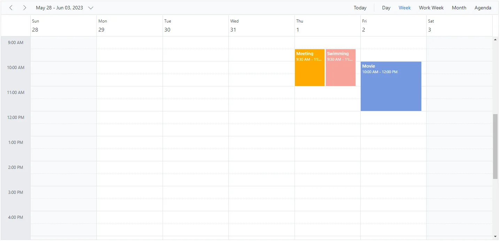

N> Setting [`AllowMultiple`](https://help.syncfusion.com/cr/blazor/Syncfusion.Blazor.Schedule.Resource.html#Syncfusion_Blazor_Schedule_Resource_AllowMultiple) to `true` allows multiple resource selection in the event editor and creates multiple copies of the same appointment for each selected resource.

## Resource grouping

Resource grouping support allows the Scheduler to group resources in a hierarchical structure, either as expandable groups in timeline views or as a vertical hierarchy in calendar views.

To get started quickly with grouping multiple resources in Scheduler, watch this video:



Scheduler supports both single-level and multi-level resource grouping in timeline and vertical views.

### Vertical resource view

The following code example shows how multiple resources are grouped and how their events are displayed in the default calendar views.

```cshtml
@using Syncfusion.Blazor.Schedule

<SfSchedule TValue="AppointmentData" Height="550px" @bind-SelectedDate="@CurrentDate">
    <ScheduleGroup Resources="@Resources"></ScheduleGroup>
    <ScheduleResources>
        <ScheduleResource TItem="ResourceData" TValue="int" DataSource="@RoomData" Field="RoomId" Title="Room" Name="Rooms" TextField="RoomText" IdField="Id" ColorField="RoomColor" AllowMultiple="false"></ScheduleResource>
        <ScheduleResource TItem="ResourceData" TValue="int[]" DataSource="@OwnersData" Field="OwnerId" Title="Owner" Name="Owners" TextField="OwnerText" IdField="Id" GroupIDField="OwnerGroupId" ColorField="OwnerColor" AllowMultiple="true"></ScheduleResource>
    </ScheduleResources>
    <ScheduleEventSettings DataSource="@DataSource"></ScheduleEventSettings>
    <ScheduleViews>
        <ScheduleView Option="View.Day"></ScheduleView>
        <ScheduleView Option="View.Week"></ScheduleView>
        <ScheduleView Option="View.WorkWeek"></ScheduleView>
        <ScheduleView Option="View.Month"></ScheduleView>
        <ScheduleView Option="View.Agenda"></ScheduleView>
    </ScheduleViews>
</SfSchedule>
@code{
    DateTime CurrentDate = new DateTime(2023, 6, 1);
    public string[] Resources { get; set; } = { "Rooms", "Owners" };
    public List<ResourceData> RoomData { get; set; } = new List<ResourceData>
    {
        new ResourceData{ RoomText = "ROOM 1", Id = 1, RoomColor = "#cb6bb2" },
        new ResourceData{ RoomText = "ROOM 2", Id = 2, RoomColor = "#56ca85" }
    };
    public List<ResourceData> OwnersData { get; set; } = new List<ResourceData>
    {
        new ResourceData{ OwnerText = "Nancy", Id = 1, OwnerGroupId = 1, OwnerColor = "#ffaa00" },
        new ResourceData{ OwnerText = "Steven", Id = 2, OwnerGroupId = 2, OwnerColor = "#f8a398" },
        new ResourceData{ OwnerText = "Michael", Id = 3, OwnerGroupId = 1, OwnerColor = "#7499e1" }
    };
    List<AppointmentData> DataSource = new List<AppointmentData>
     {
        new AppointmentData { Id = 1, Subject = "Meeting", StartTime = new DateTime(2023, 6, 1, 9, 30, 0) , EndTime = new DateTime(2023, 6, 1, 11, 0, 0), OwnerId = 1, RoomId = 1 }
    };
    public class AppointmentData
    {
        public int Id { get; set; }
        public string Subject { get; set; }
        public string Location { get; set; }
        public DateTime StartTime { get; set; }
        public DateTime EndTime { get; set; }
        public string Description { get; set; }
        public bool IsAllDay { get; set; }
        public string RecurrenceRule { get; set; }
        public string RecurrenceException { get; set; }
        public Nullable<int> RecurrenceID { get; set; }
        public int OwnerId { get; set; }
        public int RoomId { get; set; }
    }
    public class ResourceData
    {
        public int Id { get; set; }
        public string RoomText { get; set; }
        public string RoomColor { get; set; }
        public string OwnerText { get; set; }
        public string OwnerColor { get; set; }
        public int OwnerGroupId { get; set; }
    }
}
```

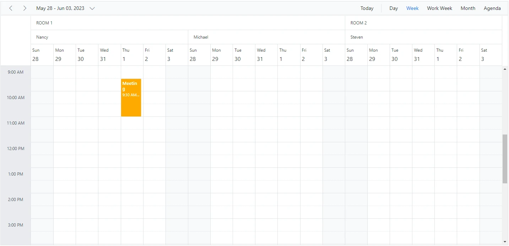

### Timeline resource view

The following code example shows how to group multiple resources in Timeline Scheduler views and display the related events under each resource.

```cshtml
@using Syncfusion.Blazor.Schedule

<SfSchedule TValue="AppointmentData" Height="550px" @bind-SelectedDate="@CurrentDate">
    <ScheduleGroup Resources="@Resources"></ScheduleGroup>
    <ScheduleResources>
        <ScheduleResource TItem="ResourceData" TValue="int" DataSource="@RoomData" Field="RoomId" Title="Room" Name="Rooms" TextField="RoomText" IdField="Id" ColorField="RoomColor" AllowMultiple="false"></ScheduleResource>
        <ScheduleResource TItem="ResourceData" TValue="int[]" DataSource="@OwnersData" Field="OwnerId" Title="Owner" Name="Owners" TextField="OwnerText" IdField="Id" GroupIDField="OwnerGroupId" ColorField="OwnerColor" AllowMultiple="true"></ScheduleResource>
    </ScheduleResources>
    <ScheduleEventSettings DataSource="@DataSource"></ScheduleEventSettings>
    <ScheduleViews>
        <ScheduleView Option="View.TimelineWeek" MaxEventsPerRow="2"></ScheduleView>
        <ScheduleView Option="View.TimelineMonth" MaxEventsPerRow="2"></ScheduleView>
        <ScheduleView Option="View.Agenda"></ScheduleView>
    </ScheduleViews>
</SfSchedule>
@code{
    DateTime CurrentDate = new DateTime(2023, 6, 1);
    public string[] Resources { get; set; } = { "Rooms", "Owners" };
    public List<ResourceData> RoomData { get; set; } = new List<ResourceData>
    {
        new ResourceData{ RoomText = "ROOM 1", Id = 1, RoomColor = "#cb6bb2" },
        new ResourceData{ RoomText = "ROOM 2", Id = 2, RoomColor = "#56ca85" }
    };
    public List<ResourceData> OwnersData { get; set; } = new List<ResourceData>
    {
        new ResourceData{ OwnerText = "Nancy", Id = 1, OwnerGroupId = 1, OwnerColor = "#ffaa00" },
        new ResourceData{ OwnerText = "Steven", Id = 2, OwnerGroupId = 2, OwnerColor = "#f8a398" },
        new ResourceData{ OwnerText = "Michael", Id = 3, OwnerGroupId = 1, OwnerColor = "#7499e1" }
    };
    List<AppointmentData> DataSource = new List<AppointmentData>
     {
        new AppointmentData { Id = 1, Subject = "Meeting", StartTime = new DateTime(2023, 6, 1, 9, 30, 0) , EndTime = new DateTime(2023, 6, 1, 11, 0, 0), OwnerId = 1, RoomId = 1 }
    };
    public class AppointmentData
    {
        public int Id { get; set; }
        public string Subject { get; set; }
        public string Location { get; set; }
        public DateTime StartTime { get; set; }
        public DateTime EndTime { get; set; }
        public string Description { get; set; }
        public bool IsAllDay { get; set; }
        public string RecurrenceRule { get; set; }
        public string RecurrenceException { get; set; }
        public Nullable<int> RecurrenceID { get; set; }
        public int OwnerId { get; set; }
        public int RoomId { get; set; }
    }
    public class ResourceData
    {
        public int Id { get; set; }
        public string RoomText { get; set; }
        public string RoomColor { get; set; }
        public string OwnerText { get; set; }
        public string OwnerColor { get; set; }
        public int OwnerGroupId { get; set; }
    }
}
```
The following image shows the multiple resources rendering on the Timeline view Scheduler.

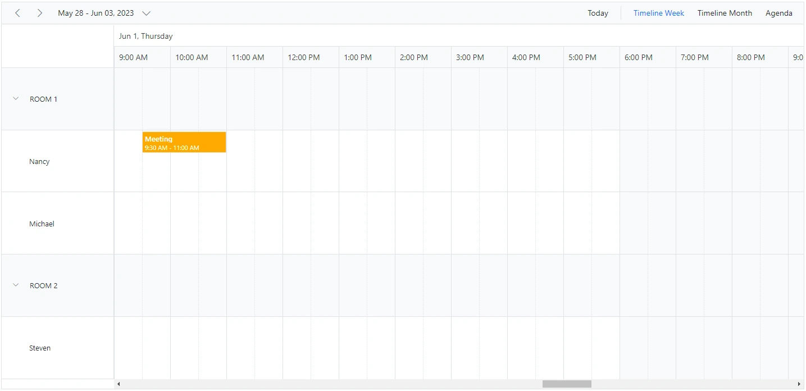

### Grouping single-level resources

This type of grouping allows the Scheduler to display all resources at a single level simultaneously. Appointments mapped to resources are displayed with the colors defined by the [`ColorField`](https://help.syncfusion.com/cr/blazor/Syncfusion.Blazor.Schedule.Resource.html#Syncfusion_Blazor_Schedule_Resource_ColorField) in the resource collection.

**Example:** To display the Scheduler with single level resource grouping,

```cshtml
@using Syncfusion.Blazor.Schedule

<SfSchedule TValue="AppointmentData" Height="550px" @bind-SelectedDate="@CurrentDate">
    <ScheduleGroup Resources="@Resources"></ScheduleGroup>
    <ScheduleResources>
        <ScheduleResource TItem="ResourceData" TValue="int[]" DataSource="@OwnersData" Field="OwnerId" Title="Owner" Name="Owners" TextField="OwnerText" IdField="Id" ColorField="OwnerColor" AllowMultiple="true"></ScheduleResource>
    </ScheduleResources>
    <ScheduleEventSettings DataSource="@DataSource"></ScheduleEventSettings>
    <ScheduleViews>
        <ScheduleView Option="View.Day"></ScheduleView>
        <ScheduleView Option="View.Week"></ScheduleView>
        <ScheduleView Option="View.WorkWeek"></ScheduleView>
        <ScheduleView Option="View.Month"></ScheduleView>
        <ScheduleView Option="View.Agenda"></ScheduleView>
    </ScheduleViews>
</SfSchedule>
@code{
    DateTime CurrentDate = new DateTime(2023, 6, 1);
    public string[] Resources { get; set; } = { "Owners" };
    List<AppointmentData> DataSource = new List<AppointmentData>
     {
        new AppointmentData { Id = 1, Subject = "Meeting", StartTime = new DateTime(2023, 6, 1, 9, 30, 0) , EndTime = new DateTime(2023, 6, 1, 11, 0, 0), OwnerId = 1 },
        new AppointmentData { Id = 2, Subject = "Swimming", StartTime = new DateTime(2023, 6, 2, 10, 30, 0) , EndTime = new DateTime(2023, 6, 2, 12, 30, 0), OwnerId = 2 },
        new AppointmentData { Id = 3, Subject = "Movie", StartTime = new DateTime(2023, 6, 3, 10, 0, 0) , EndTime = new DateTime(2023,6 , 3, 12, 0, 0), OwnerId = 3 }
    };
    public List<ResourceData> OwnersData { get; set; } = new List<ResourceData>
    {
        new ResourceData{ OwnerText = "Nancy", Id = 1, OwnerColor = "#ffaa00" },
        new ResourceData{ OwnerText = "Steven", Id = 2, OwnerColor = "#f8a398" },
        new ResourceData{ OwnerText = "Michael", Id = 3, OwnerColor = "#7499e1" }
    };
    public class AppointmentData
    {
        public int Id { get; set; }
        public string Subject { get; set; }
        public string Location { get; set; }
        public DateTime StartTime { get; set; }
        public DateTime EndTime { get; set; }
        public string Description { get; set; }
        public bool IsAllDay { get; set; }
        public string RecurrenceRule { get; set; }
        public string RecurrenceException { get; set; }
        public Nullable<int> RecurrenceID { get; set; }
        public int OwnerId { get; set; }
    }
    public class ResourceData
    {
        public int Id { get; set; }
        public string OwnerText { get; set; }
        public string OwnerColor { get; set; }
    }
}
```
The following image display the Scheduler with single level resource grouping.

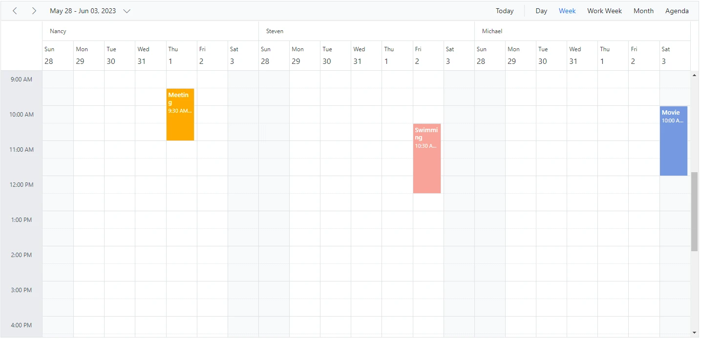

N> The `Name` field defined in the **Resources** collection, such as `Owners`, is mapped within the [`Group`](https://help.syncfusion.com/cr/blazor/Syncfusion.Blazor.Schedule.ScheduleGroup.html) property to enable grouping for those resource levels in the Scheduler.

### Grouping multi-level resources

It is possible to group Scheduler resources in multiple levels by mapping child resources to each parent resource. In the following example, there are two resource levels, and the second level uses [`GroupIDField`](https://help.syncfusion.com/cr/blazor/Syncfusion.Blazor.Schedule.Resource.html#Syncfusion_Blazor_Schedule_Resource_GroupIDField) to map to the first level resource ID and establish the parent-child relationship.

```cshtml
@using Syncfusion.Blazor.Schedule

<SfSchedule TValue="AppointmentData" Height="550px" @bind-SelectedDate="@CurrentDate">
    <ScheduleGroup Resources="@Resources"></ScheduleGroup>
    <ScheduleResources>
        <ScheduleResource TItem="ResourceData" TValue="int" DataSource="@HotelData" Field="HotelId" Title="Hotel" Name="Hotels" TextField="HotelText" IdField="Id" ColorField="HotelColor" AllowMultiple="false"></ScheduleResource>
        <ScheduleResource TItem="ResourceData" TValue="int" DataSource="@RoomData" Field="RoomId" Title="Room" Name="Rooms" TextField="RoomText" IdField="Id" ColorField="RoomColor"
                          GroupIDField="RoomGroupId" AllowMultiple="false"></ScheduleResource>
        <ScheduleResource TItem="ResourceData" TValue="int[]" DataSource="@OwnersData" Field="OwnerId" Title="Owner" Name="Owners" TextField="OwnerText" IdField="Id" GroupIDField="OwnerGroupId" ColorField="OwnerColor" AllowMultiple="true"></ScheduleResource>
    </ScheduleResources>
    <ScheduleEventSettings DataSource="@DataSource"></ScheduleEventSettings>
    <ScheduleViews>
        <ScheduleView Option="View.Day"></ScheduleView>
        <ScheduleView Option="View.Week"></ScheduleView>
        <ScheduleView Option="View.WorkWeek"></ScheduleView>
        <ScheduleView Option="View.Month"></ScheduleView>
        <ScheduleView Option="View.Agenda"></ScheduleView>
    </ScheduleViews>
</SfSchedule>
@code{
    DateTime CurrentDate = new DateTime(2023, 6, 1);
    public string[] Resources { get; set; } = { "Hotels", "Rooms", "Owners" };
    public List<ResourceData> HotelData { get; set; } = new List<ResourceData>
    {
        new ResourceData{ HotelText = "Hotel 1", Id = 1, HotelColor = "#f8a398" },
        new ResourceData{ HotelText = "Hotel 2", Id = 2, HotelColor = "#ffaa00" }
    };
    public List<ResourceData> RoomData { get; set; } = new List<ResourceData>
    {
        new ResourceData{ RoomText = "ROOM 1", Id = 1, RoomGroupId = 1, RoomColor = "#cb6bb2" },
        new ResourceData{ RoomText = "ROOM 2", Id = 2, RoomGroupId = 2, RoomColor = "#56ca85" }
    };
    public List<ResourceData> OwnersData { get; set; } = new List<ResourceData>
    {
        new ResourceData{ OwnerText = "Nancy", Id = 1, OwnerGroupId = 1, OwnerColor = "#ffaa00" },
        new ResourceData{ OwnerText = "Steven", Id = 2, OwnerGroupId = 2, OwnerColor = "#f8a398" },
        new ResourceData{ OwnerText = "Michael", Id = 3, OwnerGroupId = 1, OwnerColor = "#7499e1" }
    };
    List<AppointmentData> DataSource = new List<AppointmentData>
    {
        new AppointmentData { Id = 1, Subject = "Meeting", StartTime = new DateTime(2023, 6, 2, 9, 30, 0) , EndTime = new DateTime(2023, 6, 2, 11, 0, 0),
         OwnerId = 1, RoomId = 1, HotelId = 1 }
    };
    public class AppointmentData
    {
        public int Id { get; set; }
        public string Subject { get; set; }
        public string Location { get; set; }
        public DateTime StartTime { get; set; }
        public DateTime EndTime { get; set; }
        public string Description { get; set; }
        public bool IsAllDay { get; set; }
        public string RecurrenceRule { get; set; }
        public string RecurrenceException { get; set; }
        public Nullable<int> RecurrenceID { get; set; }
        public int OwnerId { get; set; }
        public int RoomId { get; set; }
        public int HotelId { get; set; }
    }
    public class ResourceData
    {
        public int Id { get; set; }
        public string HotelText { get; set; }
        public string HotelColor { get; set; }
        public string RoomText { get; set; }
        public string RoomColor { get; set; }
        public string OwnerText { get; set; }
        public string OwnerColor { get; set; }
        public int RoomGroupId { get; set; }
        public int OwnerGroupId { get; set; }
    }
}
```
The following image displays the resources of Scheduler in multi levels.

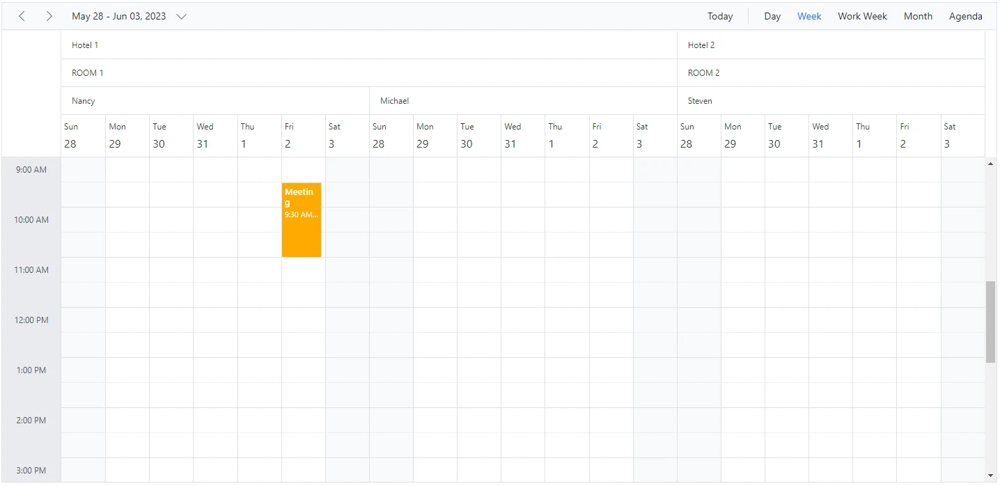

### One-to-One grouping

In multi-level grouping, Scheduler usually groups child-level resources based on the [`GroupIDField`](https://help.syncfusion.com/cr/blazor/Syncfusion.Blazor.Schedule.Resource.html#Syncfusion_Blazor_Schedule_Resource_GroupIDField) that maps to the [`IdField`](https://help.syncfusion.com/cr/blazor/Syncfusion.Blazor.Schedule.Resource.html#Syncfusion_Blazor_Schedule_Resource_IdField) of the parent-level resources, with [`ByGroupID`](https://help.syncfusion.com/cr/blazor/Syncfusion.Blazor.Schedule.ScheduleGroup.html#Syncfusion_Blazor_Schedule_ScheduleGroup_ByGroupID) set to `true` by default. You can also group each child resource against each parent resource. To enable this type of grouping, set [`ByGroupID`](https://help.syncfusion.com/cr/blazor/Syncfusion.Blazor.Schedule.ScheduleGroup.html#Syncfusion_Blazor_Schedule_ScheduleGroup_ByGroupID) to `false` within the [`Group`](https://help.syncfusion.com/cr/blazor/Syncfusion.Blazor.Schedule.ScheduleGroup.html) property. In the following code example, the child resources are mapped one to one with each resource on the first level.

```cshtml
@using Syncfusion.Blazor.Schedule

<SfSchedule TValue="AppointmentData" Height="550px" @bind-SelectedDate="@CurrentDate">
    <ScheduleGroup ByGroupID="false" Resources="@Resources"></ScheduleGroup>
    <ScheduleResources>
        <ScheduleResource TItem="ResourceData" TValue="int" DataSource="@RoomData" Field="RoomId" Title="Room" Name="Rooms" TextField="RoomText" IdField="Id"
                          ColorField="RoomColor" AllowMultiple="false"></ScheduleResource>
        <ScheduleResource TItem="ResourceData" TValue="int[]" DataSource="@OwnersData" Field="OwnerId" Title="Owner" Name="Owners" TextField="OwnerText" IdField="Id" ColorField="OwnerColor" AllowMultiple="true"></ScheduleResource>
    </ScheduleResources>
    <ScheduleEventSettings DataSource="@DataSource"></ScheduleEventSettings>
    <ScheduleViews>
        <ScheduleView Option="View.Day"></ScheduleView>
        <ScheduleView Option="View.Week"></ScheduleView>
        <ScheduleView Option="View.WorkWeek"></ScheduleView>
        <ScheduleView Option="View.Month"></ScheduleView>
        <ScheduleView Option="View.Agenda"></ScheduleView>
    </ScheduleViews>
</SfSchedule>
@code{
    DateTime CurrentDate = new DateTime(2023, 6, 1);
    public string[] Resources { get; set; } = { "Rooms", "Owners" };
    public List<ResourceData> RoomData { get; set; } = new List<ResourceData>
    {
        new ResourceData{ RoomText = "ROOM 1", Id = 1, RoomColor = "#cb6bb2" },
        new ResourceData{ RoomText = "ROOM 2", Id = 2, RoomColor = "#56ca85" }
    };
    public List<ResourceData> OwnersData { get; set; } = new List<ResourceData>
    {
        new ResourceData{ OwnerText = "Nancy", Id = 1, OwnerColor = "#ffaa00" },
        new ResourceData{ OwnerText = "Steven", Id = 2, OwnerColor = "#f8a398" }
    };
    List<AppointmentData> DataSource = new List<AppointmentData>
    {
        new AppointmentData { Id = 1, Subject = "Meeting", StartTime = new DateTime(2023, 6, 2, 9, 30, 0) , EndTime = new DateTime(2023, 6, 2, 11, 0, 0), OwnerId = 1, RoomId = 1 }
    };
    public class AppointmentData
    {
        public int Id { get; set; }
        public string Subject { get; set; }
        public string Location { get; set; }
        public DateTime StartTime { get; set; }
        public DateTime EndTime { get; set; }
        public string Description { get; set; }
        public bool IsAllDay { get; set; }
        public string RecurrenceRule { get; set; }
        public string RecurrenceException { get; set; }
        public Nullable<int> RecurrenceID { get; set; }
        public int OwnerId { get; set; }
        public int RoomId { get; set; }
    }
    public class ResourceData
    {
        public int Id { get; set; }
        public string RoomText { get; set; }
        public string RoomColor { get; set; }
        public string OwnerText { get; set; }
        public string OwnerColor { get; set; }
    }
}
```

The following image depicts how the scheduler will render when [`ByGroupID`](https://help.syncfusion.com/cr/blazor/Syncfusion.Blazor.Schedule.ScheduleGroup.html#Syncfusion_Blazor_Schedule_ScheduleGroup_ByGroupID) sets as false.

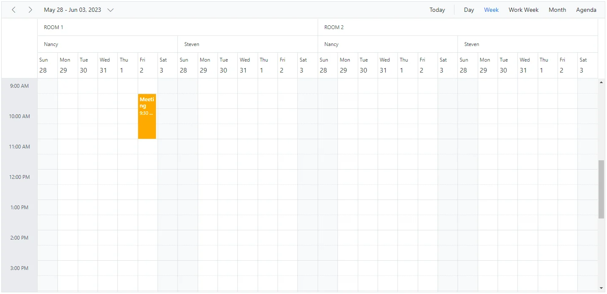

### Grouping resources by date

This groups resources under each date and is applicable only to calendar views such as Day, Week, Work Week, Month, Agenda, and Month-Agenda. To enable this grouping, set the [`ByDate`](https://help.syncfusion.com/cr/blazor/Syncfusion.Blazor.Schedule.ScheduleGroup.html#Syncfusion_Blazor_Schedule_ScheduleGroup_ByDate) option to `true` within the [`Group`](https://help.syncfusion.com/cr/blazor/Syncfusion.Blazor.Schedule.ScheduleGroup.html) property.

**Example:** To display the Scheduler with resources grouped by date,

```cshtml
@using Syncfusion.Blazor.Schedule

<SfSchedule TValue="AppointmentData" Height="550px" @bind-SelectedDate="@CurrentDate">
    <ScheduleGroup ByDate="true" Resources="@Resources"></ScheduleGroup>
    <ScheduleResources>
        <ScheduleResource TItem="ResourceData" TValue="int[]" DataSource="@OwnersData" Field="OwnerId" Title="Owner" Name="Owners" TextField="OwnerText" IdField="Id"
                          GroupIDField="OwnerGroupId" ColorField="OwnerColor" AllowMultiple="true"></ScheduleResource>
    </ScheduleResources>
    <ScheduleEventSettings DataSource="@DataSource"></ScheduleEventSettings>
    <ScheduleViews>
        <ScheduleView Option="View.Day"></ScheduleView>
        <ScheduleView Option="View.Week"></ScheduleView>
        <ScheduleView Option="View.WorkWeek"></ScheduleView>
        <ScheduleView Option="View.Month"></ScheduleView>
        <ScheduleView Option="View.Agenda"></ScheduleView>
    </ScheduleViews>
</SfSchedule>
@code{
    private DateTime CurrentDate = new DateTime(2023, 6, 1);
    public string[] Resources { get; set; } = { "Owners" };
    public List<ResourceData> OwnersData { get; set; } = new List<ResourceData>
{
        new ResourceData{ OwnerText = "Nancy", Id = 1, OwnerColor = "#ffaa00" },
        new ResourceData{ OwnerText = "Steven", Id = 2, OwnerColor = "#f8a398" },
        new ResourceData{ OwnerText = "Michael", Id = 3, OwnerColor = "#7499e1" }
    };
    List<AppointmentData> DataSource = new List<AppointmentData>
    {
        new AppointmentData { Id = 1, Subject = "Meeting", StartTime = new DateTime(2023, 6, 2, 9, 30, 0) , EndTime = new DateTime(2023, 6, 2, 11, 0, 0), OwnerId = 1 }
    };
    public class AppointmentData
    {
        public int Id { get; set; }
        public string Subject { get; set; }
        public string Location { get; set; }
        public DateTime StartTime { get; set; }
        public DateTime EndTime { get; set; }
        public string Description { get; set; }
        public bool IsAllDay { get; set; }
        public string RecurrenceRule { get; set; }
        public string RecurrenceException { get; set; }
        public Nullable<int> RecurrenceID { get; set; }
        public int OwnerId { get; set; }
    }
    public class ResourceData
    {
        public int Id { get; set; }
        public string OwnerText { get; set; }
        public string OwnerColor { get; set; }
    }
}
```

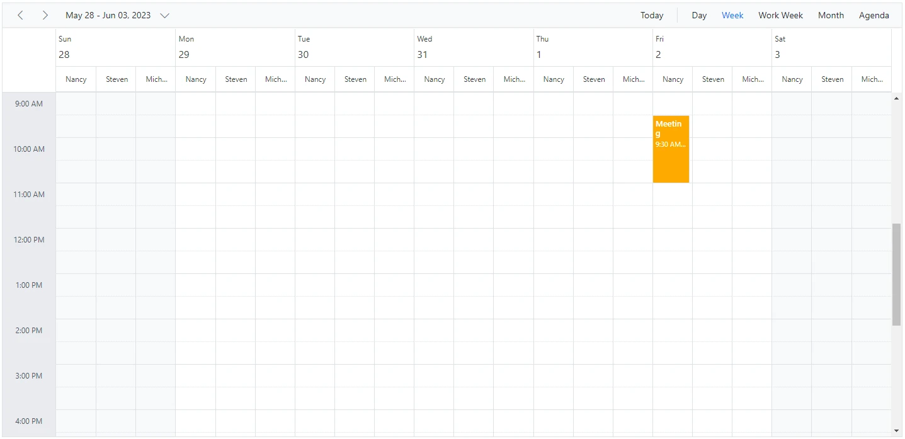

N> This type of grouping by date is not applicable to any of the **timeline views**.

## Working with shared events

Multiple resources can share the same events, allowing CRUD actions on one shared instance to reflect on all other shared instances simultaneously. To enable this option, set the [`AllowGroupEdit`](https://help.syncfusion.com/cr/blazor/Syncfusion.Blazor.Schedule.ScheduleGroup.html#Syncfusion_Blazor_Schedule_ScheduleGroup_AllowGroupEdit) property to `true` within the [`Group`](https://help.syncfusion.com/cr/blazor/Syncfusion.Blazor.Schedule.ScheduleGroup.html) property. With this property enabled, a single appointment remains in the appointment collection even when it is shared by more than one resource, and the resource field stores the IDs of the multiple resources in an array.

N> Any create, edit, or delete action performed on one shared event instance is reflected in all related instances visible in the UI.

**Example:** To edit all the resource events simultaneously,

```cshtml
@using Syncfusion.Blazor.Schedule

<SfSchedule TValue="AppointmentData" Height="550px" @bind-SelectedDate="@CurrentDate">
    <ScheduleGroup AllowGroupEdit="true" Resources="@Resources"></ScheduleGroup>
    <ScheduleResources>
        <ScheduleResource TItem="ResourceData" TValue="int[]" DataSource="@ConferenceData" Field="ConferenceId" Title="Attendees" Name="Conferences" TextField="Text" IdField="Id" ColorField="Color" AllowMultiple="true"></ScheduleResource>
    </ScheduleResources>
    <ScheduleEventSettings DataSource="@DataSource"></ScheduleEventSettings>
    <ScheduleViews>
        <ScheduleView Option="View.Day"></ScheduleView>
        <ScheduleView Option="View.Week"></ScheduleView>
        <ScheduleView Option="View.WorkWeek"></ScheduleView>
        <ScheduleView Option="View.Month"></ScheduleView>
        <ScheduleView Option="View.Agenda"></ScheduleView>
    </ScheduleViews>
</SfSchedule>

@code{
    DateTime CurrentDate = new DateTime(2023, 6, 1);
    public string[] Resources { get; set; } = { "Conferences" };
    List<AppointmentData> DataSource = new List<AppointmentData>
    {
        new AppointmentData { Id = 1, Subject = "Meeting", StartTime = new DateTime(2023, 6, 2, 9, 30, 0) , EndTime = new DateTime(2023, 6, 2, 11, 0, 0),
        ConferenceId = new int[] { 1, 2, 3 } }
    };
    public List<ResourceData> ConferenceData { get; set; } = new List<ResourceData>
    {
        new ResourceData{ Text = "Margaret", Id = 1, Color = "#1aaa55"},
        new ResourceData{ Text = "Robert", Id = 2, Color = "#357cd2"},
        new ResourceData{ Text = "Laura", Id = 3, Color = "#7fa900"}
    };
    public class AppointmentData
    {
        public int Id { get; set; }
        public string Subject { get; set; }
        public string Location { get; set; }
        public DateTime StartTime { get; set; }
        public DateTime EndTime { get; set; }
        public string Description { get; set; }
        public bool IsAllDay { get; set; }
        public string RecurrenceRule { get; set; }
        public string RecurrenceException { get; set; }
        public Nullable<int> RecurrenceID { get; set; }
        public int[] ConferenceId { get; set; }
    }
    public class ResourceData
    {
        public int Id { get; set; }
        public string Text { get; set; }
        public string Color { get; set; }
    }
}
```

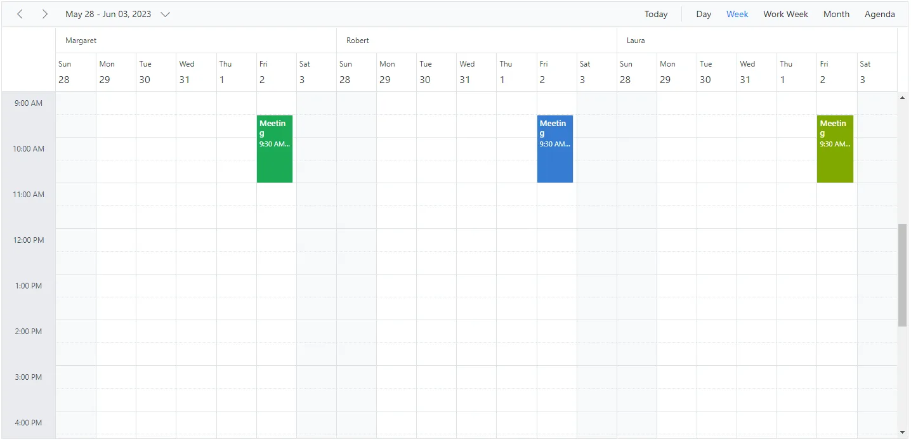

## Simple resource header customization

It is possible to customize the resource header cells by using the built-in template option and change their appearance in both vertical and timeline view modes. All resource-related fields and other information can be accessed within the resource header template.

**Example:** To customize the resource header and display it along with designation and image, refer to the following code example.

```cshtml
@using Syncfusion.Blazor.Schedule

<SfSchedule TValue="AppointmentData" Width="100%" Height="650px" @bind-SelectedDate="@CurrentDate">
    <ScheduleTemplates>
        <ResourceHeaderTemplate>
            @{
                var resourceData = (context as TemplateContext).ResourceData as ResourceData;
                <div class='template-wrap'>
                    <div class="resource-image"></div>
                    <div class="resource-details">
                        <div class="resource-name">@(resourceData.Text)</div>
                        <div class="resource-designation">@(resourceData.Designation)</div>
                    </div>
                </div>
            }
        </ResourceHeaderTemplate>
    </ScheduleTemplates>
    <ScheduleGroup Resources="@Resources"></ScheduleGroup>
    <ScheduleResources>
        <ScheduleResource TItem="ResourceData" TValue="int" DataSource="@DoctorsData" Field="DoctorId" Title="Doctor Name" Name="Doctors" TextField="Text" IdField="Id" ColorField="Color"></ScheduleResource>
    </ScheduleResources>
    <ScheduleViews>
        <ScheduleView Option="View.Day"></ScheduleView>
        <ScheduleView Option="View.Week"></ScheduleView>
        <ScheduleView Option="View.WorkWeek"></ScheduleView>
        <ScheduleView Option="View.Month"></ScheduleView>
        <ScheduleView Option="View.Agenda"></ScheduleView>
    </ScheduleViews>
</SfSchedule>
@code{
    DateTime CurrentDate = new DateTime(2023, 6, 1);
    public string[] Resources { get; set; } = { "Doctors" };
    public List<ResourceData> DoctorsData { get; set; } = new List<ResourceData>
    {
        new ResourceData{ Text = "Will Smith", Id = 1, Color = "#ea7a57", Designation = "Cardiologist", Image = "will-smith" },
        new ResourceData{ Text = "Alice", Id = 2, Color = "rgb(53, 124, 210)", Designation = "Neurologist", Image = "alice"  },
        new ResourceData{ Text = "Robson", Id = 3, Color = "#7fa900", Designation = "Orthopedic Surgeon", Image = "robson"  }
    };
    public class AppointmentData
    {
        public int Id { get; set; }
        public string Subject { get; set; }
        public string Location { get; set; }
        public DateTime StartTime { get; set; }
        public DateTime EndTime { get; set; }
        public string Description { get; set; }
        public bool IsAllDay { get; set; }
        public string RecurrenceRule { get; set; }
        public string RecurrenceException { get; set; }
        public Nullable<int> RecurrenceID { get; set; }
        public int DoctorId { get; set; }
    }
    public class ResourceData
    {
        public int Id { get; set; }
        public string Text { get; set; }
        public string Designation { get; set; }
        public string Color { get; set; }
        public string Image { get; set; }
    }
}
<style>
    .e-schedule .e-vertical-view .e-resource-cells {
        height: 62px;
    }

    .e-schedule .template-wrap {
        display: flex;
        text-align: left;
    }

    .e-schedule .template-wrap .resource-image img {
        width: 45px;
        height: 45px;
    }

    .e-schedule .template-wrap .resource-details {
        padding-left: 10px;
    }

    .e-schedule .template-wrap .resource-details .resource-name {
        font-size: 16px;
        font-weight: 500;
        margin-top: 5px;
    }

    .e-schedule.e-device .template-wrap .resource-details .resource-name {
        font-size: inherit;
        font-weight: inherit;
    }

    .e-schedule.e-device .e-resource-tree-popup .e-fullrow {
        height: 50px;
    }

    .e-schedule.e-device .template-wrap .resource-details .resource-designation {
        display: none;
    }
</style>
```

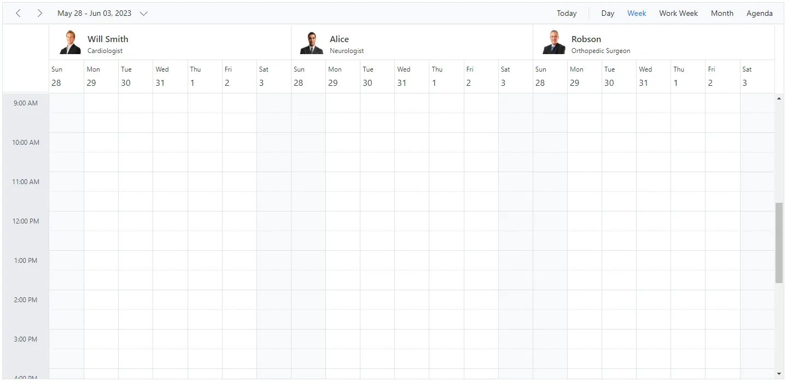

N> To customize the resource header in compact mode, use the `e-device` class as shown in the code example.


## Customizing resource header with multiple columns

It is possible to customize resource headers to display multiple columns such as Room, Type, and Capacity. The following code example shows how to achieve this, and it is applicable only to timeline views.

```cshtml
@using Syncfusion.Blazor.Schedule

<SfSchedule TValue="AppointmentData" Width="100%" Height="650px" @bind-SelectedDate="@CurrentDate" @bind-CurrentView="@CurrentView">
    <ScheduleWorkHours Start="08:00" End="18:00"></ScheduleWorkHours>
    <ScheduleTimeScale SlotCount="1" Interval="60"></ScheduleTimeScale>
    <ScheduleGroup Resources="@GroupData"></ScheduleGroup>
    <ScheduleResources>
        <ScheduleResource TItem="ResourceData" TValue="int[]" DataSource="@OwnersData" Field="OwnerId" Title="OwnerType" Name="Owner" TextField="Text" IdField="Id" GroupIDField="OwnerGroupId" ColorField="Ownercolor" AllowMultiple="true"></ScheduleResource>
    </ScheduleResources>
    <ScheduleTemplates>
        <ResourceHeaderTemplate>
            @{
                var resourceData = (context as TemplateContext).ResourceData as ResourceData;
                <div class='template-wrap'>
                    <div class="room-name">@(resourceData.Text)</div>
                    <div class="room-capacity">@(resourceData.Capacity)</div>
                    <div class="room-type">@(resourceData.Type)</div>
                    <div class="room-avail">@(resourceData.Availability)</div>
                </div>
            }
        </ResourceHeaderTemplate>
    </ScheduleTemplates>
    <ScheduleEventSettings DataSource="@DataSource"></ScheduleEventSettings>
    <ScheduleViews>
        <ScheduleView Option="View.TimelineWeek" MaxEventsPerRow="2"></ScheduleView>
        <ScheduleView Option="View.TimelineMonth" MaxEventsPerRow="2"></ScheduleView>
    </ScheduleViews>
</SfSchedule>

@code{
    DateTime CurrentDate = new DateTime(2023, 6, 1);
    private View CurrentView = View.TimelineWeek;
    public string[] GroupData { get; set; } = { "Owner" };

    public List<ResourceData> OwnersData { get; set; } = new List<ResourceData> {
        new ResourceData{ Text = "Jammy", Id = 1, OwnerGroupId = 1, Ownercolor = "#ea7a57", Capacity = 20, Type = "Conference" , Availability = 10 },
        new ResourceData{ Text = "Tweety", Id = 2, OwnerGroupId = 2, Ownercolor = "#7fa900", Capacity = 7, Type = "Cabin", Availability = 5 },
        new ResourceData{ Text = "Nestle", Id = 3, OwnerGroupId = 1, Ownercolor = "#865fcf", Capacity = 5, Type = "Cabin", Availability = 2 },
        new ResourceData{ Text = "Phoenix", Id = 4, OwnerGroupId = 2, Ownercolor = "#fec200", Capacity = 15, Type = "Conference", Availability = 12 },
        new ResourceData{ Text = "Rick Roll", Id = 5, OwnerGroupId = 1, Ownercolor = "#865fcf", Capacity = 20, Type = "Conference", Availability = 7 },
        new ResourceData{ Text = "Rainbow", Id = 6, OwnerGroupId = 2, Ownercolor = "#1aaa55", Capacity = 8, Type = "Cabin", Availability = 3 }

    };
    public class ResourceData
    {
        public int Id { get; set; }
        public string Text { get; set; }
        public int OwnerGroupId { get; set; }
        public string RoomColor { get; set; }
        public string Ownercolor { get; set; }
        public int Capacity { get; set; }
        public string Type { get; set; }
        public int Availability { get; set; }
    }
    List<AppointmentData> DataSource = new List<AppointmentData>
{
        new AppointmentData { Id = 1, Subject = "Meeting", StartTime = new DateTime(2023, 6, 16, 9, 30, 0) , EndTime = new DateTime(2023, 6, 16, 11, 0, 0),
        OwnerId = 1 }

    };
    public class AppointmentData
    {
        public int Id { get; set; }
        public string Subject { get; set; }
        public string Location { get; set; }
        public DateTime StartTime { get; set; }
        public DateTime EndTime { get; set; }
        public string Description { get; set; }
        public bool IsAllDay { get; set; }
        public string RecurrenceRule { get; set; }
        public string RecurrenceException { get; set; }
        public Nullable<int> RecurrenceID { get; set; }
        public int OwnerId { get; set; }
    }
}
<style>
    .e-schedule .e-timeline-month-view .e-resource-left-td,
    .e-schedule .e-timeline-view .e-resource-left-td {
        vertical-align: bottom;
        width: 350px;
    }

    .e-schedule.e-device .e-timeline-month-view .e-resource-left-td,
    .e-schedule.e-device .e-timeline-view .e-resource-left-td {
        width: 75px;
    }

    .e-schedule .e-timeline-month-view .e-resource-left-td .e-resource-text,
    .e-schedule .e-timeline-view .e-resource-left-td .e-resource-text {
        display: flex;
        font-weight: 500;
        padding: 0;
    }

        .e-schedule .e-timeline-month-view .e-resource-left-td .e-resource-text > div,
        .e-schedule .e-timeline-view .e-resource-left-td .e-resource-text > div {
            border-right: 1px solid rgba(0, 0, 0, 0.12);
            border-top: 1px solid rgba(0, 0, 0, 0.12);
            flex: 0 0 20%;
            font-weight: 500;
            height: 36px;
            line-height: 34px;
            padding-left: 5px;
        }

            .e-schedule .e-timeline-month-view .e-resource-left-td .e-resource-text > div:first-child,
            .e-schedule .e-timeline-view .e-resource-left-td .e-resource-text > div:first-child {
                flex: 0 0 40%;
            }

            .e-schedule .e-timeline-month-view .e-resource-left-td .e-resource-text > div:last-child,
            .e-schedule .e-timeline-view .e-resource-left-td .e-resource-text > div:last-child {
                border-right: 0;
            }

    .e-schedule .e-schedule-table > tbody > tr > td {
        width: 100%;
    }

    .e-schedule .e-timeline-view .e-resource-collapse,
    .e-schedule .e-timeline-month-view .e-resource-collapse {
        margin-top: 23px;
    }

    .e-schedule .e-parent-node .room-type {
        flex: 0 0 20.8% !important;
    }

    .e-schedule .e-parent-node .room-capacity {
        flex: 0 0 20.8% !important;
    }

    .e-schedule .e-parent-node .room-name {
        flex: 0 0 37.8% !important;
    }

    .e-schedule .e-parent-node .room-avail {
        flex: 0 0 20.8% !important;
    }

    .e-schedule .e-timeline-view .e-resource-tree-icon,
    .e-schedule .e-timeline-month-view .e-resource-tree-icon {
        margin-top: 22px !important;
    }

    .e-schedule .template-wrap {
        display: flex;
        height: 100%;
        text-align: left;
    }

    .e-schedule .e-resource-cells .e-blazor-template {
        height: 100%;
    }

    .e-schedule .template-wrap > div {
        border-right: 1px solid rgba(0, 0, 0, 0.12);
        flex: 0 0 20%;
        font-weight: 500;
        line-height: 58px;
        overflow: hidden;
        padding-left: 5px;
        text-overflow: ellipsis;
    }

        .e-schedule .template-wrap > div:first-child {
            flex: 0 0 40%;
        }

        .e-schedule .template-wrap > div:last-child {
            border-right: 0;
        }

    .e-schedule .e-timeline-view .e-resource-cells,
    .e-schedule .e-timeline-month-view .e-resource-cells {
        padding-left: 0;
    }

    .e-schedule .e-timeline-view .e-date-header-wrap table col,
    .e-schedule .e-timeline-view .e-content-wrap table col {
        width: 100px;
    }

    .e-schedule .e-read-only {
        opacity: .8;
    }

    @@media (max-width: 550px) {
        .e-schedule .e-timeline-view .e-resource-left-td {
            width: 100px;
        }

            .e-schedule .e-timeline-view .e-resource-left-td .e-resource-text > div,
            .e-schedule .template-wrap > div {
                flex: 0 0 100%;
            }

                .e-schedule .template-wrap > div:first-child {
                    border-right: 0;
                }

                .e-schedule .e-timeline-view .e-resource-left-td .e-resource-text > div:first-child {
                    border-right: 0;
                }

        .e-schedule .room-type,
        .e-schedule .room-capacity {
            display: none;
        }
    }
</style>
```

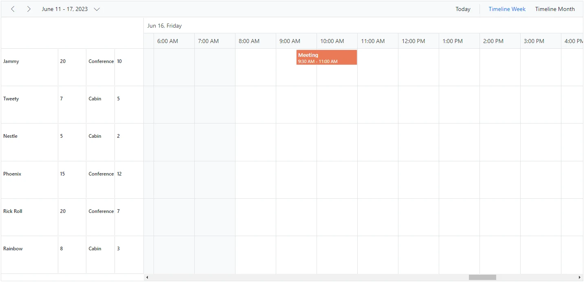

## Expand and collapse resource fields

It is possible to expand and collapse resource fields. By default, resource fields are expanded with their child fields. This behavior can be customized by using the [`ExpandedField`](https://help.syncfusion.com/cr/blazor/Syncfusion.Blazor.Schedule.Resource.html#Syncfusion_Blazor_Schedule_Resource_ExpandedField) property. When the [`ExpandedField`](https://help.syncfusion.com/cr/blazor/Syncfusion.Blazor.Schedule.Resource.html#Syncfusion_Blazor_Schedule_Resource_ExpandedField) property in the resource data source is set to `false`, the resource fields remain collapsed. By default, [`ExpandedField`](https://help.syncfusion.com/cr/blazor/Syncfusion.Blazor.Schedule.Resource.html#Syncfusion_Blazor_Schedule_Resource_ExpandedField) is set to `true`.

```cshtml
@using Syncfusion.Blazor.Schedule

<SfSchedule TValue="AppointmentData" Height="550px" @bind-SelectedDate="@CurrentDate">
    <ScheduleGroup Resources="@Resources"></ScheduleGroup>
    <ScheduleResources>
        <ScheduleResource TItem="ResourceData" TValue="int" DataSource="@RoomData" Field="RoomId" Title="Room" Name="Rooms" TextField="RoomText" IdField="Id" ColorField="RoomColor" AllowMultiple="false" ExpandedField="IsExpand"></ScheduleResource>
        <ScheduleResource TItem="ResourceData" TValue="int[]" DataSource="@OwnersData" Field="OwnerId" Title="Owner" Name="Owners" TextField="OwnerText" IdField="Id" GroupIDField="OwnerGroupId" ColorField="OwnerColor" AllowMultiple="true"></ScheduleResource>
    </ScheduleResources>
    <ScheduleEventSettings DataSource="@DataSource"></ScheduleEventSettings>
    <ScheduleViews>
        <ScheduleView Option="View.TimelineWeek" MaxEventsPerRow="2"></ScheduleView>
        <ScheduleView Option="View.TimelineMonth" MaxEventsPerRow="2"></ScheduleView>
        <ScheduleView Option="View.Agenda"></ScheduleView>
    </ScheduleViews>
</SfSchedule>
@code{
    private DateTime CurrentDate = new DateTime(2023, 6, 1);
    public string[] Resources { get; set; } = { "Rooms", "Owners" };
    public List<ResourceData> RoomData { get; set; } = new List<ResourceData>
    {
        new ResourceData{ RoomText = "ROOM 1", Id = 1, RoomColor = "#cb6bb2",IsExpand=true},
        new ResourceData{ RoomText = "ROOM 2", Id = 2, RoomColor = "#56ca85" , IsExpand=false }
    };
    public List<ResourceData> OwnersData { get; set; } = new List<ResourceData>
    {
        new ResourceData{ OwnerText = "Nancy", Id = 1, OwnerGroupId = 1, OwnerColor = "#ffaa00" },
        new ResourceData{ OwnerText = "Steven", Id = 2, OwnerGroupId = 2, OwnerColor = "#f8a398" },
        new ResourceData{ OwnerText = "Michael", Id = 3, OwnerGroupId = 1, OwnerColor = "#7499e1" }
    };
    List<AppointmentData> DataSource = new List<AppointmentData>
    {
        new AppointmentData { Id = 1, Subject = "Meeting", StartTime = new DateTime(2023, 6, 2, 9, 30, 0) , EndTime = new DateTime(2023, 6, 2, 11, 0, 0), OwnerId = 1, RoomId = 1 }
    };
    public class AppointmentData
    {
        public int Id { get; set; }
        public string Subject { get; set; }
        public string Location { get; set; }
        public DateTime StartTime { get; set; }
        public DateTime EndTime { get; set; }
        public string Description { get; set; }
        public bool IsAllDay { get; set; }
        public string RecurrenceRule { get; set; }
        public string RecurrenceException { get; set; }
        public Nullable<int> RecurrenceID { get; set; }
        public int OwnerId { get; set; }
        public int RoomId { get; set; }
    }
    public class ResourceData
    {
        public int Id { get; set; }
        public string RoomText { get; set; }
        public string RoomColor { get; set; }
        public string OwnerText { get; set; }
        public string OwnerColor { get; set; }
        public int OwnerGroupId { get; set; }
        public bool IsExpand { get; set; }
    }
}
```
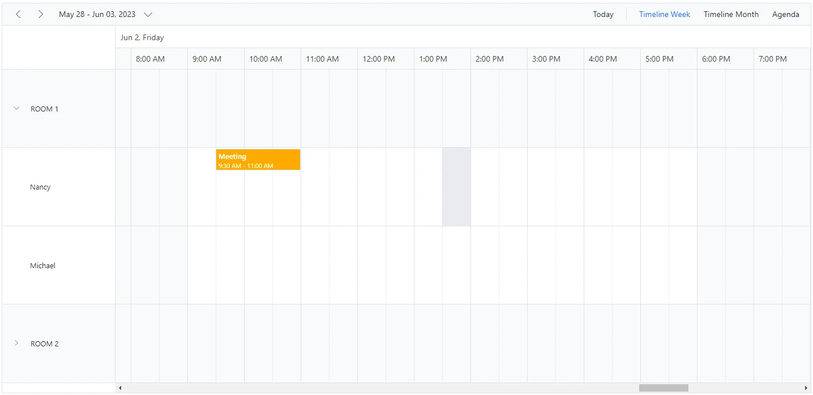

## Displaying tooltip for resource headers

It is possible to display a tooltip over the resource headers showing resource information. By default, no tooltip is displayed on resource headers. To enable it, assign a customized template to the [`HeaderTooltipTemplate`](https://help.syncfusion.com/cr/blazor/Syncfusion.Blazor.Schedule.ScheduleGroup.html#Syncfusion_Blazor_Schedule_ScheduleGroup_HeaderTooltipTemplate) option within the [`ScheduleGroup`](https://help.syncfusion.com/cr/blazor/Syncfusion.Blazor.Schedule.ScheduleGroup.html).

```cshtml
@using Syncfusion.Blazor.Schedule

<SfSchedule TValue="AppointmentData" Height="550px" @bind-SelectedDate="@CurrentDate">
    <ScheduleGroup Resources="@Resources">
        <HeaderTooltipTemplate>
            @{
                var resourceData = (context as TemplateContext).ResourceData as ResourceData;
                <div class='template-wrap'>
                    <div class="resource-image"></div>
                    <div class="resource-details">
                        <div class="resource-name">@(resourceData.Text)</div>
                    </div>
                </div>
            }
        </HeaderTooltipTemplate>
    </ScheduleGroup>
    <ScheduleResources>
        <ScheduleResource TValue="int[]" TItem="ResourceData" DataSource="@ConferenceData" Field="ConferenceId" Title="Attendees" Name="Conferences" TextField="Text" IdField="Id" ColorField="Color" AllowMultiple="true"></ScheduleResource>
    </ScheduleResources>
    <ScheduleEventSettings DataSource="@DataSource"></ScheduleEventSettings>
    <ScheduleViews>
        <ScheduleView Option="View.Day"></ScheduleView>
        <ScheduleView Option="View.Week"></ScheduleView>
        <ScheduleView Option="View.WorkWeek"></ScheduleView>
        <ScheduleView Option="View.Month"></ScheduleView>
        <ScheduleView Option="View.Agenda"></ScheduleView>
    </ScheduleViews>
</SfSchedule>

@code{
    DateTime CurrentDate = new DateTime(2023, 6, 1);
    public string[] Resources { get; set; } = { "Conferences" };
    List<AppointmentData> DataSource = new List<AppointmentData>
    {
       new AppointmentData { Id = 1, Subject = "Meeting", StartTime = new DateTime(2023, 6, 16, 9, 30, 0) , EndTime = new DateTime(2023, 6, 16, 11, 0, 0),
       ConferenceId = 1 }
    };
    public List<ResourceData> ConferenceData { get; set; } = new List<ResourceData>
    {
        new ResourceData{ Text = "Margaret", Id = 1, Color = "#1aaa55", Image= "margaret" },
        new ResourceData{ Text = "Robert", Id = 2, Color = "#357cd2", Image= "robert" },
        new ResourceData{ Text = "Laura", Id = 3, Color = "#7fa900", Image= "laura" }
    };
    public class AppointmentData
    {
        public int Id { get; set; }
        public string Subject { get; set; }
        public string Location { get; set; }
        public DateTime StartTime { get; set; }
        public DateTime EndTime { get; set; }
        public string Description { get; set; }
        public bool IsAllDay { get; set; }
        public string RecurrenceRule { get; set; }
        public string RecurrenceException { get; set; }
        public Nullable<int> RecurrenceID { get; set; }
        public int ConferenceId { get; set; }
    }
    public class ResourceData
    {
        public int Id { get; set; }
        public string Image { get; set; }
        public string Text { get; set; }
        public string Color { get; set; }
    }
}
```

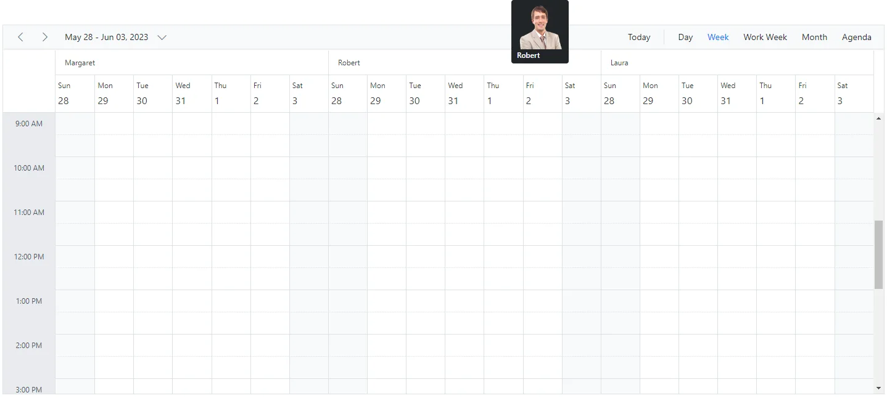

## Choosing between resource colors for appointments

By default, the colors defined in the top-level resource collection are applied to events. If you want to apply a specific resource color to events regardless of the top-level parent resource color, define the [`ResourceColorField`](https://help.syncfusion.com/cr/blazor/Syncfusion.Blazor.Schedule.IScheduleEventSettings.html#Syncfusion_Blazor_Schedule_IScheduleEventSettings_ResourceColorField) option within the [`EventSettings`](https://help.syncfusion.com/cr/blazor/Syncfusion.Blazor.Schedule.IScheduleEventSettings.html) property.

```cshtml
@using Syncfusion.Blazor.Schedule
@using Syncfusion.Blazor.Buttons

<SfRadioButton Label="Hotels" Name="Select" Value="Hotels" @bind-Checked="@ResourceColor"></SfRadioButton>
<SfRadioButton Label="Rooms" Name="Select" Value="Rooms" @bind-Checked="@ResourceColor"></SfRadioButton>
<SfRadioButton Label="Owners" Name="Select" Value="Owners" @bind-Checked="@ResourceColor"></SfRadioButton>

<SfSchedule TValue="AppointmentData" Height="550px" @bind-SelectedDate="@CurrentDate">
    <ScheduleGroup Resources="@Resources"></ScheduleGroup>
    <ScheduleResources>
        <ScheduleResource TItem="ResourceData" TValue="int" DataSource="@HotelData" Field="HotelId" Title="Hotel" Name="Hotels" TextField="HotelText" IdField="Id" ColorField="HotelColor" AllowMultiple="false"></ScheduleResource>
        <ScheduleResource TItem="ResourceData" TValue="int" DataSource="@RoomData" Field="RoomId" Title="Room" Name="Rooms" TextField="RoomText" IdField="Id"
                          ColorField="RoomColor" GroupIDField="RoomGroupId" AllowMultiple="false"></ScheduleResource>
        <ScheduleResource TItem="ResourceData" TValue="int[]" DataSource="@OwnersData" Field="OwnerId" Title="Owner" Name="Owners" TextField="OwnerText" IdField="Id"
                          GroupIDField="OwnerGroupId" ColorField="OwnerColor" AllowMultiple="true"></ScheduleResource>
    </ScheduleResources>
    <ScheduleEventSettings DataSource="@DataSource" ResourceColorField="@ResourceColor"></ScheduleEventSettings>
    <ScheduleViews>
        <ScheduleView Option="View.Day"></ScheduleView>
        <ScheduleView Option="View.Week"></ScheduleView>
        <ScheduleView Option="View.WorkWeek"></ScheduleView>
        <ScheduleView Option="View.Month"></ScheduleView>
        <ScheduleView Option="View.Agenda"></ScheduleView>
    </ScheduleViews>
</SfSchedule>

@code{
    DateTime CurrentDate = new DateTime(2023, 6, 1);
    public string ResourceColor { get; set; } = "Rooms";
    public string[] Resources { get; set; } = { "Hotels", "Rooms", "Owners" };
    public List<ResourceData> HotelData { get; set; } = new List<ResourceData>
    {
        new ResourceData{ HotelText = "Hotel 1", Id = 1, HotelColor = "#f8a398" },
        new ResourceData{ HotelText = "Hotel 2", Id = 2, HotelColor = "#ffaa00" }
    };
    public List<ResourceData> RoomData { get; set; } = new List<ResourceData>
    {
        new ResourceData{ RoomText = "ROOM 1", Id = 1, RoomGroupId = 1, RoomColor = "#cb6bb2" },
        new ResourceData{ RoomText = "ROOM 2", Id = 2, RoomGroupId = 2, RoomColor = "#56ca85" }
    };
    public List<ResourceData> OwnersData { get; set; } = new List<ResourceData>
    {
        new ResourceData{ OwnerText = "Nancy", Id = 1, OwnerGroupId = 1, OwnerColor = "#ffaa00" },
        new ResourceData{ OwnerText = "Steven", Id = 2, OwnerGroupId = 2, OwnerColor = "#f8a398" },
        new ResourceData{ OwnerText = "Michael", Id = 3, OwnerGroupId = 1, OwnerColor = "#7499e1" }
    };
    List<AppointmentData> DataSource = new List<AppointmentData>
    {
            new AppointmentData { Id = 1, Subject = "Meeting", StartTime = new DateTime(2023, 6, 16, 9, 30, 0) , EndTime = new DateTime(2023, 6, 16, 11, 0, 0),
            OwnerId = 1, RoomId = 1, HotelId = 1 }
    };
    public class AppointmentData
    {
        public int Id { get; set; }
        public string Subject { get; set; }
        public string Location { get; set; }
        public DateTime StartTime { get; set; }
        public DateTime EndTime { get; set; }
        public string Description { get; set; }
        public bool IsAllDay { get; set; }
        public string RecurrenceRule { get; set; }
        public string RecurrenceException { get; set; }
        public Nullable<int> RecurrenceID { get; set; }
        public int OwnerId { get; set; }
        public int RoomId { get; set; }
        public int HotelId { get; set; }
    }
    public class ResourceData
    {
        public int Id { get; set; }
        public string HotelText { get; set; }
        public string RoomText { get; set; }
        public string OwnerText { get; set; }
        public string HotelColor { get; set; }
        public string RoomColor { get; set; }
        public string OwnerColor { get; set; }
        public int RoomGroupId { get; set; }
        public int OwnerGroupId { get; set; }
    }
}
```

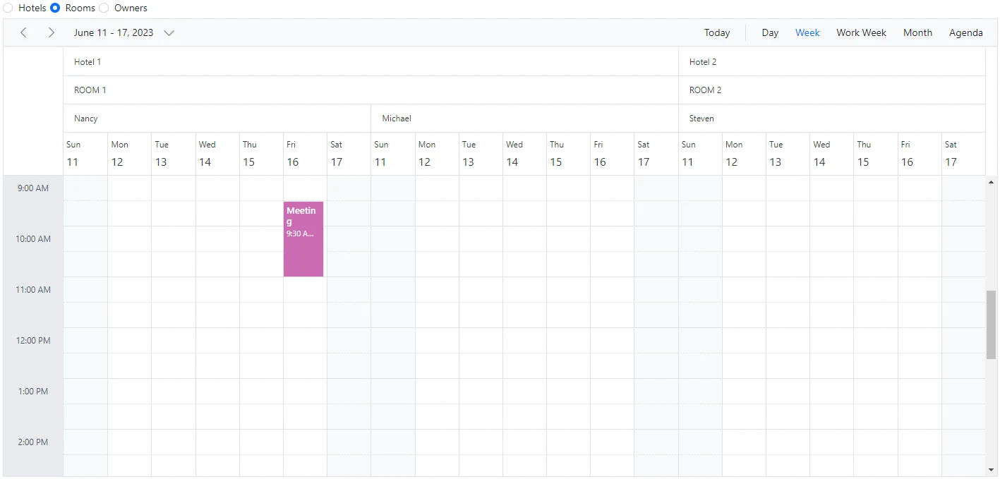

N> The value of the [`ResourceColorField`](https://help.syncfusion.com/cr/blazor/Syncfusion.Blazor.Schedule.IScheduleEventSettings.html#Syncfusion_Blazor_Schedule_IScheduleEventSettings_ResourceColorField) field should be mapped to the `Name` value defined within the [`ScheduleResource`](https://help.syncfusion.com/cr/blazor/Syncfusion.Blazor.Schedule.Resource.html).

## Setting different working days and hours for resources

Each resource in the Scheduler can have different working hours and working days. The [`ScheduleResource`](https://help.syncfusion.com/cr/blazor/Syncfusion.Blazor.Schedule.Resource.html) collection provides options to customize the default working hours and days of Scheduler.

* [Using the work day field for different work days](#Set-different-work-days)
* [Using the start hour and end hour fields for different work hours](#Set-different-work-hours)

### Set different work days

Different working days can be set for Scheduler resources by using the [`WorkDaysField`](https://help.syncfusion.com/cr/blazor/Syncfusion.Blazor.Schedule.Resource.html#Syncfusion_Blazor_Schedule_Resource_WorkDaysField) property, which maps the working days field from the resource data source. This field accepts a collection of day indexes from 0 to 6. By default, it is set to [1, 2, 3, 4, 5]. In the following example, each resource uses different values and therefore renders only those working days. This option is applicable only to calendar views and not to timeline views.

```cshtml
@using Syncfusion.Blazor.Schedule

<SfSchedule TValue="AppointmentData" Height="550px" @bind-SelectedDate="@CurrentDate" @bind-CurrentView="@CurrentView">
    <ScheduleGroup Resources="@Resources"></ScheduleGroup>
    <ScheduleResources>
        <ScheduleResource TItem="ResourceData" TValue="int" DataSource="@DoctorsData" Field="DoctorId" Title="Doctor Name" Name="Doctors" TextField="Text"
                          IdField="Id" ColorField="Color" WorkDaysField="WorkDays"></ScheduleResource>
    </ScheduleResources>
    <ScheduleViews>
        <ScheduleView Option="View.Day"></ScheduleView>
        <ScheduleView Option="View.Week"></ScheduleView>
        <ScheduleView Option="View.WorkWeek"></ScheduleView>
        <ScheduleView Option="View.Month"></ScheduleView>
        <ScheduleView Option="View.Agenda"></ScheduleView>
    </ScheduleViews>
</SfSchedule>

@code{
    DateTime CurrentDate = new DateTime(2023, 6, 1);
    View CurrentView = View.WorkWeek;
    public string[] Resources { get; set; } = { "Doctors" };
    public List<ResourceData> DoctorsData { get; set; } = new List<ResourceData>
    {
        new ResourceData{ Text = "Will Smith", Id = 1, Color = "#ea7a57", WorkDays = new int[] { 1, 2, 4, 5 } },
        new ResourceData{ Text = "Alice", Id = 2, Color = "rgb(53, 124, 210)", WorkDays = new int[] { 1, 3, 5 } },
        new ResourceData{ Text = "Robson", Id = 3, Color = "#7fa900" }
    };
    public class AppointmentData
    {
        public int Id { get; set; }
        public string Subject { get; set; }
        public string Location { get; set; }
        public DateTime StartTime { get; set; }
        public DateTime EndTime { get; set; }
        public string Description { get; set; }
        public bool IsAllDay { get; set; }
        public string RecurrenceRule { get; set; }
        public string RecurrenceException { get; set; }
        public Nullable<int> RecurrenceID { get; set; }
        public int DoctorId { get; set; }
    }
    public class ResourceData
    {
        public int Id { get; set; }
        public string Text { get; set; }
        public string Color { get; set; }
        public int[] WorkDays { get; set; }
    }
}
```

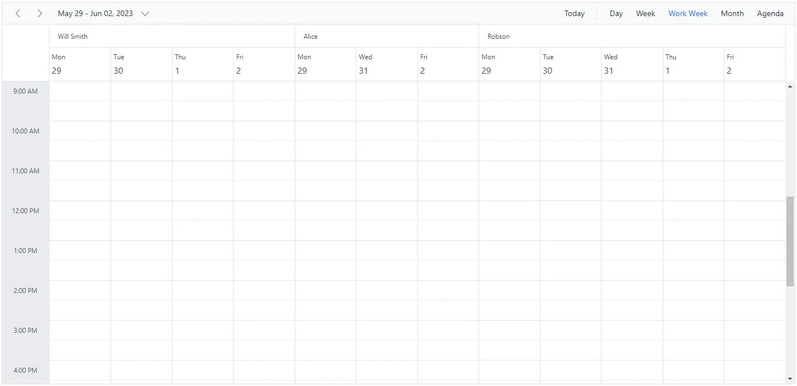

### Set different work hours

Different working hours can be set for Scheduler resources by using the [`StartHourField`](https://help.syncfusion.com/cr/blazor/Syncfusion.Blazor.Schedule.Resource.html#Syncfusion_Blazor_Schedule_Resource_StartHourField) and [`EndHourField`](https://help.syncfusion.com/cr/blazor/Syncfusion.Blazor.Schedule.Resource.html#Syncfusion_Blazor_Schedule_Resource_EndHourField) properties, which map the `startHourField` and `endHourField` values from the resource data source.

* [`StartHourField`](https://help.syncfusion.com/cr/blazor/Syncfusion.Blazor.Schedule.Resource.html#Syncfusion_Blazor_Schedule_Resource_StartHourField) - Denotes the start time of the working/business hour in a day.
* [`EndHourField`](https://help.syncfusion.com/cr/blazor/Syncfusion.Blazor.Schedule.Resource.html#Syncfusion_Blazor_Schedule_Resource_EndHourField) - Denotes the end time limit of the working/business hour in a day.

Working hours indicate the work duration of a day and are highlighted visually with an active color over the work cells. Each Scheduler resource can define its own working hours, as shown in the following example.

```cshtml
@using Syncfusion.Blazor.Schedule

<SfSchedule TValue="AppointmentData" Height="650px" @bind-SelectedDate="@CurrentDate">
    <ScheduleGroup Resources="@Resources"></ScheduleGroup>
    <ScheduleResources>
        <ScheduleResource TItem="ResourceData" TValue="int" DataSource="@DoctorsData" Field="DoctorId" Title="Doctor Name" Name="Doctors" TextField="Text" IdField="Id"
                          ColorField="Color" WorkDaysField="WorkDays" StartHourField="StartHour" EndHourField="EndHour"></ScheduleResource>
    </ScheduleResources>
    <ScheduleViews>
        <ScheduleView Option="View.Day"></ScheduleView>
        <ScheduleView Option="View.Week"></ScheduleView>
        <ScheduleView Option="View.WorkWeek"></ScheduleView>
        <ScheduleView Option="View.Month"></ScheduleView>
        <ScheduleView Option="View.Agenda"></ScheduleView>
    </ScheduleViews>
</SfSchedule>

@code{
    DateTime CurrentDate = new DateTime(2023, 6, 1);
    public string[] Resources { get; set; } = { "Doctors" };
    public List<ResourceData> DoctorsData { get; set; } = new List<ResourceData>
    {
        new ResourceData{ Text = "Will Smith", Id = 1, Color = "#ea7a57", StartHour = "07:00", EndHour = "13:00"},
        new ResourceData{ Text = "Alice", Id = 2, Color = "rgb(53, 124, 210)", StartHour = "09:00", EndHour = "17:00"},
        new ResourceData{ Text = "Robson", Id = 3, Color = "#7fa900", StartHour = "08:00", EndHour = "16:00"}
    };
    public class AppointmentData
    {
        public int Id { get; set; }
        public string Subject { get; set; }
        public string Location { get; set; }
        public DateTime StartTime { get; set; }
        public DateTime EndTime { get; set; }
        public string Description { get; set; }
        public bool IsAllDay { get; set; }
        public string RecurrenceRule { get; set; }
        public string RecurrenceException { get; set; }
        public Nullable<int> RecurrenceID { get; set; }
        public int DoctorId { get; set; }
    }
    public class ResourceData
    {
        public int Id { get; set; }
        public string Text { get; set; }
        public string Color { get; set; }
        public string StartHour { get; set; }
        public string EndHour { get; set; }
    }
}
```

In this example, a resource named `Will Smith` has working hours from 7:00 AM to 1:00 PM and is visually highlighted, whereas the other two resources have different working hours.

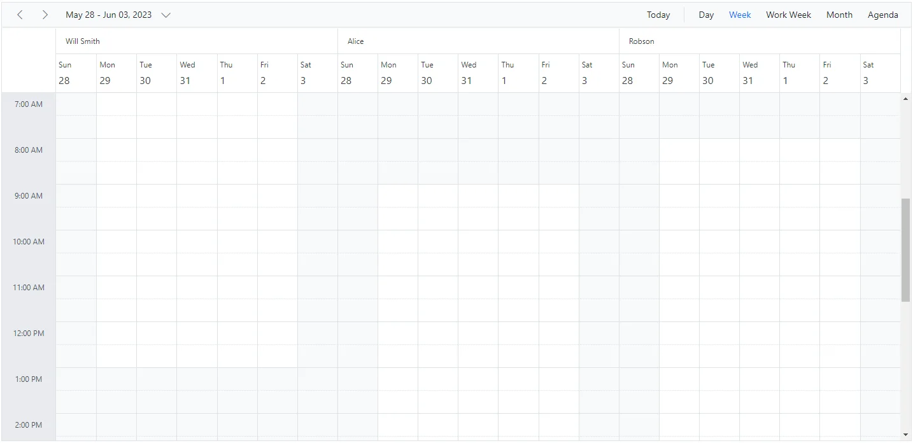

### Hide non-working days when grouped by date

In Scheduler, you can set custom work days for each resource and group the Scheduler by date to display those work days. By default, Scheduler shows all days when grouped by date, even if some are not included in the custom work days. However, you can use the [HideNonWorkingDays](https://help.syncfusion.com/cr/blazor/Syncfusion.Blazor.Schedule.ScheduleGroup.html#Syncfusion_Blazor_Schedule_ScheduleGroup_HideNonWorkingDays) property to display only the custom work days.
To use the [HideNonWorkingDays](https://help.syncfusion.com/cr/blazor/Syncfusion.Blazor.Schedule.ScheduleGroup.html#Syncfusion_Blazor_Schedule_ScheduleGroup_HideNonWorkingDays) property, include it in the Scheduler configuration and set it to `true`.
**Example:** To display Scheduler with resources grouped by date for custom working days,
 
```cshtml
@using Syncfusion.Blazor.Schedule
    <SfSchedule TValue="ResourceData" Width="100%" Height="650px">
        <ScheduleGroup ByDate="true" HideNonWorkingDays="@HideNonWorkingDays" Resources="@groupData"></ScheduleGroup>
        <ScheduleResources>
            <ScheduleResource TItem="ResourceData" TValue="int[]" DataSource="@OwnersData" Field="TaskId" Title="Assignee" Name="Owners" TextField="Text" IdField="Id" ColorField="Color" WorkDaysField="WorkDays" AllowMultiple="true"></ScheduleResource>
        </ScheduleResources>
        <ScheduleEventSettings DataSource="@dataSource"></ScheduleEventSettings>
    </SfSchedule>
@code{
    private bool HideNonWorkingDays { get; set; } = true;
    private string[] groupData = new string[] { "Owners" };
    private List<ResourceData> OwnersData { get; set; } = new List<ResourceData> {
        new ResourceData { Text = "Alice", Id= 1, Color = "#df5286", WorkDays = new int[] { 1, 2, 3, 4} },
        new ResourceData { Text = "Smith", Id= 2, Color = "#5978ee", WorkDays = new int[] { 2, 3, 5 } }
    };
    private List<ResourceData> dataSource = new List<ResourceData>()
    {
        new ResourceData
        {
            Id = 1,
            Subject = "Workflow Analysis",
            StartTime = new DateTime(DateTime.Today.Year, DateTime.Today.Month, DateTime.Today.Day, 9, 30, 0).AddDays(1),
            EndTime = new DateTime(DateTime.Today.Year, DateTime.Today.Month,DateTime.Today.Day, 12, 0, 0).AddDays(1),
            IsAllDay = false,
            ProjectId = 1,
            TaskId = 2
        },
        new ResourceData
        {
            Id = 2,
            Subject = "Requirement planning",
            StartTime = new DateTime(DateTime.Today.Year, DateTime.Today.Month, DateTime.Today.Day, 12, 30, 0),
            EndTime = new DateTime(DateTime.Today.Year, DateTime.Today.Month, DateTime.Today.Day, 14, 45, 0),
            IsAllDay = false,
            ProjectId = 1,
            TaskId = 1
        },
        new ResourceData
        {
            Id = 1,
            Subject = "Quality Analysis",
            StartTime = new DateTime(DateTime.Today.Year, DateTime.Today.Month, DateTime.Today.Day, 10, 0, 0).AddDays(1),
            EndTime = new DateTime(DateTime.Today.Year, DateTime.Today.Month, DateTime.Today.Day, 12, 30, 0).AddDays(1),
            IsAllDay = false,
            ProjectId = 1,
            TaskId = 1
        },
        new ResourceData
        {
            Id = 1,
            Subject = "Release planing",
            StartTime = new DateTime(DateTime.Today.Year, DateTime.Today.Month, DateTime.Today.Day, 10, 0, 0).AddDays(-1),
            EndTime = new DateTime(DateTime.Today.Year, DateTime.Today.Month, DateTime.Today.Day, 12, 30, 0).AddDays(-1),
            IsAllDay = false,
            ProjectId = 1,
            TaskId = 1
        }
    };
    public class ResourceData
    {
        public string Text { get; set; }
        public int Id { get; set; }
        public string Color { get; set; }
        public int[] WorkDays { get; set; }
        public string Subject { get; set; }
        public DateTime StartTime { get; set; }
        public DateTime EndTime { get; set; }
        public Nullable<bool> IsAllDay { get; set; }
        public int ProjectId { get; set; }
        public int TaskId { get; set; }
    }
}
```

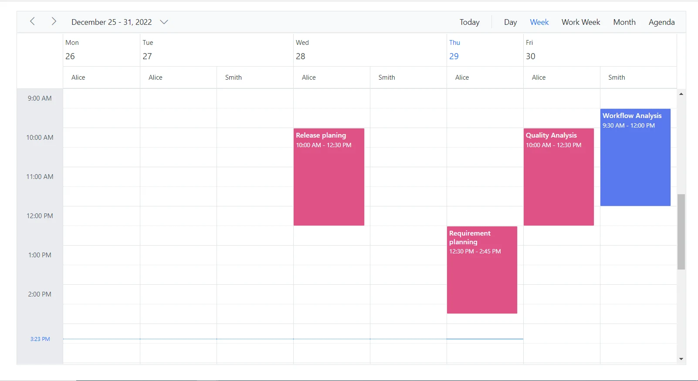

N> The [HideNonWorkingDays](https://help.syncfusion.com/cr/blazor/Syncfusion.Blazor.Schedule.ScheduleGroup.html#Syncfusion_Blazor_Schedule_ScheduleGroup_HideNonWorkingDays) property applies only when Scheduler is grouped by [ByDate](https://help.syncfusion.com/cr/blazor/Syncfusion.Blazor.Schedule.ScheduleGroup.html#Syncfusion_Blazor_Schedule_ScheduleGroup_ByDate).

### Hide non-working days when grouped by date

In Scheduler, you can set custom work days for each resource and group the Scheduler by date to display those work days. By default, Scheduler shows all days when grouped by date, even if some are not included in the custom work days. However, you can use the [HideNonWorkingDays](https://help.syncfusion.com/cr/blazor/Syncfusion.Blazor.Schedule.ScheduleGroup.html#Syncfusion_Blazor_Schedule_ScheduleGroup_HideNonWorkingDays) property to display only the custom work days.

To use the [HideNonWorkingDays](https://help.syncfusion.com/cr/blazor/Syncfusion.Blazor.Schedule.ScheduleGroup.html#Syncfusion_Blazor_Schedule_ScheduleGroup_HideNonWorkingDays) property, include it in the Scheduler configuration and set it to `true`.

**Example:** To display Scheduler with resources grouped by date for custom working days,
 
```cshtml
@using Syncfusion.Blazor.Schedule

    <SfSchedule TValue="ResourceData" Width="100%" Height="650px">
        <ScheduleGroup ByDate="true" HideNonWorkingDays="@HideNonWorkingDays" Resources="@groupData"></ScheduleGroup>
        <ScheduleResources>
            <ScheduleResource TItem="ResourceData" TValue="int[]" DataSource="@OwnersData" Field="TaskId" Title="Assignee" Name="Owners" TextField="Text" IdField="Id" ColorField="Color" WorkDaysField="WorkDays" AllowMultiple="true"></ScheduleResource>
        </ScheduleResources>
        <ScheduleEventSettings DataSource="@dataSource"></ScheduleEventSettings>
    </SfSchedule>
@code{
    private bool HideNonWorkingDays { get; set; } = true;
    private string[] groupData = new string[] { "Owners" };
    private List<ResourceData> OwnersData { get; set; } = new List<ResourceData> {
        new ResourceData { Text = "Alice", Id= 1, Color = "#df5286", WorkDays = new int[] { 1, 2, 3, 4} },
        new ResourceData { Text = "Smith", Id= 2, Color = "#5978ee", WorkDays = new int[] { 2, 3, 5 } }
    };
    private List<ResourceData> dataSource = new List<ResourceData>()
    {
        new ResourceData
        {
            Id = 1,
            Subject = "Workflow Analysis",
            StartTime = new DateTime(DateTime.Today.Year, DateTime.Today.Month, DateTime.Today.Day, 9, 30, 0).AddDays(1),
            EndTime = new DateTime(DateTime.Today.Year, DateTime.Today.Month,DateTime.Today.Day, 12, 0, 0).AddDays(1),
            IsAllDay = false,
            ProjectId = 1,
            TaskId = 2
        },
        new ResourceData
        {
            Id = 2,
            Subject = "Requirement planning",
            StartTime = new DateTime(DateTime.Today.Year, DateTime.Today.Month, DateTime.Today.Day, 12, 30, 0),
            EndTime = new DateTime(DateTime.Today.Year, DateTime.Today.Month, DateTime.Today.Day, 14, 45, 0),
            IsAllDay = false,
            ProjectId = 1,
            TaskId = 1
        },
        new ResourceData
        {
            Id = 1,
            Subject = "Quality Analysis",
            StartTime = new DateTime(DateTime.Today.Year, DateTime.Today.Month, DateTime.Today.Day, 10, 0, 0).AddDays(1),
            EndTime = new DateTime(DateTime.Today.Year, DateTime.Today.Month, DateTime.Today.Day, 12, 30, 0).AddDays(1),
            IsAllDay = false,
            ProjectId = 1,
            TaskId = 1
        },
        new ResourceData
        {
            Id = 1,
            Subject = "Release planing",
            StartTime = new DateTime(DateTime.Today.Year, DateTime.Today.Month, DateTime.Today.Day, 10, 0, 0).AddDays(-1),
            EndTime = new DateTime(DateTime.Today.Year, DateTime.Today.Month, DateTime.Today.Day, 12, 30, 0).AddDays(-1),
            IsAllDay = false,
            ProjectId = 1,
            TaskId = 1
        }
    };
    public class ResourceData
    {
        public string Text { get; set; }
        public int Id { get; set; }
        public string Color { get; set; }
        public int[] WorkDays { get; set; }
        public string Subject { get; set; }
        public DateTime StartTime { get; set; }
        public DateTime EndTime { get; set; }
        public Nullable<bool> IsAllDay { get; set; }
        public int ProjectId { get; set; }
        public int TaskId { get; set; }
    }
}
```

N> The [HideNonWorkingDays](https://help.syncfusion.com/cr/blazor/Syncfusion.Blazor.Schedule.ScheduleGroup.html#Syncfusion_Blazor_Schedule_ScheduleGroup_HideNonWorkingDays) property applies only when Scheduler is grouped by [ByDate](https://help.syncfusion.com/cr/blazor/Syncfusion.Blazor.Schedule.ScheduleGroup.html#Syncfusion_Blazor_Schedule_ScheduleGroup_ByDate).

## Compact view in mobile

Although Scheduler views are designed to be responsive on mobile devices, it can be difficult to view all resources and related events at once when Scheduler uses multiple resources. Therefore, compact mode is introduced specifically for displaying multiple Scheduler resources on mobile devices. By default, this mode is enabled when multiple resources are used on mobile devices. If you need to disable compact mode, set [`EnableCompactView`](https://help.syncfusion.com/cr/blazor/Syncfusion.Blazor.Schedule.ScheduleGroup.html#Syncfusion_Blazor_Schedule_ScheduleGroup_EnableCompactView) to `false` within the [`ScheduleGroup`](https://help.syncfusion.com/cr/blazor/Syncfusion.Blazor.Schedule.ScheduleGroup.html) property. Disabling this option will display the desktop Scheduler view on mobile devices.

With compact view enabled on mobile, you can view only one resource at a time. To switch to other resources, use the TreeView on the left, which lists the available resources and displays the selected resource and its appointments.


## Adaptive UI in desktop

By default, the Scheduler layout adapts automatically in desktop and mobile devices with appropriate UI changes. If you want to display the adaptive Scheduler in desktop mode with adaptive enhancements, set the [`EnableAdaptiveUI`](https://help.syncfusion.com/cr/blazor/Syncfusion.Blazor.Schedule.SfSchedule-1.html#Syncfusion_Blazor_Schedule_SfSchedule_1_EnableAdaptiveUI) property to `true`. This displays the mobile Scheduler layout on desktop devices.

Some of the default changes made for compact Scheduler in desktop devices are as follows:
* View options displayed in the Navigation drawer.
* Plus icon is added to the header for new event creation.
* Today icon is added to the header instead of the Today button.
* With Multiple resources – only one resource has been shown to enhance the view experience of resource events details clearly. To switch to other resources, there is a TreeView on the left that lists all other available resources, clicking on which will display that particular resource and its related events.

To get started quickly with adaptive UI in Scheduler, watch this video:



```cshtml
@using Syncfusion.Blazor.Schedule

<SfSchedule TValue="AppointmentData" Width="100%" Height="650px" @bind-SelectedDate="@CurrentDate" @bind-CurrentView="@CurrentView" EnableAdaptiveUI="true">
    <ScheduleGroup Resources="@GroupData"></ScheduleGroup>
    <ScheduleResources>
        <ScheduleResource TItem="ResourceData" TValue="int" DataSource="@ProjectData" Field="ProjectId" Title="Choose Project" Name="Projects" TextField="Text" IdField="Id" ColorField="Color"></ScheduleResource>
        <ScheduleResource TItem="ResourceData" TValue="int[]" DataSource="@TaskData" Field="TaskId" Title="Category" Name="Categories" TextField="Text" IdField="Id" GroupIDField="GroupId" ColorField="Color" AllowMultiple="true"></ScheduleResource>
    </ScheduleResources>
    <ScheduleViews>
        <ScheduleView Option="View.Day"></ScheduleView>
        <ScheduleView Option="View.Week"></ScheduleView>
        <ScheduleView Option="View.Month"></ScheduleView>
    </ScheduleViews>
    <ScheduleEventSettings DataSource="@DataSource"></ScheduleEventSettings>
</SfSchedule>

@code{
    private View CurrentView = View.Month;
    public DateTime CurrentDate = new DateTime(2023, 6, 1);
    List<AppointmentData> DataSource = new List<AppointmentData>
    {
         new AppointmentData { Id = 1, Subject = "Meeting", StartTime = new DateTime(2023, 6, 16, 9, 30, 0) , EndTime = new DateTime(2023, 6, 16, 11, 0, 0), ProjectId = 1, TaskId = 1 }
    };
    private string[] GroupData = new string[] { "Projects", "Categories" };
    private List<ResourceData> ProjectData { get; set; } = new List<ResourceData> {
        new ResourceData {Text = "PROJECT 1", Id= 1, Color= "#cb6bb2"},
        new ResourceData {Text = "PROJECT 2", Id= 2, Color= "#56ca85"},
        new ResourceData {Text = "PROJECT 3", Id= 3, Color= "#df5286"}
    };
    private List<ResourceData> TaskData { get; set; } = new List<ResourceData> {
        new ResourceData { Text = "Nancy", Id= 1, GroupId = 1, Color = "#df5286" },
        new ResourceData { Text = "Steven", Id= 2, GroupId = 1, Color = "#7fa900" },
        new ResourceData { Text = "Robert", Id= 3, GroupId = 2, Color = "#ea7a57" },
        new ResourceData { Text = "Smith", Id= 4, GroupId = 2, Color = "#5978ee" },
        new ResourceData { Text = "Michael", Id= 5, GroupId = 3, Color = "#df5286" },
        new ResourceData { Text = "Root", Id= 6, GroupId = 3, Color = "#00bdae" }
    };
    public class ResourceData
    {
        public string Text { get; set; }
        public int Id { get; set; }
        public int GroupId { get; set; }
        public string Color { get; set; }
    }
    public class AppointmentData
    {
        public int Id { get; set; }
        public string Subject { get; set; }
        public string Location { get; set; }
        public DateTime StartTime { get; set; }
        public DateTime EndTime { get; set; }
        public string Description { get; set; }
        public bool IsAllDay { get; set; }
        public string RecurrenceRule { get; set; }
        public string RecurrenceException { get; set; }
        public Nullable<int> RecurrenceID { get; set; }
        public int ProjectId { get; set; }
        public int TaskId { get; set; }
    }
}
```

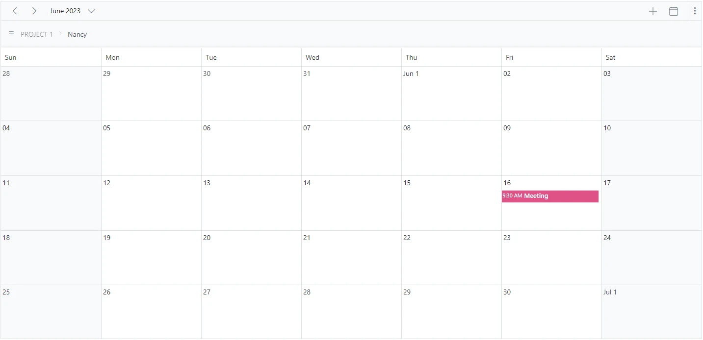

## See also

[How to use Blazor Scheduler to create an Airfare Calendar](https://www.youtube.com/watch?v=QlzdcZTmOrU-0)
[How to expand or collapse a resource programmatically](./how-to/expand-collapse-resource-dynamically)