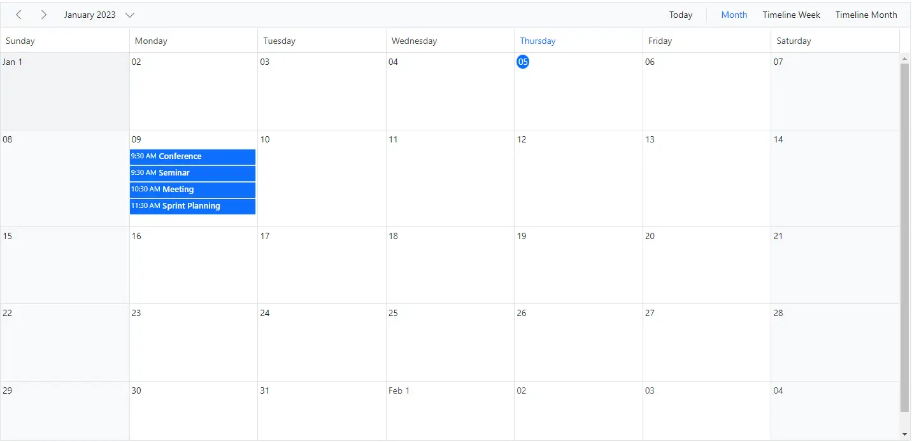
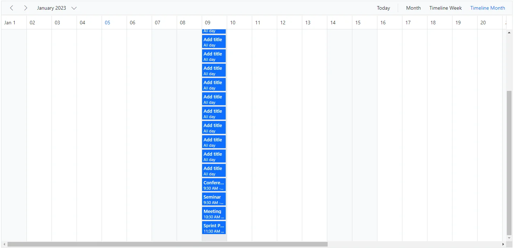
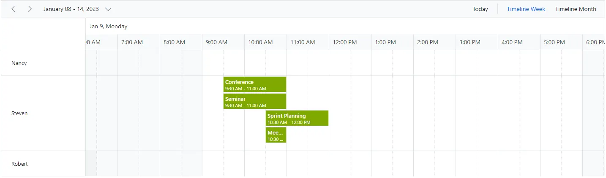
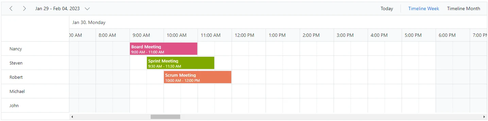

# Row Auto Height in Blazor Scheduler

By default, the height of Scheduler rows in timeline views is static. When the same time range contains multiple overlapping appointments, a `+n more` indicator is displayed. With this feature enabled, you can view all overlapping appointments in that time range by auto-adjusting the row height instead of showing the `+n more` indicator.

To enable auto row height adjustments in Scheduler timeline views and the Month view, set the [`EnableAutoRowHeight`](https://help.syncfusion.com/cr/blazor/Syncfusion.Blazor.Schedule.SfSchedule-1.html#Syncfusion_Blazor_Schedule_SfSchedule_1_EnableAutoRowHeight) property to `true`. The default value is `false`.

N> This auto row height adjustment is applicable only to timeline views and the calendar Month view.

The following sections show how it works in the supported views.

When [`EnableAutoRowHeight`](https://help.syncfusion.com/cr/blazor/Syncfusion.Blazor.Schedule.SfSchedule-1.html#Syncfusion_Blazor_Schedule_SfSchedule_1_EnableAutoRowHeight) is enabled, the row height is automatically adjusted based on the number of overlapping events in the same time range, as shown in the following example.

To get started quickly with row auto height in Scheduler, watch this video:



```cshtml
@using Syncfusion.Blazor.Schedule

<SfSchedule TValue="AppointmentData" Height="650px" EnableAutoRowHeight="true">
    <ScheduleViews>
        <ScheduleEventSettings DataSource="@DataSource"></ScheduleEventSettings>
        <ScheduleView Option="View.Month"></ScheduleView>
        <ScheduleView Option="View.TimelineWeek"></ScheduleView>
        <ScheduleView Option="View.TimelineMonth"></ScheduleView>
    </ScheduleViews>
</SfSchedule>
@code{
    DateTime CurrentDate = new DateTime(2023, 1, 8);
    List<AppointmentData> DataSource = new List<AppointmentData>
    {
        new AppointmentData { Id = 1, Subject = "Meeting", StartTime = new DateTime(2023, 1, 9, 10, 30, 0) , EndTime = new DateTime(2023, 1, 9, 11, 0, 0) },
        new AppointmentData { Id = 2, Subject = "Conference", StartTime = new DateTime(2023, 1, 9, 9, 30, 0) , EndTime = new DateTime(2023, 1, 9, 11, 0, 0) },
        new AppointmentData { Id = 3, Subject = "Seminar", StartTime = new DateTime(2023, 1, 9, 9, 30, 0) , EndTime = new DateTime(2023, 1, 9, 11, 0, 0) },
        new AppointmentData { Id = 4, Subject = "Sprint Planning", StartTime = new DateTime(2023, 1, 9, 11, 30, 0) , EndTime = new DateTime(2023, 1, 9, 12, 0, 0) }
    };
    public class AppointmentData
    {
        public int Id { get; set; }
        public string Subject { get; set; }
        public string Location { get; set; }
        public DateTime StartTime { get; set; }
        public DateTime EndTime { get; set; }
        public string Description { get; set; }
        public bool IsAllDay { get; set; }
        public string RecurrenceRule { get; set; }
        public string RecurrenceException { get; set; }
        public Nullable<int> RecurrenceID { get; set; }
    }
}
```





## Timeline views with multiple resources

In timeline views with multiple resources, auto row height adjusts each resource row based on the overlapping appointments it contains.

```cshtml
@using Syncfusion.Blazor.Schedule

<SfSchedule TValue="AppointmentData" Height="650px" EnableAutoRowHeight="true">
    <ScheduleGroup Resources="@Resources"></ScheduleGroup>
    <ScheduleResources>
        <ScheduleResource TItem="ResourceData" TValue="int" DataSource="@OwnerData" Field="OwnerId" Title="Owner" Name="Owner" TextField="Text" IdField="Id" ColorField="Color"></ScheduleResource>
    </ScheduleResources>
    <ScheduleEventSettings DataSource="@DataSource"></ScheduleEventSettings>
    <ScheduleViews>
        <ScheduleView Option="View.TimelineWeek"></ScheduleView>
        <ScheduleView Option="View.TimelineMonth"></ScheduleView>
    </ScheduleViews>
</SfSchedule>

@code{
    DateTime CurrentDate = new DateTime(2023, 1, 9);
    public string[] Resources { get; set; } = { "Owner" };
    private List<ResourceData> OwnerData { get; set; } = new List<ResourceData> {
        new ResourceData { Text = "Nancy", Id= 1, Color = "#df5286" },
        new ResourceData { Text = "Steven", Id= 2, Color = "#7fa900" },
        new ResourceData { Text = "Robert", Id= 3, Color = "#ea7a57" }
    };
    List<AppointmentData> DataSource = new List<AppointmentData>
    {
        new AppointmentData { Id = 1, OwnerId = 2,Subject = "Meeting", StartTime = new DateTime(2023, 1, 9, 10, 30, 0) , EndTime = new DateTime(2023, 1, 9, 11, 0, 0) },
        new AppointmentData { Id = 2, OwnerId = 2,Subject = "Conference", StartTime = new DateTime(2023, 1, 9, 9, 30, 0) , EndTime = new DateTime(2023, 1, 9, 11, 0, 0) },
        new AppointmentData { Id = 3, OwnerId = 2,Subject = "Seminar", StartTime = new DateTime(2023, 1, 9, 9, 30, 0) , EndTime = new DateTime(2023, 1, 9, 11, 0, 0) },
        new AppointmentData { Id = 4, OwnerId = 2, Subject = "Sprint Planning", StartTime = new DateTime(2023, 1, 9, 10, 30, 0) , EndTime = new DateTime(2023, 1, 9, 12, 0, 0) }
    };
    public class ResourceData
    {
        public int Id { get; set; }
        public string Text { get; set; }
        public string Color { get; set; }
    }
    public class AppointmentData
    {
        public int Id { get; set; }
        public string Subject { get; set; }
        public string Location { get; set; }
        public DateTime StartTime { get; set; }
        public DateTime EndTime { get; set; }
        public string Description { get; set; }
        public bool IsAllDay { get; set; }
        public string RecurrenceRule { get; set; }
        public string RecurrenceException { get; set; }
        public Nullable<int> RecurrenceID { get; set; }
        public int OwnerId { get; set; }
    }
}
```



## Appointments occupying entire cell

By default, when [`EnableAutoRowHeight`](https://help.syncfusion.com/cr/blazor/Syncfusion.Blazor.Schedule.SfSchedule-1.html#Syncfusion_Blazor_Schedule_SfSchedule_1_EnableAutoRowHeight) is enabled, some space remains at the bottom of the cell when an appointment is rendered. To remove this space, set the [`IgnoreWhitespace`](https://help.syncfusion.com/cr/blazor/Syncfusion.Blazor.Schedule.IScheduleEventSettings.html#Syncfusion_Blazor_Schedule_IScheduleEventSettings_IgnoreWhitespace) property in the [`ScheduleEventSettings`](https://help.syncfusion.com/cr/blazor/Syncfusion.Blazor.Schedule.IScheduleEventSettings.html) tag helper to `true`. The default value is `false`.

```cshtml

@using Syncfusion.Blazor.Schedule

<SfSchedule TValue="AppointmentData" Height="350px" EnableAutoRowHeight="true" @bind-SelectedDate="@CurrentDate">
    <ScheduleGroup Resources="@Resources"></ScheduleGroup>
    <ScheduleResources>
        <ScheduleResource TItem="ResourceData" TValue="int" DataSource="@OwnerData" Field="OwnerId" Title="Owner" Name="Owner" TextField="Text" IdField="Id" ColorField="Color"></ScheduleResource>
    </ScheduleResources>
    <ScheduleEventSettings DataSource="@DataSource" IgnoreWhitespace="true"></ScheduleEventSettings>
    <ScheduleViews>
        <ScheduleView Option="View.TimelineWeek"></ScheduleView>
        <ScheduleView Option="View.TimelineMonth"></ScheduleView>
    </ScheduleViews>
</SfSchedule>

@code{
    DateTime CurrentDate = new DateTime(2023, 1, 30);
    public string[] Resources { get; set; } = { "Owner" };
    private List<ResourceData> OwnerData { get; set; } = new List<ResourceData>
{
        new ResourceData { Text = "Nancy", Id= 1, Color = "#df5286" },
        new ResourceData { Text = "Steven", Id= 2, Color = "#7fa900" },
        new ResourceData { Text = "Robert", Id= 3, Color = "#ea7a57" },
        new ResourceData { Text = "Michael", Id= 4, Color = "#df5286" },
        new ResourceData { Text = "John", Id= 5, Color = "#7fa900" }
    };
    private List<AppointmentData> DataSource = new List<AppointmentData>
{
        new AppointmentData {  Id = 1, Subject = "Board Meeting", StartTime = new DateTime(2023, 1, 30, 9, 0, 0), EndTime = new DateTime(2023, 1, 30, 11, 0, 0), OwnerId = 1},
        new AppointmentData {  Id = 2, Subject = "Sprint Meeting", StartTime = new DateTime(2023, 1, 30, 9, 30, 0), EndTime = new DateTime(2023, 1, 30, 11, 30, 0), OwnerId = 2},
        new AppointmentData {  Id = 3, Subject = "Scrum Meeting", StartTime = new DateTime(2023, 1, 30, 10, 0, 0), EndTime = new DateTime(2023, 1, 30, 12, 0, 0), OwnerId = 3}
    };
    public class ResourceData
    {
        public int Id { get; set; }
        public string Text { get; set; }
        public string Color { get; set; }
    }
    public class AppointmentData
    {
        public int Id { get; set; }
        public string Subject { get; set; }
        public string Location { get; set; }
        public DateTime StartTime { get; set; }
        public DateTime EndTime { get; set; }
        public string Description { get; set; }
        public bool IsAllDay { get; set; }
        public string RecurrenceRule { get; set; }
        public string RecurrenceException { get; set; }
        public Nullable<int> RecurrenceID { get; set; }
        public int OwnerId { get; set; }
    }
}
```



N> The [`IgnoreWhitespace`](https://help.syncfusion.com/cr/blazor/Syncfusion.Blazor.Schedule.IScheduleEventSettings.html#Syncfusion_Blazor_Schedule_IScheduleEventSettings_IgnoreWhitespace) property is applicable only when [`EnableAutoRowHeight`](https://help.syncfusion.com/cr/blazor/Syncfusion.Blazor.Schedule.SfSchedule-1.html#Syncfusion_Blazor_Schedule_SfSchedule_1_EnableAutoRowHeight) is enabled.