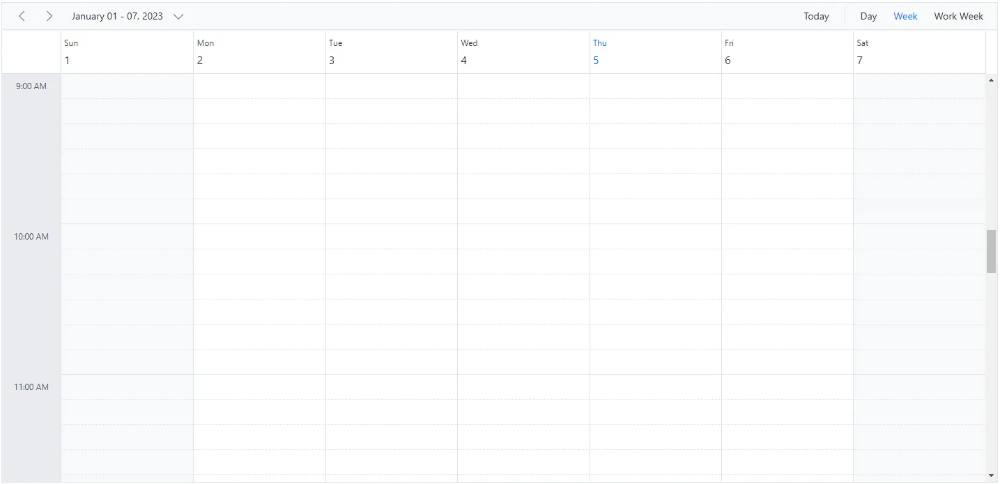
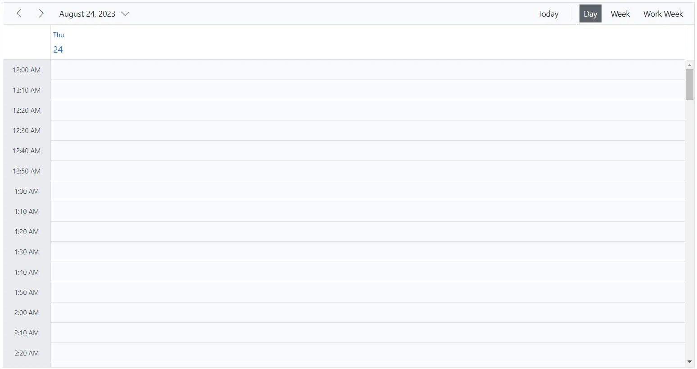
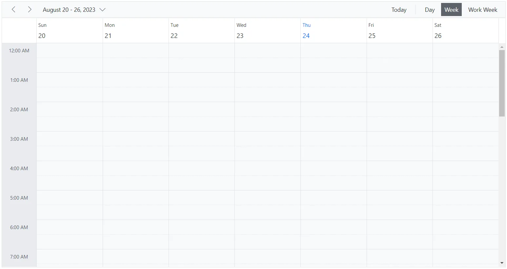
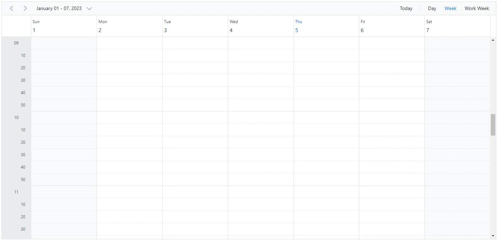
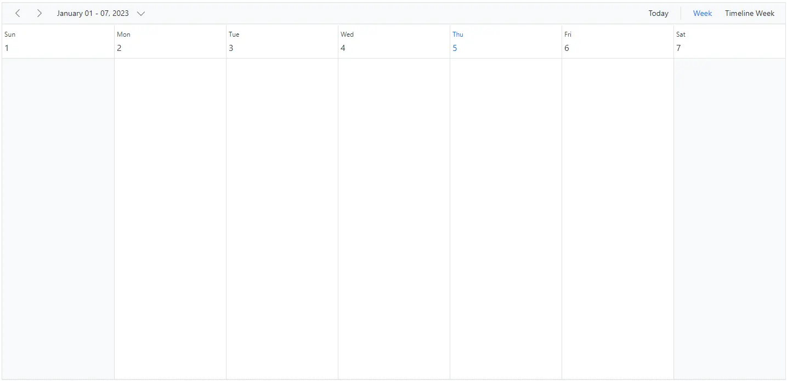
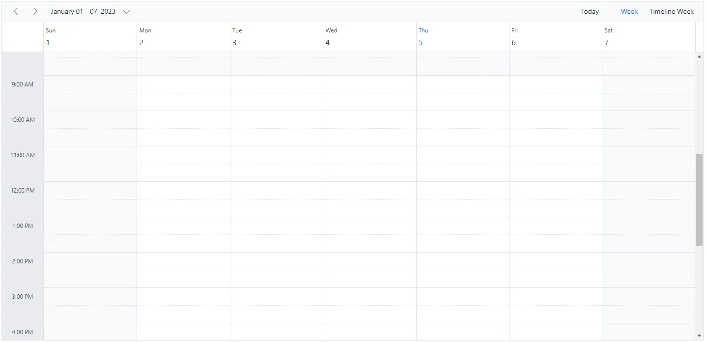

# Timescale Customization in Blazor Scheduler

Time slots are the time cells displayed in the Day, Week, and Work Week views of both the calendar area on the left and the timeline views at the top. The [`ScheduleTimeScale`](https://help.syncfusion.com/cr/blazor/Syncfusion.Blazor.Schedule.ScheduleTimeScale.html) property lets you control the time slot duration for the work cells displayed in Scheduler. It includes the following sub-options:

* [`Enable`](https://help.syncfusion.com/cr/blazor/Syncfusion.Blazor.Schedule.ScheduleTimeScale.html#Syncfusion_Blazor_Schedule_ScheduleTimeScale_Enable) - When set to `true`, Scheduler displays appointments accurately against the exact time duration. When set to `false`, all appointments in a day are displayed one below the other without grid lines. The default value is `true`.
* [`Interval`](https://help.syncfusion.com/cr/blazor/Syncfusion.Blazor.Schedule.ScheduleTimeScale.html#Syncfusion_Blazor_Schedule_ScheduleTimeScale_Interval) - Defines the time duration used for the time axis, such as 1 hour or 30 minutes. It accepts values in minutes and defaults to 60.
* [`SlotCount`](https://help.syncfusion.com/cr/blazor/Syncfusion.Blazor.Schedule.ScheduleTimeScale.html#Syncfusion_Blazor_Schedule_ScheduleTimeScale_SlotCount) - Determines how many slots are split within the specified interval. It defaults to 2, so an hour is shown as two slots of 30 minutes each.

> Note: The upper limit for rendering slots within a single day using the **Interval** and **SlotCount** properties of **ScheduleTimeScale** is 1000. This limit matches the maximum **colspan** value allowed for the **table** element. It applies only to the `TimelineDay`, `TimelineWeek`, and `TimelineWorkWeek` views.

## Setting different time slot duration

The [`Interval`](https://help.syncfusion.com/cr/blazor/Syncfusion.Blazor.Schedule.ScheduleTimeScale.html#Syncfusion_Blazor_Schedule_ScheduleTimeScale_Interval) and [`SlotCount`](https://help.syncfusion.com/cr/blazor/Syncfusion.Blazor.Schedule.ScheduleTimeScale.html#Syncfusion_Blazor_Schedule_ScheduleTimeScale_SlotCount) properties can be used together to set different time slot durations, as shown in the following code example. Here, six time slots represent one hour.

```cshtml
@using Syncfusion.Blazor.Schedule

<SfSchedule TValue="AppointmentData" Height="650px">
    <ScheduleTimeScale Interval="60" SlotCount="6"></ScheduleTimeScale>
    <ScheduleViews>
        <ScheduleView Option="View.Day"></ScheduleView>
        <ScheduleView Option="View.Week"></ScheduleView>
        <ScheduleView Option="View.WorkWeek"></ScheduleView>
    </ScheduleViews>
</SfSchedule>

@code{
    public class AppointmentData
    {
        public int Id { get; set; }
        public string Subject { get; set; }
        public string Location { get; set; }
        public DateTime StartTime { get; set; }
        public DateTime EndTime { get; set; }
        public string Description { get; set; }
        public bool IsAllDay { get; set; }
        public string RecurrenceRule { get; set; }
        public string RecurrenceException { get; set; }
        public Nullable<int> RecurrenceID { get; set; }
    }
}
```



## Adjusting the time slot duration for various views

By using the [Interval](https://help.syncfusion.com/cr/blazor/Syncfusion.Blazor.Schedule.ScheduleViewTimeScale.html#Syncfusion_Blazor_Schedule_ScheduleViewTimeScale_Interval) and [SlotCount](https://help.syncfusion.com/cr/blazor/Syncfusion.Blazor.Schedule.ScheduleViewTimeScale.html#Syncfusion_Blazor_Schedule_ScheduleViewTimeScale_SlotCount) properties within [`ScheduleViewTimeScale`](https://help.syncfusion.com/cr/blazor/Syncfusion.Blazor.Schedule.ScheduleViewTimeScale.html), as a child element of [`ScheduleView`](https://help.syncfusion.com/cr/blazor/Syncfusion.Blazor.Schedule.ScheduleViews.html), you can customize the duration of time slots for individual views. In this example, the `Day` view has six time slots per hour, while the `Week` and `WorkWeek` views have two time slots per hour.

```cshtml
@using Syncfusion.Blazor.Schedule

<SfSchedule TValue="AppointmentData" Height="650px">
    <ScheduleViews>
        <ScheduleView Option="View.Day">
            <ScheduleViewTimeScale Interval="10" SlotCount="1"></ScheduleViewTimeScale>
        </ScheduleView>
        <ScheduleView Option="View.Week">
            <ScheduleViewTimeScale Interval="60" SlotCount="2"></ScheduleViewTimeScale>
        </ScheduleView>
        <ScheduleView Option="View.WorkWeek">
            <ScheduleViewTimeScale Interval="60" SlotCount="2"></ScheduleViewTimeScale>
        </ScheduleView>
    </ScheduleViews>
</SfSchedule>

@code{
    public class AppointmentData
    {
        public int Id { get; set; }
        public string Subject { get; set; }
        public string Location { get; set; }
        public DateTime StartTime { get; set; }
        public DateTime EndTime { get; set; }
        public string Description { get; set; }
        public bool IsAllDay { get; set; }
        public string RecurrenceRule { get; set; }
        public string RecurrenceException { get; set; }
        public Nullable<int> RecurrenceID { get; set; }
    }
}
```




## Customizing time cells using template

The template option allows you to customize time slots as follows:

* [`MajorSlotTemplate`](https://help.syncfusion.com/cr/blazor/Syncfusion.Blazor.Schedule.ScheduleTimeScale.html#Syncfusion_Blazor_Schedule_ScheduleTimeScale_MajorSlotTemplate) - Applies a template to the major time slots. The template accepts an `HTMLElement`, and the rendered content is displayed in the time cells. Time details can be accessed within the template.
* [`MinorSlotTemplate`](https://help.syncfusion.com/cr/blazor/Syncfusion.Blazor.Schedule.ScheduleTimeScale.html#Syncfusion_Blazor_Schedule_ScheduleTimeScale_MinorSlotTemplate) - Applies a template to the minor time slots. The template accepts an `HTMLElement`, and the rendered content is displayed in the time cells. Time details can be accessed within the template.

```cshtml
@using Syncfusion.Blazor.Schedule
@using System.Globalization

<SfSchedule TValue="AppointmentData" Height="650px">
    <ScheduleTimeScale Interval="60" SlotCount="6">
        <MajorSlotTemplate>
            <div>@(majorSlotTemplate((context as TemplateContext).Date))</div>
        </MajorSlotTemplate>
        <MinorSlotTemplate>
            <div style="text-align: right; margin-right: 15px">@(minorSlotTemplate((context as TemplateContext).Date))</div>
        </MinorSlotTemplate>
    </ScheduleTimeScale>
    <ScheduleViews>
        <ScheduleView Option="View.Day"></ScheduleView>
        <ScheduleView Option="View.Week"></ScheduleView>
        <ScheduleView Option="View.WorkWeek"></ScheduleView>
    </ScheduleViews>
</SfSchedule>

@code{
    public static string majorSlotTemplate(DateTime date)
    {
        return date.ToString("hh", CultureInfo.InvariantCulture);
    }
    public static string minorSlotTemplate(DateTime date)
    {
        return date.ToString("mm", CultureInfo.InvariantCulture);
    }
    public class AppointmentData
    {
        public int Id { get; set; }
        public string Subject { get; set; }
        public string Location { get; set; }
        public DateTime StartTime { get; set; }
        public DateTime EndTime { get; set; }
        public string Description { get; set; }
        public bool IsAllDay { get; set; }
        public string RecurrenceRule { get; set; }
        public string RecurrenceException { get; set; }
        public Nullable<int> RecurrenceID { get; set; }
    }
}
```



## Hide the timescale

The grid lines that indicate the exact time duration can be enabled or disabled in Scheduler by setting the [`Enable`](https://help.syncfusion.com/cr/blazor/Syncfusion.Blazor.Schedule.ScheduleTimeScale.html#Syncfusion_Blazor_Schedule_ScheduleTimeScale_Enable) option within [`ScheduleTimeScale`](https://help.syncfusion.com/cr/blazor/Syncfusion.Blazor.Schedule.ScheduleTimeScale.html) to `true` or `false`. Its default value is `true`.

```cshtml
@using Syncfusion.Blazor.Schedule

<SfSchedule TValue="AppointmentData" Height="650px">
    <ScheduleTimeScale Enable="false"></ScheduleTimeScale>
    <ScheduleViews>
        <ScheduleView Option="View.Week"></ScheduleView>
        <ScheduleView Option="View.TimelineWeek" MaxEventsPerRow="10"></ScheduleView>
    </ScheduleViews>
</SfSchedule>

@code{
    public class AppointmentData
    {
        public int Id { get; set; }
        public string Subject { get; set; }
        public string Location { get; set; }
        public DateTime StartTime { get; set; }
        public DateTime EndTime { get; set; }
        public string Description { get; set; }
        public bool IsAllDay { get; set; }
        public string RecurrenceRule { get; set; }
        public string RecurrenceException { get; set; }
        public Nullable<int> RecurrenceID { get; set; }
    }
}
```



## Highlighting current date and time

By default, Scheduler highlights the current date in the header across all views and marks the system time in specific views such as Day, Week, Work Week, Timeline Day, Timeline Week, and Timeline Work Week. To stop showing the current time indicator, set the [`ShowTimeIndicator`](https://help.syncfusion.com/cr/blazor/Syncfusion.Blazor.Schedule.SfSchedule-1.html#Syncfusion_Blazor_Schedule_SfSchedule_1_ShowTimeIndicator) property to `false`. The default value is `true`.

```cshtml
@using Syncfusion.Blazor.Schedule

<SfSchedule TValue="AppointmentData" Height="650px" ShowTimeIndicator="false">
    <ScheduleViews>
        <ScheduleView Option="View.Week"></ScheduleView>
        <ScheduleView Option="View.TimelineWeek" MaxEventsPerRow="10"></ScheduleView>
    </ScheduleViews>
</SfSchedule>

@code{
    public class AppointmentData
    {
        public int Id { get; set; }
        public string Subject { get; set; }
        public string Location { get; set; }
        public DateTime StartTime { get; set; }
        public DateTime EndTime { get; set; }
        public string Description { get; set; }
        public bool IsAllDay { get; set; }
        public string RecurrenceRule { get; set; }
        public string RecurrenceException { get; set; }
        public Nullable<int> RecurrenceID { get; set; }
    }
}
```


