# Views in Blazor Scheduler

The Scheduler includes a wide variety of view modes, each with its own configuration options. The available view modes are Day, Week, Work Week, Month, Agenda, Month Agenda, Timeline Day, Timeline Week, Timeline Work Week, and Timeline Month. By default, the `Week` view is active.

To navigate between different views and dates, use the navigation options in the Scheduler header bar. The active view option is highlighted by default. The date range of the active view is displayed at the left side of the header bar, and clicking it opens a calendar popup for easy date selection.

N> By default, Scheduler displays calendar views such as Day, Week, Work Week, Month, and Agenda.

## Setting specific view on scheduler

As Scheduler displays the `Week` view by default, set the [`CurrentView`](https://help.syncfusion.com/cr/blazor/Syncfusion.Blazor.Schedule.SfSchedule-1.html#Syncfusion_Blazor_Schedule_SfSchedule_1_CurrentView) property to change the active view. The supported view names are:

* Day
* Week
* WorkWeek
* Month
* Agenda
* MonthAgenda
* TimelineDay
* TimelineWeek
* TimelineWorkWeek
* TimelineMonth
* TimelineYear
* Year

It is possible to display only the desired views in Scheduler by using the [`Views`](https://help.syncfusion.com/cr/blazor/Syncfusion.Blazor.Schedule.ScheduleView.html) property.

To get started quickly with customizing individual Scheduler views, watch this video:



In the following example, Scheduler displays two views: `Week` and `TimelineDay`.

```cshtml
@using Syncfusion.Blazor.Schedule

<SfSchedule TValue="AppointmentData" Height="550px" @bind-CurrentView="@CurrentView">
    <ScheduleViews>
        <ScheduleView Option="View.Week"></ScheduleView>
        <ScheduleView Option="View.TimelineDay" MaxEventsPerRow="10"></ScheduleView>
    </ScheduleViews>
</SfSchedule>
@code{
    View CurrentView = View.Week;
    public class AppointmentData
    {
        public int Id { get; set; }
        public string Subject { get; set; }
        public string Location { get; set; }
        public DateTime StartTime { get; set; }
        public DateTime EndTime { get; set; }
        public string Description { get; set; }
        public bool IsAllDay { get; set; }
        public string RecurrenceRule { get; set; }
        public string RecurrenceException { get; set; }
        public Nullable<int> RecurrenceID { get; set; }
    }
}
```

To configure Scheduler with different settings for each view, refer to the following code example. Here, the Week view displays dates in `dd-MM-yyyy` format, while the Month view hides weekend days and is read-only.

```cshtml
@using Syncfusion.Blazor.Schedule

<SfSchedule TValue="AppointmentData" Height="550px" @bind-CurrentView="@CurrentView">
    <ScheduleViews>
        <ScheduleView Option="View.Week" DateFormat="dd-MMM-yyyy"></ScheduleView>
        <ScheduleView Option="View.Month" MaxEventsPerRow="2" Readonly="true" ShowWeekend="false"></ScheduleView>
    </ScheduleViews>
</SfSchedule>
@code{
    View CurrentView = View.Week;
    public class AppointmentData
    {
        public int Id { get; set; }
        public string Subject { get; set; }
        public string Location { get; set; }
        public DateTime StartTime { get; set; }
        public DateTime EndTime { get; set; }
        public string Description { get; set; }
        public bool IsAllDay { get; set; }
        public string RecurrenceRule { get; set; }
        public string RecurrenceException { get; set; }
        public Nullable<int> RecurrenceID { get; set; }
    }
}
```

## View-specific configuration

There are scenarios where each view may need different settings. For such cases, you can define the applicable Scheduler properties within the `Views` property for each view option, as shown in the following examples. The fields available for each view option are listed below.

| Property | Type | Description | Applicable views |
|----------|------|-------------|------------------|
| [`Option`](https://help.syncfusion.com/cr/blazor/Syncfusion.Blazor.Schedule.ScheduleView.html#Syncfusion_Blazor_Schedule_ScheduleView_Option) | `View` | Accepts the Scheduler view name that determines the related properties. The view names can be `Day`, `Week`, and so on. | All views. |
| [`IsSelected`](https://help.syncfusion.com/cr/blazor/Syncfusion.Blazor.Schedule.ScheduleView.html#Syncfusion_Blazor_Schedule_ScheduleView_IsSelected) | bool | Works like the `CurrentView` property and defines the active Scheduler view. | All views. |
| [`DateFormat`](https://help.syncfusion.com/cr/blazor/Syncfusion.Blazor.Schedule.ScheduleView.html#Syncfusion_Blazor_Schedule_ScheduleView_DateFormat) | string | By default, Scheduler follows the date format of the assigned culture. When defined for a specific view, only that view uses this format. | All views. |
| [`Readonly`](https://help.syncfusion.com/cr/blazor/Syncfusion.Blazor.Schedule.ScheduleView.html#Syncfusion_Blazor_Schedule_ScheduleView_Readonly) | bool | When set to `true`, prevents CRUD actions on the view where it is defined. | All views. |
| [`ResourceHeaderTemplate`](https://help.syncfusion.com/cr/blazor/Syncfusion.Blazor.Schedule.ScheduleView.html#Syncfusion_Blazor_Schedule_ScheduleView_ResourceHeaderTemplate) | string | Used to customize the resource header cells in Scheduler. It is applied only to the views where it is defined. | All views. |
| [`DateHeaderTemplate`](https://help.syncfusion.com/cr/blazor/Syncfusion.Blazor.Schedule.ScheduleView.html#Syncfusion_Blazor_Schedule_ScheduleView_DateHeaderTemplate) | string | Used to customize the date header cells. It is applied only to the views where it is defined. | All views. |
| [`EventTemplate`](https://help.syncfusion.com/cr/blazor/Syncfusion.Blazor.Schedule.ScheduleView.html#Syncfusion_Blazor_Schedule_ScheduleView_EventTemplate) | string | Used to customize the event appearance. It is applied to the events in the view where it is defined. | All views. |
| [`ShowWeekend`](https://help.syncfusion.com/cr/blazor/Syncfusion.Blazor.Schedule.ScheduleView.html#Syncfusion_Blazor_Schedule_ScheduleView_ShowWeekend) | bool | When set to `false`, hides weekend days from the views where it is defined. | All views. |
| [`Group`](https://help.syncfusion.com/cr/blazor/Syncfusion.Blazor.Schedule.ScheduleGroup.html) | `GroupModel` | Allows different resource grouping options in all available Scheduler view modes. | All views. |
| [`CellTemplate`](https://help.syncfusion.com/cr/blazor/Syncfusion.Blazor.Schedule.ScheduleView.html#Syncfusion_Blazor_Schedule_ScheduleView_CellTemplate) | string | Used to customize Scheduler work cells. It is applied only to the views where it is defined. | All views except Agenda. |
| [`WorkDays`](https://help.syncfusion.com/cr/blazor/Syncfusion.Blazor.Schedule.ScheduleView.html#Syncfusion_Blazor_Schedule_ScheduleView_WorkDays) | int[] | Used to set the working days in Scheduler views. | All views except Agenda. |
| [`DisplayName`](https://help.syncfusion.com/cr/blazor/Syncfusion.Blazor.Schedule.ScheduleView.html#Syncfusion_Blazor_Schedule_ScheduleView_DisplayName) | string | Used to set a different display name for customized interval views. | All views except Agenda and Month Agenda. |
| [`Interval`](https://help.syncfusion.com/cr/blazor/Syncfusion.Blazor.Schedule.ScheduleView.html#Syncfusion_Blazor_Schedule_ScheduleView_Interval) | int | Used to customize Scheduler views with different sets of days, weeks, work weeks, or months. | All views except Agenda and Month Agenda. |
| [`StartHour`](https://help.syncfusion.com/cr/blazor/Syncfusion.Blazor.Schedule.ScheduleView.html#Syncfusion_Blazor_Schedule_ScheduleView_StartHour) | string | Specifies the start hour from which Scheduler should be displayed. It accepts a time string in a short skeleton format and hides time beyond the specified start time. | Day, Week, Work Week, Timeline Day, Timeline Week, and Timeline Work Week. |
| [`EndHour`](https://help.syncfusion.com/cr/blazor/Syncfusion.Blazor.Schedule.ScheduleView.html#Syncfusion_Blazor_Schedule_ScheduleView_EndHour) | string | Specifies the end hour at which Scheduler ends. It accepts a time string in a short skeleton format. | Day, Week, Work Week, Timeline Day, Timeline Week, and Timeline Work Week. |
| [`TimeScale`](https://help.syncfusion.com/cr/blazor/Syncfusion.Blazor.Schedule.ScheduleTimeScale.html) | `TimeScaleModel` | Used to set different timescale configurations for each applicable view mode. | Day, Week, Work Week, Timeline Day, Timeline Week, and Timeline Work Week. |
| [`ShowWeekNumber`](https://help.syncfusion.com/cr/blazor/Syncfusion.Blazor.Schedule.ScheduleView.html#Syncfusion_Blazor_Schedule_ScheduleView_ShowWeekNumber) | bool | When set to `true`, shows the week number for the corresponding weeks. | Day, Week, Work Week, and Month. |
| [`AllowVirtualScrolling`](https://help.syncfusion.com/cr/blazor/Syncfusion.Blazor.Schedule.ScheduleView.html#Syncfusion_Blazor_Schedule_ScheduleView_AllowVirtualScrolling) | bool | Enables or disables virtual scrolling. | Agenda and Timeline views. |
| [`HeaderRows`](https://help.syncfusion.com/cr/blazor/Syncfusion.Blazor.Schedule.ScheduleView.html#Syncfusion_Blazor_Schedule_ScheduleView_HeaderRows) | `HeaderRowsModel` | Defines custom header rows on timeline views to display year, month, week, date, and hour labels as separate rows. | Timeline views only. |

### Day view

Usually, a day view displays a single day with all related appointments. It is possible to customize the day view to display more days by extending the [`Views`](https://help.syncfusion.com/cr/blazor/Syncfusion.Blazor.Schedule.ScheduleView.html) property with the [`Interval`](https://help.syncfusion.com/cr/blazor/Syncfusion.Blazor.Schedule.ScheduleView.html#Syncfusion_Blazor_Schedule_ScheduleView_Interval) option. You can also define any of the above properties within the [`ScheduleView`](https://help.syncfusion.com/cr/blazor/Syncfusion.Blazor.Schedule.ScheduleView.html) tag helper, as shown in the following code example.

```cshtml
@using Syncfusion.Blazor.Schedule

<SfSchedule TValue="AppointmentData" Height="550px" @bind-SelectedDate="CurrentDate">
    <ScheduleViews>
        <ScheduleView Option="View.Day" Interval="3"></ScheduleView>
    </ScheduleViews>
    <ScheduleEventSettings DataSource="@DataSource"></ScheduleEventSettings>
</SfSchedule>

@code{
    DateTime CurrentDate = new DateTime(2023, 3, 10);
    List<AppointmentData> DataSource = new List<AppointmentData>
    {
        new AppointmentData { Id = 1, Subject = "Meeting", StartTime = new DateTime(2023, 3, 10, 10, 0, 0) , EndTime = new DateTime(2023, 3, 10, 12, 0, 0) },
        new AppointmentData { Id = 2, Subject = "Conference", StartTime = new DateTime(2023, 3, 11, 9, 30, 0) , EndTime = new DateTime(2023, 3, 11, 12, 0, 0) }
    };
    public class AppointmentData
    {
        public int Id { get; set; }
        public string Subject { get; set; }
        public string Location { get; set; }
        public DateTime StartTime { get; set; }
        public DateTime EndTime { get; set; }
        public string Description { get; set; }
        public bool IsAllDay { get; set; }
        public string RecurrenceRule { get; set; }
        public string RecurrenceException { get; set; }
        public Nullable<int> RecurrenceID { get; set; }
    }
}
```

N> All the above properties can be accessed within the Day view except [`AllowVirtualScrolling`](https://help.syncfusion.com/cr/blazor/Syncfusion.Blazor.Schedule.ScheduleView.html#Syncfusion_Blazor_Schedule_ScheduleView_AllowVirtualScrolling) and [`HeaderRows`](https://help.syncfusion.com/cr/blazor/Syncfusion.Blazor.Schedule.ScheduleView.html#Syncfusion_Blazor_Schedule_ScheduleView_HeaderRows).

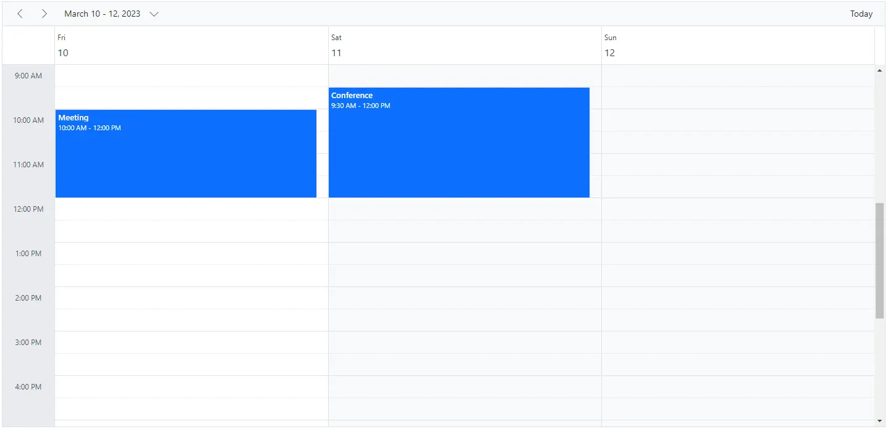

### Week view

The Week view displays seven days, from Sunday to Saturday, with all related appointments. The first day of the week can be changed by using the [`FirstDayOfWeek`](https://help.syncfusion.com/cr/blazor/Syncfusion.Blazor.Schedule.ScheduleView.html#Syncfusion_Blazor_Schedule_ScheduleView_FirstDayOfWeek) property, which accepts an integer value such as Sunday=0, Monday=1, Tuesday=2, and so on. You can navigate to a particular date in Day view from Week view by clicking the appropriate date in the date header bar.

```cshtml
@using Syncfusion.Blazor.Schedule

<SfSchedule TValue="AppointmentData" Height="550px" @bind-SelectedDate="CurrentDate">
    <ScheduleViews>
        <ScheduleView Option="View.Day"></ScheduleView>
        <ScheduleView Option="View.Week" Interval="3" DisplayName="3 Weeks"></ScheduleView>
    </ScheduleViews>
    <ScheduleEventSettings DataSource="@DataSource"></ScheduleEventSettings>  
</SfSchedule>

@code{
    DateTime CurrentDate = new DateTime(2023, 1, 19);
    List<AppointmentData> DataSource = new List<AppointmentData>
    {
        new AppointmentData { Id = 1, Subject = "Meeting", StartTime = new DateTime(2023, 1, 19, 10, 0, 0) , EndTime = new DateTime(2023, 1, 19, 12, 0, 0) },
        new AppointmentData { Id = 2, Subject = "Conference", StartTime = new DateTime(2023, 1, 21, 9, 30, 0) , EndTime = new DateTime(2023, 1, 21, 12, 0, 0) }
    };
    public class AppointmentData
    {
        public int Id { get; set; }
        public string Subject { get; set; }
        public string Location { get; set; }
        public DateTime StartTime { get; set; }
        public DateTime EndTime { get; set; }
        public string Description { get; set; }
        public bool IsAllDay { get; set; }
        public string RecurrenceRule { get; set; }
        public string RecurrenceException { get; set; }
        public Nullable<int> RecurrenceID { get; set; }
    }
}
```

N> All the above properties in the table can be accessed within Week and Work Week views except [`AllowVirtualScrolling`](https://help.syncfusion.com/cr/blazor/Syncfusion.Blazor.Schedule.ScheduleView.html#Syncfusion_Blazor_Schedule_ScheduleView_AllowVirtualScrolling) and [`HeaderRows`](https://help.syncfusion.com/cr/blazor/Syncfusion.Blazor.Schedule.ScheduleView.html#Syncfusion_Blazor_Schedule_ScheduleView_HeaderRows).

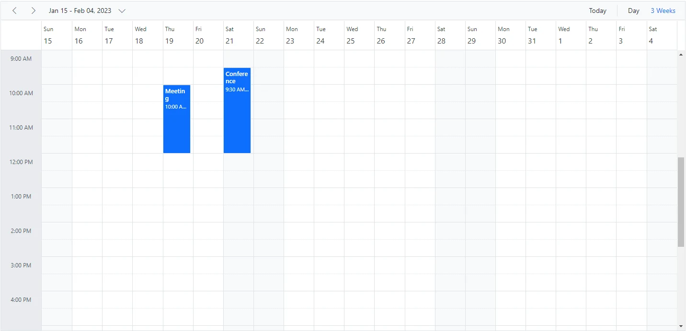

### Work Week view

The Work Week view displays only the five working days of a week and the associated appointments. You can customize the working days by using the [`WorkDays`](https://help.syncfusion.com/cr/blazor/Syncfusion.Blazor.Schedule.ScheduleView.html#Syncfusion_Blazor_Schedule_ScheduleView_WorkDays) property, which accepts an array of integer values such as Sunday=0, Monday=1, Tuesday=2, and so on. By default, it displays Monday through Friday. You can also navigate to a particular date in Day view from Work Week view by clicking the appropriate date in the date header bar.

The following code example shows how to change the start and end hours only in the `Work Week` view of Scheduler.

```cshtml
@using Syncfusion.Blazor.Schedule

<SfSchedule TValue="AppointmentData" Height="550px" @bind-SelectedDate="CurrentDate">
    <ScheduleViews>
        <ScheduleView Option="View.WorkWeek" StartHour="08:00" EndHour="13:00"></ScheduleView>
    </ScheduleViews>
    <ScheduleEventSettings DataSource="@DataSource"></ScheduleEventSettings>
</SfSchedule>

@code{
    DateTime CurrentDate = new DateTime(2023, 1, 17);
    List<AppointmentData> DataSource = new List<AppointmentData>
    {
        new AppointmentData { Id = 1, Subject = "Meeting", StartTime = new DateTime(2023, 1, 17, 10, 0, 0) , EndTime = new DateTime(2023, 1, 17, 12, 0, 0) },
        new AppointmentData { Id = 2, Subject = "Conference", StartTime = new DateTime(2023, 1, 19, 9, 30, 0) , EndTime = new DateTime(2023, 1, 19, 12, 0, 0) }
    };
    public class AppointmentData
    {
        public int Id { get; set; }
        public string Subject { get; set; }
        public string Location { get; set; }
        public DateTime StartTime { get; set; }
        public DateTime EndTime { get; set; }
        public string Description { get; set; }
        public bool IsAllDay { get; set; }
        public string RecurrenceRule { get; set; }
        public string RecurrenceException { get; set; }
        public Nullable<int> RecurrenceID { get; set; }
    }
}
```

N> The Week, Work Week, and Day views can display all-day appointments in a separate row with an expand or collapse option.

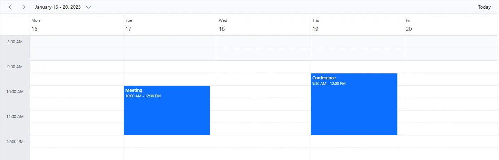

### Month view

A Month view displays all days of a particular month along with the related appointments. You can navigate to a particular date in Day view by clicking the date text in the month cells.

By default, when you create an appointment in Month view, it is treated as an all-day appointment. You can change this behavior by clearing the `All-day` option in the editor window so that it defaults to a start time of 9:00 AM and an end time of 9:30 AM.

By default, Month view shows a single appointment in each day cell. If there is more than one appointment in a day, a `+ more` indicator appears in that cell, and clicking it shows the hidden appointments. You can decide how many appointments render in a day based on the Scheduler and month cell height by using the [`MaxEventsPerRow`](https://help.syncfusion.com/cr/blazor/Syncfusion.Blazor.Schedule.ScheduleView.html#Syncfusion_Blazor_Schedule_ScheduleView_MaxEventsPerRow) property within [`ScheduleView`](https://help.syncfusion.com/cr/blazor/Syncfusion.Blazor.Schedule.ScheduleViews.html). The default value is 1. The following code example shows how to change the working days only in the `Month` view.

```cshtml
@using Syncfusion.Blazor.Schedule

<SfSchedule TValue="AppointmentData" Height="550px" @bind-SelectedDate="CurrentDate">
    <ScheduleViews>
        <ScheduleView Option="View.Month" MaxEventsPerRow="2" WorkDays="@WorkingDays"></ScheduleView>
    </ScheduleViews>
    <ScheduleEventSettings DataSource="@DataSource"></ScheduleEventSettings>
</SfSchedule>
@code{
    public int[] WorkingDays { get; set; } = { 1, 3, 5 };
    DateTime CurrentDate = new DateTime(2023, 2, 1);
    List<AppointmentData> DataSource = new List<AppointmentData>
    {
        new AppointmentData { Id = 1, Subject = "Meeting", StartTime = new DateTime(2023, 2, 13, 10, 0, 0) , EndTime = new DateTime(2023, 2, 13, 12, 0, 0) },
        new AppointmentData { Id = 2, Subject = "Conference", StartTime = new DateTime(2023, 2, 17, 9, 30, 0) , EndTime = new DateTime(2023, 2, 17, 12, 0, 0) },
        new AppointmentData { Id = 3, Subject = "Seminar", StartTime = new DateTime(2023, 2, 22, 14, 30, 0) , EndTime = new DateTime(2023, 2, 22, 18, 0, 0) }
    };
    public class AppointmentData
    {
        public int Id { get; set; }
        public string Subject { get; set; }
        public string Location { get; set; }
        public DateTime StartTime { get; set; }
        public DateTime EndTime { get; set; }
        public string Description { get; set; }
        public bool IsAllDay { get; set; }
        public string RecurrenceRule { get; set; }
        public string RecurrenceException { get; set; }
        public Nullable<int> RecurrenceID { get; set; }
    }
}
```

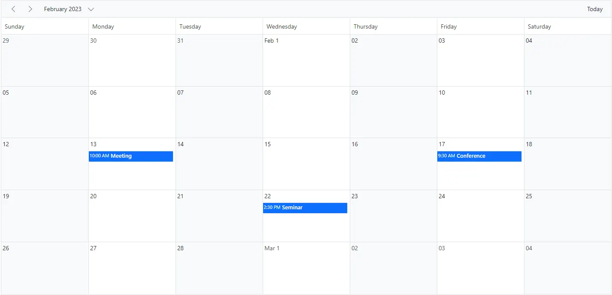

### Agenda view

The Agenda view lists appointments in a grid-like layout for the next seven days by default, starting from the current date. The number of days can be changed by using the [`AgendaDaysCount`](https://help.syncfusion.com/cr/blazor/Syncfusion.Blazor.Schedule.SfSchedule-1.html#Syncfusion_Blazor_Schedule_SfSchedule_1_AgendaDaysCount) property. It allows virtual scrolling of dates by enabling the [`AllowVirtualScrolling`](https://help.syncfusion.com/cr/blazor/Syncfusion.Blazor.Schedule.ScheduleView.html#Syncfusion_Blazor_Schedule_ScheduleView_AllowVirtualScrolling) property. You can also show or hide days with no appointments by setting the [`HideEmptyAgendaDays`](https://help.syncfusion.com/cr/blazor/Syncfusion.Blazor.Schedule.SfSchedule-1.html#Syncfusion_Blazor_Schedule_SfSchedule_1_HideEmptyAgendaDays) property to `true` or `false`.

The following code example depicts how to display events of four days in Agenda view.

```cshtml
@using Syncfusion.Blazor.Schedule

<SfSchedule TValue="AppointmentData" Height="550px" AgendaDaysCount="4" @bind-SelectedDate="CurrentDate">
    <ScheduleViews>
        <ScheduleView Option="View.Agenda"></ScheduleView>
    </ScheduleViews>
    <ScheduleEventSettings DataSource="@DataSource"></ScheduleEventSettings>
</SfSchedule>
@code{
    DateTime CurrentDate = new DateTime(2023, 2, 13);
    List<AppointmentData> DataSource = new List<AppointmentData>
    {
        new AppointmentData { Id = 1, Subject = "Meeting", StartTime = new DateTime(2023, 2, 13, 10, 0, 0) , EndTime = new DateTime(2023, 2, 13, 12, 0, 0) },
        new AppointmentData { Id = 2, Subject = "Conference", StartTime = new DateTime(2023, 2, 15, 9, 30, 0) , EndTime = new DateTime(2023, 2, 15, 12, 0, 0) }
    };
    public class AppointmentData
    {
        public int Id { get; set; }
        public string Subject { get; set; }
        public string Location { get; set; }
        public DateTime StartTime { get; set; }
        public DateTime EndTime { get; set; }
        public string Description { get; set; }
        public bool IsAllDay { get; set; }
        public string RecurrenceRule { get; set; }
        public string RecurrenceException { get; set; }
        public Nullable<int> RecurrenceID { get; set; }
    }
}
```

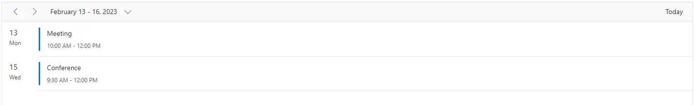

### Month Agenda view

A Month-Agenda view shows a month calendar where clicking a particular day displays the appointments for that date below the calendar. Days with appointments are marked with a circular dot below the calendar date.

The following code example shows how to hide weekend days in `MonthAgenda` view and modify the working days list only for Month Agenda view.

```cshtml
@using Syncfusion.Blazor.Schedule

<SfSchedule TValue="AppointmentData" Height="550px" @bind-SelectedDate="CurrentDate">
    <ScheduleViews>
        <ScheduleView Option="View.MonthAgenda" ShowWeekend="false" WorkDays="@WorkingDays"></ScheduleView>
    </ScheduleViews>
     <ScheduleEventSettings DataSource="@DataSource"></ScheduleEventSettings>
</SfSchedule>

@code{
    public int[] WorkingDays { get; set; } = { 0, 3, 6 };
    DateTime CurrentDate = new DateTime(2023, 2, 12);
    List<AppointmentData> DataSource = new List<AppointmentData>
    {
        new AppointmentData { Id = 1, Subject = "Meeting", StartTime = new DateTime(2023, 2, 12, 10, 0, 0) , EndTime = new DateTime(2023, 2, 12, 12, 0, 0) },
        new AppointmentData { Id = 2, Subject = "Conference", StartTime = new DateTime(2023, 2, 12, 9, 30, 0) , EndTime = new DateTime(2023, 2, 12, 12, 0, 0) },
        new AppointmentData { Id = 3, Subject = "Seminar", StartTime = new DateTime(2023, 2, 22, 14, 30, 0) , EndTime = new DateTime(2023, 2, 22, 18, 0, 0) }
    };
    public class AppointmentData
    {
        public int Id { get; set; }
        public string Subject { get; set; }
        public string Location { get; set; }
        public DateTime StartTime { get; set; }
        public DateTime EndTime { get; set; }
        public string Description { get; set; }
        public bool IsAllDay { get; set; }
        public string RecurrenceRule { get; set; }
        public string RecurrenceException { get; set; }
        public Nullable<int> RecurrenceID { get; set; }
    }
}
```

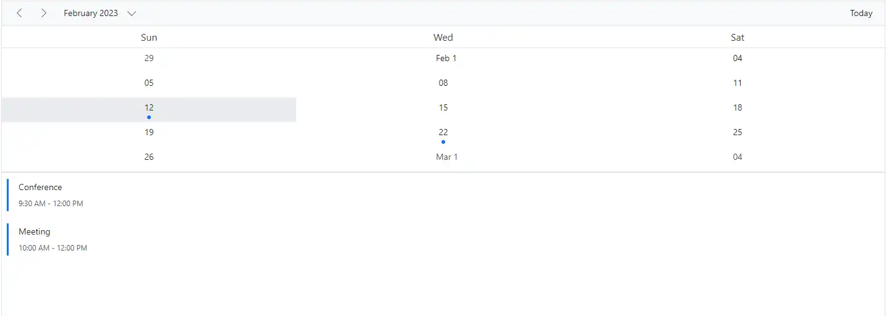

### Timeline views – Day, Week, Work Week

Similar to the vertical Day, Week, and Work Week views, the corresponding timeline views show appointments with time slots displayed horizontally. By default, the cell height adjusts based on the height set for Scheduler, and each cell shows a single appointment. If there is more than one appointment, a `+ more` indicator appears at the bottom of the cell, and clicking it shows the hidden appointments. You can decide how many appointments render in a cell based on the Scheduler and work cell height by using the [`MaxEventsPerRow`](https://help.syncfusion.com/cr/blazor/Syncfusion.Blazor.Schedule.ScheduleView.html#Syncfusion_Blazor_Schedule_ScheduleView_MaxEventsPerRow) property within [`ScheduleView`](https://help.syncfusion.com/cr/blazor/Syncfusion.Blazor.Schedule.ScheduleView.html). The default value is `1`.

```cshtml
@using Syncfusion.Blazor.Schedule

<SfSchedule TValue="AppointmentData" Height="550px" @bind-SelectedDate="CurrentDate">
    <ScheduleViews>
        <ScheduleView Option="View.TimelineDay" StartHour="08:00" EndHour="12:00" ShowWeekend="false" MaxEventsPerRow="10"></ScheduleView>
        <ScheduleView Option="View.TimelineWeek" IsSelected="true" MaxEventsPerRow="10"></ScheduleView>
        <ScheduleView Option="View.TimelineWorkWeek" StartHour="13:00" EndHour="20:00" WorkDays="@WorkingDays" MaxEventsPerRow="10"></ScheduleView>
        <ScheduleView Option="View.Agenda"></ScheduleView>
    </ScheduleViews>
    <ScheduleEventSettings DataSource="@DataSource"></ScheduleEventSettings>
</SfSchedule>
@code{
    public int[] WorkingDays { get; set; } = { 1, 3, 6 };
    DateTime CurrentDate = new DateTime(2023, 2, 13);
    List<AppointmentData> DataSource = new List<AppointmentData>
    {
        new AppointmentData { Id = 1, Subject = "Meeting", StartTime = new DateTime(2023, 2, 13, 14, 0, 0) , EndTime = new DateTime(2023, 2, 13, 16, 0, 0) },
        new AppointmentData { Id = 2, Subject = "Conference", StartTime = new DateTime(2023, 2, 15, 13, 30, 0) , EndTime = new DateTime(2023, 2, 15, 18, 0, 0) }
    };
    public class AppointmentData
    {
        public int Id { get; set; }
        public string Subject { get; set; }
        public string Location { get; set; }
        public DateTime StartTime { get; set; }
        public DateTime EndTime { get; set; }
        public string Description { get; set; }
        public bool IsAllDay { get; set; }
        public string RecurrenceRule { get; set; }
        public string RecurrenceException { get; set; }
        public Nullable<int> RecurrenceID { get; set; }
    }
}
```

N> Clicking the dates in the date header bar of Timeline Day, Timeline Week, and Timeline Work Week allows navigation to the Agenda view.

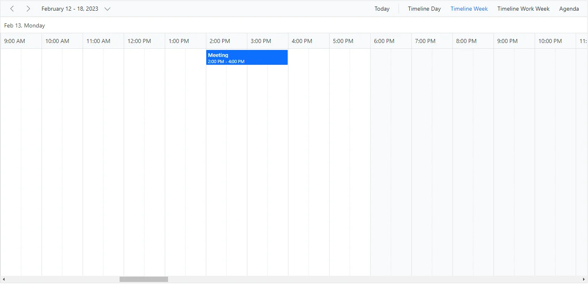

### Timeline Month view

A Timeline Month view displays the current month days along with the appointments.

```cshtml
@using Syncfusion.Blazor.Schedule

<SfSchedule TValue="AppointmentData" Height="550px"@bind-SelectedDate="CurrentDate">
    <ScheduleViews>
        <ScheduleView Option="View.TimelineDay" StartHour="08:00" EndHour="12:00" MaxEventsPerRow="10"></ScheduleView>
        <ScheduleView Option="View.TimelineMonth" IsSelected="true" ShowWeekend="false" MaxEventsPerRow="10"></ScheduleView>
    </ScheduleViews>
    <ScheduleEventSettings DataSource="@DataSource"></ScheduleEventSettings>
</SfSchedule>
@code{
    DateTime CurrentDate = new DateTime(2023, 2, 1);
    List<AppointmentData> DataSource = new List<AppointmentData>
    {
        new AppointmentData { Id = 1, Subject = "Meeting", StartTime = new DateTime(2023, 2, 10, 10, 0, 0) , EndTime = new DateTime(2023, 2, 10, 12, 0, 0) },
        new AppointmentData { Id = 2, Subject = "Conference", StartTime = new DateTime(2023, 2, 10, 9, 30, 0) , EndTime = new DateTime(2023, 2, 10, 12, 0, 0) },
        new AppointmentData { Id = 3, Subject = "Seminar", StartTime = new DateTime(2023, 2, 22, 14, 30, 0) , EndTime = new DateTime(2023, 2, 22, 18, 0, 0) }
    };
    public class AppointmentData
    {
        public int Id { get; set; }
        public string Subject { get; set; }
        public string Location { get; set; }
        public DateTime StartTime { get; set; }
        public DateTime EndTime { get; set; }
        public string Description { get; set; }
        public bool IsAllDay { get; set; }
        public string RecurrenceRule { get; set; }
        public string RecurrenceException { get; set; }
        public Nullable<int> RecurrenceID { get; set; }
    }
}
```

N> Clicking the dates in the date header bar of Timeline Month allows navigation to the Timeline Day view.

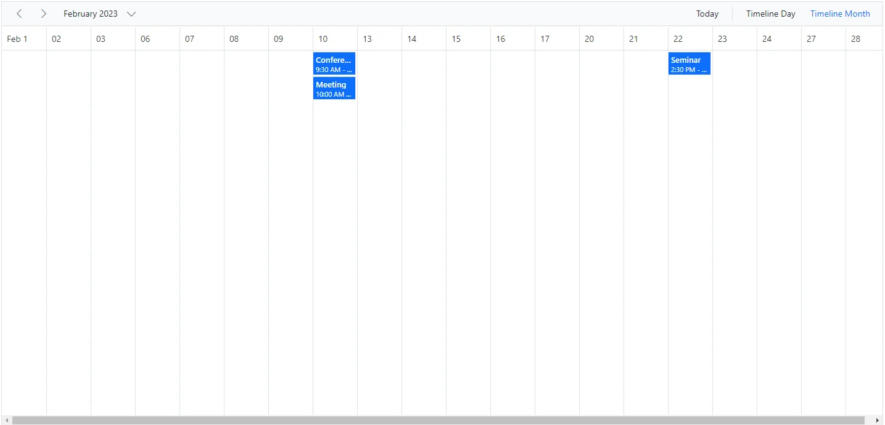

### Timeline Year view

A Timeline Year view displays the complete year along with the appointments.

By default, the Timeline Year view orientation is set to horizontal. In the following code example, the Timeline Year view is set to vertical orientation.

```cshtml
@using Syncfusion.Blazor.Schedule

<SfSchedule TValue="AppointmentData" Width="100%" Height="550px" @bind-SelectedDate="@CurrentDate">
    <ScheduleViews>
        <ScheduleView Option="View.TimelineYear" Orientation="Orientation.Vertical" DisplayName="Horizontal Year"></ScheduleView>
    </ScheduleViews>
    <ScheduleEventSettings DataSource="@DataSource"></ScheduleEventSettings>
</SfSchedule>

@code{
    DateTime CurrentDate = new DateTime(2023, 3, 10);
    List<AppointmentData> DataSource = new List<AppointmentData>
    {
        new AppointmentData { Id = 1, Subject = "Meeting", StartTime = new DateTime(2023, 3, 4, 0, 0, 0) , EndTime = new DateTime(2023, 3, 5, 0, 0, 0) },
        new AppointmentData { Id = 2, Subject = "Conference", StartTime = new DateTime(2023, 5, 1, 9, 30, 0) , EndTime = new DateTime(2023, 5, 1, 12, 0, 0) },
        new AppointmentData { Id = 3, Subject = "Seminar", StartTime = new DateTime(2023, 1, 2, 9, 30, 0) , EndTime = new DateTime(2023, 1, 2, 12, 0, 0) }
    };
    public class AppointmentData
    {
        public int Id { get; set; }
        public string Subject { get; set; }
        public string Location { get; set; }
        public DateTime StartTime { get; set; }
        public DateTime EndTime { get; set; }
        public string Description { get; set; }
        public bool IsAllDay { get; set; }
        public string RecurrenceRule { get; set; }
        public string RecurrenceException { get; set; }
        public Nullable<int> RecurrenceID { get; set; }
    }
}
```

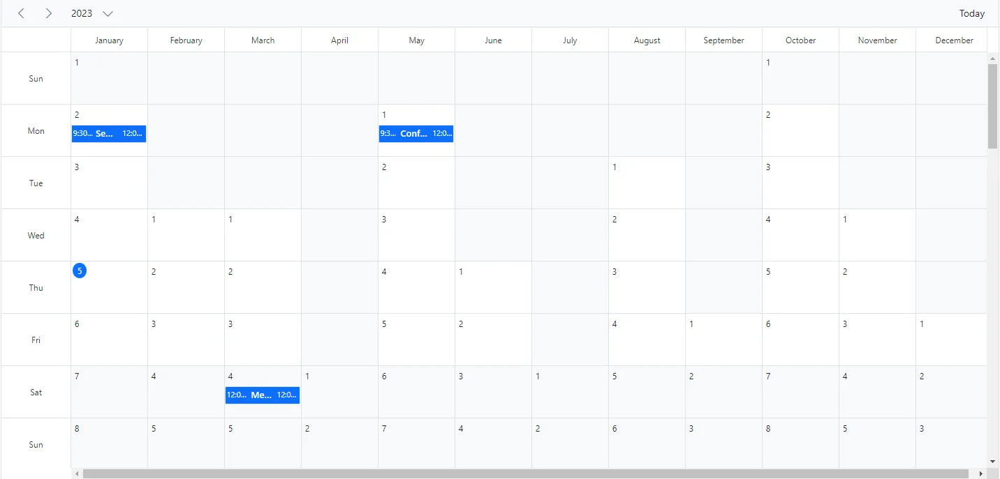

#### Setting the first month of timeline year

By default, months in Timeline Year view are displayed from January to December. You can customize this behavior by using the scheduler [FirstMonthOfYear](https://help.syncfusion.com/cr/blazor/Syncfusion.Blazor.Schedule.SfSchedule-1.html#Syncfusion_Blazor_Schedule_SfSchedule_1_FirstMonthOfYear) property. This property lets you set the first month of the timeline year in Scheduler. Pass an integer value to the [FirstMonthOfYear](https://help.syncfusion.com/cr/blazor/Syncfusion.Blazor.Schedule.SfSchedule-1.html#Syncfusion_Blazor_Schedule_SfSchedule_1_FirstMonthOfYear) property, where 1 represents January, 2 represents February, and so on. This property applies only to Timeline Year view.

```cshtml
@using Syncfusion.Blazor.Schedule

<SfSchedule TValue="AppointmentData" Height="650px" @bind-SelectedDate="@CurrentDate" FirstMonthOfYear="4">
    <ScheduleViews>
        <ScheduleView Option="View.TimelineYear" Orientation="Orientation.Horizontal" DisplayName="Horizontal Timeline Year" IsSelected="true"></ScheduleView>
        <ScheduleView Option="View.TimelineYear" Orientation="Orientation.Vertical" DisplayName="Vertical Timeline Year"></ScheduleView>
        <ScheduleEventSettings DataSource="@DataSource"></ScheduleEventSettings>
    </ScheduleViews>
</SfSchedule>
@code{
    DateTime CurrentDate = new DateTime(2023, 4, 13);
    List<AppointmentData> DataSource = new List<AppointmentData>
    {
    new AppointmentData { Id = 1, Subject = "Paris", StartTime = new DateTime(2023, 5, 3, 10, 0, 0) , EndTime = new DateTime(2023, 5, 3, 12, 0, 0) },
    new AppointmentData { Id = 2, Subject = "Germany", StartTime = new DateTime(2023, 5, 5, 10, 0, 0) , EndTime = new DateTime(2023, 5, 5, 12, 0, 0) }
    };
    public class AppointmentData
    {
        public int Id { get; set; }
        public string Subject { get; set; }
        public string Location { get; set; }
        public DateTime StartTime { get; set; }
        public DateTime EndTime { get; set; }
        public string Description { get; set; }
        public bool IsAllDay { get; set; }
        public string RecurrenceRule { get; set; }
        public string RecurrenceException { get; set; }
        public Nullable<int> RecurrenceID { get; set; }
    }
}
```

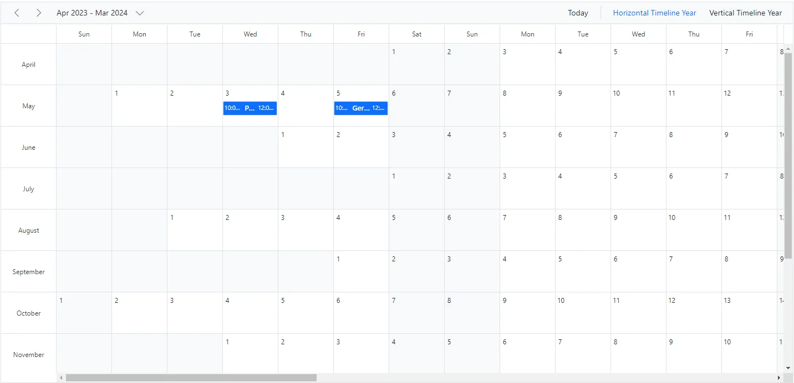

### Year view

The Year view shows a year calendar where clicking a particular day displays the appointments for that date below the calendar. Days with appointments are marked with a circular dot below the calendar date.

```cshtml
@using Syncfusion.Blazor.Schedule

<SfSchedule TValue="AppointmentData" Width="100%" Height="550px" @bind-SelectedDate="@CurrentDate">
    <ScheduleViews>
        <ScheduleView Option="View.Year"></ScheduleView>
    </ScheduleViews>
    <ScheduleEventSettings DataSource="@DataSource"></ScheduleEventSettings>
</SfSchedule>

@code{
    DateTime CurrentDate = new DateTime(2023, 3, 10);
    List<AppointmentData> DataSource = new List<AppointmentData>
    {
        new AppointmentData { Id = 1, Subject = "Meeting", StartTime = new DateTime(2023, 3, 4, 0, 0, 0) , EndTime = new DateTime(2023, 3, 5, 0, 0, 0) },
        new AppointmentData { Id = 2, Subject = "Conference", StartTime = new DateTime(2023, 5, 1, 9, 30, 0) , EndTime = new DateTime(2023, 5, 1, 12, 0, 0) },
        new AppointmentData { Id = 3, Subject = "Seminar", StartTime = new DateTime(2023, 1, 2, 9, 30, 0) , EndTime = new DateTime(2023, 1, 2, 12, 0, 0) }
    };
    public class AppointmentData
    {
        public int Id { get; set; }
        public string Subject { get; set; }
        public string Location { get; set; }
        public DateTime StartTime { get; set; }
        public DateTime EndTime { get; set; }
        public string Description { get; set; }
        public bool IsAllDay { get; set; }
        public string RecurrenceRule { get; set; }
        public string RecurrenceException { get; set; }
        public Nullable<int> RecurrenceID { get; set; }
    }
}
```

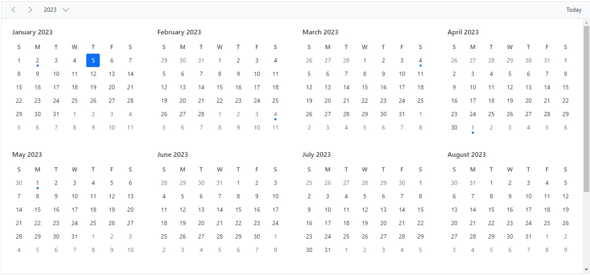

## Extending view intervals

It is possible to customize the default number of days shown in different Scheduler view modes. For example, Day view can be extended to display four days by setting the `Interval` option to 4 for the `Day` option within the [`ScheduleView`](https://help.syncfusion.com/cr/blazor/Syncfusion.Blazor.Schedule.ScheduleView.html), as shown in the following code example. In the same way, you can display three weeks by setting `Interval` to 3 for the `Week` option.

You can provide an alternative display name for such customized views in the Scheduler header bar by setting the appropriate [`DisplayName`](https://help.syncfusion.com/cr/blazor/Syncfusion.Blazor.Schedule.ScheduleView.html#Syncfusion_Blazor_Schedule_ScheduleView_DisplayName) property.

```cshtml
@using Syncfusion.Blazor.Schedule

<SfSchedule TValue="AppointmentData" Height="550px" @bind-SelectedDate="@CurrentDate">
    <ScheduleViews>
        <ScheduleView Option="View.Day" Interval="4" DisplayName="4 Days"></ScheduleView>
        <ScheduleView Option="View.Week" IsSelected="true" Interval="3" DisplayName="3 Weeks"></ScheduleView>
    </ScheduleViews>
    <ScheduleEventSettings DataSource="@DataSource"></ScheduleEventSettings>
</SfSchedule>

@code{
    DateTime CurrentDate = new DateTime(2023, 2, 13);
    List<AppointmentData> DataSource = new List<AppointmentData>
    {
        new AppointmentData { Id = 1, Subject = "Meeting", StartTime = new DateTime(2023, 2, 13, 10, 0, 0) , EndTime = new DateTime(2023, 2, 13, 12, 0, 0) },
        new AppointmentData { Id = 2, Subject = "Conference", StartTime = new DateTime(2023, 2, 15, 9, 30, 0) , EndTime = new DateTime(2023, 2, 15, 11, 0, 0) }
    };
    public class AppointmentData
    {
        public int Id { get; set; }
        public string Subject { get; set; }
        public string Location { get; set; }
        public DateTime StartTime { get; set; }
        public DateTime EndTime { get; set; }
        public string Description { get; set; }
        public bool IsAllDay { get; set; }
        public string RecurrenceRule { get; set; }
        public string RecurrenceException { get; set; }
        public Nullable<int> RecurrenceID { get; set; }
    }
}
```

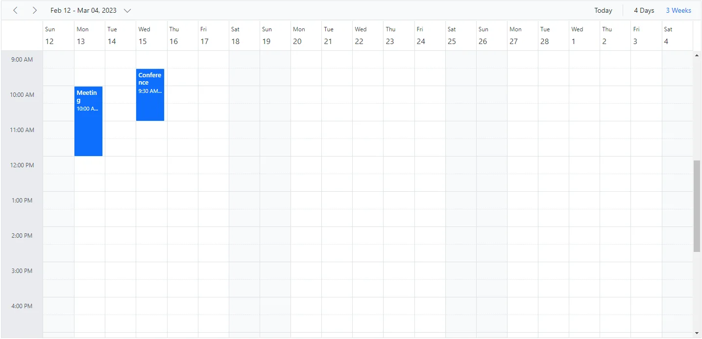

N> View intervals can be extended in all Scheduler view modes except Agenda and Month-Agenda views.
