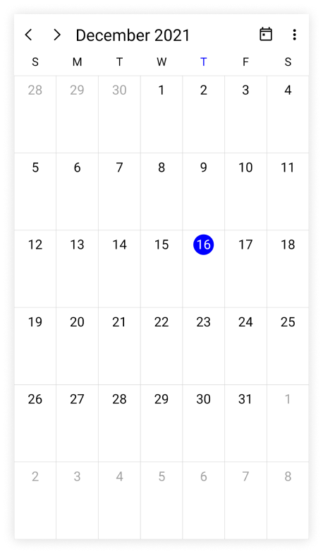
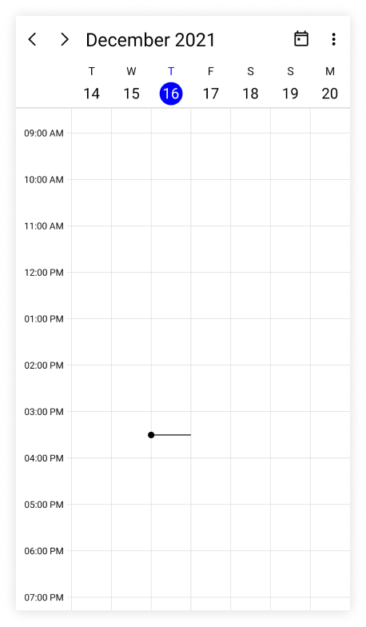
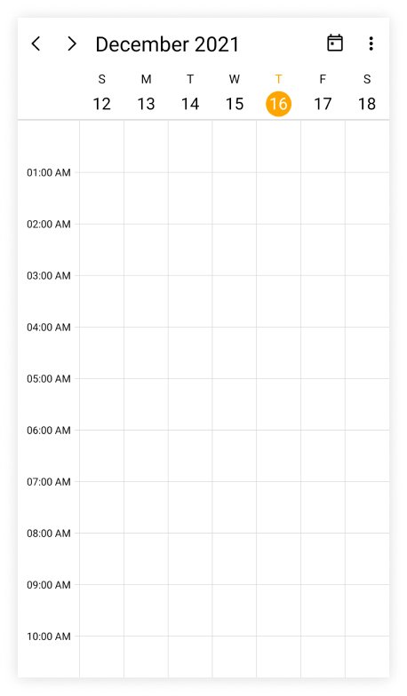
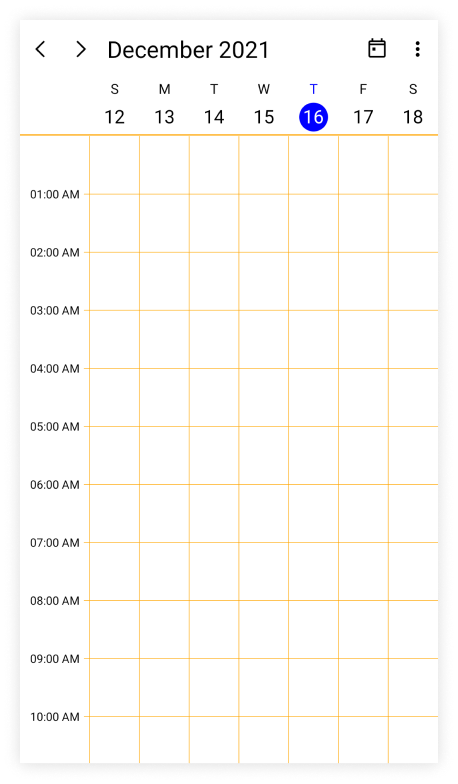
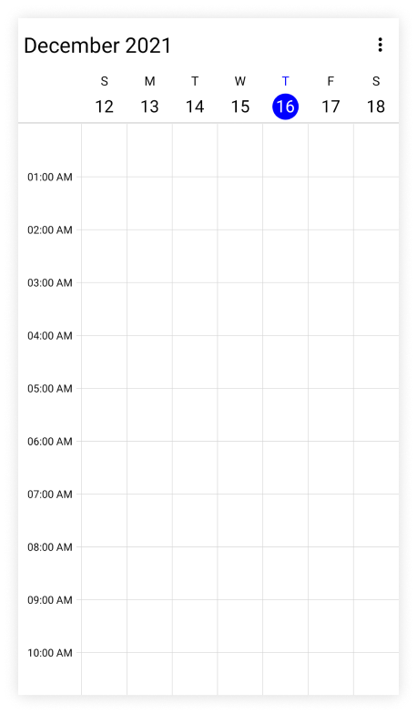
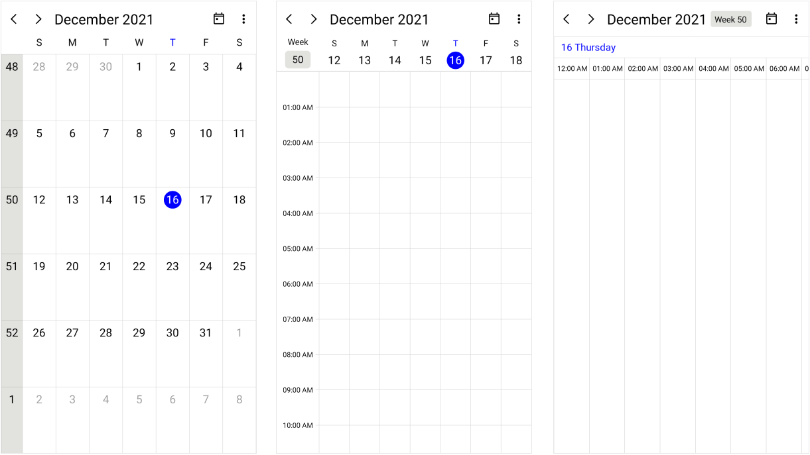
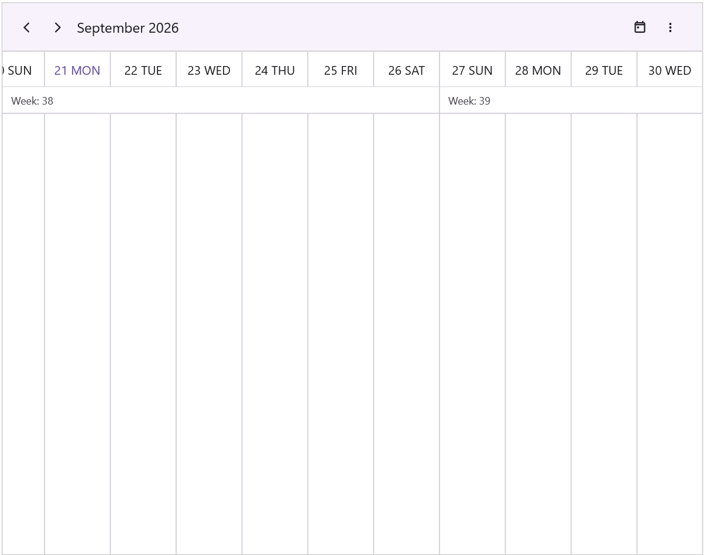
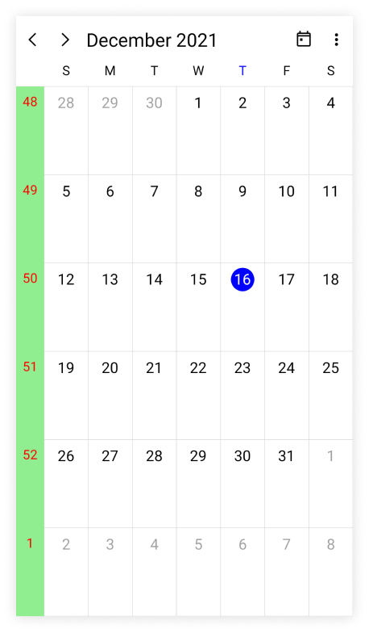
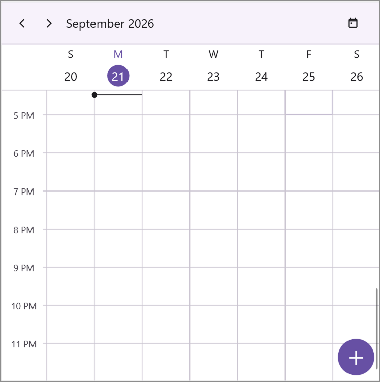
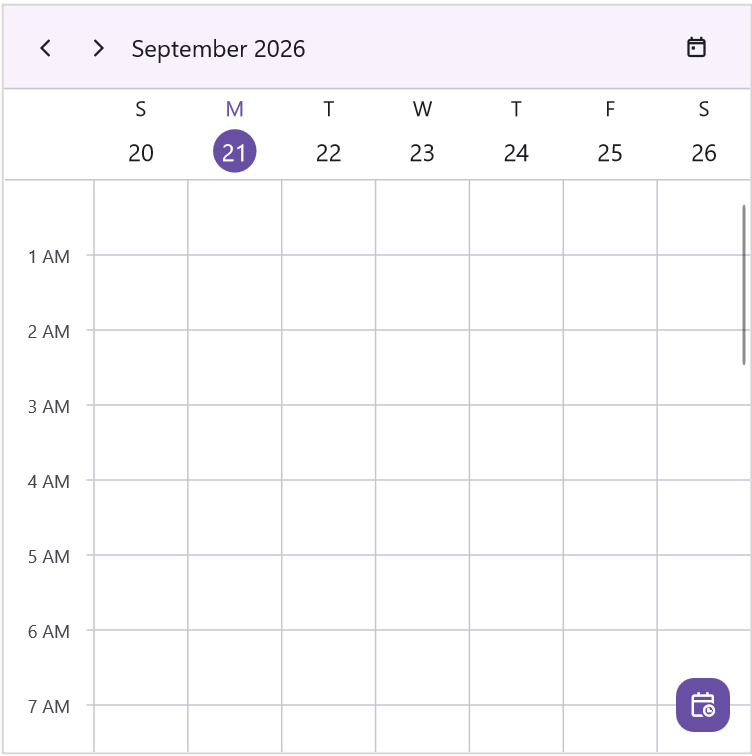

# Customization in .NET MAUI Scheduler
Customization of the [.NET MAUI Scheduler](https://www.syncfusion.com/maui-controls/maui-scheduler) lets you adjust its views, appearance, and functionality to match your application requirements.

## Change different scheduler views

The [.NET MAUI Scheduler](https://help.syncfusion.com/cr/maui/Syncfusion.Maui.Scheduler.SfScheduler.html) control provides nine different types of views to display dates and it can be assigned to the control by using the [View](https://help.syncfusion.com/cr/maui/Syncfusion.Maui.Scheduler.SfScheduler.html#Syncfusion_Maui_Scheduler_SfScheduler_View) property. The control is assigned to the [Day](https://help.syncfusion.com/cr/maui/Syncfusion.Maui.Scheduler.SchedulerView.html#Syncfusion_Maui_Scheduler_SchedulerView_Day) view by default. The current date will be displayed initially for all the Scheduler views.




<ContentPage   
    . . .
    xmlns:scheduler="clr-namespace:Syncfusion.Maui.Scheduler;assembly=Syncfusion.Maui.Scheduler">

    <scheduler:SfScheduler x:Name="scheduler" View="Month"/>
</ContentPage>




using Syncfusion.Maui.Scheduler;

. . .
public partial class MainPage : ContentPage
{
    public MainPage()
    {
        InitializeComponent();
        SfScheduler scheduler = new SfScheduler();
        scheduler.View = SchedulerView.Month;
        this.Content = scheduler;
    }
}




## Change first day of week

The scheduler allows customization on the first day of the week with the [FirstDayOfWeek](https://help.syncfusion.com/cr/maui/Syncfusion.Maui.Scheduler.SfScheduler.html#Syncfusion_Maui_Scheduler_SfScheduler_FirstDayOfWeek) property. The Scheduler will default to `Sunday` as the first day of the week.

The following code shows the Scheduler with `Tuesday` as the first day of the week.

  


<ContentPage   
    . . .
    xmlns:scheduler="clr-namespace:Syncfusion.Maui.Scheduler;assembly=Syncfusion.Maui.Scheduler">

    <scheduler:SfScheduler x:Name="scheduler" FirstDayOfWeek="Tuesday"/>
</ContentPage>




using Syncfusion.Maui.Scheduler;

. . .
public partial class MainPage : ContentPage
{
    public MainPage()
    {
        InitializeComponent();
        SfScheduler scheduler = new SfScheduler();
        scheduler.FirstDayOfWeek = DayOfWeek.Tuesday;
        this.Content = scheduler;
    }
}

  


## Today highlight brush

The today highlight brush of the Scheduler can be customized by using the [TodayHighlightBrush](https://help.syncfusion.com/cr/maui/Syncfusion.Maui.Scheduler.SfScheduler.html#Syncfusion_Maui_Scheduler_SfScheduler_TodayHighlightBrush) property in the [SfScheduler](https://help.syncfusion.com/cr/maui/Syncfusion.Maui.Scheduler.SfScheduler.html), which highlights the today's circle and text in the Scheduler view header and month cell.

  


<ContentPage   
    . . .
    xmlns:scheduler="clr-namespace:Syncfusion.Maui.Scheduler;assembly=Syncfusion.Maui.Scheduler">

    <scheduler:SfScheduler x:Name="scheduler" TodayHighlightBrush="Orange"/>
</ContentPage>




using Syncfusion.Maui.Scheduler;

. . .
public partial class MainPage : ContentPage
{
    public MainPage()
    {
        InitializeComponent();
        SfScheduler scheduler = new SfScheduler();
        scheduler.TodayHighlightBrush = Brush.Orange;
        this.Content = scheduler;
    }
}

  


## Cell border brush

The vertical and horizontal line color of the Scheduler can be customized by using the [CellBorderBrush](https://help.syncfusion.com/cr/maui/Syncfusion.Maui.Scheduler.SfScheduler.html#Syncfusion_Maui_Scheduler_SfScheduler_CellBorderBrush) property in the [SfScheduler](https://help.syncfusion.com/cr/maui/Syncfusion.Maui.Scheduler.SfScheduler.html).

  


<ContentPage   
    . . .
    xmlns:scheduler="clr-namespace:Syncfusion.Maui.Scheduler;assembly=Syncfusion.Maui.Scheduler">

    <scheduler:SfScheduler x:Name="scheduler" CellBorderBrush="Orange"/>
</ContentPage>




using Syncfusion.Maui.Scheduler;

. . .
public partial class MainPage : ContentPage
{
    public MainPage()
    {
        InitializeComponent();
        SfScheduler scheduler = new SfScheduler();
        scheduler.CellBorderBrush = Brush.Orange;
        this.Content = scheduler;
    }
}

  


## Background color

The Scheduler background color can be customized by using the `BackgroundColor` property in the [SfScheduler](https://help.syncfusion.com/cr/maui/Syncfusion.Maui.Scheduler.SfScheduler.html).

  


<ContentPage   
    . . .
    xmlns:scheduler="clr-namespace:Syncfusion.Maui.Scheduler;assembly=Syncfusion.Maui.Scheduler">

    <scheduler:SfScheduler x:Name="scheduler" BackgroundColor="LightBlue"/>
</ContentPage>




using Syncfusion.Maui.Scheduler;

. . .
public partial class MainPage : ContentPage
{
    public MainPage()
    {
        InitializeComponent();
        SfScheduler scheduler = new SfScheduler();
        scheduler.BackgroundColor = Colors.LightBlue;
        this.Content = scheduler;
    }
}

  


## Show navigation arrows

By using the [ShowNavigationArrows](https://help.syncfusion.com/cr/maui/Syncfusion.Maui.Scheduler.SfScheduler.html#Syncfusion_Maui_Scheduler_SfScheduler_ShowNavigationArrows) property of the [SfScheduler](https://help.syncfusion.com/cr/maui/Syncfusion.Maui.Scheduler.SfScheduler.html), you can navigate to the previous or next views of the Scheduler. By default, the value `ShowNavigationArrows` is `true,` which displays the navigation icons and `Today` button in the header view. It allows to quickly navigate to today and previous or next views.

  


<ContentPage   
    . . .
    xmlns:scheduler="clr-namespace:Syncfusion.Maui.Scheduler;assembly=Syncfusion.Maui.Scheduler">

    <scheduler:SfScheduler x:Name="scheduler" ShowNavigationArrows="False"/>
</ContentPage>




using Syncfusion.Maui.Scheduler;

. . .
public partial class MainPage : ContentPage
{
    public MainPage()
    {
        InitializeComponent();
        SfScheduler scheduler = new SfScheduler();
        scheduler.ShowNavigationArrows = false;
        this.Content = scheduler;
    }
}

  


## Show week number

Display the week number of the year in all Scheduler views of the [SfScheduler](https://help.syncfusion.com/cr/maui/Syncfusion.Maui.Scheduler.SfScheduler.html) by setting the [ShowWeekNumber](https://help.syncfusion.com/cr/maui/Syncfusion.Maui.Scheduler.SfScheduler.html#Syncfusion_Maui_Scheduler_SfScheduler_ShowWeekNumber) property to `true`. By default, it is `false.` The week numbers will be displayed based on the ISO standard.

  


<ContentPage   
    . . .
    xmlns:scheduler="clr-namespace:Syncfusion.Maui.Scheduler;assembly=Syncfusion.Maui.Scheduler">

    <scheduler:SfScheduler x:Name="scheduler" ShowWeekNumber="True"/>
</ContentPage>




using Syncfusion.Maui.Scheduler;

. . .
public partial class MainPage : ContentPage
{
    public MainPage()
    {
        InitializeComponent();
        SfScheduler scheduler = new SfScheduler();
        scheduler.ShowWeekNumber = true;
        this.Content = scheduler;
    }
}

  


#### Customize the week number text style

The Week number text style of the Scheduler can be customized by using the [WeekNumberStyle](https://help.syncfusion.com/cr/maui/Syncfusion.Maui.Scheduler.SfScheduler.html#Syncfusion_Maui_Scheduler_SfScheduler_WeekNumberStyle) property, which allows you to customize the [TextStyle](https://help.syncfusion.com/cr/maui/Syncfusion.Maui.Scheduler.SchedulerWeekNumberStyle.html#Syncfusion_Maui_Scheduler_SchedulerWeekNumberStyle_TextStyle) and the [Background](https://help.syncfusion.com/cr/maui/Syncfusion.Maui.Scheduler.SchedulerWeekNumberStyle.html#Syncfusion_Maui_Scheduler_SchedulerWeekNumberStyle_Background) color in the Week number of the [SfScheduler](https://help.syncfusion.com/cr/maui/Syncfusion.Maui.Scheduler.SfScheduler.html).

  


<ContentPage   
    . . .
    xmlns:scheduler="clr-namespace:Syncfusion.Maui.Scheduler;assembly=Syncfusion.Maui.Scheduler">

    <scheduler:SfScheduler x:Name="scheduler" ShowWeekNumber="True"/>
</ContentPage>




using Syncfusion.Maui.Scheduler;

. . .
public partial class MainPage : ContentPage
{
    public MainPage()
    {
        InitializeComponent();
        SfScheduler scheduler = new SfScheduler();
        scheduler.ShowWeekNumber = true;

        var schedulerTextStyle = new SchedulerTextStyle()
        {
            TextColor = Colors.Red,
            FontSize = 14
        };

        var schedulerWeekNumberStyle = new SchedulerWeekNumberStyle()
        {
            Background = Brush.LightGreen,
            TextStyle = schedulerTextStyle
        };

        scheduler.WeekNumberStyle = schedulerWeekNumberStyle;
        this.Content = scheduler;
    }
}




N> It is not applicable if the `View` is `Timeline Month` and it is applied only when the `ShowWeekNumber` property is `enabled.`

## Show floating action button

Display a floating action button (FAB) at the bottom-right corner of the [SfScheduler](https://help.syncfusion.com/cr/maui/Syncfusion.Maui.Scheduler.SfScheduler.html) by setting the [ShowFloatingActionButton](https://help.syncfusion.com/cr/maui/Syncfusion.Maui.Scheduler.SfScheduler.html#Syncfusion_Maui_Scheduler_SfScheduler_ShowFloatingActionButton) property to `true`. Tapping the FAB opens the appointment editor for a new appointment on the scheduler's current [DisplayDate](https://help.syncfusion.com/cr/maui/Syncfusion.Maui.Scheduler.SfScheduler.html#Syncfusion_Maui_Scheduler_SfScheduler_DisplayDate), enabling quick creation of appointments from any view.

The default value is `false`.




<ContentPage
    . . .
    xmlns:scheduler="clr-namespace:Syncfusion.Maui.Scheduler;assembly=Syncfusion.Maui.Scheduler">

    <scheduler:SfScheduler x:Name="Scheduler"
                           View="Week"
                           ShowFloatingActionButton="True"/>
</ContentPage>




using Syncfusion.Maui.Scheduler;

. . .
public partial class MainPage : ContentPage
{
    public MainPage()
    {
        InitializeComponent();
        SfScheduler scheduler = new SfScheduler();
        scheduler.View = SchedulerView.Week;
        scheduler.ShowFloatingActionButton = true;
        this.Content = scheduler;
    }
}




N> 
* The [ShowFloatingActionButton](https://help.syncfusion.com/cr/maui/Syncfusion.Maui.Scheduler.SfScheduler.html#Syncfusion_Maui_Scheduler_SfScheduler_ShowFloatingActionButton) property has no effect on the SmartScheduler (AI-assisted) variant — the FAB is suppressed there so it doesn't compete with the SmartScheduler's own command surface.
* Tapping the FAB opens the appointment editor only when the editor is enabled through the [AppointmentEditorMode](https://help.syncfusion.com/cr/maui/Syncfusion.Maui.Scheduler.SfScheduler.html#Syncfusion_Maui_Scheduler_SfScheduler_AppointmentEditorMode) property (with the `Add` flag set).

### Customize the floating action button appearance

Customize the visual content rendered inside the FAB by setting the [FloatingActionButtonTemplate](https://help.syncfusion.com/cr/maui/Syncfusion.Maui.Scheduler.SfScheduler.html#Syncfusion_Maui_Scheduler_SfScheduler_FloatingActionButtonTemplate) property of [SfScheduler](https://help.syncfusion.com/cr/maui/Syncfusion.Maui.Scheduler.SfScheduler.html). Use this `DataTemplate` to render any view that matches the application's design language — for example, a compact 36×36 rounded `Border` containing a `Label` rendered with a Segoe Fluent / Material glyph as the FAB content.




<ContentPage
    . . .
    xmlns:scheduler="clr-namespace:Syncfusion.Maui.Scheduler;assembly=Syncfusion.Maui.Scheduler">

    <scheduler:SfScheduler x:Name="Scheduler"
                           View="Week"
                           ShowFloatingActionButton="True">
        <scheduler:SfScheduler.FloatingActionButtonTemplate>
            <DataTemplate>
                <Border BackgroundColor="#6750A4"
                        StrokeThickness="0"
                        StrokeShape="RoundRectangle 12"
                        HeightRequest="36"
                        WidthRequest="36">

                    <Grid>
                        <Label Text="&#xE774;"
                               FontFamily="MauiMaterialAssets"
                               FontSize="18"
                               TextColor="White"
                               HorizontalOptions="Center"
                               VerticalOptions="Center"/>
                    </Grid>
                </Border>
            </DataTemplate>
        </scheduler:SfScheduler.FloatingActionButtonTemplate>
    </scheduler:SfScheduler>
</ContentPage>




using Syncfusion.Maui.Scheduler;
using Microsoft.Maui.Controls.Shapes;

. . .
public partial class MainPage : ContentPage
{
    public MainPage()
    {
        InitializeComponent();
        SfScheduler scheduler = new SfScheduler();
        scheduler.View = SchedulerView.Week;
        scheduler.ShowFloatingActionButton = true;
        scheduler.FloatingActionButtonTemplate = new DataTemplate(() =>
        {
            var label = new Label
            {
                Text = "\uE774",
                FontFamily = "MauiMaterialAssets",
                FontSize = 18,
                TextColor = Colors.White,
                HorizontalOptions = LayoutOptions.Center,
                VerticalOptions = LayoutOptions.Center
            };

            var grid = new Grid { Content = label };

            var border = new Border
            {
                BackgroundColor = Color.FromArgb("#6750A4"),
                StrokeShape = new RoundRectangle { CornerRadius = 12 },
                StrokeThickness = 0,
                HeightRequest = 36,
                WidthRequest = 36,
                Content = grid
            };

            return border;
        });
        this.Content = scheduler;
    }
}




N> You can refer to our [.NET MAUI Scheduler](https://www.syncfusion.com/scheduler-sdk/maui-scheduler) feature tour page for its groundbreaking feature representations. You can also explore our [.NET MAUI Scheduler Example](https://github.com/syncfusion/maui-demos/tree/master/MAUI/Scheduler) that shows you how to render the Scheduler in .NET MAUI.