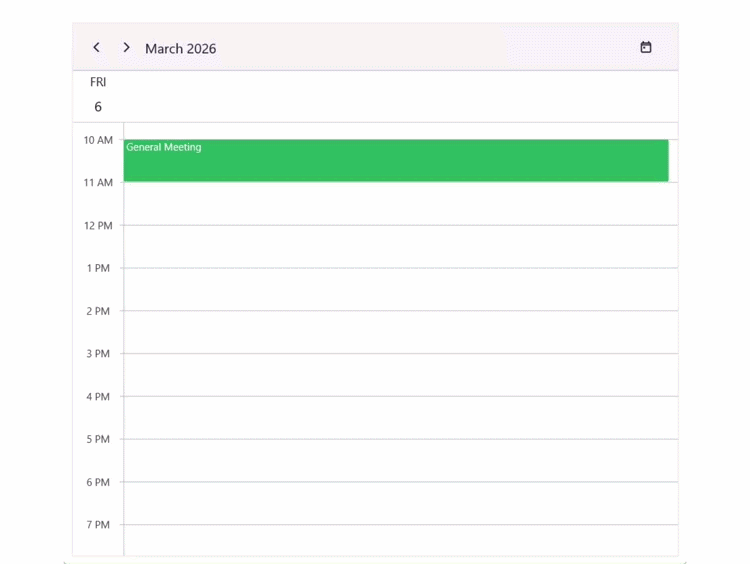
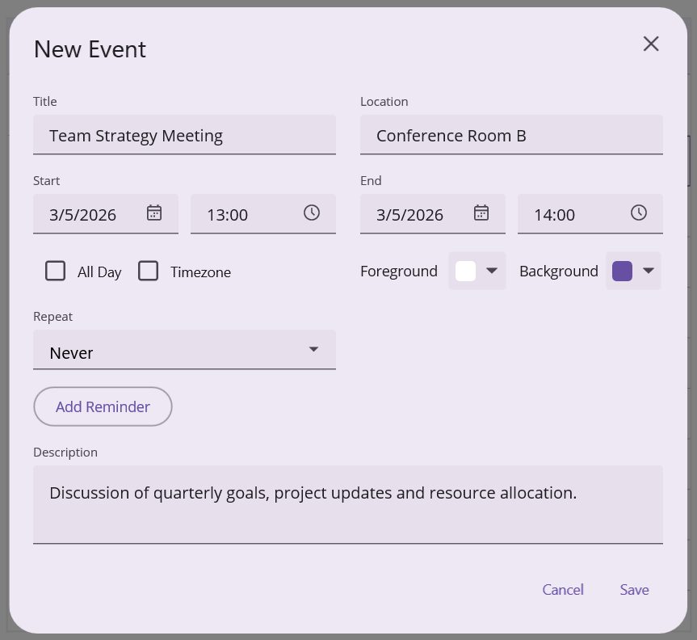
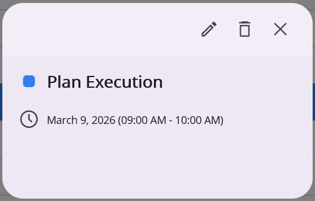
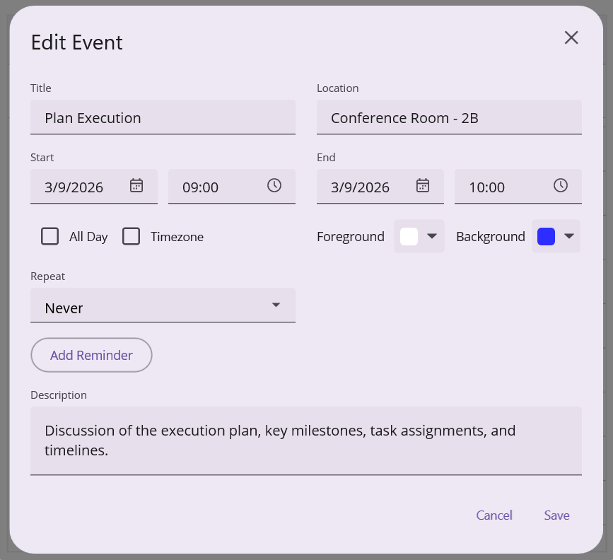
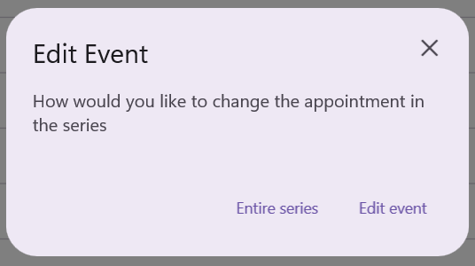
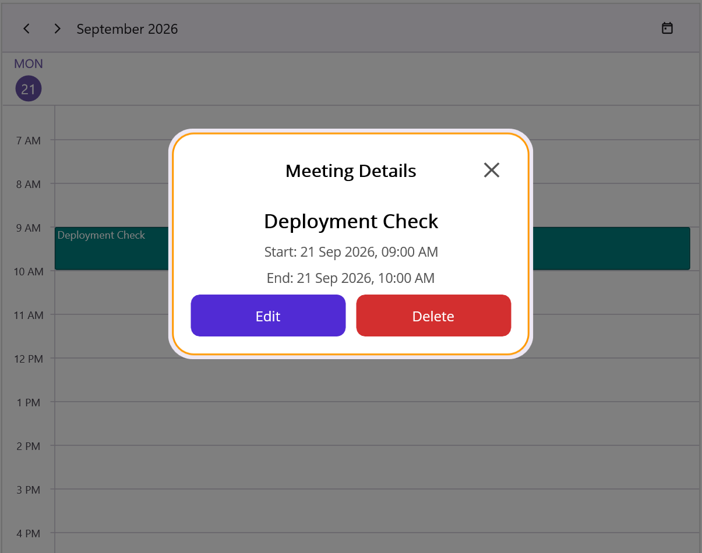

# Appointment Editor in .NET MAUI Scheduler

The Appointment Editor is a popup dialog used for adding, editing, or deleting appointments in the Scheduler. It provides fields for entering detailed event information, along with options for color customization, recurrence configuration, and timezone selection. The editor can be opened by double‑tapping a time slot or an existing appointment.

You can control when the editor is available by using the [AppointmentEditorMode](https://help.syncfusion.com/cr/maui/Syncfusion.Maui.Scheduler.AppointmentEditorMode.html) property:

- [Add](https://help.syncfusion.com/cr/maui/Syncfusion.Maui.Scheduler.AppointmentEditorMode.html#Syncfusion_Maui_Scheduler_AppointmentEditorMode_Add) – Allows users to create new appointments.
- [Edit](https://help.syncfusion.com/cr/maui/Syncfusion.Maui.Scheduler.AppointmentEditorMode.html#Syncfusion_Maui_Scheduler_AppointmentEditorMode_Edit) – Allows users to modify existing appointments.
- [None](https://help.syncfusion.com/cr/maui/Syncfusion.Maui.Scheduler.AppointmentEditorMode.html#Syncfusion_Maui_Scheduler_AppointmentEditorMode_None) – Disables the editor entirely.

By default, `AppointmentEditorMode` is set to `None`. To enable the Appointment Editor for user interaction, set the AppointmentEditorMode property to `Add`, `Edit`, or both.



<ContentPage   
    . . .
    xmlns:scheduler="clr-namespace:Syncfusion.Maui.Scheduler;assembly=Syncfusion.Maui.Scheduler">
    <scheduler:SfScheduler x:Name="scheduler"
                           View="Day"
                           AppointmentEditorMode="Add,Edit">
    </scheduler:SfScheduler>
</ContentPage>


using Syncfusion.Maui.Scheduler;

. . .
public partial class MainPage : ContentPage
{
    public MainPage()
    {
        InitializeComponent();
        this.scheduler.AppointmentEditorMode = AppointmentEditorMode.Add | AppointmentEditorMode.Edit;
    }
}



## Adding Appointments

Appointments can be created using the appointment editor window.
 
Double-tapping a time slot opens the editor, where appointment details can be entered and saved.
 
To allow appointment creation, configure the [AppointmentEditorMode](https://help.syncfusion.com/cr/maui/Syncfusion.Maui.Scheduler.AppointmentEditorMode.html) property with the `Add` option. If the `AppointmentEditorMode` does not include `Add`, double‑tapping a time slot will not open the editor.



<ContentPage   
    . . .
    xmlns:scheduler="clr-namespace:Syncfusion.Maui.Scheduler;assembly=Syncfusion.Maui.Scheduler">
    <scheduler:SfScheduler x:Name="scheduler"
                           View="Day"
                           AppointmentEditorMode="Add">
    </scheduler:SfScheduler>
</ContentPage>


using Syncfusion.Maui.Scheduler;

. . .
public partial class MainPage : ContentPage
{
    public MainPage()
    {
        InitializeComponent();
        this.scheduler.AppointmentEditorMode = AppointmentEditorMode.Add;
    }
}



## Editing Appointment

Existing appointments can be modified through the appointment editor. To allow editing, set the [AppointmentEditorMode](https://help.syncfusion.com/cr/maui/Syncfusion.Maui.Scheduler.AppointmentEditorMode.html) to `Edit`.



<ContentPage   
    . . .
    xmlns:scheduler="clr-namespace:Syncfusion.Maui.Scheduler;assembly=Syncfusion.Maui.Scheduler">
    <scheduler:SfScheduler x:Name="scheduler"
                           View="Day"
                           AppointmentEditorMode="Edit">
    </scheduler:SfScheduler>
</ContentPage>


using Syncfusion.Maui.Scheduler;

. . .
public partial class MainPage : ContentPage
{
    public MainPage()
    {
        InitializeComponent();
        this.scheduler.AppointmentEditorMode = AppointmentEditorMode.Edit;
    }
}


 
Double-tapping an appointment displays a dialog that shows the appointment details such as subject and time. The dialog includes the following options:
 
- **Edit** – Opens the appointment editor to modify the appointment.
- **Delete** – Deletes the appointment.
- **Close** – Closes the dialog.

 
Selecting `Edit` opens the editor filled in with the current appointment details. After making changes, select `Save` to update the appointment or `Cancel` to discard changes.

 
When the scheduler is bound to a data source, the updated values are automatically reflected in the underlying data object.

### Editing recurring appointment

When editing a recurring appointment, a dialog appears requesting confirmation on whether to modify:
 
- The entire series, or
- Only the selected occurrence

 
After selecting the required option, the appointment editor opens with the corresponding appointment details. Changes can then be applied to either the entire series or the selected occurrence.

## Open appointment editor popups programmatically

The Scheduler allows appointment-management popups to be opened programmatically. This enables the Add, Edit, Quick Info, and Delete Confirmation popups to be displayed from custom actions and application-specific workflows, providing greater flexibility when integrating scheduling functionality into an application. Programmatically opened popups follow the same workflow and behavior as popups opened through built-in Scheduler interactions.

N> These methods are applicable only when the appointment editor is enabled through the `AppointmentEditorMode` property. If the appointment editor is disabled, calling these methods has no effect.

### Open Add Appointment Popup

The add appointment popup is used to create a new appointment by entering details such as subject, start time, end time, location, recurrence information, and notes.

To open the add appointment popup, call the `OpenAddPopup` method and specify the new appointment's start date and time using the `DateTime startDate` parameter. The popup is displayed with the specified start date and time preselected.



<ContentPage   
    . . .
    xmlns:scheduler="clr-namespace:Syncfusion.Maui.Scheduler;assembly=Syncfusion.Maui.Scheduler">
        <Grid RowDefinitions="0.9*,0.1*">
            <scheduler:SfScheduler x:Name="Scheduler"
                                   View="Week"
                                   AppointmentEditorMode="Add,Edit"/>
            <Button Grid.Row="1" 
                    x:Name="Add" 
                    Text="Add" 
                    Clicked="Add_Clicked" 
                    HeightRequest="50"
                    HorizontalOptions="Center"
                    VerticalOptions="Center"/>
        </Grid>
</ContentPage>


using Syncfusion.Maui.Scheduler;

...
public partial class MainPage : ContentPage
{
    public MainPage()
    {
        InitializeComponent();
    }

    private void Add_Clicked(object sender, EventArgs e)
    {
        this.Scheduler.OpenAddPopup(DateTime.Today.AddHours(9));
    }
}



### Open Edit Appointment Popup

The edit appointment popup is used to modify the details of an existing appointment.

Use the `OpenEditPopup(object appointment)` method to open the editor for the specified appointment. The appointment parameter specifies the appointment whose details are populated in the popup for editing. The appointment can be a SchedulerAppointment or a custom appointment object.



<ContentPage   
    . . .
    xmlns:scheduler="clr-namespace:Syncfusion.Maui.Scheduler;assembly=Syncfusion.Maui.Scheduler">
        <Grid RowDefinitions="0.9*,0.1*">
            <scheduler:SfScheduler x:Name="Scheduler"
                                   View="Week"
                                   AppointmentEditorMode="Add,Edit"/>
            <Button Grid.Row="1" 
                    x:Name="Edit" 
                    Text="Edit" 
                    Clicked="Edit_Clicked" 
                    HeightRequest="50"
                    HorizontalOptions="Center"
                    VerticalOptions="Center"/>
        </Grid>
</ContentPage>


using Syncfusion.Maui.Scheduler;

...
public partial class MainPage : ContentPage
{
    public ObservableCollection<SchedulerAppointment> Events { get; set; }

    public MainPage()
    {
        InitializeComponent();
        this.Events = new ObservableCollection<SchedulerAppointment>();
        this.Events.Add(new SchedulerAppointment()
        {
            StartTime = DateTime.Today.AddHours(9),
            EndTime = DateTime.Today.AddHours(10),
            Subject = "Client Meeting",
            Location = "Hutchison road",
        });

        this.Scheduler.AppointmentsSource = this.Events;
    }

    private void Edit_Clicked(object sender, EventArgs e)
    {
        this.Scheduler.OpenEditPopup(this.Events[0]);
    }
}



### Open Quick Info Popup

The quick info popup provides a compact view of appointment details.

Use the `OpenQuickInfoPopup(object appointment)` method to display the quick info popup. The appointment parameter specifies the appointment whose details are displayed in the popup. The appointment can be a SchedulerAppointment or a custom appointment object.



<ContentPage   
    . . .
    xmlns:scheduler="clr-namespace:Syncfusion.Maui.Scheduler;assembly=Syncfusion.Maui.Scheduler">
        <Grid RowDefinitions="0.9*,0.1*">
            <scheduler:SfScheduler x:Name="Scheduler"
                                   View="Week"
                                   AppointmentEditorMode="Add,Edit"/>
            <Button Grid.Row="1" 
                    x:Name="QuickInfo" 
                    Text="QuickInfo" 
                    Clicked="QuickInfo_Clicked" 
                    HeightRequest="50"
                    HorizontalOptions="Center"
                    VerticalOptions="Center"/>
        </Grid>
</ContentPage>


using Syncfusion.Maui.Scheduler;

...
public partial class MainPage : ContentPage
{
    public ObservableCollection<SchedulerAppointment> Events { get; set; }

    public MainPage()
    {
        InitializeComponent();
        this.Events = new ObservableCollection<SchedulerAppointment>();
        this.Events.Add(new SchedulerAppointment()
        {
            StartTime = DateTime.Today.AddHours(9),
            EndTime = DateTime.Today.AddHours(10),
            Subject = "Client Meeting",
            Location = "Hutchison road",
        });

        this.Scheduler.AppointmentsSource = this.Events;
    }

     private void QuickInfo_Clicked(object sender, EventArgs e)
    {
        this.Scheduler.OpenQuickInfoPopup(this.Events[0]);
    }
}



### Open Delete Confirmation Popup

The delete confirmation popup is used to confirm the removal of an appointment before it is deleted. 

Use the `DeleteAppointment(object appointment)` method to display the delete confirmation popup. The appointment parameter specifies the appointment for which the confirmation is displayed. The appointment can be a SchedulerAppointment or a custom appointment object.



<ContentPage   
    . . .
    xmlns:scheduler="clr-namespace:Syncfusion.Maui.Scheduler;assembly=Syncfusion.Maui.Scheduler">
        <Grid RowDefinitions="0.9*,0.1*">
            <scheduler:SfScheduler x:Name="Scheduler"
                                   View="Week"
                                   AppointmentEditorMode="Add,Edit"/>
            <Button Grid.Row="1" 
                    x:Name="Delete" 
                    Text="Delete" 
                    Clicked="Delete_Clicked" 
                    HeightRequest="50"
                    HorizontalOptions="Center"
                    VerticalOptions="Center"/>
        </Grid>
</ContentPage>


using Syncfusion.Maui.Scheduler;

...
public partial class MainPage : ContentPage
{
    public ObservableCollection<SchedulerAppointment> Events { get; set; }

    public MainPage()
    {
        InitializeComponent();
        this.Events = new ObservableCollection<SchedulerAppointment>();
        this.Events.Add(new SchedulerAppointment()
        {
            StartTime = DateTime.Today.AddHours(9),
            EndTime = DateTime.Today.AddHours(10),
            Subject = "Client Meeting",
            Location = "Hutchison road",
        });

        this.Scheduler.AppointmentsSource = this.Events;
    }

     private void Delete_Clicked(object sender, EventArgs e)
    {
        this.Scheduler.DeleteAppointment(this.Events[0]);
    }
}



## Events

### Appointment Editor Opening

The [AppointmentEditorOpening](https://help.syncfusion.com/cr/maui/Syncfusion.Maui.Scheduler.SfScheduler.html#Syncfusion_Maui_Scheduler_SfScheduler_AppointmentEditorOpening) event is raised before the appointment editor dialog appears. It occurs when an appointment is double‑tapped for modification or when a time slot is double‑tapped to create a new appointment. Set the event args' `Cancel` property to `true` to prevent the editor from opening.



<ContentPage   
    . . .
    xmlns:scheduler="clr-namespace:Syncfusion.Maui.Scheduler;assembly=Syncfusion.Maui.Scheduler">
    <scheduler:SfScheduler x:Name="scheduler"
                           View="Day"
                           AppointmentEditorMode="Add,Edit"
                           AppointmentEditorOpening="Scheduler_AppointmentEditorOpening">
    </scheduler:SfScheduler>
</ContentPage>


using Syncfusion.Maui.Scheduler;

. . .
public partial class MainPage : ContentPage
{
    public MainPage()
    {
        InitializeComponent();
    }

    private void Scheduler_AppointmentEditorOpening(object? sender, AppointmentEditorOpeningEventArgs e)
    {
        e.Cancel = true;
    }
}



The [AppointmentEditorOpeningEventArgs](https://help.syncfusion.com/cr/maui/Syncfusion.Maui.Scheduler.AppointmentEditorOpeningEventArgs.html) provides information about the editor opening operation.

- [Appointment](https://help.syncfusion.com/cr/maui/Syncfusion.Maui.Scheduler.AppointmentEditorOpeningEventArgs.html#Syncfusion_Maui_Scheduler_AppointmentEditorOpeningEventArgs_Appointment) : Retrieves the appointment that is being edited. The value will be null when the editor is opened to create a new appointment.
- [DateTime](https://help.syncfusion.com/cr/maui/Syncfusion.Maui.Scheduler.AppointmentEditorOpeningEventArgs.html#Syncfusion_Maui_Scheduler_AppointmentEditorOpeningEventArgs_DateTime) : Indicates the date and time of the selected time slot.
- [Resource](https://help.syncfusion.com/cr/maui/Syncfusion.Maui.Scheduler.AppointmentEditorOpeningEventArgs.html#Syncfusion_Maui_Scheduler_AppointmentEditorOpeningEventArgs_Resource) : Returns the resource associated with the appointment. This is the single resource under the tapped time slot. When the editor is opened without a resource context, the value is null.
- [RecurringAppointmentEditMode](https://help.syncfusion.com/cr/maui/Syncfusion.Maui.Scheduler.AppointmentEditorOpeningEventArgs.html#Syncfusion_Maui_Scheduler_AppointmentEditorOpeningEventArgs_RecurringAppointmentEditMode) : Specifies the edit mode applied when modifying a recurring appointment.
- [Cancel](https://help.syncfusion.com/cr/maui/Syncfusion.Maui.Scheduler.AppointmentEditorOpeningEventArgs.html#Syncfusion_Maui_Scheduler_AppointmentEditorOpeningEventArgs_Cancel) : Set to `true` to prevent the appointment editor from opening.



<ContentPage   
    . . .
    xmlns:scheduler="clr-namespace:Syncfusion.Maui.Scheduler;assembly=Syncfusion.Maui.Scheduler">
    <scheduler:SfScheduler x:Name="scheduler"
                           View="Day"
                           AppointmentEditorMode="Add,Edit"
                           AppointmentEditorOpening="Scheduler_AppointmentEditorOpening">
    </scheduler:SfScheduler>
</ContentPage>


using Syncfusion.Maui.Scheduler;

. . .
public partial class MainPage : ContentPage
{
    public MainPage()
    {
        InitializeComponent();
    }

    private void Scheduler_AppointmentEditorOpening(object? sender, AppointmentEditorOpeningEventArgs e)
    {
        var appointment = e.Appointment;
        var dateTime = e.DateTime;
        var resource = e.Resource;
        var recurringAppointmentEditMode = e.RecurringAppointmentEditMode;
        // To prevent the editor from opening, uncomment the line below.
        // e.Cancel = true;
    }
}



### Appointment Editor Closing

The [AppointmentEditorClosing](https://help.syncfusion.com/cr/maui/Syncfusion.Maui.Scheduler.SfScheduler.html#Syncfusion_Maui_Scheduler_SfScheduler_AppointmentEditorClosing) event is triggered when the appointment editor is about to close after performing an action such as Add, Edit, Delete, or Cancel. This event allows you to control the close operation and optionally handle the performed action. Set the event args' `Cancel` property to `true` to stop the editor from closing.



<ContentPage   
    . . .
    xmlns:scheduler="clr-namespace:Syncfusion.Maui.Scheduler;assembly=Syncfusion.Maui.Scheduler">
    <scheduler:SfScheduler x:Name="scheduler"
                           View="Day"
                           AppointmentEditorMode="Add,Edit"
                           AppointmentEditorClosing="Scheduler_AppointmentEditorClosing">
    </scheduler:SfScheduler>
</ContentPage>


using Syncfusion.Maui.Scheduler;

. . .
public partial class MainPage : ContentPage
{
    public MainPage()
    {
        InitializeComponent();
    }

    private void Scheduler_AppointmentEditorClosing(object? sender, AppointmentEditorClosingEventArgs e)
    {
        e.Cancel = true;
    }
}


 
The [AppointmentEditorClosingEventArgs](https://help.syncfusion.com/cr/maui/Syncfusion.Maui.Scheduler.AppointmentEditorClosingEventArgs.html) contains details about the operation performed in the editor.

- [Action](https://help.syncfusion.com/cr/maui/Syncfusion.Maui.Scheduler.AppointmentEditorClosingEventArgs.html#Syncfusion_Maui_Scheduler_AppointmentEditorClosingEventArgs_Action) : Indicates the action executed in the editor. Possible values are members of the [AppointmentEditorAction](https://help.syncfusion.com/cr/maui/Syncfusion.Maui.Scheduler.AppointmentEditorAction.html) enum: `Add`, `Edit`, `Delete`, or `Cancel`.
- [Appointment](https://help.syncfusion.com/cr/maui/Syncfusion.Maui.Scheduler.AppointmentEditorClosingEventArgs.html#Syncfusion_Maui_Scheduler_AppointmentEditorClosingEventArgs_Appointment) : Contains the appointment details associated with the performed action.
- [Resources](https://help.syncfusion.com/cr/maui/Syncfusion.Maui.Scheduler.AppointmentEditorClosingEventArgs.html#Syncfusion_Maui_Scheduler_AppointmentEditorClosingEventArgs_Resources) : Provides the collection of resources assigned to the appointment. Note the difference from the `Resource` property of `AppointmentEditorOpeningEventArgs` — this is a collection that contains all resources linked to the appointment, not the single resource under a tapped slot.
- [Handled](https://help.syncfusion.com/cr/maui/Syncfusion.Maui.Scheduler.AppointmentEditorClosingEventArgs.html#Syncfusion_Maui_Scheduler_AppointmentEditorClosingEventArgs_Handled) : Determines whether the scheduler should process the action automatically. When set to `true`, the scheduler skips its default add/edit/delete logic and the action must be persisted manually in the event handler (for example, by writing to a database or remote service).
- [Cancel](https://help.syncfusion.com/cr/maui/Syncfusion.Maui.Scheduler.AppointmentEditorClosingEventArgs.html#Syncfusion_Maui_Scheduler_AppointmentEditorClosingEventArgs_Cancel) : Set to `true` to keep the editor open and prevent it from closing.



<ContentPage   
    . . .
    xmlns:scheduler="clr-namespace:Syncfusion.Maui.Scheduler;assembly=Syncfusion.Maui.Scheduler">
    <scheduler:SfScheduler x:Name="scheduler"
                           View="Day"
                           AppointmentEditorMode="Add,Edit"
                           AppointmentEditorClosing="Scheduler_AppointmentEditorClosing">
    </scheduler:SfScheduler>
</ContentPage>


using Syncfusion.Maui.Scheduler;

. . .
public partial class MainPage : ContentPage
{
    public MainPage()
    {
        InitializeComponent();
    }

    private void Scheduler_AppointmentEditorClosing(object? sender, AppointmentEditorClosingEventArgs e)
    {
        var appointment = e.Appointment;
        var action = e.Action;
        var resources = e.Resources;
    }
}



### Recurring Appointment Beginning Edit

The [RecurringAppointmentBeginningEdit](https://help.syncfusion.com/cr/maui/Syncfusion.Maui.Scheduler.SfScheduler.html#Syncfusion_Maui_Scheduler_SfScheduler_RecurringAppointmentBeginningEdit) event occurs when a recurring appointment is edited or deleted. This event lets you control how recurring appointments are modified.
 
The [RecurringAppointmentBeginningEditEventArgs](https://help.syncfusion.com/cr/maui/Syncfusion.Maui.Scheduler.RecurringAppointmentBeginningEditEventArgs.html) contains details about the editing behavior of a recurring appointment.

- [EditMode](https://help.syncfusion.com/cr/maui/Syncfusion.Maui.Scheduler.RecurringAppointmentBeginningEditEventArgs.html#Syncfusion_Maui_Scheduler_RecurringAppointmentBeginningEditEventArgs_EditMode) : Defines how the recurring appointment should be edited.
 
#### RecurringAppointmentEditMode Options

- [User](https://help.syncfusion.com/cr/maui/Syncfusion.Maui.Scheduler.RecurringAppointmentEditMode.html#Syncfusion_Maui_Scheduler_RecurringAppointmentEditMode_User) : Displays a dialog prompting whether to edit a single occurrence or the entire series.
- [Occurrence](https://help.syncfusion.com/cr/maui/Syncfusion.Maui.Scheduler.RecurringAppointmentEditMode.html#Syncfusion_Maui_Scheduler_RecurringAppointmentEditMode_Occurrence) : Edits only the selected occurrence in the series.
- [Series](https://help.syncfusion.com/cr/maui/Syncfusion.Maui.Scheduler.RecurringAppointmentEditMode.html#Syncfusion_Maui_Scheduler_RecurringAppointmentEditMode_Series) : Edits the entire recurring appointment series.



<ContentPage   
    . . .
    xmlns:scheduler="clr-namespace:Syncfusion.Maui.Scheduler;assembly=Syncfusion.Maui.Scheduler">
    <scheduler:SfScheduler x:Name="scheduler"
                           View="Day"
                           AppointmentEditorMode="Add,Edit"
                           RecurringAppointmentBeginningEdit="Scheduler_RecurringAppointmentBeginningEdit">
    </scheduler:SfScheduler>
</ContentPage>


using Syncfusion.Maui.Scheduler;

. . .
public partial class MainPage : ContentPage
{
    public MainPage()
    {
        InitializeComponent();
    }

    private void Scheduler_RecurringAppointmentBeginningEdit(object? sender, RecurringAppointmentBeginningEditEventArgs e)
    {
        var editMode = e.EditMode;
    }
}



## Quick Info Template

The [QuickInfoTemplate](https://help.syncfusion.com/cr/maui/Syncfusion.Maui.Scheduler.SfScheduler.html#Syncfusion_Maui_Scheduler_SfScheduler_QuickInfoTemplate) property of [SfScheduler](https://help.syncfusion.com/cr/maui/Syncfusion.Maui.Scheduler.SfScheduler.html) lets you customize the content displayed in the quick info popup. By default, `QuickInfoTemplate` is `null`, and the built‑in quick info UI is shown. When a custom template is provided, it replaces the default popup with developer‑defined content.

N> The [AppointmentEditorMode](https://help.syncfusion.com/cr/maui/Syncfusion.Maui.Scheduler.AppointmentEditorMode.html) property should be set to `Add` or `Edit` for the quick info popup to be shown.

The binding context of the template is a [QuickInfoPopupDetails](https://help.syncfusion.com/cr/maui/Syncfusion.Maui.Scheduler.QuickInfoPopupDetails.html) instance that provides the associated [SchedulerAppointment](https://help.syncfusion.com/cr/maui/Syncfusion.Maui.Scheduler.SchedulerAppointment.html) through its `SchedulerAppointment` property and the `EditAppointment`, `DeleteAppointment`, and `ClosePopup` methods to perform edit, delete, and close actions with the same behavior as the built‑in quick info icons.



<ContentPage
    . . .
    xmlns:scheduler="clr-namespace:Syncfusion.Maui.Scheduler;assembly=Syncfusion.Maui.Scheduler">

    <scheduler:SfScheduler x:Name="Scheduler"
                           AppointmentEditorMode="Add,Edit">
        <scheduler:SfScheduler.QuickInfoTemplate>
                <DataTemplate>
                    <Border
                        Margin="4"
                        Padding="20"
                        BackgroundColor="White"
                        Stroke="#FF9800"
                        StrokeThickness="2">
                        <Border.StrokeShape>
                            <RoundRectangle CornerRadius="24" />
                        </Border.StrokeShape>
                        <Grid
                            RowDefinitions="Auto,*,Auto"
                            RowSpacing="15">
                            <!-- Header -->
                            <Grid
                                Grid.Row="0"
                                ColumnDefinitions="44,*,44">
                                <BoxView
                                    Grid.Column="0"
                                    BackgroundColor="Transparent" />
                                <Label
                                    Grid.Column="1"
                                    Text="Meeting Details"
                                    FontSize="20"
                                    FontAttributes="Bold"
                                    TextColor="Black"
                                    HorizontalTextAlignment="Center"
                                    VerticalTextAlignment="Center" />
                                <!-- Close button at top-right -->
                                <Button
                                    Grid.Column="2"
                                    Text="&#xE70B;"
                                    FontFamily="MauiMaterialAssets"
                                    FontSize="24"
                                    FontAttributes="Bold"
                                    TextColor="#555555"
                                    BackgroundColor="Transparent"
                                    Padding="0"
                                    WidthRequest="40"
                                    HeightRequest="40"
                                    HorizontalOptions="End"
                                    VerticalOptions="Start"
                                    Clicked="OnCloseClicked" />
                            </Grid>
                            <!-- Appointment details -->
                            <VerticalStackLayout
                                Grid.Row="1"
                                Padding="10,5"
                                Spacing="10"
                                HorizontalOptions="Center"
                                VerticalOptions="Center">
                                <Label
                                    FontSize="22"
                                    FontAttributes="Bold"
                                    TextColor="Black"
                                    HorizontalOptions="Center"
                                    HorizontalTextAlignment="Center"
                                    Text="{Binding SchedulerAppointment.Subject}" />
                                <Label
                                    FontSize="15"
                                    TextColor="#555555"
                                    HorizontalOptions="Center"
                                    HorizontalTextAlignment="Center"
                                    Text="{Binding SchedulerAppointment.StartTime,
                                                   StringFormat='Start: {0:dd MMM yyyy, hh:mm tt}'}" />
                                <Label
                                    FontSize="15"
                                    TextColor="#555555"
                                    HorizontalOptions="Center"
                                    HorizontalTextAlignment="Center"
                                    Text="{Binding SchedulerAppointment.EndTime,
                                                   StringFormat='End: {0:dd MMM yyyy, hh:mm tt}'}" />
                            </VerticalStackLayout>
                            <!-- Bottom action buttons -->
                            <Grid
                                Grid.Row="2"
                                Margin="0,10,0,0"
                                ColumnDefinitions="*,*"
                                ColumnSpacing="12">
                                <Button
                                    Grid.Column="0"
                                    Text="Edit"
                                    FontSize="16"
                                    TextColor="White"
                                    BackgroundColor="#512BD4"
                                    CornerRadius="10"
                                    HeightRequest="48"
                                    Clicked="OnEditClicked" />
                                <Button
                                    Grid.Column="1"
                                    Text="Delete"
                                    FontSize="16"
                                    TextColor="White"
                                    BackgroundColor="#D32F2F"
                                    CornerRadius="10"
                                    HeightRequest="48"
                                    Clicked="OnDeleteClicked" />
                            </Grid>
                        </Grid>
                    </Border>
                </DataTemplate>
            </scheduler:SfScheduler.QuickInfoTemplate>
    </scheduler:SfScheduler>
</ContentPage>


using Syncfusion.Maui.Scheduler;

. . .
public partial class MainPage : ContentPage
{
    public MainPage()
    {
        InitializeComponent();
        SfScheduler scheduler = new SfScheduler();
        scheduler.AppointmentEditorMode = AppointmentEditorMode.Edit;
        scheduler.QuickInfoTemplate = new DataTemplate(() =>
        {
            var border = new Border
            {
                Margin = 4,
                Padding = 20,
                BackgroundColor = Colors.White,
                Stroke = Color.FromArgb("#FF9800"),
                StrokeThickness = 2,
                StrokeShape = new RoundRectangle
                {
                    CornerRadius = new CornerRadius(24)
                }
            };

            var rootGrid = new Grid
            {
                RowDefinitions =
                {
                    new RowDefinition(GridLength.Auto),
                    new RowDefinition(GridLength.Star),
                    new RowDefinition(GridLength.Auto)
                },
                RowSpacing = 15
            };

            // Header
            var headerGrid = new Grid
            {
                ColumnDefinitions =
                {
                    new ColumnDefinition(44),
                    new ColumnDefinition(GridLength.Star),
                    new ColumnDefinition(44)
                }
            };

            headerGrid.Add(new BoxView
            {
                BackgroundColor = Colors.Transparent
            }, 0, 0);

            headerGrid.Add(new Label
            {
                Text = "Meeting Details",
                FontSize = 20,
                FontAttributes = FontAttributes.Bold,
                TextColor = Colors.Black,
                HorizontalTextAlignment = TextAlignment.Center,
                VerticalTextAlignment = TextAlignment.Center
            }, 1, 0);

            var closeButton = new Button
            {
                Text = "\uE70B",
                FontFamily = "MauiMaterialAssets",
                FontSize = 24,
                FontAttributes = FontAttributes.Bold,
                TextColor = Color.FromArgb("#555555"),
                BackgroundColor = Colors.Transparent,
                Padding = 0,
                WidthRequest = 40,
                HeightRequest = 40,
                HorizontalOptions = LayoutOptions.End,
                VerticalOptions = LayoutOptions.Start
            };

            closeButton.Clicked += OnCloseClicked;

            headerGrid.Add(closeButton, 2, 0);

            // Appointment details
            var detailsLayout = new VerticalStackLayout
            {
                Padding = new Thickness(10, 5),
                Spacing = 10,
                HorizontalOptions = LayoutOptions.Center,
                VerticalOptions = LayoutOptions.Center
            };

            var subjectLabel = new Label
            {
                FontSize = 22,
                FontAttributes = FontAttributes.Bold,
                TextColor = Colors.Black,
                HorizontalOptions = LayoutOptions.Center,
                HorizontalTextAlignment = TextAlignment.Center
            };
            subjectLabel.SetBinding(Label.TextProperty, "SchedulerAppointment.Subject");

            var startLabel = new Label
            {
                FontSize = 15,
                TextColor = Color.FromArgb("#555555"),
                HorizontalOptions = LayoutOptions.Center,
                HorizontalTextAlignment = TextAlignment.Center
            };
            startLabel.SetBinding(
                Label.TextProperty,
                new Binding(
                    "SchedulerAppointment.StartTime",
                    stringFormat: "Start: {0:dd MMM yyyy, hh:mm tt}"));

            var endLabel = new Label
            {
                FontSize = 15,
                TextColor = Color.FromArgb("#555555"),
                HorizontalOptions = LayoutOptions.Center,
                HorizontalTextAlignment = TextAlignment.Center
            };
            endLabel.SetBinding(
                Label.TextProperty,
                new Binding(
                    "SchedulerAppointment.EndTime",
                    stringFormat: "End: {0:dd MMM yyyy, hh:mm tt}"));

            detailsLayout.Children.Add(subjectLabel);
            detailsLayout.Children.Add(startLabel);
            detailsLayout.Children.Add(endLabel);

            // Bottom buttons
            var buttonGrid = new Grid
            {
                Margin = new Thickness(0, 10, 0, 0),
                ColumnDefinitions =
                {
                    new ColumnDefinition(GridLength.Star),
                    new ColumnDefinition(GridLength.Star)
                },
                ColumnSpacing = 12
            };

            var editButton = new Button
            {
                Text = "Edit",
                FontSize = 16,
                TextColor = Colors.White,
                BackgroundColor = Color.FromArgb("#512BD4"),
                CornerRadius = 10,
                HeightRequest = 48
            };
            editButton.Clicked += OnEditClicked;

            var deleteButton = new Button
            {
                Text = "Delete",
                FontSize = 16,
                TextColor = Colors.White,
                BackgroundColor = Color.FromArgb("#D32F2F"),
                CornerRadius = 10,
                HeightRequest = 48
            };
            deleteButton.Clicked += OnDeleteClicked;

            buttonGrid.Add(editButton, 0, 0);
            buttonGrid.Add(deleteButton, 1, 0);

            rootGrid.Add(headerGrid);
            Grid.SetRow(headerGrid, 0);

            rootGrid.Add(detailsLayout);
            Grid.SetRow(detailsLayout, 1);

            rootGrid.Add(buttonGrid);
            Grid.SetRow(buttonGrid, 2);

            border.Content = rootGrid;

            return border;
        });
    }

    private void OnEditClicked(object sender, EventArgs e)
    {
        if (((Button)sender).BindingContext is QuickInfoPopupDetails details)
        {
            details.EditAppointment();
        }
    }

    private void OnDeleteClicked(object sender, EventArgs e)
    {
        if (((Button)sender).BindingContext is QuickInfoPopupDetails details)
        {
            details.DeleteAppointment();
        }
    }

    private void OnCloseClicked(object sender, EventArgs e)
    {
        if (((Button)sender).BindingContext is QuickInfoPopupDetails details)
        {
            details.ClosePopup();
        }
    }
}



## QuickInfoPopupDetails

The [QuickInfoPopupDetails](https://help.syncfusion.com/cr/maui/Syncfusion.Maui.Scheduler.QuickInfoPopupDetails.html) class provides the data context and action methods available inside the `QuickInfoTemplate`. It exposes the [SchedulerAppointment](https://help.syncfusion.com/cr/maui/Syncfusion.Maui.Scheduler.QuickInfoPopupDetails.html#Syncfusion_Maui_Scheduler_QuickInfoPopupDetails_SchedulerAppointment) associated with the currently displayed quick info popup, along with three methods that mirror the built‑in quick info actions.

### SchedulerAppointment

Gets the [SchedulerAppointment](https://help.syncfusion.com/cr/maui/Syncfusion.Maui.Scheduler.SchedulerAppointment.html) for which the quick info popup is displayed. Bind it inside the template to surface appointment details such as subject, start time, end time, location, and notes.



<scheduler:SfScheduler.QuickInfoTemplate>
    <DataTemplate>
        <Label Text="{Binding SchedulerAppointment.Subject}" />
    </DataTemplate>
</scheduler:SfScheduler.QuickInfoTemplate>



### EditAppointment

The `EditAppointment` method opens the appointment editor for the associated appointment, replicating the behavior of the built‑in edit icon of the quick info popup.



private void OnEditClicked(object sender, EventArgs e)
{
    if (((Button)sender).BindingContext is QuickInfoPopupDetails details)
    {
        details.EditAppointment();
    }
}



### DeleteAppointment

The `DeleteAppointment` method deletes the appointment associated with the quick info popup and closes the popup, the same behavior as the built‑in delete icon. If the appointment is recurring, the recurrence edit mode selection popup is displayed when required.



private void OnDeleteClicked(object sender, EventArgs e)
{
    if (((Button)sender).BindingContext is QuickInfoPopupDetails details)
    {
        details.DeleteAppointment();
    }
}



### ClosePopup

The `ClosePopup` method closes the quick info popup, the same behavior as the built‑in close icon.



private void OnCloseClicked(object sender, EventArgs e)
{
    if (((Button)sender).BindingContext is QuickInfoPopupDetails details)
    {
        details.ClosePopup();
    }
}


