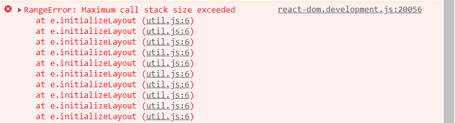
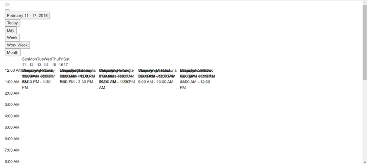
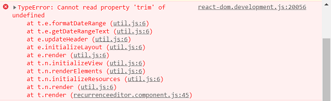

# Frequently Asked Questions in React Scheduler

In this article, you can find some frequently asked questions and corresponding solutions while getting hands-on experience with the [React Scheduler](https://www.syncfusion.com/scheduler-sdk/react-scheduler).

## Maximum call stack size exceeded

**Error Image:**



**Root Cause:** The error occurs when Scheduler views are not imported or injected into the project.

**Solution:** Import and inject the required view modules. For example, if you're using the `Day` view without injecting its module, add the corresponding service to the `Inject` component.

> **Note:** The example below shows the correct way to use the `Day` view with proper module injection to avoid the "Maximum call stack size exceeded" error.


```ts

import { render } from 'react-dom';
import * as React from 'react';
import { ScheduleComponent, ViewsDirective, ViewDirective, Agenda, TimelineViews, TimelineMonth, Inject, Resize, DragAndDrop
} from '@syncfusion/ej2-react-schedule';
import { extend } from '@syncfusion/ej2-base';
import { SampleBase } from './sample-base';
import * as dataSource from './datasource.json';

export class TimelineView extends SampleBase {
  constructor() {
    super(...arguments);
    this.data = extend([], dataSource.scheduleData.concat(dataSource.timelineData), null, true);
  }
  private eventSettings: EventSettingsModel = { dataSource: this.data };
  
  render() {
    return (<ScheduleComponent height="650px" selectedDate={new Date(2021, 0, 10)} eventSettings={this.eventSettings}>
              <ViewsDirective>
                <ViewDirective option="Day" />
                <ViewDirective option="TimelineWeek" />
                <ViewDirective option="TimelineWorkWeek" />
                <ViewDirective option="TimelineDay" />
                <ViewDirective option="Agenda" />
              </ViewsDirective>
              <Inject
                services={[ TimelineViews, TimelineMonth, Agenda, Resize, DragAndDrop]}
              />
            </ScheduleComponent>
    );
  }
}

render(<TimelineView />, document.getElementById('sample'));

```


## Grouping with empty resources

**Problem Description:** When grouping is enabled without providing resource data, the following issues occur:

- **Normal (vertical) views** - Render but CRUD operations fail
- **Timeline views** - Do not render; displays empty scheduler table

**Solution:** Do not enable grouping when no resources are defined in your Scheduler configuration.

> **Important:** Always ensure resource data is properly configured before enabling the grouping feature.

## Not providing e-field in editor template

**Problem:** When using a custom editor template, the `e-field` attribute is missing from input elements, causing data binding failures.

**Solution:** The `e-field` attribute is mandatory for each form element in the editor template to enable proper data binding.

> **Important:** Every input control in your custom editor template must include the `e-field` attribute matching the corresponding event property name. Refer to the [Editor Template Customization Guide](https://help.syncfusion.com/scheduler-sdk/react/schedule/editor-template#customizing-event-editor-using-template) for detailed examples.

## Missing CSS reference

**Error Image:**

  

**Problem:** The Scheduler component does not render properly when CSS stylesheets are not included in the project.

**Solution:** Include the appropriate Syncfusion CSS stylesheet in your HTML file's `<head>` section. You can either use CDN links or local CSS files.

> **Tip:** Use one of the available Syncfusion themes: `material.css`, `bootstrap.css`, `fabric.css`, `highcontrast.css`, or `tailwind.css`.

```html
<html>
<head>
    <title>Syncfusion React Sample</title>
    <meta charset="utf-8" />
    <meta name="viewport" content="width=device-width, initial-scale=1.0, user-scalable=no" />
    <meta http-equiv="x-ua-compatible" content="ie=edge">
    <meta name="description" content="Syncfusion React UI Components" />
    <meta name="author" content="Syncfusion" />

    <!-- Include Scheduler CSS from CDN -->
    <link href="https://cdn.syncfusion.com/ej2/material.css" rel="stylesheet">

</head>

<body class="material">
    <div id='sample'></div>
</body>
</html>
```

## QuickInfoTemplate at bottom

**Problem:** When using [`quickInfoTemplate`](https://ej2.syncfusion.com/react/documentation/api/schedule#quickinfotemplates), the quick info popup may not display fully at the bottom area of the Scheduler.

**Solution:** Use the [`cellClick`](https://ej2.syncfusion.com/react/documentation/api/schedule#cellclick) and [`eventClick`](https://ej2.syncfusion.com/react/documentation/api/schedule#eventclick) events to refresh the popup position. This ensures the popup is repositioned when clicked.

```tsx
constructor() {
  super(...arguments);
  this.eventAdded = false;
}

onClick(args) {
  if (!this.eventAdded) {
    let popupInstance = document.querySelector('.e-quick-popup-wrapper').ej2_instances[0];
    popupInstance.open = () => {
      popupInstance.refreshPosition();
    };
    this.eventAdded = true;
  }
}

// Add this to your ScheduleComponent JSX:
<ScheduleComponent 
  id="schedule" 
  cellClick={this.onClick.bind(this)} 
  eventClick={this.onClick.bind(this)}
>
```

> **Tip:** The `refreshPosition()` method recalculates the popup's position based on available viewport space, ensuring it displays correctly even near boundaries.

## Not importing culture files while using localization

**Error Image:**



**Problem:** When using [`locale`](https://help.syncfusion.com/scheduler-sdk/react/schedule/localization), missing or incorrectly imported culture files prevent proper localization from functioning.

**Solution:** Import all required CLDR (Common Locale Data Repository) files and initialize localization using the `loadCldr()` and `L10n.load()` functions.

**Required CLDR files to import:**
- `numbers.json` - Number formatting for the locale
- `timeZoneNames.json` - Timezone information
- `ca-gregorian.json` - Calendar data
- `numberingSystems.json` - Numbering system data

```tsx
import { loadCldr, L10n } from '@syncfusion/ej2-base';
import enNumberData from '@syncfusion/ej2-cldr-data/main/en-GB/numbers.json';
import entimeZoneData from '@syncfusion/ej2-cldr-data/main/en-GB/timeZoneNames.json';
import enGregorian from '@syncfusion/ej2-cldr-data/main/en-GB/ca-gregorian.json';
import enNumberingSystem from '@syncfusion/ej2-cldr-data/supplemental/numberingSystems.json';

// Step 1: Load CLDR data
loadCldr(enNumberData, entimeZoneData, enGregorian, enNumberingSystem);

// Step 2: Configure locale-specific strings
L10n.load({
  'en-GB': {
    schedule: {
      day: 'Day',
      week: 'Week',
      workWeek: 'Work Week',
      month: 'Month'
    }
  }
});
```

## See also

* [Syncfusion React Scheduler](https://www.syncfusion.com/scheduler-sdk/react-scheduler)
* [Scheduler API Reference](https://ej2.syncfusion.com/react/documentation/api/schedule)
* [Editor Template Customization](https://help.syncfusion.com/scheduler-sdk/react/schedule/editor-template)
* [Scheduler Localization Guide](https://help.syncfusion.com/scheduler-sdk/react/schedule/localization)
* [Quick Popup Template](https://ej2.syncfusion.com/react/documentation/api/schedule#quickinfotemplates)
* [Scheduler Event Grouping](https://help.syncfusion.com/scheduler-sdk/react/schedule/resources)
* [Scheduler Live Examples](https://ej2.syncfusion.com/react/demos/#/tailwind3/schedule/overview)

> **Important:** Always load CLDR data before rendering the Scheduler component with localization. Missing files will cause localization to fail silently.