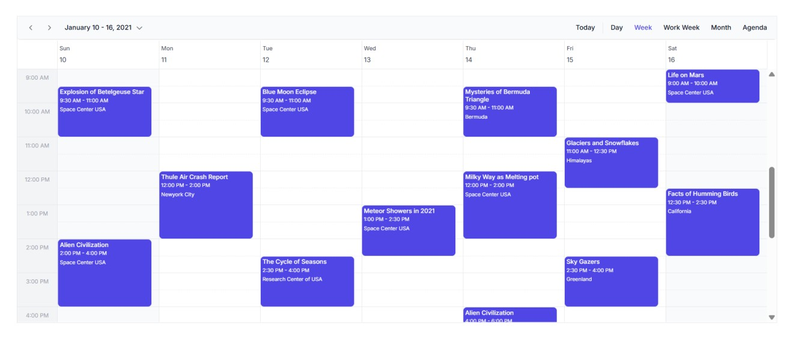

# Getting Started with React Scheduler

This section briefly explains how to create [**React Scheduler**](https://www.syncfusion.com/scheduler-sdk/react-scheduler) and configure its available functionalities in React environment.

> **Ready to streamline your Syncfusion<sup style="font-size:70%">&reg;</sup> React development?** Discover the full potential of React components with Syncfusion<sup style="font-size:70%">&reg;</sup> AI Coding Assistant. Effortlessly integrate, configure, and enhance your projects with intelligent, context-aware code suggestions, streamlined setups, and real-time insights—all seamlessly integrated into your preferred AI-powered IDEs like VS Code, Cursor, Syncfusion<sup style="font-size:70%">&reg;</sup> CodeStudio and more. [Explore Syncfusion<sup style="font-size:70%">&reg;</sup> AI Coding Assistant](https://ej2.syncfusion.com/react/documentation/ai-coding-assistant/overview)

To get started quickly with React Scheduler using the Create React App, you can check on this video







## Prerequisites

- [Node.js 24+](https://nodejs.org/en) (LTS recommended).
- Syncfusion CLI.

## Install the Syncfusion CLI 

Install the Syncfusion CLI globally using the following command:



npm install -g @syncfusion/syncfusion-cli



## Set up the Vite project using Syncfusion CLI

You can create a React Vite application using the Syncfusion CLI. The CLI provides two ways to create a project:

### Non-interactive mode

Non-interactive mode allows you to create a project directly using a single command with the required command-line arguments.



sf new my-app --framework react --type ts --template scheduler --theme tailwind3



In this mode, the project configuration is passed directly in the command. The above command creates a React Vite application configured with the Syncfusion<sup style="font-size:70%">&reg;</sup> `Scheduler` component.

### Interactive mode

Interactive mode guides you through the project creation process with step-by-step prompts.



sf



When you run the `sf` command, the CLI prompts you to select the required project configuration. To create a React Vite application with the Syncfusion<sup style="font-size:70%">&reg;</sup> `Scheduler` component, select the following options:




√ Project name? ... my-app
√ Choose Framework: » React
√ Choose Build Tool: » Vite
√ Choose Language: » TypeScript
√ Choose Template: » Scheduler
√ Choose Theme: » Tailwind3
√ Choose Style Format: » CSS
√ Would you like to integrate the Syncfusion MCP Server (AI Assistant) into this project? ... no
√ Would you like to install Syncfusion Component Skills for AI-powered development? ... no      
√ Install dependencies and start app now? ... no




The above selections generate a React Vite application configured with the Syncfusion<sup style="font-size:70%">&reg;</sup> `Scheduler` component. You can choose different values for language, theme, style format, MCP setup, and skills installation based on your project requirements.

The Syncfusion<sup style="font-size:70%">&reg;</sup> CLI creates the project with a predefined template. After the project is generated, you can customize or replace the component code based on your application requirements.

## Run the project

Once the project is created, navigate to the project directory and run the following commands in your terminal.



cd my-app
npm install
npm run dev



The output will appear as follows:







## Prerequisites

| Requirement | Version |
|-------------|---------|
| React | 15.5.4 or higher |
| Node.js | 14.0.0 or above |
| Yarn (optional) | 0.25 or above |

### React supported versions

| React version | Minimum Syncfusion React Scheduler version |
| ------------- | ------------------------------------------- |
| [React v19](https://react.dev/blog/2024/12/05/react-19) | 29.1.33 and above |
| [React v18](https://reactjs.org/blog/2022/03/29/react-v18.html) | 20.2.36 and above |
| [React v17](https://reactjs.org/blog/2020/10/20/react-v17.html) | 18.3.50 and above |
| [React v16](https://reactjs.org/blog/2017/09/26/react-v16.0.html) | 16.2.45 and above | |

### Browser Support

| Browser | Supported versions |
|---|---|
| Chrome | Latest |
| Firefox | Latest |
| Opera | Latest |
| Edge | 13+ |
| Internet Explorer (IE) | 11+ |
| Safari | 9+ |
| iOS Safari | 9+ |
| Android Browser / Chrome for Android | 4.4+ |
| Windows Mobile | IE 11+ |

## Installation and configuration

To build a high-performance React application with a smooth development workflow, `Vite` is the recommended tool. Unlike traditional setups such as Create React App, Vite is designed for speed and simplicity, providing near-instant startup and lightning-fast updates during development. For detailed steps, refer to the Vite [installation instructions](https://vite.dev/guide/)

Run the following command to set up a React application:

**For TypeScript environment:**

```bash
npm create vite@latest my-app -- --template react-ts
```

**For JavaScript environment:**

```bash
npm create vite@latest my-app -- --template react
```

After running the above commands, the project will be created and all required dependencies will be installed automatically.

## Adding Syncfusion<sup style="font-size:70%">&reg;</sup> Schedule package

All the available Essential<sup style="font-size:70%">&reg;</sup> JS 2 packages are published in the [`npmjs.com`](https://www.npmjs.com/~syncfusionorg) public registry.
To install the Schedule component, use the following command:

```
cd my-app
npm install @syncfusion/ej2-react-schedule --save
```

## Adding CSS reference from a theme package

Themes for the Syncfusion<sup style="font-size:70%">&reg;</sup> React Schedule component can be applied with CSS files provided through [npm theme packages](https://www.npmjs.com/package/@syncfusion/ej2-tailwind3-theme). For a full list of available themes, refer to the [Themes](https://ej2.syncfusion.com/react/documentation/appearance/theme) documentation. The example below uses the **Tailwind 3** theme.

> Note: If you are not using Tailwind 3, you can skip the theme-package install and use the default theme CSS shipped with the Schedule component.

Install the **Tailwind 3** theme package using the following command:




npm install @syncfusion/ej2-tailwind3-theme --save




Then add the following CSS reference to the **src/App.css** file:

```css
@import "../node_modules/@syncfusion/ej2-tailwind3-theme/styles/schedule/index.css";
```

## Initialize the Schedule and configure module injection

Import the Schedule component into your **src/App.tsx** (or **src/App.jsx**) file and inject the required modules. Since each view in the Schedule is maintained as a separate module, you need to inject the modules required for the desired views.



import { ScheduleComponent, Day, Week, WorkWeek, Month, Agenda, Inject } from '@syncfusion/ej2-react-schedule';
import './App.css';

function App () {
  return (
    <ScheduleComponent width="100%" height="550px">
      <Inject services={[Day, Week, WorkWeek, Month, Agenda]} />
    </ScheduleComponent>
  );
};

export default App;


import { ScheduleComponent, Day, Week, WorkWeek, Month, Agenda, Inject } from '@syncfusion/ej2-react-schedule';
import './App.css';

function App () {
  return (
    <ScheduleComponent>
      <Inject services={[Day, Week, WorkWeek, Month, Agenda]} />
    </ScheduleComponent>
  );
};

export default App;



Run the following command in the terminal to start the development server. This compiles the project, launches a local server, and allows you to view changes in real time during development.

```bash
npm run dev
```

Open the URL shown in the terminal (typically `http://localhost:5173`) to view the app.

> The demo above will display an empty Schedule.

## Setting the current date

The Schedule usually displays the system date as its current date. To change the current date of the Schedule to a specific date, define the `selectedDate` property.

> The `Date` constructor in JavaScript uses 0-indexed months, so `new Date(2026, 4, 18)` corresponds to **May 18, 2026**.



import { ScheduleComponent, Day, Week, WorkWeek, Month, Agenda, Inject } from '@syncfusion/ej2-react-schedule';
import './App.css';

function App () {
  return (
    <ScheduleComponent selectedDate={new Date(2026, 4, 18)}>
      <Inject services={[Day, Week, WorkWeek, Agenda, Month]} />
    </ScheduleComponent>
  )
};

export default App;


import { ScheduleComponent, Day, Week, WorkWeek, Month, Agenda, Inject } from '@syncfusion/ej2-react-schedule';
import './App.css';

function App () {
  return (
    <ScheduleComponent selectedDate={new Date(2026, 4, 18)}>
      <Inject services={[Day, Week, WorkWeek, Agenda, Month]} />
    </ScheduleComponent>
  )
};

export default App;



## Setting the current view

Scheduler displays `week` view by default. To change the current view, define the applicable view name to the `currentView` property. The default applicable view names are:

* Day
* Week
* WorkWeek
* Month
* Agenda



import { ScheduleComponent, Day, Week, WorkWeek, Month, Agenda, Inject } from '@syncfusion/ej2-react-schedule';
import './App.css';

function App () {
  return (
    <ScheduleComponent currentView='Day'>
      <Inject services={[Day, Week, WorkWeek, Agenda, Month]} />
    </ScheduleComponent>
  )
};

export default App;


import { ScheduleComponent, Day, Week, WorkWeek, Month, Agenda, Inject } from '@syncfusion/ej2-react-schedule';
import './App.css';

function App () {
  return (
    <ScheduleComponent currentView='Day'>
      <Inject services={[Day, Week, WorkWeek, Agenda, Month]} />
    </ScheduleComponent>
  )
};

export default App;



## Populating appointments

To populate the Schedule with appointments, you can use either a local JSON array or a remote data service. Assign the data to the `dataSource` property, which is part of the `eventSettings` configuration.

The `StartTime` and `EndTime` fields are mandatory for each appointment. The following example uses the default field names: `Id`, `Subject`, `StartTime`, and `EndTime`.



import { ScheduleComponent, Day, Week, WorkWeek, Month, Agenda, Inject, type EventSettingsModel } from '@syncfusion/ej2-react-schedule';
import './App.css';

function App () {
  const data = [
    {
      Id: 1,
      Subject: 'Meeting - 1',
      StartTime: new Date(new Date().setHours(9,0,0)),
      EndTime: new Date(new Date().setHours(10,0,0)),
    }
  ];

  const eventSettings: EventSettingsModel = { dataSource: data };

  return (
    <ScheduleComponent eventSettings={eventSettings}>
      <Inject services={[Day, Week, WorkWeek, Month, Agenda]} />
    </ScheduleComponent>
  );
};

export default App;


import { ScheduleComponent, Day, Week, WorkWeek, Month, Agenda, Inject } from '@syncfusion/ej2-react-schedule';
import './App.css';

function App () {
  const data = [
    {
      Id: 1,
      Subject: 'Meeting - 1',
      StartTime: new Date(new Date().setHours(9,0,0)),
      EndTime: new Date(new Date().setHours(10,0,0)),
    }
  ];

  const eventSettings = { dataSource: data };

  return (
    <ScheduleComponent eventSettings={eventSettings}>
      <Inject services={[Day, Week, WorkWeek, Month, Agenda]} />
    </ScheduleComponent>
  );
};

export default App;







## Troubleshooting

* **The Schedule is not visible** — make sure you have set `width` and `height` on `ScheduleComponent`, and that the theme CSS has been imported.
* **A view (Day/Week/WorkWeek/Month/Agenda) is missing** — verify the corresponding module is included in the `Inject` `services` array.
* **Appointments don't render** — confirm each item in `dataSource` has valid `StartTime` and `EndTime` `Date` objects.
* **Styles look broken in Vite** — prefer importing the theme CSS in `src/main.tsx` instead of using a relative `@import` path in `App.css`.

## Version compatibility

| Package | Minimum version |
| --- | --- |
| React | 18.0.0 |
| TypeScript (TypeScript workflow only) | 4.5 |
| `@syncfusion/ej2-react-schedule` | Latest |

## See also

* [Explore available views and their customization options](./views.md)
* [Explore appointments and event data handling](./appointments.md)
