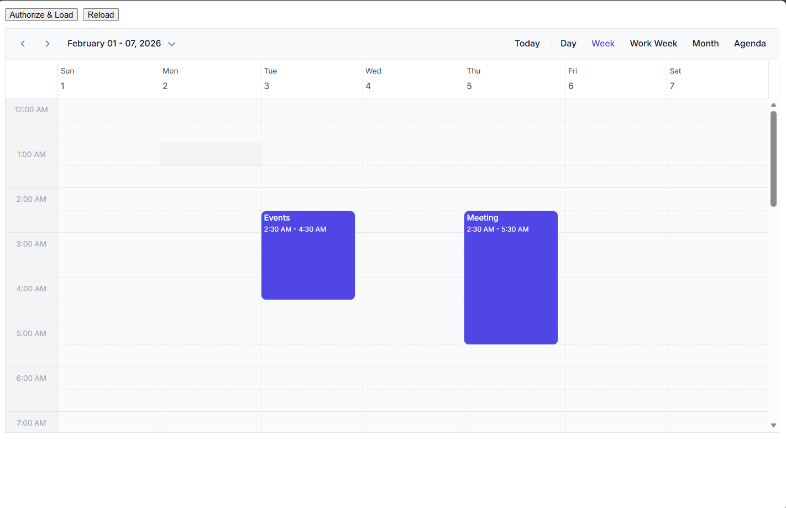

# Integrating React Scheduler with Google Calendar

This integration allows users to manage their Google Calendar events directly within the [React Scheduler](https://www.syncfusion.com/scheduler-sdk/react-scheduler). Changes made in the Scheduler are synced to Google Calendar, and existing Google events are displayed in the Scheduler interface.

## Prerequisites

Before integrating Google Calendar with the React Scheduler, ensure you have:

- **Node.js and npm** - Version 14+ installed on your local machine for React project creation and management
- **Google Account** - Required to access Google Cloud Console and create OAuth 2.0 credentials
- **Basic React knowledge** - Familiarity with React components, state management, and hooks
- **Text Editor or IDE** - Any code editor (VS Code recommended) for project development

## Integration flow overview

The integration follows this sequence:

1. **Event Display** - Scheduler displays events loaded from your Google Calendar
2. **Authentication** - App uses Google Identity Services (GIS) to obtain OAuth access tokens
3. **CRUD Mapping** - Any create/update/delete operations in Scheduler are converted to Google Calendar API calls
4. **Synchronization** - After each operation, events are reloaded from Google Calendar to keep data in sync

> **Important:** This integration uses OAuth 2.0 authentication. Users must authorize the application to access their Google Calendar data.


## Create Google Cloud credentials

### Step 1: Setup Google Calendar API
- Open https://console.cloud.google.com.
- Click the **Project Dropdown** > **New Project**.
- Name it (e.g., Scheduler-Integration) and click **Create**.

### Step 2: Enable the Google Calendar API
- Navigate to **APIs & Services** → **Library** → search **"Calendar"** → Click **Enable**.

### Step 3: Configure OAuth consent screen (External or Internal depending on your audience).
- Navigate to **APIs & Services** → **OAuth consent screen** → select **External** → Click **Create**.
- Provide the **App name** and **Support email**

### Step 4: Add Test Users
- Navigate to **APIs & Services** → **Audience** → Add mail in **Test User** → Click **Save**.

### Step 5: Generate OAuth Credentials
- Navigate to **APIs & Services** → **Credentials** → Click **Create Credentials** → **OAuth client ID**
- Set Application Type to **Web application**
- Add `http://localhost:3000` to **Authorized JavaScript origins** (for React development server)
- For production, add your actual domain URL

> **Important:** Copy and save the generated **Client ID** immediately. You'll need it to configure your React application.


## Create React project and install packages

**Step 1:** Create a new React application:
```bash
npx create-react-app sf-react-gcal
cd sf-react-gcal
```

**Step 2:** Install the Syncfusion Scheduler component:
```bash
npm install @syncfusion/ej2-react-schedule
```

> **Tip:** If you prefer Yarn, replace `npm install` with `yarn add` in all commands.

## Add Google identity services script

The Google Identity Services (GIS) library handles OAuth authentication. Add the following script to the `<head>` section of your `public/index.html` file:

```html
<script src="https://accounts.google.com/gsi/client" async defer></script>
```

> **Note:** The `async defer` attributes ensure the script loads asynchronously without blocking page rendering.

## Add Syncfusion CSS references

Import the required Syncfusion CSS stylesheets in your `src/App.js` file:

```css
import '@syncfusion/ej2-base/styles/tailwind3.css';
import '@syncfusion/ej2-buttons/styles/tailwind3.css';
import '@syncfusion/ej2-calendars/styles/tailwind3.css';
import '@syncfusion/ej2-dropdowns/styles/tailwind3.css';
import '@syncfusion/ej2-inputs/styles/tailwind3.css';
import '@syncfusion/ej2-lists/styles/tailwind3.css';
import '@syncfusion/ej2-popups/styles/tailwind3.css';
import '@syncfusion/ej2-navigations/styles/tailwind3.css';
import '@syncfusion/ej2-react-schedule/styles/tailwind3.css';
```

## Configuring the Syncfusion React Scheduler Component

### 1. Create the Scheduler Component

Create a new file `src/Scheduler/schedule.js` with the **Syncfusion React Scheduler** component. Replace the placeholder values with your actual **Client ID** and **Calendar ID**:
    ```js
    import React from 'react';
    import {
      ScheduleComponent,
      ViewsDirective,
      ViewDirective,
      Day,
      Week,
      WorkWeek,
      Month,
      Agenda,
      Inject,
      Resize,
      DragAndDrop
    } from '@syncfusion/ej2-react-schedule';

    class Schedule extends React.Component {
      constructor(props) {
        super(props);
        this.state = {
          gisReady: false,
          token: null,
          events: []
        };
        this.calendarId = 'primary'; // USE YOUR CALENDAR_ID OR 'primary'
        this.clientId =
          'YOUR CLIENT_ID'; // USE YOUR CLIENT_ID
      }
      render() {
        const { gisReady, token, events } = this.state;
        const eventSettings = { dataSource: events };

        return (
          <div className="schedule-control-section">
            <div className="col-lg-12 control-section">
              <div className="control-wrapper drag-sample-wrapper">
                <div>
                  <button
                    onClick={this.signIn}
                    disabled={!gisReady}
                  >
                    {gisReady ? 'Authorize & Load' : 'Loading Google…'}
                  </button>
                  <button onClick={this.loadEvents} disabled={!token}>
                    Reload Events
                  </button>
                </div>

                <div className="schedule-container">
                  <ScheduleComponent
                    allowDragAndDrop={true}
                    allowResizing={true}
                    width="100%"
                    height="650px"
                    selectedDate={new Date()}
                    eventSettings={ dataSource: eventSettings }
                    actionBegin={this.onActionBegin}
                  >
                    <ViewsDirective>
                      <ViewDirective option="Day" />
                      <ViewDirective option="Week" />
                      <ViewDirective option="WorkWeek" />
                      <ViewDirective option="Month" />
                      <ViewDirective option="Agenda" />
                    </ViewsDirective>
                    <Inject services={[Day, Week, WorkWeek, Month, Agenda, Resize, DragAndDrop]} />
                  </ScheduleComponent>
                </div>
              </div>
            </div>
          </div>
        );
      }
    }

    export default Schedule;
    ```

> **Important:** Replace `'YOUR CLIENT_ID'` with your actual Google OAuth Client ID from Step 5 of the credentials setup. Use `'primary'` for your default Google Calendar or replace with a specific calendar ID.

### 2. Add Google OAuth authorization

Add the authorization logic to the **Schedule** class in `src/Scheduler/schedule.js`:
    ```js
    componentDidMount() {
        const ready = () =>
          !!(window.google && window.google.accounts && window.google.accounts.oauth2);

        if (ready()) {
          this.setState({ gisReady: true });
        } else {
          this._gisPoll = setInterval(() => {
            if (ready()) {
              clearInterval(this._gisPoll);
              this.setState({ gisReady: true });
            }
          }, 100);
        }
      }

      componentWillUnmount() {
        if (this._gisPoll) clearInterval(this._gisPoll);
      }

      signIn = () => {
        const tokenClient = window.google.accounts.oauth2.initTokenClient({
          client_id: this.clientId,
          scope: 'https://www.googleapis.com/auth/calendar',
          callback: async (resp) => {
            if (resp?.access_token) {
              this.setState({ token: resp.access_token }, async () => {
                await this.loadEvents();
              });
            }
          }
        });

        tokenClient.requestAccessToken();
      };
    ```

> **Tip:** The `componentDidMount` method polls for the Google Identity Services library availability. This ensures the GIS script has loaded before attempting to use it.

### 3. Add CRUD Operation handling

Handle create, update, and delete operations in the **Schedule** class. Add this code to `src/Scheduler/schedule.js`:
    ```js
    onActionBegin = async (args) => {
        const { token } = this.state;

        if (['eventCreate', 'eventChange', 'eventRemove'].includes(args.requestType)) {
          args.cancel = true; 
        } else {
          return;
        }

        if (!token) return;

        const headers = {
          Authorization: `Bearer ${token}`,
          'Content-Type': 'application/json'
        };

        const pickApp = () => {
          if (Array.isArray(args.data)) return args.data[0];
          if (args.data) return args.data;
          if (Array.isArray(args.changedRecords) && args.changedRecords.length)
            return args.changedRecords[0];
          return null;
        };

        if (args.requestType === 'eventCreate') {
          const app = pickApp();
          if (!app) return;

          const resource = toGoogleEventResource(app);
          const res = await fetch(
            `https://www.googleapis.com/calendar/v3/calendars/${encodeURIComponent(
              this.calendarId
            )}/events`,
            { method: 'POST', headers, body: JSON.stringify(resource) }
          );
          if (!res.ok) return;
          await this.loadEvents();
        }

        if (args.requestType === 'eventChange') {
          const app = pickApp();
          if (!app) return;

          const resource = toGoogleEventResource(app);
          const res = await fetch(
            `https://www.googleapis.com/calendar/v3/calendars/${encodeURIComponent(
              this.calendarId
            )}/events/${encodeURIComponent(app.Id)}`,
            { method: 'PATCH', headers, body: JSON.stringify(resource) }
          );
          if (!res.ok) return;
          await this.loadEvents();
        }

        if (args.requestType === 'eventRemove') {
          const app = pickApp();
          if (!app) return;

          const res = await fetch(
            `https://www.googleapis.com/calendar/v3/calendars/${encodeURIComponent(
              this.calendarId
            )}/events/${encodeURIComponent(app.Id)}`,
            { method: 'DELETE', headers }
          );
          if (!res.ok) return;
          await this.loadEvents();
        }
      };
      ```

> **Note:** The `args.cancel = true` prevents the default Scheduler update. Instead, the operation is sent to Google Calendar API, and events are reloaded to reflect the API response.

### 4. Add date conversion utilities

Google Calendar uses different date formats for all-day and timed events. Add these utility functions to handle conversions:
    ```js
    function parseDateOnlyToLocal(dateStr) {
      const [y, m, d] = (dateStr || '').split('-').map(Number);
      return new Date(y, m - 1, d);
    }
    function formatDateOnlyFromLocal(d) {
      const y = d.getFullYear();
      const m = String(d.getMonth() + 1).padStart(2, '0');
      const day = String(d.getDate()).padStart(2, '0');
      return `${y}-${m}-${day}`;
    }
    ```

## Data mapping: Google Calendar ↔ Syncfusion React Scheduler

### 1. Map Google Calendar Data to Scheduler

Convert events from Google Calendar API format to Scheduler format. Add this function to `src/Scheduler/schedule.js`:
    ```js
    function mapGoogleToScheduler(items) {
      return (items || [])
        .map((evt) => {
          const isAllDay = Boolean(evt.start?.date && !evt.start?.dateTime);

          if (isAllDay) {
            const start = parseDateOnlyToLocal(evt.start.date);
            const end = parseDateOnlyToLocal(evt.end.date); 
            return {
              Id: evt.id,
              Subject: evt.summary || '(No title)',
              StartTime: start,
              EndTime: end,
              IsAllDay: true,
              Location: evt.location,
              Description: evt.description
            };
          }

          const start = evt.start?.dateTime;
          const end = evt.end?.dateTime;
          if (!start || !end) return null;

          return {
            Id: evt.id,
            Subject: evt.summary || '(No title)',
            StartTime: new Date(start),
            EndTime: new Date(end),
            IsAllDay: false,
            Location: evt.location,
            Description: evt.description
          };
        })
        .filter(Boolean);
    }
    ```

> **Important:** The mapping handles both all-day events (which use date-only format) and timed events (which use datetime format) correctly.

### 2. Map Scheduler Data to Google Calendar

Convert events from Scheduler format to Google Calendar API format. Add this function to `src/Scheduler/schedule.js`:
    ```js
    function toGoogleEventResource(app) {
      if (app.IsAllDay) {
        const startDate = new Date(
          app.StartTime.getFullYear(),
          app.StartTime.getMonth(),
          app.StartTime.getDate()
        );
        let endDate = new Date(
          app.EndTime.getFullYear(),
          app.EndTime.getMonth(),
          app.EndTime.getDate()
        );
        if (+endDate <= +startDate) {
          endDate = new Date(startDate);
          endDate.setDate(endDate.getDate() + 1);
        }
        const resource = {
          summary: app.Subject,
          location: app.Location,
          description: app.Description,
          start: { date: formatDateOnlyFromLocal(startDate) },
          end: { date: formatDateOnlyFromLocal(endDate) }
        };
        if (app.RecurrenceRule) resource.recurrence = [`RRULE:${app.RecurrenceRule}`];
        return resource;
      }

      const tz = Intl.DateTimeFormat().resolvedOptions().timeZone;
      const resource = {
        summary: app.Subject,
        location: app.Location,
        description: app.Description,
        start: { dateTime: new Date(app.StartTime).toISOString() },
        end: { dateTime: new Date(app.EndTime).toISOString() }
      };
      if (app.RecurrenceRule) {
        resource.start.timeZone = tz;
        resource.end.timeZone = tz;
        resource.recurrence = [`RRULE:${app.RecurrenceRule}`];
      }
      return resource;
    }
    ```

> **Tip:** Recurring events are preserved by including the `RecurrenceRule` (RRULE) in the Google Calendar API request.

### 3. Load Google Calendar Events

Fetch all events from Google Calendar and update the Scheduler. Add this method to the **Schedule** class in `src/Scheduler/schedule.js`:
    ```js
    loadEvents = async () => {
        const { token } = this.state;
        if (!token) return;

        const url = new URL(
          `https://www.googleapis.com/calendar/v3/calendars/${encodeURIComponent(
            this.calendarId
          )}/events`
        );
        url.searchParams.set('singleEvents', 'true');
        url.searchParams.set('orderBy', 'startTime');
        url.searchParams.set('maxResults', '2500');
        url.searchParams.set('timeMin', new Date(2020, 0, 1).toISOString());

        const res = await fetch(url.toString(), {
          headers: { Authorization: `Bearer ${token}` }
        });
        if (!res.ok) throw new Error('Failed to load events');

        const data = await res.json();
        const mapped = mapGoogleToScheduler(data.items || []);
        this.setState({ events: mapped });
      };
    ```
## Rendering the Scheduler in the App Component

Update your main `App.js` file to render the Schedule component:

```tsx
import React from 'react';
import Schedule from './Scheduler/schedule';

function App() {
  return (
    <div className="App">
      <Schedule />
    </div>
  );
}

export default App;
```

## Running the Application

Start the development server:

```bash
npm start
```

The application will open at `http://localhost:3000`.

## Output



The Scheduler will now display your Google Calendar events and allow you to create, update, and delete events directly.

## Testing and verification

**Before testing, verify:**
- ✅ Your Client ID is correctly configured in `schedule.js`
- ✅ `http://localhost:3000` is added to Authorized JavaScript origins in Google Cloud Console
- ✅ Google Calendar API is enabled in your Google Cloud project
- ✅ The GIS script has loaded (check browser console for errors)

**To test the integration:**

1. Click **"Authorize & Load"** button
2. Authenticate with your Google account
3. Verify your Google Calendar events appear in the Scheduler
4. Create a new event in the Scheduler - it should sync to Google Calendar
5. Edit or delete events and confirm changes sync to Google Calendar

> **Troubleshooting:** If events don't load, check the browser console (F12) for API errors. Common issues include incorrect Client ID, missing API permissions, or origin URL mismatch.

## Additional resources

* [Google Calendar Integration Sample on GitHub](https://github.com/SyncfusionExamples/react-scheduler-crud-google-calendar) - Complete working example
* [Google Identity Services Documentation](https://developers.google.com/identity/protocols/oauth2)
* [Google Calendar API Documentation](https://developers.google.com/calendar/api)

## See also

* [Syncfusion React Scheduler](https://www.syncfusion.com/scheduler-sdk/react-scheduler)
* [Scheduler API Reference](https://ej2.syncfusion.com/react/documentation/api/schedule)
* [Data Binding Methods](./data-binding.md)
* [CRUD Operations](./crud-actions.md)
* [Scheduler Live Examples](https://ej2.syncfusion.com/react/demos/#/tailwind3/schedule/overview)
* [SharePoint Integration](./sharepoint.md)
* [Getting Started Guide](./getting-started.md)
