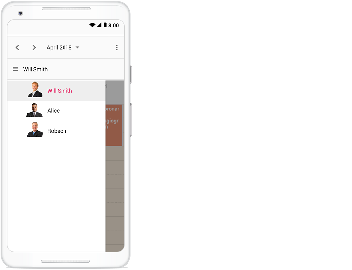
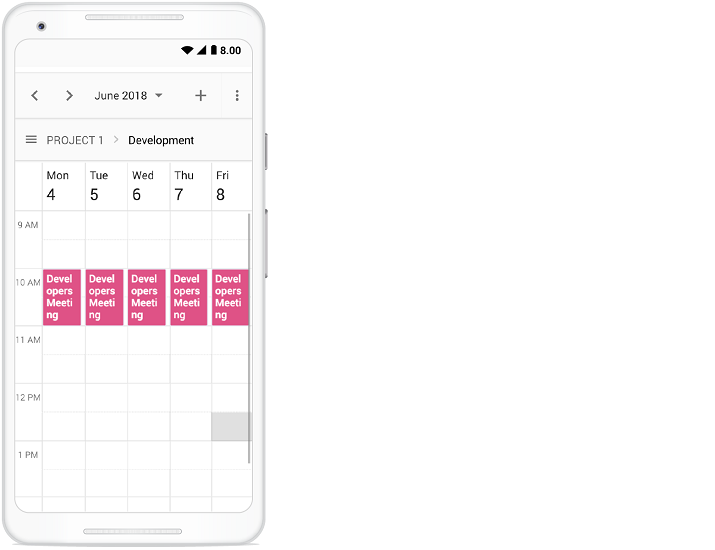
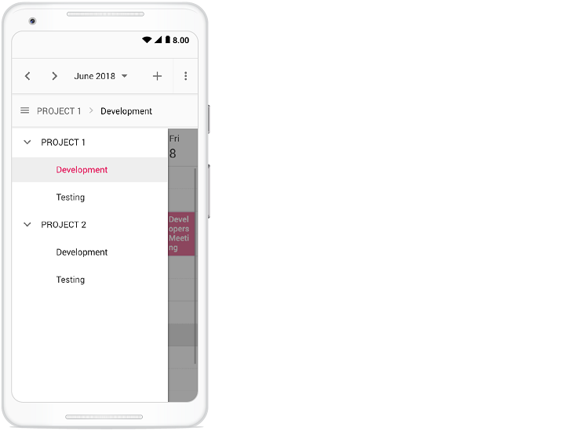

# Resources in React Scheduler component

Resources and grouping support allow the Scheduler to be shared across multiple resources. The appointments of each resource are displayed under the relevant resource. Each resource in the Scheduler is arranged in a column or row order, with dedicated spacing to display all its respective appointments on a single page. The Scheduler also supports multiple levels of resource grouping, enabling hierarchical categorization. Resources can be displayed either in expandable groups (Timeline views) or in vertical hierarchy (Calendar views).

It is possible to assign one or more resources to the same appointment by allowing multiple selection of resource options available in the event editor window.

The React Scheduler groups resources based on different criteria, including grouping appointments by resources, grouping resources by dates, and timeline scheduling. Resource data can be bound to the Scheduler either as a local JSON collection or via a remote service URL.

> **Tip:** Use resources when appointments need to be organized by team, room, project, category, or any other business dimension.

Learn how to add appointments for multiple resources in the React Scheduler from this video:



## Resource fields

The default options available within the [`resources`](https://ej2.syncfusion.com/react/documentation/api/schedule/resources) collection are:

| Field name | Type | Description |
|-------|---------| --------------- |
| `field` | String | Binds to the resource [`field`](https://ej2.syncfusion.com/react/documentation/api/schedule/resources#field) of the event object. |
| `title` | String | Displays the [`title`](https://ej2.syncfusion.com/react/documentation/api/schedule/resources#title) of the resource field in the event editor window. |
| `name` | String | A unique resource [`name`](https://ej2.syncfusion.com/react/documentation/api/schedule/resources#name) used to differentiate resource objects during grouping. |
| `allowMultiple` | Boolean | When set to `true`, the [`allowMultiple`](https://ej2.syncfusion.com/react/documentation/api/schedule/resources#allowmultiple) property allows the selection of multiple resource names, creating multiple instances of the same appointment for the selected resources. |
| `dataSource` | Object | Assigns the resource [`dataSource`](https://ej2.syncfusion.com/react/documentation/api/schedule/resources#datasource). Data can be passed as an array of JavaScript objects or via a [`DataManager`](https://ej2.syncfusion.com/documentation/data/api-datamanager) instance for remote data. Adaptors can be used to customize remote data processing. |
| `query` | Query | Defines the external [`query`](https://ej2.syncfusion.com/react/documentation/api/schedule/resources#query) executed during data processing. |
| `idField` | String | Binds the resource ID field name from the resource [`dataSource`](https://ej2.syncfusion.com/react/documentation/api/schedule/resources#datasource). |
| `expandedField` | String | Binds the [`expandedField`](https://ej2.syncfusion.com/react/documentation/api/schedule/resources#expandedfield) from the resource [`dataSource`](https://ej2.syncfusion.com/react/documentation/api/schedule/resources#datasource). A boolean value determines whether the resource in timeline views is collapsed or expanded on initial load. |
| `textField` | String | Binds the [`textField`](https://ej2.syncfusion.com/react/documentation/api/schedule/resources#textfield) name from the resource [`dataSource`](https://ej2.syncfusion.com/react/documentation/api/schedule/resources#datasource). Typically holds resource names. |
| `groupIDField` | String | Binds the [`groupIDField`](https://ej2.syncfusion.com/react/documentation/api/schedule/resources#groupidfield) name from the resource [`dataSource`](https://ej2.syncfusion.com/react/documentation/api/schedule/resources#datasource). Holds parent resource IDs for hierarchical grouping. |
| `colorField` | String | Binds the [`colorField`](https://ej2.syncfusion.com/react/documentation/api/schedule/resources#colorfield) name from the resource [`dataSource`](https://ej2.syncfusion.com/react/documentation/api/schedule/resources#datasource). The mapped color is applied to events of the resource. |
| `startHourField` | String | Binds the [`startHourField`](https://ej2.syncfusion.com/react/documentation/api/schedule/resources#starthourfield) name from the resource [`dataSource`](https://ej2.syncfusion.com/react/documentation/api/schedule/resources#datasource). Defines different work start hours for resources. |
| `endHourField` | String | Binds the [`endHourField`](https://ej2.syncfusion.com/react/documentation/api/schedule/resources#endhourfield) name from the resource [`dataSource`](https://ej2.syncfusion.com/react/documentation/api/schedule/resources#datasource). Defines different work end hours for resources. |
| `workDaysField` | String | Binds the [`workDaysField`](https://ej2.syncfusion.com/react/documentation/api/schedule/resources#workdaysfield) name from the resource [`dataSource`](https://ej2.syncfusion.com/react/documentation/api/schedule/resources#datasource). Defines different working days for resources. |
| `cssClassField` | String | Binds the custom [`cssClassField`](https://ej2.syncfusion.com/react/documentation/api/schedule/resources#cssclassfield) name from the resource [`dataSource`](https://ej2.syncfusion.com/react/documentation/api/schedule/resources#datasource). Applies mapped CSS classes to events of those resources. |

> **Tip:** Use `query` with remote data sources when you need to filter or shape resource data before it is bound to the Scheduler.

## Resource data binding

Resource data can be bound to the Scheduler either as a local JSON collection or via a remote service URL.

### Using local JSON data

The following example shows how to bind local JSON data to the [`dataSource`](https://ej2.syncfusion.com/react/documentation/api/schedule/resources#datasource) of the [`resources`](https://ej2.syncfusion.com/react/documentation/api/schedule/resources) collection.

> **Note:** Local JSON binding is the simplest option when resource data is static or stored within the application codebase.

```ts

import * as React from 'react';
import { useState } from 'react';
import * as ReactDOM from 'react-dom';
import { Day, Week, WorkWeek, Month, Agenda, ScheduleComponent, ResourcesDirective, ResourceDirective, Inject } from '@syncfusion/ej2-react-schedule';
import { resourceData } from './datasource';
const App = () => {
  const [ownerData] = useState([
    { OwnerText: 'Nancy', Id: 1, OwnerColor: '#ffaa00' },
    { OwnerText: 'Steven', Id: 2, OwnerColor: '#f8a398' },
    { OwnerText: 'Michael', Id: 3, OwnerColor: '#7499e1' }
  ]);
  const eventSettings: EventSettingsModel = { dataSource: resourceData };

  return (
    <ScheduleComponent width='100%' height='550px' selectedDate={new Date(2018, 3, 1)} eventSettings={eventSettings}>
      <ResourcesDirective>
        <ResourceDirective field='OwnerId' title='Owner' name='Owners' allowMultiple={true} dataSource={ownerData} textField='OwnerText' idField='Id' colorField='OwnerColor'>
        </ResourceDirective>
      </ResourcesDirective>
      <Inject services={[Day, Week, WorkWeek, Month, Agenda]} />
    </ScheduleComponent>
  );
}
;
const root = ReactDOM.createRoot(document.getElementById('schedule'));
root.render(<App />);

```

### Using remote service URL

The following example shows how to bind remote data to the [`dataSource`](https://ej2.syncfusion.com/react/documentation/api/schedule/resources#datasource).

> **Important:** When binding remote resources, make sure the service returns data in a format that matches the Scheduler resource fields such as `idField`, `textField`, and `colorField`.

```ts

import * as React from 'react';
import { useState } from 'react';
import * as ReactDOM from 'react-dom';
import { Week, Month, Agenda, ScheduleComponent, ResourcesDirective, ResourceDirective, Inject } from '@syncfusion/ej2-react-schedule';
import { resourceData } from './datasource';
import { DataManager, UrlAdaptor } from '@syncfusion/ej2-data';
const App = () => {
  const [ownerData] = useState(new DataManager({
    url: 'Home/GetResourceData',
    adaptor: new UrlAdaptor(),
    crossDomain: true
  }));
  const eventSettings: EventSettingsModel = { dataSource: resourceData };

  return <ScheduleComponent width='100%' height='550px' selectedDate={new Date(2018, 3, 1)} eventSettings={eventSettings}>
    <ResourcesDirective>
      <ResourceDirective field='OwnerId' title='Owner' name='Owners' allowMultiple={true} dataSource={ownerData} textField='OwnerText' idField='Id' colorField='OwnerColor'>
      </ResourceDirective>
    </ResourcesDirective>
    <Inject services={[Week, Month, Agenda]} />
  </ScheduleComponent>;
}
const root = ReactDOM.createRoot(document.getElementById('schedule'));
root.render(<App />);
```


## Scheduler with multiple resources

It is possible to display the Scheduler in default mode without visually showcasing all the resources in it, but allowing the required resources to be assigned to appointments through the event editor resource options.

The appointments belonging to different resources will be displayed together in the default Scheduler and will be differentiated based on the resource color assigned in the **resources** collection.

**Example:** To display the default Scheduler with multiple resource options in the event editor, ignore the group option and simply define the [`resources`](https://ej2.syncfusion.com/react/documentation/api/schedule/resources) property with all its internal options.

> **Tip:** This mode is useful when you want resource selection in the editor without splitting the main Scheduler view into separate resource lanes.












        


> Setting [`allowMultiple`](https://ej2.syncfusion.com/react/documentation/api/schedule/resources#allowmultiple)  to `true` in the above code example allows you to select multiple resources from the event editor and also creates multiple copies of the same appointment in the Scheduler for each resources while rendering.

## Resource grouping

Resource grouping allows the Scheduler to organize resources hierarchically, either as expandable groups (Timeline views) or as vertical hierarchy (Calendar views). Both single-level and multi-level grouping are supported.

Scheduler supports both single and multiple levels of resource grouping that can be customized in timeline and vertical Scheduler views.

> **Note:** Grouping behavior changes depending on the active view. Timeline views are better suited for expandable resource hierarchies, while calendar views show vertical resource lanes.

Explore advanced options for multiple resources and grouping in the React Scheduler by watching this video:



### Vertical resource view

The following code example displays how multiple resources are grouped and how their events are portrayed in the default calendar views.

> **Tip:** Use vertical grouping when you want each resource to occupy a dedicated row or column in calendar-style views.












        


### Timeline resource view

The following code example depicts how to group multiple resources in Timeline Scheduler views and how the relevant events are displayed under those resources.

> **Tip:** Timeline grouping is ideal when you need to compare multiple resources across the same time range.












        


### Grouping single-level resources

This kind of grouping allows the Scheduler to display all the resources at a single level simultaneously. The appointments mapped under resources will be displayed with the colors as per the [`colorField`](https://ej2.syncfusion.com/react/documentation/api/schedule/resources#colorfield) defined in the resources collection.

**Example:** To display the Scheduler with single-level resource grouping,

> **Note:** Single-level grouping is useful when resources are related but do not need parent-child relationships.












        


> The [`name`](https://ej2.syncfusion.com/react/documentation/api/schedule/resources#name) field defined in the **resources** collection namely `Owners` will be mapped within the [`group`](https://ej2.syncfusion.com/react/documentation/api/schedule/group) property, in order to enable the grouping option with those resource levels on the Scheduler.

### Grouping multi-level resources

It is possible to group the resources of Scheduler in multiple levels by mapping child resources to each parent resource. In the following example, there are two levels of resources, and the second-level resources are defined with [`groupIDField`](https://ej2.syncfusion.com/react/documentation/api/schedule/resources#groupidfield) mapping to the first-level resource's ID to establish the parent-child relationship between them.

**Example:** To display the Scheduler with multi-level resource grouping options,

> **Important:** Ensure the child resource `groupIDField` values match valid parent resource IDs, or the hierarchy will not render correctly.












        


### One-to-One grouping

In multi-level grouping, Scheduler usually groups the resources on the child level based on the `groupIDField` that maps to the `idField` of parent-level resources (with [`byGroupID`](https://ej2.syncfusion.com/react/documentation/api/schedule/group#bygroupid) set to `true` by default). There is also an option that allows you to group all child resources against each parent resource. To enable this kind of grouping, set [`byGroupID`](https://ej2.syncfusion.com/react/documentation/api/schedule/group#bygroupid) to `false` within the [`group`](https://ej2.syncfusion.com/react/documentation/api/schedule/group) property. In the following code example, there are two levels of resources, and all three child-level resources are mapped one-to-one with each resource in the first level.

> **Tip:** One-to-one grouping is helpful when each parent resource should show the same set of child lanes or categories.












        


### Grouping resources by date

It groups the number of resources under each date and is applicable only on calendar views such as Day, Week, Work Week, Month, Agenda, and Month-Agenda. To enable such grouping, set the [`byDate`](https://ej2.syncfusion.com/react/documentation/api/schedule/group#bydate) option to `true` within the [`group`](https://ej2.syncfusion.com/react/documentation/api/schedule/group) property.

**Example:** To display the Scheduler with resources grouped by date,

> **Note:** Grouping by date is not available in Timeline views.












        


> Grouping by date is not applicable in timeline views.

---

## Working with shared events

Multiple resources can share the same events. CRUD actions performed on one shared event instance are reflected across all related instances. To enable this option, set [`allowGroupEdit`](https://ej2.syncfusion.com/react/documentation/api/schedule/group#allowgroupedit) to `true` within the [`group`](https://ej2.syncfusion.com/react/documentation/api/schedule/group) property. With this property enabled, a single appointment object is maintained within the appointment collection even if it is shared by more than one resource, while the resource fields of that appointment object hold the IDs of the multiple resources.

> **Important:** Any create, edit, or delete action performed on one shared event instance is reflected across all related instances visible in the UI.

> **Tip:** Use shared events when multiple resources need to participate in the same appointment without duplicating the record in your data source.

**Example:** To edit all the resource events simultaneously,












        


## Simple resource header customization

It is possible to customize the resource header cells using the built-in template option and change their look and appearance in both vertical and timeline view modes. All resource-related fields and other information can be accessed within the resource header template option.

**Example:** To customize the resource header and display it along with the designation [`resource field`](https://ej2.syncfusion.com/react/documentation/api/schedule/resources), refer to the code example below.

> **Note:** Resource header templates are a good place to show names, avatars, roles, or other metadata that helps users identify each resource quickly.












        


> To customize the resource header in compact mode properly make use of the class `e-device` as in the code example.



## Customizing resource header with multiple columns

It is possible to customize the resource headers to display multiple columns such as Room, Type, and Capacity. The following code example shows how to achieve this and applies only to timeline views.

> **Tip:** Multi-column headers are useful when each resource has several descriptive attributes that should be visible at a glance.












        


## Collapse/Expand child resources in timeline views

It is possible to expand and collapse resources that have child resources in timeline views dynamically. By default, resources are in the expanded state with their child resources. You can collapse and expand the child resources in the UI by setting the [`expandedField`](https://ej2.syncfusion.com/react/documentation/api/schedule/resources#expandedfield) option to `false`; the default value is `true`.

> **Note:** Collapsing child resources can help reduce visual clutter when you have many nested resource groups.












        


## Displaying tooltip for resource headers

Tooltips can be displayed over resource headers to show resource information. By default, tooltips are not displayed. To enable them, assign a customized template design to the [`headerTooltipTemplate`](https://ej2.syncfusion.com/react/documentation/api/schedule/group#headertooltiptemplate) option within the [`group`](https://ej2.syncfusion.com/react/documentation/api/schedule/group) property.

> **Tip:** Use header tooltips to surface details that do not fit comfortably in the resource header itself, such as contact info or additional status.












        


## Choosing between resource colors for appointments

By default, the colors defined in the top-level resources collection are applied to the events. If you want to apply a specific resource color to events regardless of the top-level parent resource color, define the [`resourceColorField`](https://ej2.syncfusion.com/react/documentation/api/schedule/eventSettings#resourcecolorfield) option within the [`eventSettings`](https://ej2.syncfusion.com/react/documentation/api/schedule/eventSettings) property.

In the following example, the colors mentioned in the second level are applied to the events.

> **Important:** The value of `resourceColorField` must match the [`name`](https://ej2.syncfusion.com/react/documentation/api/schedule/resources#name) value in the corresponding resource definition.











        


> The value of the [`resourceColorField`](https://ej2.syncfusion.com/react/documentation/api/schedule/eventSettings#resourcecolorfield) field should be mapped with the [`name`](https://ej2.syncfusion.com/react/documentation/api/schedule/resources#name) value given within the [`resources`](https://ej2.syncfusion.com/react/documentation/api/schedule/resources) property.

## Dynamically add and remove resources

It is possible to add or remove resources dynamically to and from the Scheduler. In the following example, when the checkboxes are checked and unchecked, the respective resources are added to or removed from the Scheduler layout. To add a new resource dynamically, use the [`addResource`](https://ej2.syncfusion.com/react/documentation/api/schedule#addresource) method, which accepts the resource object, resource name (the level where the resource should be added), and index (the position where the resource should be inserted).

To remove resources dynamically, use the [`removeResource`](https://ej2.syncfusion.com/react/documentation/api/schedule#removeresource) method, which accepts the index (the position from where the resource should be removed) and resource name (the level that contains the resource) as parameters.

> **Tip:** Dynamic resource updates are useful when the list of resources changes based on user actions, permissions, or external data.












        


## Setting different working days and hours for resources

Each resource in the Scheduler can have different working hours as well as different working days. There are default options available within the [`resources`](https://ej2.syncfusion.com/react/documentation/api/schedule/resources) collection to customize the default working hours and days of the Scheduler.

> **Important:** When using resource-specific working days or hours, make sure the resource data includes the corresponding fields and that the Scheduler view supports those settings.

* [Using the work day field for different work days](#Set-different-work-days)
* [Using the start hour and end hour fields for different work hours](#Set-different-work-hours)

### Set different work days

Different working days can be set for the Scheduler resources using the [`workDaysField`](https://ej2.syncfusion.com/react/documentation/api/schedule/resources#workdaysfield) property, which maps the working-days field from the resource data source. This field accepts a collection of day indexes from 0 to 6. By default, it is set to `[1, 2, 3, 4, 5]`, and in the following example each resource has a different value, so each one renders only its assigned working days. This option applies only to calendar views and does not apply to timeline views.

> **Note:** Day indexes use Sunday as `0` and Saturday as `6`.












        


### Set different work hours

Different working hours can be set for the Scheduler resources using the [`startHourField`](https://ej2.syncfusion.com/react/documentation/api/schedule/resources#starthourfield) and [`endHourField`](https://ej2.syncfusion.com/react/documentation/api/schedule/resources#endhourfield) properties, which map the corresponding fields from the resource data source.

* [`startHourField`](https://ej2.syncfusion.com/react/documentation/api/schedule/resources#starthourfield) - Denotes the start time of the working or business hour in a day.
* [`endHourField`](https://ej2.syncfusion.com/react/documentation/api/schedule/resources#endhourfield) - Denotes the end time limit of the working or business hour in a day.

Working hours indicate the work-hour duration of a day, which is highlighted visually with an active color over the work cells. Each resource on the Scheduler can be defined with its own set of working hours as depicted in the following example.

> **Tip:** Set resource-specific work hours when different teams or rooms operate on different schedules.












        


In this example, a resource named `Will Smith` is depicted with working hours ranging from 7.00 AM to 3.00 PM and is visually illustrated with active colors, whereas the other two resources have different working hours set.

## Hide non-working days when grouped by date

In the Scheduler, you can set custom work days for each resource and group the Scheduler by date to display those work days. By default, the Scheduler shows all days when it is grouped by date, even if they are not included in the custom work days for the resources. However, you can use the [`hideNonWorkingDays`](https://ej2.syncfusion.com/react/documentation/api/schedule/group#hidenonworkingdays) property to show only the custom work days in the Scheduler.

To use the [`hideNonWorkingDays`](https://ej2.syncfusion.com/react/documentation/api/schedule/group#hidenonworkingdays) property, include it in the configuration options for your Scheduler component and set it to `true`.

**Example:** To display the Scheduler with resources grouped by date for custom working days,

> **Important:** This property works only when the Scheduler is grouped by date; it does not affect other grouping modes.












        


> The [`hideNonWorkingDays`](https://ej2.syncfusion.com/react/documentation/api/schedule/group#hidenonworkingdays) property only applies when the Scheduler is grouped [`byDate`](https://ej2.syncfusion.com/react/documentation/api/schedule/group#bydate).

## Compact view in mobile

Although the Scheduler views are designed with mobile responsiveness in mind, it can be difficult to view all resources and their related events at once on a mobile device when using multiple resources. Therefore, a compact mode is available for displaying multiple Scheduler resources on mobile devices. By default, this mode is enabled when multiple resources are used on mobile. If you need to disable this compact mode, set [`enableCompactView`](https://ej2.syncfusion.com/react/documentation/api/schedule/group#enablecompactview) to `false` within the [`group`](https://ej2.syncfusion.com/react/documentation/api/schedule/group) property. Disabling this option shows the desktop Scheduler layout on mobile devices.

With compact view enabled on mobile, you can view only one resource at a time. To switch to other resources, use the tree view on the left, which lists the available resources. Clicking a resource displays its appointments.



Clicking the menu icon before the resource text shows the resources available in the Scheduler, as shown below.



> **Tip:** Compact view is especially useful when resource lists are long and screen space is limited.

## Adaptive UI in desktop

By default, the Scheduler layout adapts automatically on desktop and mobile devices with appropriate UI changes. If you want to display the adaptive Scheduler in desktop mode with mobile-style enhancements, set the [`enableAdaptiveUI`](https://ej2.syncfusion.com/react/documentation/api/schedule#enableadaptiveui) property to `true`. Enabling this option displays the exact mobile mode of the Scheduler view on desktop devices.

Some of the default changes made for compact Scheduler rendering on desktop devices are as follows:
* View options are displayed in the navigation drawer.
* A plus icon is added to the header for new event creation.
* A Today icon is added to the header instead of the Today button.
* With multiple resources, only one resource is shown to improve clarity. To switch to other resources, use the TreeView on the left to select a different resource and its related events.

> **Note:** Adaptive UI is useful for testing and for desktop experiences that intentionally mimic the mobile layout.












        


## See also

* [Syncfusion React Scheduler](https://www.syncfusion.com/react-components/react-scheduler) - Component homepage
* [Resource Grouping](https://ej2.syncfusion.com/react/documentation/schedule/resources#resource-grouping) - Grouping overview
* [Scheduler API Reference](https://ej2.syncfusion.com/react/documentation/api/schedule) - Complete API documentation
* [Resources API Reference](https://ej2.syncfusion.com/react/documentation/api/schedule/resources) - Resource configuration options
* [Group API Reference](https://ej2.syncfusion.com/react/documentation/api/schedule/group) - Grouping and shared event options
* [Live Examples](https://ej2.syncfusion.com/react/demos/#/tailwind3/schedule/overview) - Interactive Scheduler demos