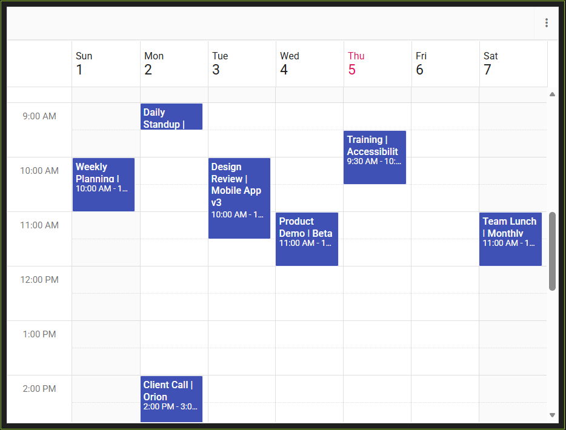

# Getting Started with React Scheduler and SharePoint

This article provides a step-by-step guide for setting up a [SharePoint](https://learn.microsoft.com/en-us/sharepoint/dev/) project and integrating the [React Scheduler](https://www.syncfusion.com/scheduler-sdk/react-scheduler).

SharePoint Framework (SPFx) is a modern client-side development model provided by Microsoft for building custom solutions and extensions for SharePoint and Microsoft Teams.

> **Tip:** Use this guide when you want to host the React Scheduler inside a SharePoint web part.

## Prerequisites

* [System requirements for Syncfusion<sup style="font-size:70%">&reg;</sup> React UI components](https://ej2.syncfusion.com/react/documentation/system-requirement)

* [System requirements for the SharePoint Framework Development Environment](https://learn.microsoft.com/en-us/sharepoint/dev/spfx/set-up-your-development-environment)

## Set up the SharePoint project

Create a new SPFx project by running the following command:

**Step 1:** To start a new [SharePoint](https://learn.microsoft.com/en-us/sharepoint/dev/) project, run:

```bash
yo @microsoft/sharepoint
```

**Step 2:** Use `my-project` as the project name and `App` as the Web Part name for this article. You will be prompted with configuration questions similar to the following:

```bash
Let's create a new Microsoft 365 solution.
? What is your solution name? my-project
? Which type of client-side component to create? WebPart
Add new Web part to solution my-project.
? What is your Web part name? App
? Which template would you like to use? React
```

**Step 3:** To trust the development certificate, run:

```bash
heft trust-dev-cert
```

After these steps, your `my-project` SPFx solution is ready for Syncfusion<sup style="font-size:70%">&reg;</sup> component integration.

> **Important:** Make sure your SPFx environment is configured correctly before you proceed with package installation.

## Add React Schedule packages

Syncfusion<sup style="font-size:70%">&reg;</sup> React component packages are available at [npmjs.com](https://www.npmjs.com/search?q=ej2-react). To use React Schedule component in the project, install the corresponding npm package:

```bash
npm install @syncfusion/ej2-react-schedule --save
```
## Import Syncfusion<sup style="font-size:70%">&reg;</sup> CSS styles

Themes for Syncfusion React components can be applied using CSS files from npm packages, CDN, CRG, or [Theme Studio](https://ej2.syncfusion.com/react/documentation/appearance/theme-studio). Refer to the [themes documentation](https://ej2.syncfusion.com/react/documentation/appearance/theme) for more details.

This example demonstrates importing the `Bootstrap` theme CSS within the `App.tsx` file located at `~/src/webparts/app/components/`.

> **Note:** Import only the CSS files required by the Syncfusion components used in your SPFx solution.




require('@syncfusion/ej2-base/styles/bootstrap5.css');
require('@syncfusion/ej2-buttons/styles/bootstrap5.css');
require('@syncfusion/ej2-calendars/styles/bootstrap5.css');
require('@syncfusion/ej2-dropdowns/styles/bootstrap5.css');
require('@syncfusion/ej2-inputs/styles/bootstrap5.css');
require('@syncfusion/ej2-lists/styles/bootstrap5.css');
require('@syncfusion/ej2-navigations/styles/bootstrap5.css');
require('@syncfusion/ej2-popups/styles/bootstrap5.css');
require('@syncfusion/ej2-splitbuttons/styles/bootstrap5.css');
require('@syncfusion/ej2-schedule/styles/bootstrap5.css');  




Update the TypeScript configuration `tsconfig.json` to map Syncfusion package paths for proper module resolution in the SPFx project:




{
  "extends": "./node_modules/@microsoft/spfx-web-build-rig/profiles/default/tsconfig-base.json",
  "compilerOptions": {
	  "jsx": "react",
    "paths": {
      "@syncfusion/*": ["./node_modules/@syncfusion/*"]
    }
  }
}




## Add React Schedule component

Follow these steps to add the component.

**Step 1:** In the `App.tsx` file inside the `~/src/webparts/app/components` folder, render the Syncfusion React Schedule component:




import * as React from 'react';
import type { IAppProps } from './IAppProps';
import { ScheduleComponent, Day, Week, WorkWeek, Month, Agenda, Inject } from '@syncfusion/ej2-react-schedule';
 
export default class App extends React.Component<IAppProps> {
    public render(): React.ReactElement<IAppProps> {
        return (
            <ScheduleComponent>
                <Inject services={[Day, Week, WorkWeek, Month, Agenda]} />
            </ScheduleComponent>
        );
    }
}



  
**Step 2:** Populate events in the React Scheduler:




public render(): React.ReactElement<IAppProps> {
    const data = [
        {
            Id: '201',
            Subject: 'Weekly Planning | Team Leads',
            StartTime: new Date(2026, 1, 1, 10, 0),
            EndTime: new Date(2026, 1, 1, 11, 0),
        },
        {
            Id: '202',
            Subject: 'Daily Standup | Engineering',
            StartTime: new Date(2026, 1, 2, 9, 0),
            EndTime: new Date(2026, 1, 2, 9, 30),
        },
        {
            Id: '203',
            Subject: 'Client Call | Orion Traders',
            StartTime: new Date(2026, 1, 2, 14, 0),
            EndTime: new Date(2026, 1, 2, 15, 0),
        },
        {
            Id: '204',
            Subject: 'Design Review | Mobile App v3',
            StartTime: new Date(2026, 1, 3, 10, 0),
            EndTime: new Date(2026, 1, 3, 11, 30),
        },
        {
            Id: '205',
            Subject: 'Security Sync | Q1 Controls',
            StartTime: new Date(2026, 1, 3, 16, 0),
            EndTime: new Date(2026, 1, 3, 17, 0),
        },
        {
            Id: '206',
            Subject: 'Product Demo | Beta Cohort',
            StartTime: new Date(2026, 1, 4, 11, 0),
            EndTime: new Date(2026, 1, 4, 12, 0),
        },
        {
            Id: '207',
            Subject: 'Sprint Retrospective | S2',
            StartTime: new Date(2026, 1, 4, 15, 0),
            EndTime: new Date(2026, 1, 4, 16, 30),
        },
        {
            Id: '208',
            Subject: 'Training | Accessibility & WCAG',
            StartTime: new Date(2026, 1, 5, 9, 30),
            EndTime: new Date(2026, 1, 5, 10, 30),
        },
        {
            Id: '209',
            Subject: 'Release Go/No-Go | v2.4',
            StartTime: new Date(2026, 1, 6, 15, 0),
            EndTime: new Date(2026, 1, 6, 16, 0),
        },
        {
            Id: '210',
            Subject: 'Team Lunch | Monthly Social',
            StartTime: new Date(2026, 1, 7, 11, 0),
            EndTime: new Date(2026, 1, 7, 12, 0),
        },
    ];

    const eventSettings = { dataSource: data };
    return (
        <ScheduleComponent height='550px' selectedDate={new Date(2026, 1, 2)} currentView='Week' eventSettings={eventSettings}>
            <Inject services={[Day, Week, WorkWeek, Month, Agenda]} />
        </ScheduleComponent>
    );
}




The following summarized code combines the previous steps:




import * as React from 'react';
import type { IAppProps } from './IAppProps';
import { ScheduleComponent, Day, Week, WorkWeek, Month, Agenda, Inject } from '@syncfusion/ej2-react-schedule';

// import Syncfusion CSS
require('@syncfusion/ej2-base/styles/bootstrap5.css');
require('@syncfusion/ej2-buttons/styles/bootstrap5.css');
require('@syncfusion/ej2-calendars/styles/bootstrap5.css');
require('@syncfusion/ej2-dropdowns/styles/bootstrap5.css');
require('@syncfusion/ej2-inputs/styles/bootstrap5.css');
require('@syncfusion/ej2-lists/styles/bootstrap5.css');
require('@syncfusion/ej2-navigations/styles/bootstrap5.css');
require('@syncfusion/ej2-popups/styles/bootstrap5.css');
require('@syncfusion/ej2-splitbuttons/styles/bootstrap5.css');
require('@syncfusion/ej2-schedule/styles/bootstrap5.css');

export default class App extends React.Component<IAppProps> {
	public render(): React.ReactElement<IAppProps> {
		const data = [
			{
				Id: '201',
				Subject: 'Weekly Planning | Team Leads',
				StartTime: new Date(2026, 1, 1, 10, 0),
				EndTime: new Date(2026, 1, 1, 11, 0),
			},
			{
				Id: '202',
				Subject: 'Daily Standup | Engineering',
				StartTime: new Date(2026, 1, 2, 9, 0),
				EndTime: new Date(2026, 1, 2, 9, 30),
			},
			{
				Id: '203',
				Subject: 'Client Call | Orion Traders',
				StartTime: new Date(2026, 1, 2, 14, 0),
				EndTime: new Date(2026, 1, 2, 15, 0),
			},
			{
				Id: '204',
				Subject: 'Design Review | Mobile App v3',
				StartTime: new Date(2026, 1, 3, 10, 0),
				EndTime: new Date(2026, 1, 3, 11, 30),
			},
			{
				Id: '205',
				Subject: 'Security Sync | Q1 Controls',
				StartTime: new Date(2026, 1, 3, 16, 0),
				EndTime: new Date(2026, 1, 3, 17, 0),
			},
			{
				Id: '206',
				Subject: 'Product Demo | Beta Cohort',
				StartTime: new Date(2026, 1, 4, 11, 0),
				EndTime: new Date(2026, 1, 4, 12, 0),
			},
			{
				Id: '207',
				Subject: 'Sprint Retrospective | S2',
				StartTime: new Date(2026, 1, 4, 15, 0),
				EndTime: new Date(2026, 1, 4, 16, 30),
			},
			{
				Id: '208',
				Subject: 'Training | Accessibility & WCAG',
				StartTime: new Date(2026, 1, 5, 9, 30),
				EndTime: new Date(2026, 1, 5, 10, 30),
			},
			{
				Id: '209',
				Subject: 'Release Go/No-Go | v2.4',
				StartTime: new Date(2026, 1, 6, 15, 0),
				EndTime: new Date(2026, 1, 6, 16, 0),
			},
			{
				Id: '210',
				Subject: 'Team Lunch | Monthly Social',
				StartTime: new Date(2026, 1, 7, 11, 0),
				EndTime: new Date(2026, 1, 7, 12, 0),
			},
		];

		const eventSettings = { dataSource: data };
		return (
			<ScheduleComponent height='550px' selectedDate={new Date(2026, 1, 2)} currentView='Week' eventSettings={eventSettings}>
				<Inject services={[Day, Week, WorkWeek, Month, Agenda]} />
			</ScheduleComponent>
		);
	}
}




## Set up Tenant domain for SPFx

The following configuration ensures that your SPFx solution loads the SharePoint Workbench for your tenant. Replace {tenantDomain} with your actual SharePoint tenant domain.

`config/serve.json`
```bash
{
  "$schema": "https://developer.microsoft.com/json-schemas/spfx-build/spfx-serve.schema.json",
  "port": 4321,
  "https": true,
  "initialPage": "https://{tenantDomain}/_layouts/workbench.aspx"
}
```

> **Note:** Update the tenant domain before running the SPFx workbench locally.

## Run the project

To run the project, use the following command:

```bash
heft start
```

The output appears as follows:



> **Tip:** You can review the complete sample in this [GitHub repository](https://github.com/SyncfusionExamples/How-to-integrate-Syncfusion-React-Scheduler-with-Sharepoint.git).

## See also

* [React Schedule component](https://www.syncfusion.com/scheduler-sdk/react-scheduler) - Component homepage
* [Getting Started with the React Schedule component](https://ej2.syncfusion.com/react/documentation/schedule/getting-started) - Basic setup guide
* [Getting Started with the Syncfusion<sup style="font-size:70%">&reg;</sup> React UI component](https://ej2.syncfusion.com/react/documentation/getting-started/quick-start) - Quick start guide