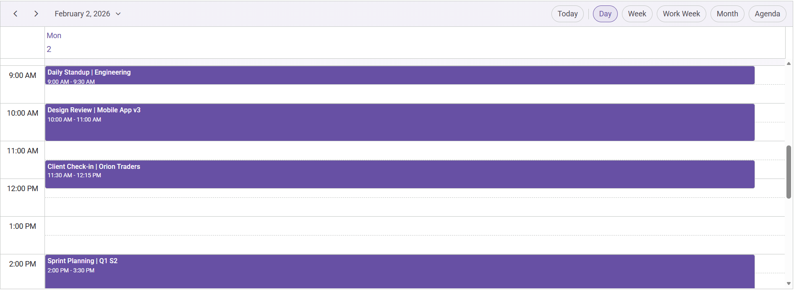

# Getting Started with React Scheduler and Vite

This article explains how to set up a [Vite](https://vite.dev/guide/) project with JavaScript and integrate [React Scheduler](https://www.syncfusion.com/scheduler-sdk/react-scheduler).

Vite is a fast, modern build tool and development server optimized for projects that use ES modules, TypeScript, JSX, and CSS modules. Its development server leverages native ES modules in modern browsers, which provides quick startup and fast feedback during development.

## Prerequisites

[System requirements for Syncfusion® React UI components](https://ej2.syncfusion.com/react/documentation/system-requirement)

## Set up the Vite project

To create a new Vite project, use one of the commands specific to NPM or Yarn.




npm create vite@latest 




yarn create vite 




Using either command starts the project setup flow with the following configurations:

**Step 1: Define the project name** - Specify the project name directly. This article uses **react-app**.




√ Project name: » **react-app**




**Step 2: Select the framework** - Select `React` as the framework.




√ Select a framework: » **React**   




**Step 3: Choose the framework variant** - Select `JavaScript` as the framework variant.




√ Select a variant: » **JavaScript**   




**Step 4:** If prompted for experimental options, choose according to your needs. This guide selects **No**.




√ Use rolldown-vite (Experimental)?: » **No**   




**Step 5:** When asked whether to install dependencies and start now, choose **Yes** to install and run immediately, or **No** to install later and start the dev server manually.




√ Install with npm and start now? » **Yes**  




After the setup completes, the application is available at `http://localhost:5173`.

## Add Syncfusion® React Scheduler packages

Syncfusion® React component packages are available on [npmjs.com](https://www.npmjs.com/search?q=ej2-react). To use the Syncfusion® React Schedule component in the project, install the corresponding package [@syncfusion/ej2-react-schedule](https://www.npmjs.com/package/@syncfusion/ej2-react-schedule) by using one of the following commands.




npm install @syncfusion/ej2-react-schedule




yarn add @syncfusion/ej2-react-schedule




## Import Syncfusion® CSS styles

In this example, the Material theme styles for the Scheduler and its dependencies are imported in `src/App.css`.




@import "../node_modules/@syncfusion/ej2-base/styles/material.css";
@import "../node_modules/@syncfusion/ej2-buttons/styles/material.css";
@import "../node_modules/@syncfusion/ej2-calendars/styles/material.css";
@import "../node_modules/@syncfusion/ej2-dropdowns/styles/material.css";
@import "../node_modules/@syncfusion/ej2-inputs/styles/material.css";
@import "../node_modules/@syncfusion/ej2-navigations/styles/material.css";
@import "../node_modules/@syncfusion/ej2-popups/styles/material.css";
@import "../node_modules/@syncfusion/ej2-react-schedule/styles/material.css";




> **Note:** Import CSS styles in the same order as their dependency graph.

## Add Syncfusion® React Schedule component

In `src/App.jsx`, use the following code snippet to render the Syncfusion React Schedule component and import `App.css` to apply styles.




import './App.css';
import { ScheduleComponent, Day, Week, WorkWeek, Month, Agenda, Inject } from '@syncfusion/ej2-react-schedule';

const App = () => {

  return (<ScheduleComponent>
    <Inject services={[Day, Week, WorkWeek, Month, Agenda]} />
  </ScheduleComponent>);

};
export default App;



        
> **Note:** The preceding demo displays an empty Scheduler.

## Populating appointments

To populate the empty Scheduler with appointments, bind event data to it by assigning the `dataSource` property with either local JSON data or a remote URL.

Here, local JSON data is assigned to the Scheduler `dataSource`.




import './App.css';
import { ScheduleComponent, Day, Week, WorkWeek, Month, Agenda, Inject } from '@syncfusion/ej2-react-schedule';
const App = () => {

    const data = [
      {
        Id: '101',
        Subject: 'Daily Standup | Engineering',
        StartTime: new Date(2026, 1, 2, 9, 0),
        EndTime: new Date(2026, 1, 2, 9, 30),
      },
      {
        Id: '102',
        Subject: 'Design Review | Mobile App v3',
        StartTime: new Date(2026, 1, 2, 10, 0),
        EndTime: new Date(2026, 1, 2, 11, 0),
      },
      {
        Id: '103',
        Subject: 'Client Check-in | Orion Traders',
        StartTime: new Date(2026, 1, 2, 11, 30),
        EndTime: new Date(2026, 1, 2, 12, 15),
      },
      {
        Id: '104',
        Subject: 'Sprint Planning | Q1 S2',
        StartTime: new Date(2026, 1, 2, 14, 0),
        EndTime: new Date(2026, 1, 2, 15, 30),
      },
      {
        Id: '105',
        Subject: 'Vendor Call | Cloud Cost Optimization',
        StartTime: new Date(2026, 1, 2, 16, 0),
        EndTime: new Date(2026, 1, 2, 17, 0),
      },
    ];

    const eventSettings = { dataSource: data };

    return (<ScheduleComponent height='550px' selectedDate={new Date(2026, 1, 2)} currentView='Day' eventSettings={eventSettings} >
      <Inject services={[Day, Week, WorkWeek, Month, Agenda]} />
    </ScheduleComponent>);

};
export default App;




## Run the project

To run the project, use the following command:




npm run dev




yarn run dev




## Output Preview

**Syncfusion React Scheduler**

*Image illustrating the Syncfusion React Scheduler* 

> You can find the sample in this [GitHub location](https://github.com/SyncfusionExamples/How-to-integrate-Syncfusion-React-Scheduler-with-Vite).