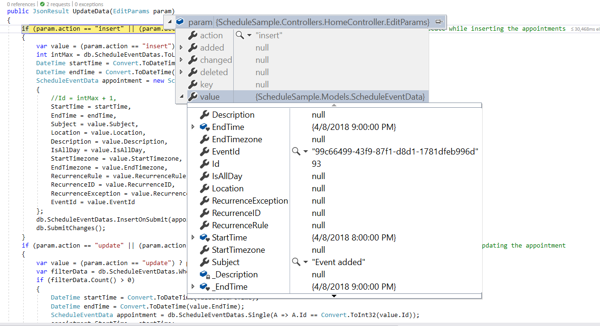
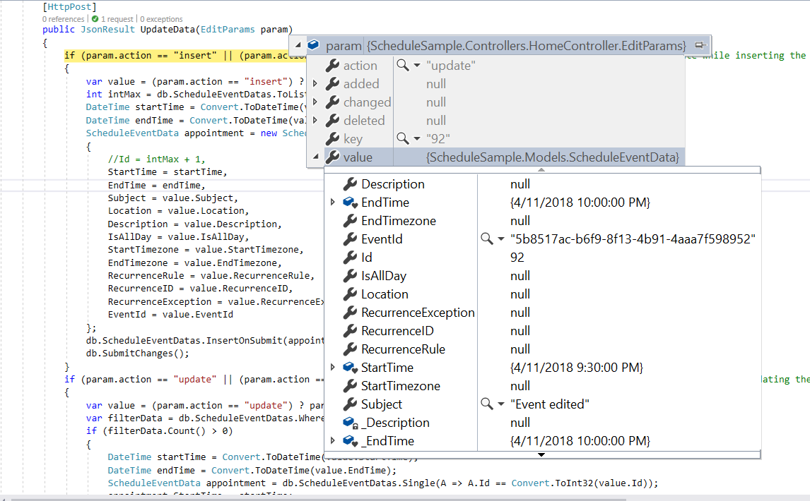
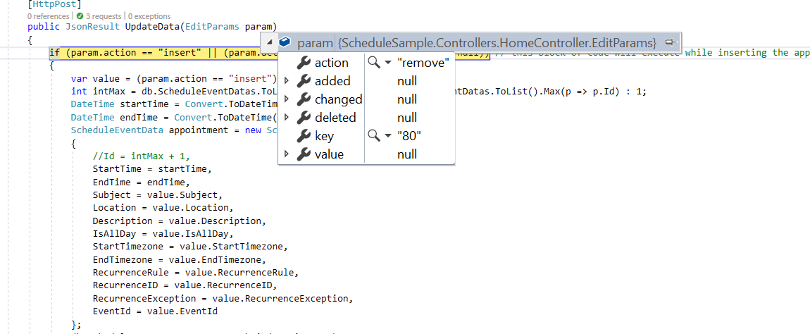

# CRUD Actions in Vue Scheduler

Events, also known as appointments, play an important role in the Scheduler. Appointments can be manipulated through the editor window or by using drag-and-drop and resize actions.

## Add

Appointments such as normal, all-day, spanned, or recurring events can be added to the Schedule component using any of the following approaches.

* [Creation using editor window](#creation-using-editor-window)
* [Creation Using addEvent method](#creation-using-addevent-method)

### Creation using Editor Window

Double-clicking on Schedule cells opens the default editor window. The editor provides fields such as **Subject**, **Location**, **Start** and **End** time, **All-day**, **Timezone**, **Description**, and recurrence options. Once the fields are filled with proper values, enter the `Save` button to add an event.

For quick entry of only the **Subject**, single-clicking the required cells opens the quick popup. Multiple cells can also be selected and the **Enter** key pressed to open the quick popup for the selected time range, then save the appointment for that range.

To include additional fields in the editor, use the [custom editor window](./editor-template#customizing-event-editor-using-template). To add one or two [additional fields to the existing default editor window](./editor-template#add-additional-fields-to-the-default-editor), define and append them to the editor.

### Creation using addEvent Method

Appointments can be created dynamically using the [`addEvent`](https://ej2.syncfusion.com/vue/documentation/api/schedule#addevent) method. A single appointment object or a collection of objects can be passed to `addEvent`. The following example demonstrates creating multiple appointments simultaneously.









        


### Inserting Events into Database at Server-Side

While adding normal or recurring events, an `insert` action occurs. The following example illustrates inserting a new event into a database on the server side.

```ts
if (param.action == "insert" || (param.action == "batch" && param.added != null)) // this block of code will execute while inserting the appointments
{
    var value = (param.action == "insert") ? param.value : param.added[0];
    int intMax = db.ScheduleEventDatas.ToList().Count > 0 ? db.ScheduleEventDatas.ToList().Max(p => p.Id) : 1;
    DateTime startTime = Convert.ToDateTime(value.StartTime);
    DateTime endTime = Convert.ToDateTime(value.EndTime);
    ScheduleEventData appointment = new ScheduleEventData()
    {
        Id = intMax + 1,
        StartTime = startTime.ToLocalTime(),
        EndTime = endTime.ToLocalTime(),
        Subject = value.Subject,
        IsAllDay = value.IsAllDay,
        StartTimezone = value.StartTimezone,
        EndTimezone = value.EndTimezone,
        RecurrenceRule = value.RecurrenceRule,
        RecurrenceID = value.RecurrenceID,
        RecurrenceException = value.RecurrenceException
    };
    db.ScheduleEventDatas.InsertOnSubmit(appointment);
    db.SubmitChanges();
}
```



### Restricting add Action based on Specific Criteria

In the following example, the specific fields of the Scheduler editor window, such as Subject and Location, are validated so that if they are left blank, the default `Required` validation message is displayed when clicking the Save button.

Additionally, the regex condition has been added to the Location field, so that if any special characters are typed into it, then the custom validation message will be displayed.









        


Creation of appointments can also be prevented dynamically. For example, to decline creation on weekend days, the appropriate condition can be checked within the [`actionBegin`](../api/schedule#actionbegin) event.









        


## Edit

The same way appointments such as normal, all-day, spanned, or recurring events are created, they can also be edited using any of the following approaches.

* [Update using editor window](#update-using-editor-window)
* [Update using saveEvent method](#update-using-saveevent-method)

### Update using Editor Window

Double-clicking an event opens the default editor window, automatically populated with the appointment's details. Edit the desired fields—Subject, Location, Start and End time, All-day, Timezone, Description, and recurrence options—and select Save to update.

> Single-clicking appointments opens the quick info popup with Edit and Delete options. Selecting Edit opens the default editor. Selecting Delete prompts for confirmation.

### Update using SaveEvent Method

Appointments can be edited and updated manually using the [`saveEvent`](https://ej2.syncfusion.com/vue/documentation/api/schedule#saveevent) method. The following code examples show how to edit normal and recurring events.

**Normal event** - Here, an event with ID `3` is edited and its subject is changed to new text. When the modified data object is passed to the [`saveEvent`](https://ej2.syncfusion.com/vue/documentation/api/schedule#saveevent) method, the changes are reflected in the original event. The `Id` field is mandatory in this edit process, and the modified event object should hold the valid `Id` value that exists in the Scheduler data source.









        


**Recurring event** - The following code example shows how to edit a single occurrence of a recurring event. In this case, the modified data should include an additional field named [`RecurrenceID`](https://ej2.syncfusion.com/vue/documentation/api/schedule/field#recurrenceid) that maps to its parent recurring event's Id value. Also, this modified occurrence is considered a new event in the Scheduler dataSource, where it is linked with its parent event through the [`RecurrenceID`](https://ej2.syncfusion.com/vue/documentation/api/schedule/field#recurrenceid) field value. The [`saveEvent`](https://ej2.syncfusion.com/vue/documentation/api/schedule#saveevent) method takes 2 arguments: the modified event data object and either `EditOccurrence` or `EditSeries`.

When the second argument is `EditOccurrence`, the passed event data is treated as a single modified occurrence. When the second argument is `EditSeries`, the modified data is edited as a whole series and no new event object is maintained in the Scheduler dataSource.

When modifying a single occurrence, it is also necessary to update the [`RecurrenceException`](https://ej2.syncfusion.com/vue/documentation/api/schedule/field#recurrenceexception) field of the parent event together with the occurrence edit. To know more about how to set [`RecurrenceException`](https://ej2.syncfusion.com/vue/documentation/api/schedule/field#recurrenceexception) values, refer to the [recurring events](./appointments#adding-exceptions) topic.









        


### Updating Events in Database at Server-Side

While editing normal events in the Scheduler, the `update` action takes place, and the following code example describes how to update an event in the database at the server side.

```ts
if (param.action == "update" || (param.action == "batch" && param.changed != null)) // this block of code will execute while updating the appointment
{
    var value = (param.action == "update") ? param.value : param.changed[0];
    var filterData = db.ScheduleEventDatas.Where(c => c.Id == Convert.ToInt32(value.Id));
    if (filterData.Count() > 0)
    {
        DateTime startTime = Convert.ToDateTime(value.StartTime);
        DateTime endTime = Convert.ToDateTime(value.EndTime);
        ScheduleEventData appointment = db.ScheduleEventDatas.Single(A => A.Id == Convert.ToInt32(value.Id));
        appointment.StartTime = startTime.ToLocalTime();
        appointment.EndTime = endTime.ToLocalTime();
        appointment.StartTimezone = value.StartTimezone;
        appointment.EndTimezone = value.EndTimezone;
        appointment.Subject = value.Subject;
        appointment.IsAllDay = value.IsAllDay;
        appointment.RecurrenceRule = value.RecurrenceRule;
        appointment.RecurrenceID = value.RecurrenceID;
        appointment.RecurrenceException = value.RecurrenceException;
    }
    db.SubmitChanges();
}
```



### How to edit a single occurrence or entire series and update it in database at server-side

Recurring appointments can be edited in either of the following ways.

* Single occurrence
* Entire series

**Editing single occurrence** - When you double-click a recurring event, a popup prompts you to choose either to edit the single event or the entire series. If you choose **EDIT EVENT**, only a single occurrence of the recurring appointment is edited. The following process takes place while editing a single occurrence:

* A new event is created from the parent event data and added to the Scheduler dataSource, with all its default field values overwritten by the newly modified data. In addition, the [`recurrenceID`](https://ej2.syncfusion.com/vue/documentation/api/schedule/field#recurrenceid) field is added, holding the `id` value of the parent recurring event. A new `Id` is generated for this event in the dataSource.

* The parent recurring event needs to be updated with the appropriate [`recurrenceException`](https://ej2.syncfusion.com/vue/documentation/api/schedule/field#recurrenceexception) field to hold the edited occurrence appointment's date collection.

Therefore, when a single occurrence is edited from a recurring event, the batch action allows both the `Add` and `Edit` action requests to occur together.

> If you edit an existing edited occurrence of a recurring event, only the edited occurrence stored in the database as an individual event object will be updated. In this case, only the `update` action takes place on the edited occurrence object in the database.

```ts
if (param.action == "insert" || (param.action == "batch" && param.added != null)) // this block of code will execute while inserting the appointments
{
    var value = (param.action == "insert") ? param.value : param.added[0];
    int intMax = db.ScheduleEventDatas.ToList().Count > 0 ? db.ScheduleEventDatas.ToList().Max(p => p.Id) : 1;
    DateTime startTime = Convert.ToDateTime(value.StartTime);
    DateTime endTime = Convert.ToDateTime(value.EndTime);
    ScheduleEventData appointment = new ScheduleEventData()
    {
        Id = intMax + 1,
        StartTime = startTime.ToLocalTime(),
        EndTime = endTime.ToLocalTime(),
        Subject = value.Subject,
        IsAllDay = value.IsAllDay,
        StartTimezone = value.StartTimezone,
        EndTimezone = value.EndTimezone,
        RecurrenceRule = value.RecurrenceRule,
        RecurrenceID = value.RecurrenceID,
        RecurrenceException = value.RecurrenceException
    };
    db.ScheduleEventDatas.InsertOnSubmit(appointment);
    db.SubmitChanges();
}
if (param.action == "update" || (param.action == "batch" && param.changed != null)) // this block of code will execute while updating the appointment
{
    var value = (param.action == "update") ? param.value : param.changed[0];
    var filterData = db.ScheduleEventDatas.Where(c => c.Id == Convert.ToInt32(value.Id));
    if (filterData.Count() > 0)
    {
        DateTime startTime = Convert.ToDateTime(value.StartTime);
        DateTime endTime = Convert.ToDateTime(value.EndTime);
        ScheduleEventData appointment = db.ScheduleEventDatas.Single(A => A.Id == Convert.ToInt32(value.Id));
        appointment.StartTime = startTime.ToLocalTime();
        appointment.EndTime = endTime.ToLocalTime();
        appointment.StartTimezone = value.StartTimezone;
        appointment.EndTimezone = value.EndTimezone;
        appointment.Subject = value.Subject;
        appointment.IsAllDay = value.IsAllDay;
        appointment.RecurrenceRule = value.RecurrenceRule;
        appointment.RecurrenceID = value.RecurrenceID;
        appointment.RecurrenceException = value.RecurrenceException;
    }
    db.SubmitChanges();
}
```

**Editing entire series** - When you select **EDIT SERIES** from the popup that opens after double-clicking the recurring event, the whole recurring series is updated with the newly provided value. When this option is chosen explicitly, if a parent event holds any edited occurrences, all its child occurrences are removed from the dataSource and only the single parent data is updated.

This action of editing the entire series also leads to the batch process, as both the `Delete` and `Edit` actions take place together.

```ts
if (param.action == "update" || (param.action == "batch" && param.changed != null)) // this block of code will execute while updating the appointment
{
    var value = (param.action == "update") ? param.value : param.changed[0];
    var filterData = db.ScheduleEventDatas.Where(c => c.Id == Convert.ToInt32(value.Id));
    if (filterData.Count() > 0)
    {
        DateTime startTime = Convert.ToDateTime(value.StartTime);
        DateTime endTime = Convert.ToDateTime(value.EndTime);
        ScheduleEventData appointment = db.ScheduleEventDatas.Single(A => A.Id == Convert.ToInt32(value.Id));
        appointment.StartTime = startTime.ToLocalTime();
        appointment.EndTime = endTime.ToLocalTime();
        appointment.StartTimezone = value.StartTimezone;
        appointment.EndTimezone = value.EndTimezone;
        appointment.Subject = value.Subject;
        appointment.IsAllDay = value.IsAllDay;
        appointment.RecurrenceRule = value.RecurrenceRule;
        appointment.RecurrenceID = value.RecurrenceID;
        appointment.RecurrenceException = value.RecurrenceException;
    }
    db.SubmitChanges();
}
if (param.action == "remove" || (param.action == "batch" && param.deleted != null)) // this block of code will execute while removing the appointment
{
    if (param.action == "remove")
    {
        int key = Convert.ToInt32(param.key);
        ScheduleEventData appointment = db.ScheduleEventDatas.Where(c => c.Id == key).FirstOrDefault();
        if (appointment != null) db.ScheduleEventDatas.DeleteOnSubmit(appointment);
    }
    else
    {
        foreach (var apps in param.deleted)
        {
            ScheduleEventData appointment = db.ScheduleEventDatas.Where(c => c.Id == apps.Id).FirstOrDefault();
            if (appointment != null) db.ScheduleEventDatas.DeleteOnSubmit(appointment);
        }
    }
    db.SubmitChanges();
}
```

> To know more about handling recurrence exceptions, refer to the [Adding exceptions](./appointments#adding-exceptions) topic.

### How to Edit from the Current and Following Events of a Series

Recurring appointments can be edited from the current and following events when the [`editFollowingEvents`](https://ej2.syncfusion.com/vue/documentation/api/schedule/eventSettings#editfollowingevents) property is enabled.

**Editing Following Events** - When you double-click a recurring event, a popup prompts you to choose either to edit the single event, Edit Following Events, or the entire series. If you choose **EDIT FOLLOWING EVENTS**, the current and following events of the recurring appointment are edited. The following process takes place while editing following events:

* A new event is created from the parent event data and added to the Scheduler dataSource, with all its default field values overwritten by the newly modified data. In addition, the [`followingID`](https://ej2.syncfusion.com/vue/documentation/api/schedule/field#followingid) field is added, holding the [`id`](https://ej2.syncfusion.com/vue/documentation/api/schedule/field#id) value of the immediate parent recurring event. A new `Id` is generated for this event in the dataSource.

* The parent recurring event is updated with an appropriate [`recurrenceRule`](https://ej2.syncfusion.com/vue/documentation/api/schedule/field#recurrencerule) value to set the modified series end date.

Therefore, when following events are edited from a recurring event, the batch action allows the `Add`, `Edit`, and `Delete` action requests to occur together.

```ts
if (param.action == "insert" || (param.action == "batch" && param.added != null)) // this block of code will execute while inserting the appointments
{
    var value = (param.action == "insert") ? param.value : param.added[0];
    int intMax = db.ScheduleEventDatas.ToList().Count > 0 ? db.ScheduleEventDatas.ToList().Max(p => p.Id) : 1;
    DateTime startTime = Convert.ToDateTime(value.StartTime);
    DateTime endTime = Convert.ToDateTime(value.EndTime);
    ScheduleEventData appointment = new ScheduleEventData()
    {
        Id = intMax + 1,
        StartTime = startTime.ToLocalTime(),
        EndTime = endTime.ToLocalTime(),
        Subject = value.Subject,
        IsAllDay = value.IsAllDay,
        StartTimezone = value.StartTimezone,
        EndTimezone = value.EndTimezone,
        RecurrenceRule = value.RecurrenceRule,
        RecurrenceID = value.RecurrenceID,
        FollowingID = value.FollowingID,
        RecurrenceException = value.RecurrenceException
    };
    db.ScheduleEventDatas.InsertOnSubmit(appointment);
    db.SubmitChanges();
}
if (param.action == "update" || (param.action == "batch" && param.changed != null)) // this block of code will execute while updating the appointment
{
    var value = (param.action == "update") ? param.value : param.changed[0];
    var filterData = db.ScheduleEventDatas.Where(c => c.Id == Convert.ToInt32(value.Id));
    if (filterData.Count() > 0)
    {
        DateTime startTime = Convert.ToDateTime(value.StartTime);
        DateTime endTime = Convert.ToDateTime(value.EndTime);
        ScheduleEventData appointment = db.ScheduleEventDatas.Single(A => A.Id == Convert.ToInt32(value.Id));
        appointment.StartTime = startTime.ToLocalTime();
        appointment.EndTime = endTime.ToLocalTime();
        appointment.StartTimezone = value.StartTimezone;
        appointment.EndTimezone = value.EndTimezone;
        appointment.Subject = value.Subject;
        appointment.IsAllDay = value.IsAllDay;
        appointment.RecurrenceRule = value.RecurrenceRule;
        appointment.RecurrenceID = value.RecurrenceID;
        appointment.FollowingID = value.FollowingID;
        appointment.RecurrenceException = value.RecurrenceException;
    }
    db.SubmitChanges();
}
if (param.action == "remove" || (param.action == "batch" && param.deleted != null)) // this block of code will execute while removing the appointment
{
    if (param.action == "remove")
    {
        int key = Convert.ToInt32(param.key);
        ScheduleEventData appointment = db.ScheduleEventDatas.Where(c => c.Id == key).FirstOrDefault();
        if (appointment != null) db.ScheduleEventDatas.DeleteOnSubmit(appointment);
    }
    else
    {
        foreach (var apps in param.deleted)
        {
            ScheduleEventData appointment = db.ScheduleEventDatas.Where(c => c.Id == apps.Id).FirstOrDefault();
            if (appointment != null) db.ScheduleEventDatas.DeleteOnSubmit(appointment);
        }
    }
    db.SubmitChanges();
}
```

### Restricting Edit Action Based on Specific Criteria

Editing of appointments can be prevented dynamically. For example, to restrict updates during non-working hours, evaluate the appropriate condition within the [`actionBegin`](../api/schedule#actionbegin) event.









        


## Delete

Appointments can be deleted in either of the following ways:

* Selecting an appointment and clicking the delete icon from the quick popup that opens.
* Selecting an appointment and pressing `Delete` key.
* Selecting multiple appointments by tap-holding an event and then continuously single-clicking other consecutive events and then pressing the `Delete` key.
* Double clicking on an event which opens the default event editor pre-filled with event details, and then choosing `Delete` button in it.

While performing any of the above-mentioned actions, a pop-up with a delete confirmation message is displayed, prompting the user to proceed with deleting an appointment.

### Deletion using Editor Window

When an event is double-clicked, the default editor window includes a Delete button at the bottom-left. Deleting from the editor removes the appointment immediately without displaying an additional confirmation alert.

### Deletion using deleteEvent Method

Appointments can be removed programmatically using the [`deleteEvent`](https://ej2.syncfusion.com/vue/documentation/api/schedule#deleteevent) method. The following examples demonstrate deleting normal and recurring events.

**Normal event** - Normal appointments can be deleted by passing either the appointment Id value or the event object collection to [`deleteEvent`](https://ej2.syncfusion.com/vue/documentation/api/schedule#deleteevent) method.









        


**Recurring Event** - Recurring events can be removed as an entire series or as a single occurrence by passing DeleteSeries or DeleteOccurrence to the deleteEvent method. The following example demonstrates deleting an entire series.









        


### Removing Events from Database at Server-Side

While deleting the event from the Scheduler, `remove` action takes place and the following code example describes how to delete event from database at server side.

```ts
if (param.action == "remove" || (param.action == "batch" && param.deleted != null)) // this block of code will execute while removing the appointment
{
    if (param.action == "remove")
    {
        int key = Convert.ToInt32(param.key);
        ScheduleEventData appointment = db.ScheduleEventDatas.Where(c => c.Id == key).FirstOrDefault();
        if (appointment != null) db.ScheduleEventDatas.DeleteOnSubmit(appointment);
    }
    else
    {
        foreach (var apps in param.deleted)
        {
            ScheduleEventData appointment = db.ScheduleEventDatas.Where(c => c.Id == apps.Id).FirstOrDefault();
            if (appointment != null) db.ScheduleEventDatas.DeleteOnSubmit(appointment);
        }
    }
    db.SubmitChanges();
}
```



### How to delete a single occurrence or entire series from Scheduler and update it in database at server-side

The recurring events can be deleted in either of the following two ways.

* Single occurrence
* Entire series

**Single occurrence** - When deletion is initiated on a recurring event, a popup prompts for deleting a single event or the entire series. Selecting DELETE EVENT removes only that occurrence. The following process occurs:

* The selected occurrence will be deleted from the Scheduler user interface.
* In code, the parent recurring event object will be updated with appropriate  [`recurrenceException`](https://ej2.syncfusion.com/vue/documentation/api/schedule/field#recurrenceexception) field, to hold the deleted occurrence appointment's date collection.

Therefore, when a single occurrence is deleted from a recurring event, the `update` action takes place on the parent recurring event as shown in the following code example.

> When an edited occurrence is deleted, only that occurrence object (stored as an individual event) is removed. In this case, a delete action occurs instead of `update` action and the parent recurring event remains unchanged.

```ts
if (param.action == "update" || (param.action == "batch" && param.changed != null)) // this block of code will execute while updating the appointment
{
    var value = (param.action == "update") ? param.value : param.changed[0];
    var filterData = db.ScheduleEventDatas.Where(c => c.Id == Convert.ToInt32(value.Id));
    if (filterData.Count() > 0)
    {
        DateTime startTime = Convert.ToDateTime(value.StartTime);
        DateTime endTime = Convert.ToDateTime(value.EndTime);
        ScheduleEventData appointment = db.ScheduleEventDatas.Single(A => A.Id == Convert.ToInt32(value.Id));
        appointment.StartTime = startTime.ToLocalTime();
        appointment.EndTime = endTime.ToLocalTime();
        appointment.StartTimezone = value.StartTimezone;
        appointment.EndTimezone = value.EndTimezone;
        appointment.Subject = value.Subject;
        appointment.IsAllDay = value.IsAllDay;
        appointment.RecurrenceRule = value.RecurrenceRule;
        appointment.RecurrenceID = value.RecurrenceID;
        appointment.RecurrenceException = value.RecurrenceException;
    }
    db.SubmitChanges();
}
```

**Entire series** - When you select an option **DELETE SERIES** from the popup, the whole recurring series will be deleted. When this option is chosen explicitly, if a parent event holds any edited occurrences - then all its child occurrences which are maintained as separate event objects will also be removed from the dataSource. This action of deleting entire series leads to `remove` action and removes one or more event objects at the same time.

```ts
if (param.action == "remove" || (param.action == "batch" && param.deleted != null)) // this block of code will execute while removing the appointment
{
    if (param.action == "remove")
    {
        int key = Convert.ToInt32(param.key);
        ScheduleEventData appointment = db.ScheduleEventDatas.Where(c => c.Id == key).FirstOrDefault();
        if (appointment != null) db.ScheduleEventDatas.DeleteOnSubmit(appointment);
    }
    else
    {
        foreach (var apps in param.deleted)
        {
            ScheduleEventData appointment = db.ScheduleEventDatas.Where(c => c.Id == apps.Id).FirstOrDefault();
            if (appointment != null) db.ScheduleEventDatas.DeleteOnSubmit(appointment);
        }
    }
    db.SubmitChanges();
}
```

### How to delete only the current and following events of a series

Recurring events can be deleted from the current and following events when the [`editFollowingEvents`](https://ej2.syncfusion.com/vue/documentation/api/schedule/eventSettings#editfollowingevents) property is enabled.

**Delete Following Events** - When deletion is initiated on a recurring event, a popup prompts for deleting a single event, following events, or the entire series. Selecting FOLLOWING EVENT removes the current and subsequent events in the series. The following process occurs:

* The selected occurrence and the following events in same series will be deleted from the Scheduler user interface.
* In code, the parent recurring event object will be updated with appropriate [`recurrenceRule`](https://ej2.syncfusion.com/vue/documentation/api/schedule/field#recurrencerule) field, to update the end date of the recurring events.

Therefore, when following events are deleted from a recurring event, the `remove` and `update` action takes place on the immediate parent recurring event as shown in the following code example.

 ```ts
if (param.action == "update" || (param.action == "batch" && param.changed != null)) // this block of code will execute while updating the appointment
{
    var value = (param.action == "update") ? param.value : param.changed[0];
    var filterData = db.ScheduleEventDatas.Where(c => c.Id == Convert.ToInt32(value.Id));
    if (filterData.Count() > 0)
    {
        DateTime startTime = Convert.ToDateTime(value.StartTime);
        DateTime endTime = Convert.ToDateTime(value.EndTime);
        ScheduleEventData appointment = db.ScheduleEventDatas.Single(A => A.Id == Convert.ToInt32(value.Id));
        appointment.StartTime = startTime.ToLocalTime();
        appointment.EndTime = endTime.ToLocalTime();
        appointment.StartTimezone = value.StartTimezone;
        appointment.EndTimezone = value.EndTimezone;
        appointment.Subject = value.Subject;
        appointment.IsAllDay = value.IsAllDay;
        appointment.RecurrenceRule = value.RecurrenceRule;
        appointment.RecurrenceID = value.RecurrenceID;
        appointment.FollowingID = value.FollowingID;
        appointment.RecurrenceException = value.RecurrenceException;
    }
    db.SubmitChanges();
}
if (param.action == "remove" || (param.action == "batch" && param.deleted != null)) // this block of code will execute while removing the appointment
{
    if (param.action == "remove")
    {
        int key = Convert.ToInt32(param.key);
        ScheduleEventData appointment = db.ScheduleEventDatas.Where(c => c.Id == key).FirstOrDefault();
        if (appointment != null) db.ScheduleEventDatas.DeleteOnSubmit(appointment);
    }
    else
    {
        foreach (var apps in param.deleted)
        {
            ScheduleEventData appointment = db.ScheduleEventDatas.Where(c => c.Id == apps.Id).FirstOrDefault();
            if (appointment != null) db.ScheduleEventDatas.DeleteOnSubmit(appointment);
        }
    }
    db.SubmitChanges();
}
```

## Drag and Drop

Dragging and dropping a normal event performs an edit action. Dragging and dropping a recurring event to a new time range triggers the batch action described in Editing a single occurrence, allowing both Add and Edit actions to occur together.

> By default, dragging a recurring instance edits only the occurrence, not the entire series.

You can watch the following video to learn more about [Vue Scheduler](https://www.syncfusion.com/vue-components/vue-scheduler)'s advanced drag and resize options:











        


## Resize

Resizing a normal event performs an edit action. Resizing a recurring event to a new time triggers the batch action described in Editing a single occurrence, allowing both Add and Edit actions to occur together.

> By default, when you resize a recurring instance, only the occurrence of the event gets edited and not a whole series.









        


> Refer to the [Vue Scheduler](https://www.syncfusion.com/vue-components/vue-scheduler) feature tour page for detailed information. Explore the [Vue Scheduler example](https://ej2.syncfusion.com/vue/demos/#/tailwind3/schedule/overview.html) example to see how data is presented and manipulated.