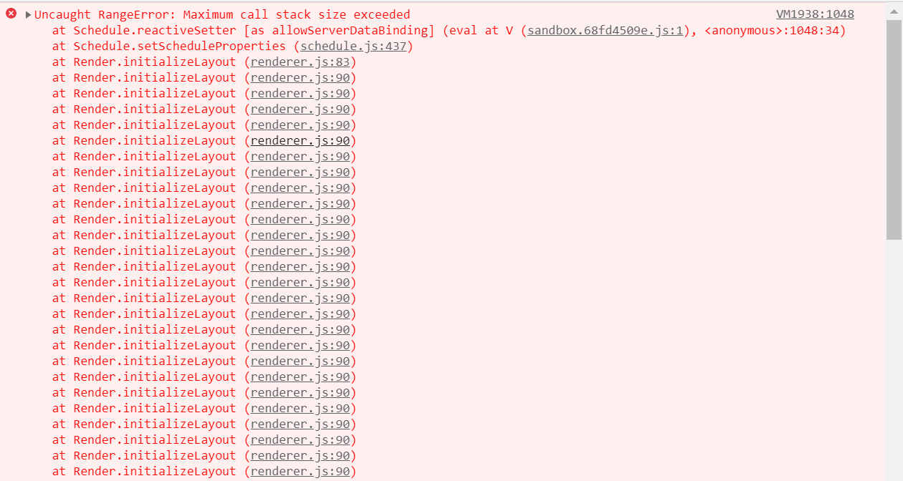
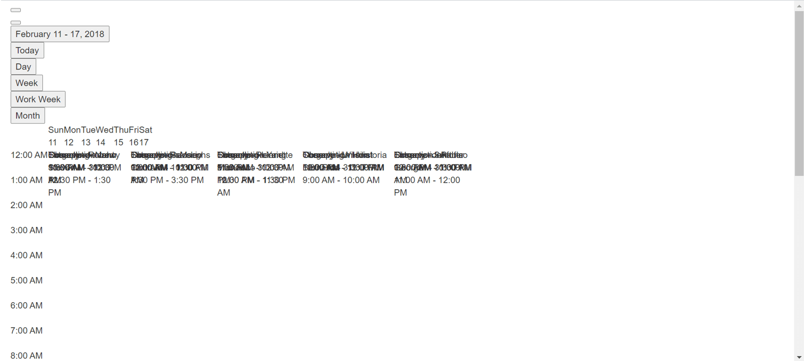
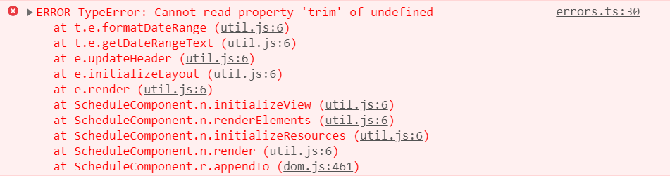

# Frequently Asked Questions in Vue Scheduler

This section provides solutions to common issues encountered while working with the [Vue Scheduler](https://www.syncfusion.com/vue-components/vue-scheduler) component.

## Maximum Call Stack Size Exceeded

**Error Image:**



**Solution:**

This error occurs when a view used in the Schedule component is not imported and injected. Each view, such as `Day`, `TimelineWeek`, `TimelineMonth`, and `Agenda`, must be injected before use. If a view is referenced without injection, the Schedule component throws a **Maximum call stack size exceeded** error.

In the following example, the `Day` view is used without injection, which results in the issue. Injecting the required view modules resolves the problem.

```
<template>
  <div>
    <div id="app">
      <div id="container">
        <ejs-schedule id="Schedule" width="100%" height="550px">
          <e-views>
            <e-view option="Day"></e-view>
            <e-view option="TimelineWeek"></e-view>
            <e-view option="TimelineMonth"></e-view>
            <e-view option="Agenda"></e-view>
          </e-views>
        </ejs-schedule>
      </div>
    </div>
  </div>
</template>

<script>
import Vue from "vue";
import {
  SchedulePlugin,
  TimelineViews,
  TimelineMonth,
  Agenda,
} from "@syncfusion/ej2-vue-schedule";
```

## Grouping with Empty Resources

Grouping without providing any resource data will cause the following issues.

* Normal (vertical) views are rendered, but CRUD operations are not available.
* Timeline views do not render and show an empty scheduler table.

So, we suggest avoiding grouping with empty resources in the Scheduler.

## Not providing e-field in editor template

**Error:** While using an editor template, the value of `e-field` is missing in the editor window.

**Solution:** The `e-field` attribute is mandatory for processing field values within the editor window. Refer to the detailed guidance in the editor template documentation [here](https://help.syncfusion.com/scheduler-sdk/vue/schedule/editor-template#customizing-event-editor-using-template).

## Missing CSS Reference

**Error Image:**

  

**Solution:**

This issue occurs when the required CSS files for the Schedule component are not included. Adding the appropriate CSS references resolves the problem.

```

      <!-- scheduler CSS is referred from this link -->
<link href="https://cdn.syncfusion.com/ej2/tailwind3.css" rel="stylesheet">
                      or
      <!-- From here -->

<style>
@import "/node_modules/@syncfusion/ej2-base/styles/tailwind3.css";
@import "/node_modules/@syncfusion/ej2-buttons/styles/tailwind3.css";
@import "/node_modules/@syncfusion/ej2-calendars/styles/tailwind3.css";
@import "/node_modules/@syncfusion/ej2-dropdowns/styles/tailwind3.css";
@import "/node_modules/@syncfusion/ej2-inputs/styles/tailwind3.css";
@import "/node_modules/@syncfusion/ej2-navigations/styles/tailwind3.css";
@import "/node_modules/@syncfusion/ej2-popups/styles/tailwind3.css";
@import "/node_modules/@syncfusion/ej2-vue-schedule/styles/tailwind3.css";
</style>

```

## QuickInfoTemplate at bottom

When using the [`quickInfoTemplate`](https://ej2.syncfusion.com/vue/documentation/api/schedule#quickinfotemplates) in the Scheduler, the quick info popup may not be shown fully at the bottom area of the Scheduler. This can be resolved by using the [`cellClick`](https://ej2.syncfusion.com/vue/documentation/api/schedule#cellclick) and [`eventClick`](https://ej2.syncfusion.com/vue/documentation/api/schedule#eventclick) events, as shown in the following code snippet.

```
<template>
    <ejs-schedule
          id="Schedule"
          width="100%"
          height="550px"
          :cellClick="onClick"
          :eventClick="onClick"
        >
    </ejs-schedule>
</template>
 .
 .
var eventAdded = false;

methods: {
  onClick: function () {
    if (!this.eventAdded) {
      let popupInstance = document.querySelector('.e-quick-popup-wrapper').ej2_instances[0];
      popupInstance.open = () => {
        popupInstance.refreshPosition();
      };
      this.eventAdded = true;
    }
  }
}
```

## Not Importing Culture Files When using Localization

**Error Image:**



While using [`locale`](https://help.syncfusion.com/scheduler-sdk/vue/schedule/localization) in the Scheduler, not importing the required culture files properly causes the problem.

**Solution:** Properly add and import the culture files such as numberingSystems, timeZoneNames, loadCldr, and L10n in your project to resolve the problem.

```javascript
import { loadCldr, L10n } from '@syncfusion/ej2-base';
import enNumberData from '@syncfusion/ej2-cldr-data/main/en-GB/numbers.json';
import entimeZoneData from '@syncfusion/ej2-cldr-data/main/en-GB/timeZoneNames.json';
import enGregorian from '@syncfusion/ej2-cldr-data/main/en-GB/ca-gregorian.json';
import enNumberingSystem from '@syncfusion/ej2-cldr-data/supplemental/numberingSystems.json';

loadCldr(frNumberData, frtimeZoneData, frGregorian, frNumberingSystem);

L10n.load({
  'en-GB': {
    schedule: {
      day: 'Day',
      week: 'Week',
      workWeek: 'Work Week',
      month: 'Month'
      }
    }
  });

```
