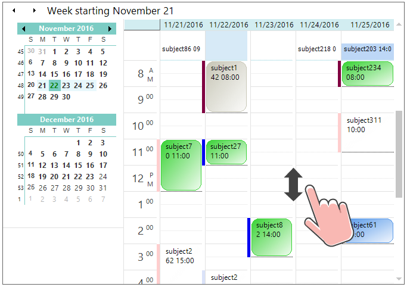
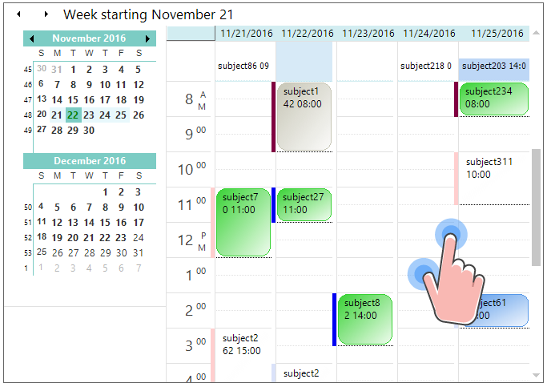

# Touch Support in Windows Forms Scheduler

The ScheduleControl provides swipe scrolling and zooming touch support, like the Outlook calendar. The touch support for schedule control can be enabled by setting the [EnableTouchMode](https://help.syncfusion.com/cr/windowsforms/Syncfusion.Windows.Forms.Schedule.ScheduleControl.html#Syncfusion_Windows_Forms_Schedule_ScheduleControl_EnableTouchMode) property to `true`. This will enable the grid to support swiping, panning, and zooming. Default value of the `EnableTouchMode` property is `false`.



using Syncfusion.Windows.Forms.Schedule;

//Enable the touch mode.
scheduleControl1.EnableTouchMode = true;


Imports Syncfusion.Windows.Forms.Schedule

'Enable the touch mode.
scheduleControl1.EnableTouchMode = True



## Touch swiping

The ScheduleControl allows you to perform the vertical swipe scrolling in Day, `WorkWeek`, and custom views. The previous or next period can be viewed by horizontal swiping left-to-right or right-to-left, like the MS Outlook calendar.

## Touch zooming

The ScheduleControl view can be changed when zooming, like the MS Outlook calendar. 

